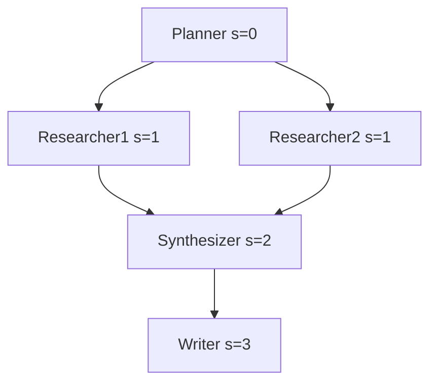

本記事は [KVFlow: Efficient Prefix Caching for Accelerating LLM-Based Multi-Agent Workflows (arXiv:2507.07400)](https://arxiv.org/abs/2507.07400) の解説記事です。

関連するZenn記事「[マルチターンAgent会話のプロンプトキャッシュ設計パターンとヒット率改善](https://zenn.dev/0h_n0/articles/d0cba2aa6f275e)」では、API側のプロンプトキャッシュをどう設計するかを扱いました。本記事はその一段下のレイヤー、すなわち自前の推論サーバー内部でKVキャッシュをどう管理するかを扱う論文を解説します。

## 論文概要（Abstract）

著者らは、LLMベースのマルチエージェントワークフローでは、各エージェントが固定のシステムプロンプトと変動するサフィックスを持ち、固定部分のKVテンソルを再利用できる点に注目している。しかし既存のLRU（Least Recently Used）退避は、次にどのエージェントが実行されるかを予測できず、必要なキャッシュを先に捨ててしまう。そこで著者らは、ワークフローを抽象化する Agent Step Graph、それに基づく退避ポリシー、CPUからGPUへのKVプリフェッチを提案し、SGLangの階層型radixキャッシュに対して単一ワークフローで最大1.83倍、並行ワークフローで最大2.19倍の高速化を報告している。

## 情報源

| 項目 | 内容 |
|------|------|
| arXiv ID | 2507.07400 |
| URL | https://arxiv.org/abs/2507.07400 |
| タイトル | KVFlow: Efficient Prefix Caching for Accelerating LLM-Based Multi-Agent Workflows |
| 著者 | Zaifeng Pan, Ajjkumar Patel, Zhengding Hu, Yipeng Shen, Yue Guan, Wan-Lu Li, Lianhui Qin, Yida Wang, Yufei Ding |
| 発表年 | 2025年 |
| 分野 | cs.DC / cs.AI 系（LLM推論システム） |
| 採択 | NeurIPS 2025 |

## 背景と動機

LLMのprefillでは、プロンプト長に比例した計算が必要になる。SGLangのRadixAttentionのようなプレフィクスキャッシュは、同一プレフィクスのKVテンソルを再利用してこのコストを削減する。マルチエージェントワークフローでは、各エージェントが「役割を定義する固定プロンプト」と「前段の出力などに由来する動的サフィックス」で構成されるため、固定部分は毎回の実行で再利用できる。

問題は、GPUメモリが有限なためキャッシュを退避させる必要がある点である。著者らによれば、標準的なLRUは「最後に使われた時刻」だけを見るため、ワークフロー上でこれから実行されるエージェントのキャッシュを先に捨ててしまう。たとえば10個のエージェントが順番に実行される場合、最も長く使われていないエージェントは、次に実行される可能性が高いエージェントである。LRUはこのパターンで最悪の選択をしやすい。さらに、CPUメモリへ退避したKVをGPUへ戻す処理が、リクエストが到着してから始まる「リアクティブ」な方式だと、PCIe転送の待ち時間がそのままレイテンシになる。


## 主要な貢献

- **Agent Step Graph**: ワークフローを有向グラフとして抽象化し、各エージェントが「あと何ステップで実行されるか」(steps-to-execution) を推定できるようにした。
- **ワークフロー認識型の退避ポリシー**: LRUの代わりに、steps-to-executionに基づく優先度をKVキャッシュのツリーノード単位で割り当てる。
- **完全オーバーラップのKVプリフェッチ**: 現在のエージェントが実行されている間に、次のエージェントのKVをCPUからGPUへ非同期にロードし、転送時間を計算の裏に隠す。

## 技術的詳細

### Agent Step Graphの定式化

著者らはワークフローを有向グラフ $G = (V, E)$ として表現している。各ノード $v \in V$ はエージェントの呼び出しを表し、辺は依存関係を表す。各ノードにはstep aggregation functionが付随し、先行ノードのsteps-to-executionから自身の値を計算する。

ノード $v$ の steps-to-execution を $s(v)$ とし、先行ノード集合を $\mathrm{pred}(v)$ とすると、論文の記述から次のように整理できる（以下の一般化した書き方は筆者による整理であり、論文の記法そのままではない）。

$$
s(v) = f_v\bigl(\{ s(u) \}_{u \in \mathrm{pred}(v)}\bigr) + 1
$$

ここで $f_v$ は集約関数である。

- 全先行ノードの完了が必要な同期（join）の場合: $f_v = \max$。論文では $\max(E_1, E_2) + 1$ と記されている。
- いずれかの経路で十分な条件分岐の場合: $f_v = \min$。論文では $\min(E_1, E_2) + 1$ と記されている。

現在実行中のエージェントの値を0とし、そこから再帰的にグラフ全体へ伝播させる。値が小さいほど、そのエージェントは近い将来に実行される。



この例ではSynthesizerは両方のResearcherを待つため $\max(1,1)+1=2$ になる。

### 退避ポリシー

SGLangのKVキャッシュはradix木で管理されるため、複数のエージェントがシステムプロンプトの一部を共有する場合、木のノードも共有される。著者らは、退避優先度をエージェント単位ではなくKVキャッシュのノード単位で割り当てると報告している。手順は次のとおりである。

1. 各エージェントの固定プロンプトの最終ノードに、そのエージェントのsteps-to-executionに基づく優先度を付与する。
2. 優先度を根方向へ伝播する。複数の子が共有する祖先ノードには、子の優先度のうち最小（最も退避されにくい値）を割り当てる。
3. 毎回変わる動的サフィックスのノードには最も高い退避優先度を与え、すぐに退避できるようにする。

退避対象は、steps-to-executionが大きい（実行が遠い）ノードから選ぶ。LRUが過去の情報のみを使うのに対し、これは未来の実行順序の推定を使う点が本質的な違いである。

```python
from __future__ import annotations
from dataclasses import dataclass, field
from enum import Enum, auto


class Aggregation(Enum):
    MAX = auto()  # join: 全先行を待つ
    MIN = auto()  # 分岐: いずれかで十分


@dataclass(frozen=True)
class AgentNode:
    name: str
    preds: tuple[str, ...] = ()
    agg: Aggregation = Aggregation.MAX


def steps_to_execution(
    graph: dict[str, AgentNode], running: str
) -> dict[str, int]:
    """現在実行中のエージェントを0として、各ノードのsteps-to-executionを計算する。

    簡略化のためDAG(ループは1周分に展開済み)を仮定する。
    """
    memo: dict[str, int] = {running: 0}

    def visit(name: str) -> int:
        if name in memo:
            return memo[name]
        node = graph[name]
        if not node.preds:
            memo[name] = 10**6  # 実行中ノードから到達不能
            return memo[name]
        vals = [visit(p) for p in node.preds]
        base = max(vals) if node.agg is Aggregation.MAX else min(vals)
        memo[name] = base + 1
        return memo[name]

    for n in graph:
        visit(n)
    return memo


@dataclass
class CacheNode:
    key: str
    children: list["CacheNode"] = field(default_factory=list)
    priority: float = 0.0  # 大きいほど先に退避


def propagate_priority(node: CacheNode) -> float:
    """共有祖先には子の最小値(最も退避されにくい値)を割り当てる。"""
    if not node.children:
        return node.priority
    node.priority = min(propagate_priority(c) for c in node.children)
    return node.priority


def pick_victims(
    leaves: list[CacheNode], need_blocks: int
) -> list[CacheNode]:
    """優先度が高い(=実行が遠い)順に退避候補を選ぶ。"""
    return sorted(leaves, key=lambda n: n.priority, reverse=True)[:need_blocks]
```

このコードは論文の考え方を説明するための簡略版であり、著者らの実装そのものではない。

### プリフェッチ機構

著者らは2つの技術を組み合わせている。

**Proactive Prefetching**: 現在のエージェントが実行されている間に、ワークフロー情報から次に実行されるエージェントを予測し、そのKVテンソルをCPUからGPUへバックグラウンドスレッドで非同期にロードする。

**Status-Aware Scheduling**: 各キャッシュノードは、GPU常駐、CPUバックアップ、ロード中、オフロード中の4状態のいずれかを持つ。スケジューラはロードが完了していないリクエストをスキップし、準備が整ったリクエストを優先して実行する。これによりCPU-GPU転送をGPU計算と重ね、待ちを隠蔽する。

転送時間を $T_{\text{load}} = \dfrac{B_{\text{KV}}}{BW_{\text{PCIe}}}$（$B_{\text{KV}}$: 転送するKVのバイト数、$BW_{\text{PCIe}}$: 実効帯域）、現在のエージェントの実行時間を $T_{\text{exec}}$ とすると、$T_{\text{load}} \le T_{\text{exec}}$ であれば転送遅延は理論上完全に隠れる。論文の実験でA10GのPCIe帯域が約2GB/sと低く設定されているのは、この隠蔽の効果が顕著に出る条件を見るためと解釈できる（この解釈は筆者によるもの）。

### LRUとの違いを具体例で理解する

LRUとワークフロー認識型退避の差を、逐次実行される5エージェント（A→B→C→D→E→A…と循環）で考える。GPUにはエージェント4つ分のKVしか載らないとする。LRUでは、Eを実行する時点で最も古く使われたAが退避される。しかしAは次のサイクルで最初に実行されるエージェントであり、すぐに再計算またはCPUからの再ロードが必要になる。循環パターンでは、この現象が毎ステップ繰り返される。これは古典的なキャッシュ理論における「ループがキャッシュ容量をわずかに超えたときにLRUが全ミスになる」問題と同型である。

steps-to-executionを使えば、Eの実行中にAは1、Bは2、Cは3、Dは4（Eを0とした場合）と見積もられるため、最も遠いDが退避対象に選ばれる。これは未来の参照を知っている場合に最適となるBeladyのアルゴリズムの考え方に近い。ワークフローという構造が既知であることを利用して、通常は知り得ない「次の参照」を近似的に取得している点が、この手法の核心である。ただしこの対応づけは筆者の解釈であり、論文がBeladyとの関係を主張しているわけではない。

### 優先度の伝播がなぜ必要か

エージェントごとに優先度を持たせるだけでは不十分な理由は、KVキャッシュがトークン列の木として共有されるためである。たとえば全エージェントが共通の「会社ポリシー」文書を先頭に持ち、その後ろに役割別の指示が続くとする。共通部分のノードは複数のエージェントから参照されるため、どれか一つでも近い将来に実行されるなら残すべきである。そのため著者らは、共有ノードに子の優先度の最小値（最も退避されにくい値）を与えている。これにより、共通プレフィクスが遠いエージェントの都合で誤って退避されることを防ぐ。

また、動的サフィックスに最高の退避優先度を与える設計は合理的である。サフィックスは毎回内容が変わるため、再利用される見込みがほぼなく、残してもGPUメモリを占有するだけだからである。固定部分と動的部分を区別するために、ユーザーによる明示的なマーキングと、キャッシュヒットの履歴によるヒューリスティックが用意されている点は、前述のとおりである。

### 設計上のトレードオフ

この方式にはいくつかの前提がある。第一に、ワークフローのグラフ構造が実行前または実行中に取得できることである。第二に、各エージェントのプロンプトの固定部分が実行間で安定していることである。第三に、steps-to-executionは「ステップ数」の距離であり、実時間の距離ではない点である。エージェントごとに処理時間が大きく異なる場合、ステップ数が近くても実行まで時間がかかることがありうる。これらは論文の記述から読み取れる前提や限界であり、導入時には自分の環境が当てはまるかを確認する必要がある。

## 実装のポイント

著者らはKVFlowをSGLang v0.4.4上に実装し、既存のradix木ベースのKVキャッシュ基盤を拡張したと報告している。主な変更点は次のとおりである。

- **LLM呼び出しのJIT置換**: ワークフローのメタデータをHTTPリクエストに埋め込む。
- **クライアントID追跡**: 並行ワークフロー間でエージェントを区別する。
- **固定部分と動的部分の区別**: ユーザーによる明示的なマーキング、またはキャッシュヒットの履歴に基づくヒューリスティックの2通り。

実務上の含意として、自前のオーケストレータ（LangGraphなど）を使う場合、プロンプトを「固定プレフィクス」と「動的サフィックス」に分け、固定部分を先頭に置く設計が前提になる。これはAPIのプロンプトキャッシュの設計原則とも共通する。

## Production Deployment Guide

ここでは論文の内容を、AWS上でマルチエージェント推論基盤として運用する場合の構成例に落とし込む。KVFlow自体は公開時点で本番向けのマネージドサービスではなく、SGLangへのパッチとして提供される研究実装であるため、以下は筆者による設計例であり、論文で検証された構成ではない。料金は2026年時点の目安で、リージョンや契約により変わるため、必ず最新の料金表で確認してほしい。

### アーキテクチャ選択

| 規模 | 構成 | 想定 |
|------|------|------|
| 小規模 (PoC) | EC2 g5.xlarge 1台 (A10G 24GB) + 8Bクラスモデル | 同時ワークフロー数が数本 |
| 中規模 | EKS + g6e / p4d 系ノードグループ + SGLang | 同時ワークフロー数十本 |
| 大規模 | EKS + p5 系 (H100) + 複数レプリカ + クライアントID aware ルーティング | 同時ワークフロー数百本以上 |

KVFlowの効果は、GPUメモリに載り切らないエージェント数・プロンプト長のときに出る。固定プロンプトが短く、全エージェントのKVがGPUに常駐できる規模では、退避自体が起きないため恩恵は小さい。まず自分のワークロードで、プレフィクスキャッシュのヒット率と退避回数を計測することを勧める。

### コスト目安

オンデマンド単価は概算（us-east-1付近）であり、変動する。

| 項目 | 小規模 | 中規模 | 大規模 |
|------|--------|--------|--------|
| GPUインスタンス | g5.xlarge 約1.0 USD/h | g6e.12xlarge 級 約10 USD/h 前後 | p5.48xlarge 級 約100 USD/h 前後 |
| 月額 (730h, 1台) | 約730 USD | 約7,300 USD | 約73,000 USD |
| EKSコントロールプレーン | 不要 | 約73 USD/月 | 約73 USD/月 |
| ロードバランサ | 約20 USD/月 | 約25 USD/月 | 約50 USD/月 |
| CloudWatch/ログ | 約20 USD/月 | 約100 USD/月 | 約500 USD/月 |
| Spot利用時 | オンデマンドの概ね3〜7割程度 (可用性次第) | 同左 | 同左 |

注意点として、KVFlowによる高速化は同一スループットに必要なGPU台数を減らす方向に働くが、その割合は論文の単一ワークフロー実験（最大1.83倍）の数値をそのまま適用できない。実ワークロードでは、論文のPEERフレームワークの現実的なワークフローで1.08倍にとどまった結果も示されているため、削減効果は0〜数割の幅で見積もるのが安全である。

### Terraform例（EKS上のGPUノードグループ）

```hcl
terraform {
  required_providers {
    aws = {
      source  = "hashicorp/aws"
      version = "~> 5.0"
    }
  }
}

provider "aws" {
  region = var.region
}

variable "region" {
  type    = string
  default = "us-east-1"
}

variable "cluster_name" {
  type    = string
  default = "kvflow-serving"
}

variable "subnet_ids" {
  type = list(string)
}

resource "aws_iam_role" "node" {
  name = "${var.cluster_name}-node"
  assume_role_policy = jsonencode({
    Version = "2012-10-17"
    Statement = [{
      Action    = "sts:AssumeRole"
      Effect    = "Allow"
      Principal = { Service = "ec2.amazonaws.com" }
    }]
  })
}

resource "aws_iam_role_policy_attachment" "node_worker" {
  role       = aws_iam_role.node.name
  policy_arn = "arn:aws:iam::aws:policy/AmazonEKSWorkerNodePolicy"
}

resource "aws_iam_role_policy_attachment" "node_cni" {
  role       = aws_iam_role.node.name
  policy_arn = "arn:aws:iam::aws:policy/AmazonEKS_CNI_Policy"
}

resource "aws_iam_role_policy_attachment" "node_ecr" {
  role       = aws_iam_role.node.name
  policy_arn = "arn:aws:iam::aws:policy/AmazonEC2ContainerRegistryReadOnly"
}

resource "aws_iam_role" "cluster" {
  name = "${var.cluster_name}-cluster"
  assume_role_policy = jsonencode({
    Version = "2012-10-17"
    Statement = [{
      Action    = "sts:AssumeRole"
      Effect    = "Allow"
      Principal = { Service = "eks.amazonaws.com" }
    }]
  })
}

resource "aws_iam_role_policy_attachment" "cluster" {
  role       = aws_iam_role.cluster.name
  policy_arn = "arn:aws:iam::aws:policy/AmazonEKSClusterPolicy"
}

resource "aws_eks_cluster" "this" {
  name     = var.cluster_name
  role_arn = aws_iam_role.cluster.arn

  vpc_config {
    subnet_ids = var.subnet_ids
  }

  depends_on = [aws_iam_role_policy_attachment.cluster]
}

resource "aws_eks_node_group" "gpu" {
  cluster_name    = aws_eks_cluster.this.name
  node_group_name = "gpu-serving"
  node_role_arn   = aws_iam_role.node.arn
  subnet_ids      = var.subnet_ids
  ami_type        = "AL2023_x86_64_NVIDIA"
  instance_types  = ["g6e.12xlarge"]
  capacity_type   = "ON_DEMAND"

  scaling_config {
    desired_size = 2
    min_size     = 1
    max_size     = 4
  }

  labels = {
    workload = "llm-serving"
  }

  taint {
    key    = "nvidia.com/gpu"
    value  = "true"
    effect = "NO_SCHEDULE"
  }

  depends_on = [
    aws_iam_role_policy_attachment.node_worker,
    aws_iam_role_policy_attachment.node_cni,
    aws_iam_role_policy_attachment.node_ecr,
  ]
}

resource "aws_cloudwatch_metric_alarm" "latency_p95" {
  alarm_name          = "${var.cluster_name}-workflow-latency-p95"
  namespace           = "KVFlow/Serving"
  metric_name         = "WorkflowLatencyMs"
  extended_statistic  = "p95"
  period              = 60
  evaluation_periods  = 5
  threshold           = 30000
  comparison_operator = "GreaterThanThreshold"
  treat_missing_data  = "notBreaching"
}
```

CPU側へKVを退避するには、ホストの空きメモリが十分必要になる。CPU-GPU間の帯域はインスタンスのPCIe世代に依存するため、インスタンス選定では論文のA10G（約2GB/s）とH100（約64GB/s）の差が示すとおり、帯域を確認する。

### 監視コード

プレフィクスキャッシュの有効性を判断するには、ヒット率、退避数、ロード待ち時間を継続的に測る。以下はSGLangなどが公開するメトリクスを前提にしたCloudWatch送信の例である。メトリクス名は環境により異なるため、実際の出力に合わせて調整が必要である。

```python
from __future__ import annotations
import time
from dataclasses import dataclass

import boto3
import requests


@dataclass(frozen=True)
class CacheStats:
    hit_tokens: float
    total_prompt_tokens: float

    @property
    def hit_rate(self) -> float:
        if self.total_prompt_tokens <= 0:
            return 0.0
        return self.hit_tokens / self.total_prompt_tokens


def scrape(url: str, timeout_s: float = 5.0) -> dict[str, float]:
    """Prometheus形式のテキストを簡易パースする。"""
    resp = requests.get(url, timeout=timeout_s)
    resp.raise_for_status()
    out: dict[str, float] = {}
    for line in resp.text.splitlines():
        if line.startswith("#") or not line.strip():
            continue
        name, _, value = line.rpartition(" ")
        try:
            out[name] = float(value)
        except ValueError:
            continue
    return out


def publish(cw, stats: CacheStats, latency_ms: float) -> None:
    cw.put_metric_data(
        Namespace="KVFlow/Serving",
        MetricData=[
            {"MetricName": "PrefixHitRate", "Value": stats.hit_rate,
             "Unit": "None"},
            {"MetricName": "WorkflowLatencyMs", "Value": latency_ms,
             "Unit": "Milliseconds"},
        ],
    )


def main(metrics_url: str, interval_s: int = 60) -> None:
    cw = boto3.client("cloudwatch")
    while True:
        try:
            m = scrape(metrics_url)
            stats = CacheStats(
                hit_tokens=m.get("cached_tokens_total", 0.0),
                total_prompt_tokens=m.get("prompt_tokens_total", 0.0),
            )
            publish(cw, stats, latency_ms=m.get("workflow_latency_ms", 0.0))
        except requests.RequestException as exc:
            print({"event": "scrape_failed", "level": "warn",
                   "error.message": str(exc), "ts": time.time()})
        time.sleep(interval_s)
```

運用上の指針は次のとおりである。

- **ヒット率の低下**: 動的サフィックスがプロンプト先頭に混入すると固定プレフィクスが壊れる。タイムスタンプやリクエストIDをプロンプト先頭に入れない。
- **ロード待ちの増加**: PCIe帯域が飽和していると、プリフェッチが次のエージェントの実行に間に合わない。同時ワークフロー数を下げるか、帯域の高いインスタンスに移す。
- **障害時の挙動**: 外部I/Oにはタイムアウトとリトライ（指数バックオフとジッタ）を設定し、キャッシュミスでも正しく動作する（遅くなるだけ）設計にする。
- **セキュリティ**: プレフィクスキャッシュはテナント間で共有するとタイミング側面からの情報漏洩リスクがあるため、テナントごとにキャッシュ空間を分離するか、共有を許す範囲を明確にする。

## 実験結果

### 実験設定

著者らは次の設定で評価したと報告している。

| 項目 | 内容 |
|------|------|
| モデル/GPU (1) | Llama-3.1-8B / NVIDIA A10G (24GB, PCIe Gen1相当 約2GB/s) |
| モデル/GPU (2) | Qwen2.5-32B / NVIDIA H100 (80GB, PCIe Gen5 約64GB/s) |
| ベースライン | SGLang (GPUのみ), SGLang + HiCache (階層型radixキャッシュ) |
| 単一ワークフロー | 10エージェントの逐次パイプラインを10回実行、固定プロンプト長 4096〜8192トークン |
| 高並行 | PEERフレームワークの独立ワークフロー、H100で最大64並行、固定プロンプト1024トークン |

### 結果

| シナリオ | 対SGLang | 対HiCache |
|----------|----------|-----------|
| 単一ワークフロー (8192トークン, A10G) | 最大2.91倍 | 最大1.83倍 |
| 高並行 (1024トークン, 64ワークフロー) | 記載なし | 最大2.19倍 |
| PEERの現実的ワークフロー | 記載なし | 1.08倍 |

著者らは、固定プロンプトが長いほど高速化の割合が大きくなり、出力トークンが増えるとデコードが支配的になるため相対的な利得が小さくなると報告している。また高並行時には、HiCacheが断片化したストレージとリアクティブなロードのためスケジューリングを乱し、場合によってはSGLangのベースラインを下回ると述べている。

数値の読み方として、見出しの1.83倍・2.19倍は固定プロンプトが長い、あるいは並行数が多いという有利な条件下の最大値である。現実的なワークフローでは1.08倍という控えめな値も報告されているため、導入効果はワークロードの特性（固定プロンプト長、出力長、並行数、GPUメモリ圧迫度）に強く依存する、と読むのが妥当である。なお、上記の数値はすべて論文の報告値であり、筆者自身は再現実験を行っていない。

### 実験結果の考察

単一ワークフローの実験は10エージェントの逐次パイプラインであり、LRUが最も不利になる循環的なアクセスパターンに近い。そのため高速化の割合が大きく出やすい条件であることに注意したい。また、A10GのPCIe帯域は約2GB/sと低く、リアクティブなロードのコストが大きくなる。たとえば8192トークンのKVをLlama-3.1-8B（一般にKVはトークンあたり数百KB規模）で転送すると、数百MB〜1GB規模になり、2GB/sでは数百ミリ秒かかる計算になる（これは筆者の概算で、論文の数値ではない）。この待ち時間を前のエージェントの実行に重ねられることが、プリフェッチの価値である。

H100環境は帯域が約64GB/sと高いため、転送コストそのものは小さい。それでも高並行の条件で効果が出ているのは、退避ポリシーの改善と、ロード待ちのリクエストをスキップして準備済みのリクエストを先に実行するスケジューリングの効果が大きいと考えられる。著者らは、HiCacheが高並行時にSGLangベースラインを下回る場合があると報告しており、単純にCPUへ階層化するだけでは、断片化やリアクティブなロードによって逆効果になりうることが示唆される。

最後に、PEERの現実的なワークフローで1.08倍にとどまった点は重要である。出力トークン数が多いワークフローではデコード時間が支配的になり、prefillの最適化の寄与が相対的に小さくなる。したがって、導入判断の際は、リクエストあたりの入力トークンと出力トークンの比、固定プロンプトの長さ、並行数を整理し、prefillがレイテンシの何割を占めるかを先に把握するのがよい。

## 実運用への応用

マルチエージェント基盤を自前で運用する場合、KVFlowの考え方は次の場面で役立つ。

- **長い固定プロンプトを持つエージェント群**: 数千トークンのシステムプロンプトを持つ役割別エージェントを多数並べる構成では、GPUメモリに全KVが載らず退避が発生しやすい。
- **ワークフローの構造が事前に既知のケース**: 固定のパイプラインやDAGで、次に呼ばれるエージェントが静的に分かる場合は、Agent Step Graphの情報を取得しやすい。
- **API利用との使い分け**: ClaudeやOpenAIなどのマネージドAPIを使う場合、KVキャッシュの退避は事業者側で行われ、利用者が制御できない。この場合はZenn記事で扱ったように、プロンプトの先頭固定とキャッシュTTLを意識した設計が主な手段になる。

一方、動的に次のエージェントが決まる（LLMがルーティングを決める）ワークフローでは、steps-to-executionの推定精度が下がる。論文でも条件分岐に対しminによる集約を用意しているが、完全に動的なケースでの効果は本論文からは判断できない。

### 導入前のチェックリスト

KVFlowのような手法を自前の基盤に取り入れる前に、次の項目を順に確認するとよい。第一に、現在のプレフィクスキャッシュのヒット率を測定し、動的な文字列が固定プロンプトの先頭に混入していないかを確認する。ヒット率が低い原因がプロンプト構造にある場合、退避ポリシーを改善する前にプロンプトの並べ替えだけで改善することが多い。第二に、GPUメモリの使用状況を確認し、KVキャッシュの退避が実際に発生しているかを調べる。退避が起きていなければ、ワークフロー認識型の退避の効果は期待できない。第三に、ワークフローのグラフ構造を実行基盤が取得できるかを確認する。オーケストレータがグラフ定義を持っていても、推論サーバーまで情報が届かなければ利用できない。KVFlowではLLM呼び出しをJITで置き換えてメタデータをHTTPリクエストに載せているが、同様の仕組みを自前で用意する工数も見積もる必要がある。第四に、PCIe帯域とCPUメモリ容量を確認する。プリフェッチの効果は、転送が前段のエージェントの実行時間に収まるかどうかに左右される。

これらを確認したうえで、まず小規模なA/Bテストで、レイテンシのp50とp95、スループット、キャッシュヒット率を比較することを勧める。論文の結果は研究環境での測定であり、本番のトラフィック分布では異なる値になりうる。

## 関連研究

- **SGLang / RadixAttention (Zheng et al., 2024)**: radix木でプレフィクスKVを自動共有する。KVFlowはこの上に構築されており、ベースラインでもある。
- **vLLM / PagedAttention (Kwon et al., 2023)**: KVキャッシュをページ単位で管理してメモリ断片化を抑える。プレフィクスキャッシュ機能も備えるが、退避は一般にLRU系である。
- **HiCache (SGLangの階層型radixキャッシュ)**: KVをCPUメモリへ拡張する仕組みで、KVFlowの主要な比較対象である。リアクティブなロードが課題として挙げられている。
- **LMCache など外部KVストア**: KVを複数階層や複数サーバーで共有する取り組みである。KVFlowのワークフロー認識は、こうした階層化と組み合わせうる方向性だが、本論文では直接評価されていない。
- **Prompt Cache (Gim et al., 2024)**: モジュール化したプロンプト断片のKVを再利用する手法で、固定部分を再利用する発想がKVFlowと近い。

## まとめと今後の展望

KVFlowは、マルチエージェントワークフローの構造情報を使ってKVキャッシュの退避とプリフェッチを制御することで、LRUとリアクティブなロードの弱点を補う手法である。著者らは、単一ワークフローで対HiCache最大1.83倍、並行ワークフローで最大2.19倍の高速化を報告している。一方で現実的なワークフローでは1.08倍という結果もあり、効果はワークロード依存である。

今後の課題として、筆者は次の点が気になった（論文が明示した将来課題ではなく、読後の所感である）。動的ルーティングを含むワークフローでの予測精度、複数GPUや複数ノードにまたがる分散環境での拡張、他の推論エンジンへの移植性である。実務では、まず自分のワークロードでキャッシュヒット率と退避回数を測り、退避が実際にボトルネックになっているかを確認してから導入を検討するのがよい。

## 参考文献

1. Pan, Z., Patel, A., Hu, Z., Shen, Y., Guan, Y., Li, W.-L., Qin, L., Wang, Y., Ding, Y. "KVFlow: Efficient Prefix Caching for Accelerating LLM-Based Multi-Agent Workflows." NeurIPS 2025. [arXiv:2507.07400](https://arxiv.org/abs/2507.07400)
2. Zheng, L. et al. "SGLang: Efficient Execution of Structured Language Model Programs." 2024. [arXiv:2312.07104](https://arxiv.org/abs/2312.07104)
3. Kwon, W. et al. "Efficient Memory Management for Large Language Model Serving with PagedAttention." SOSP 2023. [arXiv:2309.06180](https://arxiv.org/abs/2309.06180)
4. Gim, I. et al. "Prompt Cache: Modular Attention Reuse for Low-Latency Inference." MLSys 2024. [arXiv:2311.04934](https://arxiv.org/abs/2311.04934)
5. 関連Zenn記事: [マルチターンAgent会話のプロンプトキャッシュ設計パターンとヒット率改善](https://zenn.dev/0h_n0/articles/d0cba2aa6f275e)
