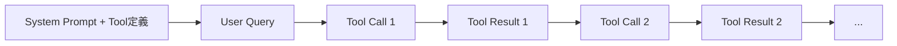

本記事は [Don't Break the Cache (arXiv:2601.06007)](https://arxiv.org/abs/2601.06007) の解説記事です。

## 論文概要（Abstract）

著者らは、OpenAI・Anthropic・Googleの3プロバイダが提供するプロンプトキャッシュ機能を、複数ターンにわたるツール呼び出しを伴う長期エージェントタスクで評価している。評価にはDeepResearch Benchを用い、500以上のエージェントセッションを実行して、キャッシュ境界の置き方が異なる複数の戦略（全文脈キャッシュ、システムプロンプトのみ、ツール結果の除外）を比較した。著者らは、APIコストが41〜80%削減され、Time to First Token（TTFT）が13〜31%改善したと報告している。一方で、全文脈を無条件にキャッシュすると、モデルによってはレイテンシがかえって悪化するとも報告している。

## 情報源

| 項目 | 内容 |
|------|------|
| arXiv ID | 2601.06007 |
| URL | https://arxiv.org/abs/2601.06007 |
| 著者 | Elias Lumer, Faheem Nizar, Akshaya Jangiti, Kevin Frank, Anmol Gulati, Mandar Phadate, Vamse Kumar Subbiah |
| 発表年 | 2026年 |
| 分野 | LLM推論の効率化、LLMエージェント |

## 背景と動機

LLMエージェントは、ツールを呼び出すたびに「システムプロンプト、ツール定義、過去の対話、ツール結果」をすべて含むリクエストを再送する。ターン数 $T$ が増えるほど、入力トークンの総量はおおよそ $T$ の二乗で増える。この入力の大半は前ターンとの重複である。

プロバイダ各社は、同一プレフィックスのKVキャッシュ（Transformerのアテンション計算で得られるKey/Valueの中間表現）を再利用するプロンプトキャッシュを提供している。ただし、最小トークン数、TTL、課金体系、自動か明示指定かといった仕様はプロバイダごとに異なる。また、既存のキャッシュ研究は単発リクエストや静的な長文プロンプトを対象とすることが多く、ツール結果のような動的内容が毎ターン追加されるエージェント環境での系統的な比較は不足していた。著者らはこのギャップを埋めることを動機としている。

## 主要な貢献

- 3つの主要プロバイダ（OpenAI、Anthropic、Google）で、長期エージェントタスクにおけるプロンプトキャッシュを横断的に評価した。著者らはこれを初の包括的評価と位置づけている。
- キャッシュ境界の置き方が異なる戦略（全文脈、システムプロンプトのみ、ツール結果の除外）を比較し、コストとTTFTへの影響を定量化した。
- プロンプトサイズ（500〜50Kトークン）とツール呼び出し回数（3〜50回）を変えるアブレーション研究を実施した。
- 動的コンテンツをプロンプトの末尾に置く、ツール定義を固定するといった、実務で使える設計指針を提示した。

## 技術的詳細

### プロンプトキャッシュの基本モデル

プロバイダのキャッシュは、リクエストの先頭からの**完全一致プレフィックス**に対して効く。リクエストのトークン列を $x_1, \dots, x_N$、キャッシュ済みプレフィックス長を $L$ とすると、キャッシュヒットの条件は次のように書ける。

$$
L = \max\{\,k \le N \mid x_{1:k} \in \mathcal{C}\,\}
$$

ここで $\mathcal{C}$ はキャッシュ済みプレフィックスの集合である。1トークンでも途中が変わると、それ以降のキャッシュはすべて無効になる。論文タイトルの "Don't Break the Cache" は、この性質を指している。

### コストモデル

1リクエストの入力コストを、通常入力単価 $p$、キャッシュ読み出し単価 $p_r$、キャッシュ書き込み単価 $p_w$ で表す。

$$
\text{Cost} = p\,(N - L - W) + p_r\,L + p_w\,W
$$

- $N$: 入力トークン総数
- $L$: キャッシュから読み出されたトークン数
- $W$: 新たにキャッシュへ書き込まれたトークン数
- $p, p_r, p_w$: 各単価（プロバイダにより $p_r < p \le p_w$ や $p_w = p$ など異なる）

$T$ ターンのセッションで、毎ターン $\Delta$ トークンが追加される（システムプロンプトは $S$ トークン）とすると、キャッシュなしの総入力トークン数は次の通りである。

$$
N_{\text{total}} = \sum_{t=1}^{T} (S + t\Delta) = TS + \frac{T(T+1)}{2}\Delta
$$

システムプロンプトのみをキャッシュする場合、第1項 $TS$ が割引対象になる。全文脈をキャッシュする場合は理論上、第2項の大部分も割引対象になる。ただし $W$ が毎ターン発生するため、書き込みコストと書き込みレイテンシがかかる。

### 評価した4つのキャッシュ条件

著者らは、キャッシュを意図的に無効化する手段として、プロンプトにUUIDを挿入する手法を使っている。UUIDより後ろはリクエストごとに変わるので、その位置でキャッシュが切れる。この仕組みで4つの条件を作っている。

| 条件 | UUIDの位置 | キャッシュされる範囲 |
|------|-----------|---------------------|
| No Cache（基準） | システムプロンプトの先頭 | なし |
| Full Context | UUIDなし | プロンプト全体（プロバイダの自動判断） |
| System Prompt Only | システムプロンプトの直後 | 静的なシステムプロンプトのみ |
| Exclude Tool Results | システムプロンプトの直後と各ツール結果の直後 | ツール結果を除く部分 |



System Prompt Onlyでは A の直後で、Exclude Tool Resultsでは A の直後と各 Tool Result の直後でキャッシュが切れる。Full Contextでは全体がキャッシュ対象になる。

### 実験設定

論文によると、モデルはGPT-4o、GPT-5.2（OpenAI）、Claude Sonnet 4.5（Anthropic）、Gemini 2.5 Pro（Google）である。ベンチマークはDeepResearch Benchで、22分野の博士レベルのリサーチ質問100問から構成される。マルチターンでWeb検索等のツールを呼び出すため、エージェントのキャッシュ挙動を測るのに適している。システムプロンプトは約10,000トークンを基本とし、合計500以上のセッションを実行している。

プロバイダ間の仕様差として、著者らは最小キャッシュ可能トークン数がOpenAIとAnthropicで1,024、Googleで4,096であること、TTLが5分から24時間まで幅があることを挙げている。

### 計測指標

コスト削減率とTTFT改善率は、基準（No Cache）に対する相対値として次のように定義される。

$$
\Delta_{\text{cost}} = \frac{C_{\text{base}} - C_{\text{strategy}}}{C_{\text{base}}} \times 100, \qquad
\Delta_{\text{TTFT}} = \frac{\overline{T}_{\text{base}} - \overline{T}_{\text{strategy}}}{\overline{T}_{\text{base}}} \times 100
$$

$C$ はセッションあたりのAPIコスト、$\overline{T}$ は平均TTFTである。TTFT改善率が負の値なら、キャッシュによってレイテンシが悪化したことを意味する。

### なぜ全文脈キャッシュで遅くなりうるのか

著者らの説明は、ツール結果のような動的内容はセッション間で再利用されないため、キャッシュ書き込みのオーバーヘッドが読み出しの利益を上回る場合がある、というものである。システムプロンプトのようにセッション間で共通の内容は、書き込みが一度で済み、以降は読み出し続けられる。ツール結果は1回しか読み出されない（同一セッションの次ターンのみ）ことが多く、書き込み側のコストが回収しにくい。

## 実装のポイント

実装上の要点は、「プロンプトの並びをキャッシュ境界に合わせて設計すること」に尽きる。著者らの推奨を、次の順序で整理できる。

1. 静的な内容（システム指示、ツール定義、Few-shot例）を先頭に置く。
2. 動的な値（タイムスタンプ、ユーザー固有情報）はシステムプロンプトの末尾に置き、キャッシュ可能なプレフィックスを最大化する。
3. ツール定義は固定する。リクエストごとにツールを動的に増減すると、プレフィックスが壊れる。可変の機能は、コード生成など別の仕組みで実行時に提供する。
4. プロバイダごとの実装差を前提に、自分のワークロードで計測してから境界戦略を選ぶ。

以下は、境界を意識したメッセージ組み立ての例である（論文のコードではなく、解説のための実装例）。

```python
from dataclasses import dataclass, field
from datetime import datetime, timezone


@dataclass(frozen=True)
class PromptParts:
    """キャッシュ境界を意識したプロンプト構成要素。"""

    static_system: str                      # 不変のシステム指示
    tool_schemas: tuple[dict, ...]          # 固定のツール定義
    dynamic_suffix: str = ""                # 毎回変わる値
    history: tuple[dict, ...] = field(default_factory=tuple)


def build_messages(parts: PromptParts) -> list[dict]:
    """静的部分を先頭、動的部分を末尾に配置したメッセージ列を返す。

    Args:
        parts: プロンプト構成要素。

    Returns:
        プレフィックスが安定したメッセージ列。
    """
    system_text = parts.static_system
    # 動的な値は静的テキストの後ろに置き、プレフィックスを壊さない
    if parts.dynamic_suffix:
        system_text += "\n\n" + parts.dynamic_suffix
    return [{"role": "system", "content": system_text}, *parts.history]


def now_stamp() -> str:
    """動的サフィックス用の現在時刻文字列を返す。"""
    return f"Current time: {datetime.now(timezone.utc).isoformat(timespec='minutes')}"
```

Anthropicでは `cache_control` ブレークポイントを明示し、OpenAIとGoogleのGemini暗黙キャッシュでは自動判定に任せる、といった差があるため、境界の制御手段は各APIのドキュメントで確認する必要がある。

## Production Deployment Guide

ここでは、論文の知見を本番のエージェント基盤に落とし込む際の構成例を示す。以下のコスト試算は、論文の結果ではなく、公開されている一般的なAWS料金体系に基づく概算であり、リージョンや時期により変動する。

### パターン別アーキテクチャ

| 規模 | 想定トラフィック | 構成 | 月額概算（LLM API除く） |
|------|----------------|------|------------------------|
| Small | 〜1万セッション/日 | API Gateway + Lambda + DynamoDB | 約50〜150 USD |
| Medium | 〜10万セッション/日 | ALB + ECS Fargate + ElastiCache + DynamoDB | 約500〜1,500 USD |
| Large | 10万セッション/日超 | EKS + ElastiCache(クラスタ) + MSK + 専用ログ基盤 | 約3,000〜10,000 USD |

- **Small**: Lambdaでエージェントループを実行する。プロンプトの静的部分はコードにバンドルし、セッション状態はDynamoDBに保存する。Lambdaの最大実行時間（15分）に収まるタスクに向く。
- **Medium**: 長時間セッションをFargateで処理する。キャッシュヒット率の計測値をElastiCacheに集計し、プロンプトテンプレートのバージョン管理を行う。
- **Large**: 複数テナント、複数プロバイダを扱う。プロバイダのレート制限とキャッシュTTLを考慮して、同一セッションのリクエストを同じ経路にまとめるルーティングを検討する。

キャッシュによる削減を含めたLLM API費用の試算の考え方は次の通りである。論文が報告する削減率（41〜80%）はモデルや戦略により異なるため、自社のモデルでの実測値を使う。

| 項目 | キャッシュなし | キャッシュあり（削減率50%と仮定） |
|------|---------------|--------------------------------|
| 月間LLM入力コスト | 10,000 USD | 5,000 USD |
| インフラ追加コスト | 0 | 数十〜数百 USD |

### Terraform例（Small構成）

```hcl
terraform {
  required_providers {
    aws = { source = "hashicorp/aws", version = "~> 5.0" }
  }
}

variable "region" {
  type    = string
  default = "ap-northeast-1"
}

provider "aws" {
  region = var.region
}

resource "aws_dynamodb_table" "sessions" {
  name         = "agent-sessions"
  billing_mode = "PAY_PER_REQUEST"
  hash_key     = "session_id"

  attribute {
    name = "session_id"
    type = "S"
  }

  ttl {
    attribute_name = "expires_at"
    enabled        = true
  }
}

resource "aws_iam_role" "agent_lambda" {
  name = "agent-lambda-role"
  assume_role_policy = jsonencode({
    Version = "2012-10-17"
    Statement = [{
      Action    = "sts:AssumeRole"
      Effect    = "Allow"
      Principal = { Service = "lambda.amazonaws.com" }
    }]
  })
}

resource "aws_iam_role_policy_attachment" "basic" {
  role       = aws_iam_role.agent_lambda.name
  policy_arn = "arn:aws:iam::aws:policy/service-role/AWSLambdaBasicExecutionRole"
}

resource "aws_lambda_function" "agent" {
  function_name = "agent-loop"
  role          = aws_iam_role.agent_lambda.arn
  runtime       = "python3.12"
  handler       = "app.handler"
  filename      = "build/agent.zip"
  timeout       = 900
  memory_size   = 1024

  environment {
    variables = {
      SESSIONS_TABLE = aws_dynamodb_table.sessions.name
    }
  }
}
```

APIキーはSecrets Managerに保存し、IAMロールに読み取り権限を付ける。上記では簡略化のため省略している。

### 監視（CloudWatch）

キャッシュ運用で最も重要な指標は、キャッシュヒット率とTTFTである。各プロバイダのレスポンスに含まれるusage情報（キャッシュ読み出しトークン数など）からヒット率を計算し、カスタムメトリクスとして送出する。

```python
import boto3

cloudwatch = boto3.client("cloudwatch")


def publish_cache_metrics(
    provider: str,
    input_tokens: int,
    cached_tokens: int,
    ttft_ms: float,
) -> None:
    """キャッシュヒット率とTTFTをCloudWatchに送信する。

    Args:
        provider: プロバイダ名（openai, anthropic, google）。
        input_tokens: 入力トークン総数。
        cached_tokens: キャッシュから読み出されたトークン数。
        ttft_ms: Time to First Token（ミリ秒）。
    """
    hit_rate = cached_tokens / input_tokens if input_tokens else 0.0
    dims = [{"Name": "Provider", "Value": provider}]
    cloudwatch.put_metric_data(
        Namespace="Agent/PromptCache",
        MetricData=[
            {"MetricName": "CacheHitRate", "Dimensions": dims,
             "Value": hit_rate, "Unit": "None"},
            {"MetricName": "TTFT", "Dimensions": dims,
             "Value": ttft_ms, "Unit": "Milliseconds"},
        ],
    )
```

アラームは、CacheHitRateが一定期間、基準値（過去の中央値など）を下回った場合に通知する設定が有効である。プロンプトテンプレートの変更で動的値がプレフィックス内に紛れ込むと、ヒット率が急落するためである。ヒット率の低下と同時にTTFTが悪化していれば、「キャッシュを壊した」可能性が高いと判断できる。

### コスト最適化チェックリスト

- [ ] システムプロンプトとツール定義が、リクエスト間でバイト単位で同一か
- [ ] タイムスタンプやユーザーIDが、プレフィックスの途中に入っていないか
- [ ] プロンプトが各プロバイダの最小キャッシュトークン数（OpenAI・Anthropicは1,024、Googleは4,096と論文に記載）を超えているか
- [ ] キャッシュのTTL内に次のリクエストが届く設計か（長い待ち時間のタスクは再書き込みになる）
- [ ] ツール結果までキャッシュ対象にして書き込みコストが読み出しの利益を上回っていないか（モデル別にTTFTを実測する）
- [ ] ヒット率とTTFTのダッシュボードとアラームがあるか
- [ ] プロンプトテンプレートの変更がCIで差分検出され、キャッシュ影響をレビューされるか
- [ ] ツール定義の動的な増減を避けているか

## 実験結果

### コスト削減とTTFT改善

論文Table 1 より、基準（No Cache）に対する各モデルの最良戦略での結果は次の通りである。

| モデル | 最良戦略 | コスト削減 | TTFT改善 |
|--------|---------|-----------|----------|
| GPT-5.2 | Exclude Tool Results | 79.6% | 13.0% |
| Claude Sonnet 4.5 | System Prompt Only | 78.5% | 22.9% |
| GPT-4o | System Prompt Only | 45.9% | 30.9% |
| Gemini 2.5 Pro | System Prompt Only | 41.4% | 6.1% |

著者らは、コスト削減は41〜80%、TTFT改善は13〜31%の範囲に収まると報告している（なお、Gemini 2.5 ProのTTFT改善は上表の通り6.1%であり、13〜31%の範囲外の値も含まれる点には注意が必要である）。

### 戦略間の差

論文Table 2 より、コスト削減率はモデルごとに戦略間で概ね2〜4ポイントの差に収まっている。著者らは、コスト削減の大半がシステムプロンプトのキャッシュによってもたらされると解釈している。つまり、ツール結果まで追加でキャッシュしても、コスト面の上積みは小さい。

一方でレイテンシは戦略の影響が大きい。著者らは、GPT-4oで全文脈キャッシュ（Full Context）がTTFTを8.8%悪化させた一方、Claude Sonnet 4.5では全文脈キャッシュでも20.9〜22.9%改善したと報告している。同じ戦略でもプロバイダ・モデルによって効果の符号が変わりうるため、横並びで一般化することは難しい。

### アブレーション研究

著者らは、プロンプトサイズ（500〜50Kトークン）とツール呼び出し回数（3〜50回）を変える追加実験を行っている。ここでは論文の定性的な傾向を整理する。なお、個別の数値は本記事では引用していないので、詳細は原論文を参照されたい。

- プロンプトが小さいと、最小キャッシュトークン数に届かないか、節約できる絶対量が小さいため、効果は限定的になる。
- プロンプトが大きいほど、再利用できるプレフィックスが大きく、効果が大きくなる。
- ツール呼び出しが増えるほど、再送される共通プレフィックスの回数が増えるため、キャッシュの累積的な利益が増える。

### プロバイダ別の所見

- **Anthropic**: Claude Sonnet 4.5では、System Prompt Onlyで最大のTTFT改善が出ており、全文脈でも悪化は見られなかった。
- **OpenAI**: GPT-5.2はExclude Tool Resultsでコスト削減が最大、GPT-4oは全文脈でTTFT悪化が見られた。同一プロバイダでもモデルで挙動が異なる。
- **Google**: Gemini 2.5 Proはコスト・TTFTとも改善幅が相対的に小さかった。最小キャッシュトークン数が4,096と大きい点が関係している可能性があるが、著者らがこれを因果として断定しているかは本記事では確認できていない。

## 実運用への応用

エージェント基盤を運用する立場では、まず「静的部分を先頭、動的部分を末尾」という並びを徹底することが、最もコスト効果が高い。システムプロンプトのキャッシュだけで削減の大半が得られるという著者らの結果に従えば、ツール結果の扱いを複雑に最適化する前に、プレフィックスの安定化を優先するのが合理的である。

次に、ツール結果を含む全文脈キャッシュは、モデルによってはTTFTを悪化させるため、有効化前に自社ワークロードでA/B計測する。論文のUUID挿入手法は、キャッシュ境界を人為的に制御する簡便な方法として、計測用のハーネスにも流用できる。

さらに、MCPサーバーなどでツールを動的に追加するエージェントは、ツール定義の変更がプレフィックス全体を無効化する点に注意が必要である。

## 関連研究

- **Prompt Cache: Modular Attention Reuse for Low-Latency Inference (Gim et al., 2023)**: プロンプトを再利用可能なモジュールに分け、アテンション状態を再利用する手法。プレフィックス一致に限らない再利用を扱う点が、本論文の実運用寄りの評価と対照的である。
- **Efficient Memory Management for Large Language Model Serving with PagedAttention (Kwon et al., 2023)**: vLLMのPagedAttention。KVキャッシュのメモリ管理を効率化し、プレフィックス共有の基盤技術になっている。
- **SGLang: Efficient Execution of Structured Language Model Programs (Zheng et al., 2023)**: RadixAttentionにより、複数リクエスト間のKVキャッシュをツリー構造で再利用する。エージェント的なマルチコール処理を対象としている。
- **CacheBlend (Yao et al., 2024)**: プレフィックスが一致しない場合でも、RAGの文書チャンクのKVキャッシュを部分的に再計算して再利用する。

## まとめと今後の展望

著者らは、3プロバイダでのエージェント評価から、プロンプトキャッシュがコストを41〜80%、TTFTを13〜31%（モデルにより異なる）改善しうること、また全文脈キャッシュが逆効果になる場合があることを示している。実装上は、静的内容を先頭、動的内容を末尾に置き、ツール定義を固定するという設計が要となる。今後は、プロバイダ仕様の変更（TTL、最小トークン数、料金）に追従した再評価や、より長いタスクでの検証が課題となる。

## 参考文献

1. Lumer, E., Nizar, F., Jangiti, A., Frank, K., Gulati, A., Phadate, M., Subbiah, V. K. "Don't Break the Cache: An Evaluation of Prompt Caching for Long-Horizon Agentic Tasks." arXiv:2601.06007, 2026. https://arxiv.org/abs/2601.06007
2. Gim, I. et al. "Prompt Cache: Modular Attention Reuse for Low-Latency Inference." arXiv:2311.04934, 2023.
3. Kwon, W. et al. "Efficient Memory Management for Large Language Model Serving with PagedAttention." SOSP 2023.
4. Zheng, L. et al. "SGLang: Efficient Execution of Structured Language Model Programs." arXiv:2312.07104, 2023.
5. Yao, J. et al. "CacheBlend: Fast Large Language Model Serving for RAG with Cached Knowledge Fusion." arXiv:2405.16444, 2024.
6. 関連Zenn記事: [マルチターンAgent会話のプロンプトキャッシュ設計パターンとヒット率改善](https://zenn.dev/0h_n0/articles/d0cba2aa6f275e)
