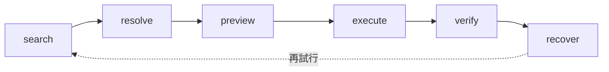
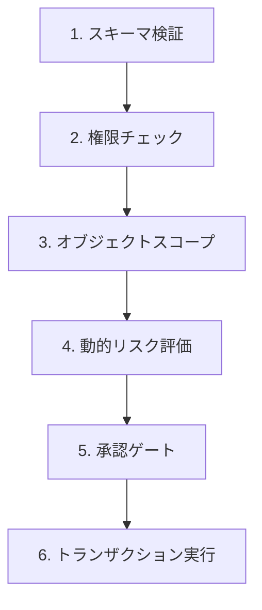

## 論文概要（Abstract）

本記事は [https://arxiv.org/abs/2605.10555](https://arxiv.org/abs/2605.10555) の解説記事です。

AIエージェントが研究プロトタイプからエンタープライズの本番環境へ移行する際、ツールインターフェースが依然として人間向けのCRUDパラダイムに根ざしている問題を指摘した論文である。著者らは5つのアーキテクチャ上のミスマッチを特定し、6動詞セマンティックプロトコル、Normalized Tool Contract（NTC）、デュアルレイヤーガバナンスパイプラインという3つの統合メカニズムで解決するAgent-First Tool APIパラダイムを提案している。本番マルチテナントSaaSプラットフォーム上での実験では、タスク成功率88%（CRUD比+37.5%）、人間介入72.7%削減、自律エラー回復5.8倍改善が報告されている。

この記事は [Zenn記事: LangGraph×サーキットブレーカーで実装するAIエージェントのエラー回復設計](https://zenn.dev/0h_n0/articles/4b5b6e56c8b488) の深掘りです。

## 情報源

- **arXiv ID**: 2605.10555
- **URL**: [https://arxiv.org/abs/2605.10555](https://arxiv.org/abs/2605.10555)
- **著者**: Kai Pan, Rong Hou（A2A Lab）
- **発表年**: 2026年（v1: 2026年5月11日、v2: 2026年8月20日）
- **分野**: cs.AI

## 背景と動機（Background & Motivation）

### なぜ従来のAPIではエージェントが動かないのか

2025年以降、LLMベースのAIエージェントが急速に普及し、ReActやFunction Callingを用いた外部ツール連携が標準的な設計パターンとなった。しかし、著者らはエージェントが実際に消費するツールインターフェース（API）そのものに根本的な問題があると指摘している。従来のREST API（CRUD: Create/Read/Update/Delete）は、人間がUI経由で操作することを前提に設計されている。エージェントは自然言語で目的を記述し、曖昧さを解消しながら多段階の操作を自律的に実行する必要があるが、CRUDの設計思想はこれとかみ合わない。

著者らは、この乖離を5つのアーキテクチャ上のミスマッチとして体系化している。

### 5つのアーキテクチャミスマッチ

| # | ミスマッチ | 従来CRUD API | エージェントの要求 |
|---|-----------|-------------|-----------------|
| 1 | **正確識別子への依存** | `GET /users/12345` のように正確なIDが必須 | 自然言語の記述（「先月入社した田中さん」）からエンティティを特定したい |
| 2 | **レンダリング指向レスポンス** | HTMLテンプレートやUI表示用のJSON | 意思決定に必要な構造化メタデータ（信頼度、根拠、次のアクション候補） |
| 3 | **シングルショット前提** | 1リクエスト=1操作で完結 | 検索→確認→実行→検証の多段階インタラクション |
| 4 | **ユーザー同等の認可** | ユーザーセッションに紐づく権限 | エージェント固有の権限モデル（委任範囲、リスクベースのエスカレーション） |
| 5 | **不透明なエラーセマンティクス** | HTTP 500 + 人間向けエラーメッセージ | 構造化された回復手段（代替操作、ロールバック手順、再試行条件） |

特に深刻なのはミスマッチ1（正確識別子への依存）である。著者らの実験では、CRUDベースラインにおいてエージェントが存在しないIDを「幻覚」する頻度が28%に達したのに対し、Agent-First APIでは4%に低減したと報告されている（85.7%の削減）。エージェントが正確なIDを事前に知っていることはまれであり、ファジー検索から段階的にエンティティを特定するプロセスが不可欠だという知見である。

## 主要な貢献（Key Contributions）

著者らの貢献は以下の3点に集約される。

- **貢献1: 6動詞セマンティックプロトコル** -- ツール操作を search / resolve / preview / execute / verify / recover の6フェーズに分解し、エージェントが曖昧さの解消から障害回復まで自律的に遂行できる意味的インターフェースを定義
- **貢献2: Normalized Tool Contract（NTC）** -- 信頼度スコア、証拠チェーン、推奨次アクション、結果参照を標準化した構造化メタデータにより、エージェントの意思決定を支援
- **貢献3: デュアルレイヤーガバナンスパイプライン** -- 静的な権限ポリシーと動的なリスクエスカレーションを組み合わせた6段階の検証パイプラインにより、エンタープライズレベルのセキュリティと自律性を両立

## 技術的詳細（Technical Details）

### 6動詞セマンティックプロトコル

Agent-First Tool APIの中核は、ツールとのインタラクションを6つの意味的フェーズに分解するプロトコルである。すべてのフェーズが毎回必要なわけではなく、タスクの性質に応じて組み合わせる設計となっている。



#### 1. search（セマンティック検索）

自然言語による記述を受け取り、関連度スコア付きの候補セットを返す。従来のCRUDが正確なIDを要求するのに対し、searchは曖昧な記述からのファジーマッチングを提供する。

```python
# 概念的なインターフェース（論文の記述に基づく）
def semantic_search(
    description: str,      # 自然言語クエリ（例: "先月作成された未解決のチケット"）
    context: dict,         # テナント・ブランド等のスコープ情報
) -> SearchResult:
    """関連度スコア付き候補セットを返す"""
    ...

@dataclass
class SearchResult:
    candidates: list[Candidate]      # 関連度順の候補リスト
    confidence: float                 # 全体の信頼度（0.0-1.0）
    evidence: list[EvidenceItem]      # マッチ根拠
    suggested_actions: list[str]      # 推奨次アクション
```

#### 2. resolve（曖昧性解消）

search結果から正規のエンティティに決定論的に解決する。これにより、エージェントがIDを「幻覚」するリスクを排除する。著者らは、CRUDベースラインでID幻覚率が28%だったのに対し、resolve動詞の導入により4%に低減したと報告している。

#### 3. preview（ドライラン）

状態を変更する操作の事前に、予想される影響をシミュレーションして返す。エージェントは実行前にリスク評価を行い、意図しない副作用を防止できる。

```python
@dataclass
class PreviewResult:
    expected_changes: list[Change]    # 予想される状態変更
    risk_level: str                   # "low" / "medium" / "high" / "critical"
    reversible: bool                  # ロールバック可能か
    affected_entities: list[str]      # 影響を受けるエンティティ
    estimated_cost: float | None      # 推定コスト（課金操作の場合）
```

#### 4. execute（実行）

実際の状態変更を行う。呼び出し元が供給する冪等性キーにより、リトライ時の重複実行を防止する設計となっている。

#### 5. verify（事後検証）

実行後に、実際の結果がエージェントの意図と一致しているかを確認する。単なるHTTPステータスの確認ではなく、ビジネスロジックレベルでの事後条件の検証を行う。

#### 6. recover（障害回復）

エラー発生時に、構造化された回復アドバイス、代替操作、修正候補を提供する。従来のHTTPエラーコード＋人間向けメッセージとは異なり、エージェントが自律的に次のアクションを決定できるだけの情報を返す。

```python
@dataclass
class RecoverResult:
    recovery_options: list[RecoveryOption]  # 回復オプション一覧
    root_cause: str                         # 根本原因の分類
    compensating_actions: list[Action]      # 補償アクション
    retry_eligible: bool                    # リトライ可能か
    suggested_alternative: str | None       # 代替操作の提案
```

### Normalized Tool Contract（NTC）

NTCは、すべてのAPI応答に付加される構造化メタデータであり、以下の4つのコンポーネントから構成される。

| コンポーネント | 説明 | 効果 |
|-------------|------|------|
| **信頼度スコア** | ベイズ更新により校正された確率値（0.0-1.0） | プランナーが行動選択の根拠として利用 |
| **証拠の来歴** | マッチ件数、マッチ指標等の構造化配列 | 監査証跡の提供、判断根拠の追跡 |
| **次アクション提案** | 推奨される後続操作のリスト | プランナーの探索空間を最適化 |
| **結果参照** | 型付きエンティティポインタ | 下流ツールでの効率的な消費 |

著者らの実験では、信頼度スコアとタスク成功率に明確な相関が確認されている。高信頼度（>0.8）の結果ではタスク成功率91%であったのに対し、低信頼度（<0.6）では48%にとどまったと報告されている。この結果は、NTCが単なる付加情報ではなく、エージェントの意思決定品質に直結するメカニズムであることを示唆している。

### デュアルレイヤーガバナンスパイプライン

エンタープライズ環境では、エージェントに無制限の操作権限を与えることは受け入れられない。著者らは6段階の検証パイプラインを設計し、静的ポリシーと動的リスク評価を統合している。



各段階の詳細は以下の通りである。

1. **スキーマ検証**: 入力制約の強制（型チェック、必須フィールド等）
2. **権限チェック**: RBAC方式の権限マトリクスによる静的ポリシー適用
3. **オブジェクトスコープ**: テナント→ブランド→ストア→ユーザーの4階層分離
4. **動的リスク評価**: 操作範囲、対象エンティティ数、クロスブランド活動、不可逆性に基づくランタイムリスク計算
5. **承認ゲート**: 高リスク操作のプロトコル内一時停止（人間承認待ち）
6. **トランザクション実行**: 状態整合性と監査可能性の確保

注目すべきは第4段階の動的リスク評価である。著者らによると、85ツール中23.5%で自動的なクロスブランドエスカレーションが発動し、偽陽性率は2%未満であったと報告されている。これは、静的ポリシーだけでは捕捉できないリスクをランタイムで動的に検知する仕組みが有効であることを示している。

## 実装のポイント（Implementation）

### 既存APIとの共存設計

著者らのアプローチで実務上重要な点は、Agent-First APIが既存のCRUD APIを置き換えるのではなく、並行して運用される設計であることだ。論文では、従来のCRUD（RESTful、UI向け）とAgent-First（セマンティック、エージェント向け）の2つのAPI面を維持し、基盤となるドメインモデルと権限システムを共有する構成が報告されている。

```python
# 概念的な共存アーキテクチャ（論文の記述に基づく構成イメージ）
class TicketService:
    """ドメインモデル層 -- CRUD/Agent-First両方から利用"""

    def __init__(self, repo: TicketRepository, authz: AuthorizationService) -> None:
        self._repo = repo
        self._authz = authz

    # --- CRUD API面（UI向け） ---
    def get_ticket_by_id(self, ticket_id: str) -> Ticket:
        """正確なIDで取得。UIが既にIDを知っている前提"""
        return self._repo.get(ticket_id)

    # --- Agent-First API面（エージェント向け） ---
    def search_tickets(self, description: str, context: ScopeContext) -> SearchResult:
        """自然言語記述でファジー検索。NTC付きで返す"""
        candidates = self._repo.semantic_search(description, context.scope)
        return SearchResult(
            candidates=candidates,
            confidence=self._compute_confidence(candidates),
            evidence=self._build_evidence(candidates),
            suggested_actions=["resolve_candidates"] if len(candidates) > 1 else ["preview_action"],
        )

    def resolve_ticket(self, candidate_id: str, context: ScopeContext) -> ResolveResult:
        """曖昧性を解消し正規エンティティに解決"""
        ticket = self._repo.get(candidate_id)
        self._authz.check_scope(context, ticket)
        return ResolveResult(entity=ticket, canonical_id=ticket.id)
```

この設計により、既存のフロントエンドやサードパーティ連携を壊すことなく、エージェント向けインターフェースを段階的に追加できる。

### 6動詞のLangGraphノードへのマッピング

6動詞プロトコルは、LangGraphのStateGraphにおけるノードとエッジに自然にマッピングできる。

```python
from langgraph.graph import StateGraph
from langgraph.types import RetryPolicy
from typing import TypedDict, Annotated
import operator


class AgentFirstState(TypedDict):
    messages: Annotated[list[dict], operator.add]
    search_results: list[dict]
    resolved_entity: dict | None
    preview: dict | None
    execution_result: dict | None
    verification: dict | None
    status: str


def search_node(state: AgentFirstState) -> dict:
    """search動詞: セマンティック検索を実行"""
    # ツールAPIのsearchエンドポイントを呼び出す
    results = tool_api.semantic_search(
        description=state["messages"][-1]["content"],
        context=get_scope_context(),
    )
    return {"search_results": results.candidates, "status": "searched"}


def resolve_node(state: AgentFirstState) -> dict:
    """resolve動詞: 曖昧性を解消"""
    candidates = state["search_results"]
    if len(candidates) == 1:
        resolved = candidates[0]
    else:
        # 信頼度スコアが最も高い候補を選択
        resolved = max(candidates, key=lambda c: c["confidence"])
    return {"resolved_entity": resolved, "status": "resolved"}


def preview_node(state: AgentFirstState) -> dict:
    """preview動詞: ドライランで影響を確認"""
    preview = tool_api.preview_action(
        entity_id=state["resolved_entity"]["id"],
        action=extract_intended_action(state["messages"]),
    )
    return {"preview": preview, "status": "previewed"}


def should_execute(state: AgentFirstState) -> str:
    """previewのリスクレベルに基づき分岐"""
    risk = state["preview"].get("risk_level", "high")
    if risk in ("low", "medium"):
        return "execute"
    return "escalate"  # 高リスクは人間承認へ


graph = StateGraph(AgentFirstState)
graph.add_node("search", search_node, retry_policy=RetryPolicy(max_attempts=3))
graph.add_node("resolve", resolve_node)
graph.add_node("preview", preview_node)
graph.add_node("execute", execute_node)
graph.add_node("verify", verify_node)
graph.add_node("recover", recover_node)

graph.add_edge("search", "resolve")
graph.add_edge("resolve", "preview")
graph.add_conditional_edges("preview", should_execute, {"execute": "execute", "escalate": "escalate"})
graph.add_edge("execute", "verify")
```

## Production Deployment Guide

本セクションでは、Agent-First Tool APIパラダイムをAWS上で本番運用する際の構成、コスト、運用設定を解説する。

### AWS実装パターン（コスト最適化重視）

Agent-First APIは既存のCRUD APIに並行してデプロイするため、セマンティック検索レイヤーの追加コストが主な増分となる。

**トラフィック量別の推奨構成:**

| 構成 | トラフィック | アーキテクチャ | 月額概算 |
|------|------------|-------------|---------|
| Small | ~100 req/日 | Lambda + Bedrock + OpenSearch Serverless | $80-200 |
| Medium | ~1,000 req/日 | ECS Fargate + Bedrock + OpenSearch | $400-900 |
| Large | 10,000+ req/日 | EKS + Spot + OpenSearch + ElastiCache | $2,500-6,000 |

**Small構成（~100 req/日）の内訳:**
- Lambda（6動詞ルーティング）: $5-10/月
- API Gateway: $5/月
- Bedrock（Claude Sonnet 4でセマンティック検索のembedding + NTC生成）: $30-80/月
- OpenSearch Serverless（候補検索用ベクトルDB）: $30-60/月
- DynamoDB（NTCメタデータ、冪等性キー、監査ログ）: $10-30/月
- CloudWatch: $5-10/月

**Medium構成（~1,000 req/日）の内訳:**
- ECS Fargate（6動詞プロトコルサーバー + ガバナンスパイプライン）: $80-150/月
- ALB: $30/月
- Bedrock: $150-400/月
- OpenSearch（t3.small.search x 2）: $80-150/月
- DynamoDB: $30-60/月
- ElastiCache（resolve結果キャッシュ）: $30-60/月

**Large構成（10,000+ req/日）の内訳:**
- EKS + Karpenter（Spot優先）: $500-1,200/月
- Bedrock Batch API: $500-1,500/月（通常比50%削減）
- OpenSearch（m6g.large.search x 3）: $400-800/月
- ElastiCache（r7g.large x 2）: $300-600/月
- DynamoDB（Provisioned + Auto Scaling）: $200-500/月

**コスト削減テクニック:**
- Spot Instances活用（EKSワーカーノード）: 最大90%削減
- Bedrock Batch API: リアルタイム性不要なNTC生成で50%削減
- Prompt Caching: 同一テナント内の類似search クエリで30-90%削減
- OpenSearch Reserved Instances: 1年コミットで最大40%削減

> 注意: 上記コストは2026年10月時点のAWS ap-northeast-1（東京）リージョンの概算値です。実際のコストはトラフィックパターン、Bedrockモデル選択、バースト使用量により変動します。最新料金は[AWS料金計算ツール](https://calculator.aws/)で確認してください。

### Terraformインフラコード

#### Small構成（Serverless）

```hcl
# Agent-First Tool API - Small構成（Lambda + Bedrock + OpenSearch Serverless）
# 前提: VPC、サブネットは既存のものを使用

# --- IAMロール（最小権限） ---
resource "aws_iam_role" "agent_api_lambda" {
  name = "agent-first-api-lambda-role"
  assume_role_policy = jsonencode({
    Version = "2012-10-17"
    Statement = [{
      Action = "sts:AssumeRole"
      Effect = "Allow"
      Principal = { Service = "lambda.amazonaws.com" }
    }]
  })
}

resource "aws_iam_role_policy" "agent_api_permissions" {
  name = "agent-first-api-permissions"
  role = aws_iam_role.agent_api_lambda.id
  policy = jsonencode({
    Version = "2012-10-17"
    Statement = [
      {
        Effect   = "Allow"
        Action   = ["bedrock:InvokeModel"]
        Resource = "arn:aws:bedrock:ap-northeast-1::foundation-model/anthropic.claude-sonnet-4-20250514-v1:0"
      },
      {
        Effect   = "Allow"
        Action   = ["aoss:APIAccessAll"]
        Resource = aws_opensearchserverless_collection.semantic.arn
      },
      {
        Effect = "Allow"
        Action = [
          "dynamodb:GetItem", "dynamodb:PutItem",
          "dynamodb:Query", "dynamodb:UpdateItem"
        ]
        Resource = aws_dynamodb_table.ntc_metadata.arn
      },
      {
        Effect   = "Allow"
        Action   = ["logs:CreateLogGroup", "logs:CreateLogStream", "logs:PutLogEvents"]
        Resource = "arn:aws:logs:*:*:*"
      }
    ]
  })
}

# --- Lambda（6動詞ルーター） ---
resource "aws_lambda_function" "agent_api" {
  function_name = "agent-first-tool-api"
  runtime       = "python3.12"
  handler       = "handler.lambda_handler"
  role          = aws_iam_role.agent_api_lambda.arn
  memory_size   = 512    # セマンティック検索処理用
  timeout       = 30     # preview/verifyに十分な時間
  filename      = "lambda.zip"

  environment {
    variables = {
      OPENSEARCH_ENDPOINT  = aws_opensearchserverless_collection.semantic.collection_endpoint
      DYNAMODB_TABLE       = aws_dynamodb_table.ntc_metadata.name
      BEDROCK_MODEL_ID     = "anthropic.claude-sonnet-4-20250514-v1:0"
      GOVERNANCE_STRICTNESS = "standard"  # standard / strict / permissive
    }
  }

  tracing_config {
    mode = "Active"  # X-Ray有効化
  }
}

# --- DynamoDB（NTCメタデータ + 冪等性キー） ---
resource "aws_dynamodb_table" "ntc_metadata" {
  name         = "agent-first-ntc-metadata"
  billing_mode = "PAY_PER_REQUEST"  # Small構成はオンデマンド
  hash_key     = "pk"
  range_key    = "sk"

  attribute {
    name = "pk"
    type = "S"
  }
  attribute {
    name = "sk"
    type = "S"
  }

  ttl {
    attribute_name = "ttl"
    enabled        = true
  }

  server_side_encryption {
    enabled = true  # KMS暗号化
  }
}

# --- OpenSearch Serverless（セマンティック検索） ---
resource "aws_opensearchserverless_collection" "semantic" {
  name = "agent-first-semantic"
  type = "VECTORSEARCH"
}

# --- CloudWatchアラーム（コスト監視） ---
resource "aws_cloudwatch_metric_alarm" "lambda_errors" {
  alarm_name          = "agent-first-api-errors"
  comparison_operator = "GreaterThanThreshold"
  evaluation_periods  = 2
  metric_name         = "Errors"
  namespace           = "AWS/Lambda"
  period              = 300
  statistic           = "Sum"
  threshold           = 10
  alarm_description   = "Agent-First API Lambda errors exceeded threshold"

  dimensions = {
    FunctionName = aws_lambda_function.agent_api.function_name
  }
}
```

#### Large構成（Container）

```hcl
# Agent-First Tool API - Large構成（EKS + Karpenter + Spot）

# --- EKSクラスタ ---
module "eks" {
  source  = "terraform-aws-modules/eks/aws"
  version = "~> 20.0"

  cluster_name    = "agent-first-api"
  cluster_version = "1.31"

  vpc_id     = var.vpc_id
  subnet_ids = var.private_subnet_ids

  # Karpenter用のIRSA設定
  enable_irsa = true
}

# --- Karpenter NodePool（Spot優先） ---
resource "kubectl_manifest" "karpenter_nodepool" {
  yaml_body = yamlencode({
    apiVersion = "karpenter.sh/v1"
    kind       = "NodePool"
    metadata   = { name = "agent-api-spot" }
    spec = {
      template = {
        spec = {
          requirements = [
            { key = "karpenter.sh/capacity-type", operator = "In", values = ["spot", "on-demand"] },
            { key = "node.kubernetes.io/instance-type", operator = "In",
              values = ["m7g.xlarge", "m6g.xlarge", "c7g.xlarge"] },
          ]
          nodeClassRef = { name = "default" }
        }
      }
      limits   = { cpu = "64", memory = "128Gi" }
      disruption = {
        consolidationPolicy = "WhenEmptyOrUnderutilized"
        consolidateAfter    = "60s"
      }
    }
  })
}

# --- AWS Budgets（月額アラート） ---
resource "aws_budgets_budget" "agent_api" {
  name         = "agent-first-api-monthly"
  budget_type  = "COST"
  limit_amount = "6000"
  limit_unit   = "USD"
  time_unit    = "MONTHLY"

  notification {
    comparison_operator       = "GREATER_THAN"
    threshold                 = 80
    threshold_type            = "PERCENTAGE"
    notification_type         = "ACTUAL"
    subscriber_email_addresses = [var.alert_email]
  }
}
```

### 運用・監視設定

#### CloudWatch Logs Insights クエリ

```
# 6動詞別のレイテンシ分析
fields @timestamp, verb, latency_ms, confidence_score
| filter verb in ["search", "resolve", "preview", "execute", "verify", "recover"]
| stats avg(latency_ms) as avg_latency,
        p95(latency_ms) as p95_latency,
        count(*) as invocation_count
  by verb
| sort avg_latency desc

# ガバナンスパイプラインのエスカレーション率
fields @timestamp, governance_stage, risk_level, escalated
| filter governance_stage = "dynamic_risk"
| stats count(*) as total,
        sum(escalated) as escalated_count,
        avg(risk_score) as avg_risk
  by bin(1h)
```

#### CloudWatch アラーム設定（Python）

```python
import boto3

cloudwatch = boto3.client("cloudwatch", region_name="ap-northeast-1")

# 6動詞プロトコルのエラー率監視
cloudwatch.put_metric_alarm(
    AlarmName="agent-first-verb-error-rate",
    MetricName="VerbErrorRate",
    Namespace="AgentFirstAPI",
    Statistic="Average",
    Period=300,
    EvaluationPeriods=2,
    Threshold=0.15,  # 15%以上でアラート
    ComparisonOperator="GreaterThanThreshold",
    AlarmActions=[sns_topic_arn],
    Dimensions=[{"Name": "Environment", "Value": "production"}],
)
```

#### X-Ray トレーシング設定

```python
from aws_xray_sdk.core import xray_recorder, patch_all

patch_all()  # boto3, requests等を自動計装

@xray_recorder.capture("agent_first_verb")
def handle_verb(verb: str, payload: dict) -> dict:
    """6動詞の実行をX-Rayでトレース"""
    subsegment = xray_recorder.current_subsegment()
    subsegment.put_annotation("verb", verb)
    subsegment.put_annotation("tenant_id", payload.get("tenant_id", "unknown"))
    subsegment.put_metadata("ntc_confidence", payload.get("confidence", 0.0))
    # ... 実行ロジック
```

#### Cost Explorer 日次レポート

```python
import boto3
from datetime import date, timedelta

ce = boto3.client("ce", region_name="us-east-1")

def get_daily_cost_report() -> dict:
    """Agent-First API関連の日次コストを取得"""
    response = ce.get_cost_and_usage(
        TimePeriod={
            "Start": str(date.today() - timedelta(days=1)),
            "End": str(date.today()),
        },
        Granularity="DAILY",
        Metrics=["BlendedCost"],
        Filter={
            "Tags": {
                "Key": "Project",
                "Values": ["agent-first-api"],
            }
        },
        GroupBy=[{"Type": "DIMENSION", "Key": "SERVICE"}],
    )
    total = sum(
        float(g["Metrics"]["BlendedCost"]["Amount"])
        for r in response["ResultsByTime"]
        for g in r["Groups"]
    )
    if total > 100:
        # SNS通知: $100/日超過
        sns = boto3.client("sns", region_name="ap-northeast-1")
        sns.publish(
            TopicArn=SNS_TOPIC_ARN,
            Subject="Agent-First API: Daily cost alert",
            Message=f"Daily cost exceeded $100: ${total:.2f}",
        )
    return response
```

### コスト最適化チェックリスト

**アーキテクチャ選択:**
- [ ] トラフィック量でServerless / Hybrid / Containerを判断
- [ ] セマンティック検索のベクトルDBサイズを見積もり

**リソース最適化:**
- [ ] EKS: Spot Instances優先（Karpenter設定）
- [ ] OpenSearch: Reserved Instances（1年コミット、最大40%削減）
- [ ] Lambda: メモリサイズをPower Tuningで最適化
- [ ] ECS/EKS: アイドル時スケールダウン（夜間・週末）
- [ ] Savings Plans: Compute Savings Plans検討

**LLMコスト削減:**
- [ ] Bedrock Batch API: 非リアルタイムNTC生成に適用（50%削減）
- [ ] Prompt Caching: 同一テナント・同一ツールの類似クエリでキャッシュ
- [ ] モデル選択ロジック: search/resolveはHaiku、preview/verifyはSonnet
- [ ] トークン数制限: NTCのevidence配列サイズを上限5に制限

**監視・アラート:**
- [ ] AWS Budgets: 月額上限設定
- [ ] CloudWatch: 6動詞別エラー率・レイテンシ
- [ ] Cost Anomaly Detection: 有効化
- [ ] 日次コストレポート: SNS通知設定

**リソース管理:**
- [ ] 未使用OpenSearchインデックス削除
- [ ] タグ戦略: Project / Environment / Verb タグ付与
- [ ] DynamoDB TTL: NTCメタデータに有効期限設定
- [ ] 開発環境: 夜間自動停止（EventBridge Scheduler）
- [ ] ログ保持期間: CloudWatch Logs 30日→S3 Glacier

## 実験結果（Results）

著者らは、本番マルチテナントSaaSプラットフォーム上で比較実験を実施している。環境は6つのビジネスドメイン（ERP、CRM、HRM、ITSM等）にわたる85の登録ツールであり、50の実運用タスクで評価が行われている。

### 主要メトリクス

| メトリクス | Agent-First API | CRUD+ReActベースライン | 改善 |
|-----------|----------------|---------------------|------|
| エンドツーエンド・タスク成功率 | 88% | 64% | +37.5% |
| ID幻覚エラー率 | 4% | 28% | -85.7% |
| エラー回復率 | 72.7% | 12.5% | 5.8倍 |
| 人間介入削減 | -- | -- | -72.7% |

### 分析

**タスク成功率の+37.5%改善**について、著者らはsearch/resolveフェーズの導入によるID幻覚の排除が最大の寄与因子であると分析している。CRUDベースラインでは、エージェントが正確なIDを知らない場合にIDを「幻覚」してしまい、存在しないリソースへのアクセスで失敗するケースが28%存在した。6動詞プロトコルのsearch→resolveフローにより、この問題が4%まで低減されている。

**エラー回復率の5.8倍改善**は、recover動詞が構造化された回復オプションを提供することで、エージェントが自律的にエラーから回復できるようになった結果である。CRUDベースラインではHTTPステータスコードと人間向けメッセージしか得られず、エージェントが適切な回復アクションを選択できなかった。

**トレードオフ**として、著者らは6動詞プロトコルが1タスクあたりのAPI呼び出し回数とトークン消費を増加させることを認めている。しかし、リトライループの排除により全体的なコストは削減されたと報告している。

### NTCの信頼度スコアと成功率の相関

| 信頼度範囲 | タスク成功率 |
|-----------|------------|
| > 0.8（高信頼度） | 91% |
| 0.6 - 0.8（中信頼度） | 74%（推定） |
| < 0.6（低信頼度） | 48% |

この結果は、エージェントの行動選択においてNTCの信頼度スコアが有効な判断材料として機能していることを示している。

## 実運用への応用（Practical Applications）

### Zenn記事のエラー回復設計との関連

関連するZenn記事では、LangGraphのRetryPolicy / TimeoutPolicy / error_handlerを組み合わせた4層回復アーキテクチャと、SAGAパターンによる補償トランザクションが解説されている。Agent-First Tool APIの6動詞プロトコルは、これらのオーケストレーション層のエラー回復とは異なるレイヤーで機能する。

具体的には以下のように棲み分けられる。

| レイヤー | 担当 | 技術 |
|---------|------|------|
| **ツールインターフェース層** | エラーの構造化表現、回復オプションの提供 | Agent-First API（recover動詞） |
| **オーケストレーション層** | リトライ、タイムアウト、サーキットブレーカー | LangGraph RetryPolicy + CircuitBreaker |
| **ワークフロー層** | 補償トランザクション、部分障害の巻き戻し | SAGAパターン |

Agent-First APIのrecover動詞が構造化された回復オプション（代替操作、補償アクション、リトライ可否）を返すことで、オーケストレーション層のerror_handlerがより賢明な判断を下せるようになる。従来のHTTPエラーコードでは「何が失敗したか」しかわからなかったが、recover動詞により「どう回復すべきか」まで機械可読な形で伝達される。

### MCPとの関係

著者らは、Agent-First APIがMCP（Model Context Protocol）等のトランスポート層標準に対して直交的かつ補完的であることを強調している。MCPがツールの発見・呼び出しのトランスポートを標準化するのに対し、Agent-First APIはその上の「セマンティック・アプリケーション層」として機能する。つまり、MCPで接続されたツールに対してAgent-First APIのプロトコルを適用することが可能であり、両者は排他的ではない。

### エンタープライズ適用の現実的な考慮事項

- **段階的導入**: 全85ツールを一度にAgent-First化するのではなく、エラー率の高いツールから優先的に6動詞化する
- **レイテンシ増加**: search→resolve→previewの追加フェーズによりレイテンシは増加するが、リトライループの排除で相殺される
- **コスト管理**: NTC生成にLLMを使用する場合、Prompt Cachingとモデル選択（search/resolveはHaiku、preview/verifyはSonnet）でコストを最適化する

## 関連研究（Related Work）

- **ReAct (Yao et al., 2022)**: LLMの推論と行動を交互に実行するパラダイム。Agent-First APIは、ReActが前提とするツールインターフェース自体を改善する位置づけにある
- **Toolformer (Schick et al., 2023)**: LLM自身にツール使用を学習させるアプローチ。Agent-First APIはツール側の設計に焦点を当てており、モデル側の改善とは補完的
- **Model Context Protocol (MCP)**: Anthropicが提唱するツール接続の標準プロトコル。Agent-First APIはMCPの上位レイヤー（セマンティック層）として共存する設計
- **Function Calling (OpenAI, 2023-)**: LLMに構造化されたツール呼び出しを生成させる機能。Agent-First APIは呼び出し先のツール側の応答品質を改善する

## まとめと今後の展望

Agent-First Tool APIは、AIエージェントが本番環境で直面するツールインターフェースの構造的問題を体系化し、6動詞セマンティックプロトコル・NTC・デュアルレイヤーガバナンスの3つの統合メカニズムで解決するパラダイムである。88%のタスク成功率（CRUD比+37.5%）、72.7%の人間介入削減、5.8倍のエラー回復改善という実験結果は、ツールインターフェースの再設計がエージェントの自律性向上に大きく寄与することを示唆している。

今後の展望として、著者らのアプローチがMCPやA2A（Agent-to-Agent）プロトコルとどのように統合されるかが注目される。また、6動詞プロトコルのオーバーヘッド（追加API呼び出し、NTC生成コスト）をさらに低減する最適化手法の研究も期待される。

## 参考文献

- **arXiv**: [https://arxiv.org/abs/2605.10555](https://arxiv.org/abs/2605.10555)
- **Related Zenn article**: [https://zenn.dev/0h_n0/articles/4b5b6e56c8b488](https://zenn.dev/0h_n0/articles/4b5b6e56c8b488)

---

:::message
この記事はAI（Claude Code）により自動生成されました。内容の正確性については複数の情報源で検証していますが、実際の利用時は公式ドキュメントもご確認ください。
:::
