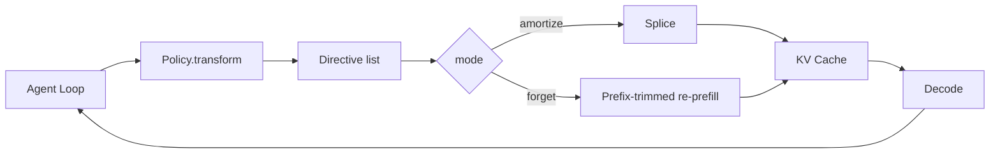
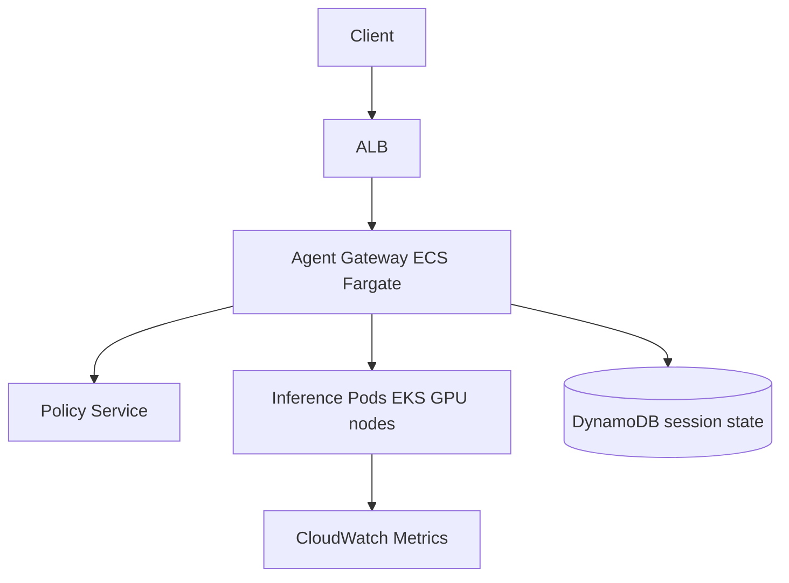

本記事は [Leyline: KV Cache Directives for Agentic Inference (arXiv:2606.01065)](https://arxiv.org/abs/2606.01065) の解説記事です。

関連するZenn記事として [マルチターンAgent会話のプロンプトキャッシュ設計パターンとヒット率改善](https://zenn.dev/0h_n0/articles/d0cba2aa6f275e) があります。そちらはAPI利用者側のプロンプト設計を扱っており、本記事は推論エンジン側のKVキャッシュ管理を扱います。

## 論文概要（Abstract）

従来のKVキャッシュ管理はチャットボットのワークロード、つまりトークン列が末尾にだけ追加されていく append-only の使い方を前提に設計されてきた。一方、エージェントシステムでは、ツール呼び出しのリトライ、古いツール出力の削除、軌道の方針転換といった「会話履歴の途中編集」が日常的に発生する。著者らは、編集の指示と位置補正の仕組みを分離する宣言的な「ディレクティブ4つ組」を導入し、アーキテクチャに依存しないインターフェースとして提案している。論文によれば、リプレイ時のキャッシュヒット率が+11.2ポイント改善し、最大241msのレイテンシ削減を達成し、debug-gymでは切り詰めルールにより+14.3ポイントの改善が得られたと報告されている。

## 情報源

| 項目 | 内容 |
|------|------|
| arXiv ID | 2606.01065 |
| URL | https://arxiv.org/abs/2606.01065 |
| 著者 | Bole Ma, Jan Eitzinger, Harald Koestler |
| 発表年 | 2026年 |
| 分野 | 推論システム、KVキャッシュ管理、LLMエージェント |

## 背景と動機

チャットボットでは、各ターンで新しいユーザー発話と応答がプロンプト末尾に追加されるだけである。そのため、SGLangのRadixAttentionやvLLMのprefix cachingのような「最長共通プレフィックスの再利用」で十分に機能する。

エージェントでは状況が異なる。たとえば次のような操作が起こる。

- ツール呼び出しが失敗したので、その出力を削除してリトライする
- 数ターン前の巨大なツール出力(ファイル全文やログ)がもう不要なので、短いスタブに置き換える
- 探索の方針を変えるため、履歴の途中から軌道を巻き戻す

履歴の途中を編集すると、編集位置以降のトークンはすべてプレフィックスが変わる。プレフィックスキャッシュの立場では、編集位置以降のKVはすべて無効となり、再計算(re-prefill)が必要になる。数万トークンの文脈では、このコストが無視できない。

さらに、編集後の文脈で再計算した場合と、元の文脈で計算済みのKVを再利用した場合とでは、モデルの出力が意味的にも異なり得る。著者らは、この「何を保証したいのか」という契約を明示的に宣言できるようにする点を、本論文の動機としている。

## 主要な貢献

- **アーキテクチャ非依存のディレクティブインターフェース**: 編集内容を宣言的な4つ組で表現し、エージェント層から推論エンジンに渡せる。
- **2つの実行モード**: インプレースのスプライス(amortize)と、プレフィックストリム後の再プリフィル(forget)を、編集ごとに宣言して選択できる。
- **RoPE位置補正の閉形式**: 回転行列の群構造を利用し、下流トークンの位置補正を再計算なしの回転だけで行う。
- **ポリシー主導のキャッシュ管理**: 会話状態からディレクティブ列を生成するポリシー層を設け、エージェント側がキャッシュ編集を制御できる。

## 技術的詳細

### ディレクティブ4つ組の形式化

論文では、ディレクティブ $D$ を次の4つ組として定義している。

$$
D = (s_{\text{start}},\ s_{\text{end}},\ R,\ m)
$$

- $[s_{\text{start}}, s_{\text{end}})$: 元のプロンプト中で置換されるトークン範囲
- $R$: 置換トークン列(多くの場合は `[truncated]` のような短いスタブ)
- $m \in \{\text{amortize}, \text{forget}\}$: 意味的モード

置換に伴う位置シフト量は次式で表される。

$$
\Delta = |R| - (s_{\text{end}} - s_{\text{start}})
$$

$\Delta < 0$ なら履歴が短くなり、下流のトークンは前方へずれる。著者らは、amortizeモードの契約は「情報的(informational)」ではなく「位置的(positional)」であると述べている。つまり、$D$ を適用した後のキャッシュは、「元のプロンプトから構築したキャッシュを、下流の位置だけ振り直したもの」と等価な出力を与える。

3つの方式の違いは次のように整理できる。

| 方式 | 計算の対象 | 下流KVの扱い |
|------|-----------|-------------|
| Full-context | 元のプロンプトを素直にprefill | そのまま |
| Re-prefill | スタブ置換後のプロンプトを素直にprefill | 全て再計算 |
| Leyline (amortize) | 元のプロンプトをprefillし、ディレクティブを$\Delta$回転で適用 | 位置のみ補正 |

論文では、`25+9=34` という計算の途中をスタブで置換する構成のマイクロベンチマークが示されている。著者らの報告では、Full-contextは「34」、Re-prefillは「0」、Leylineは「34」を予測する。これは、amortizeモードが「元の文脈で計算済みの注意結果」を保持していることを示す、契約を区別するための例である。

### 全体アーキテクチャ



エージェントループは、ポリシーに現在のメッセージ列とターン番号を渡し、ディレクティブのリストを受け取る。推論エンジンは、各ディレクティブのモードに応じて経路を切り替える。

### RoPEによる位置補正

RoPE(Rotary Position Embedding)は、位置 $p$ のベクトル $x$ の隣接する2次元ペアを、周波数 $\theta_j$ に応じた角度で回転させる。

$$
R(p) = \bigoplus_{j=0}^{d/2-1}
\begin{pmatrix}
\cos(p\theta_j) & -\sin(p\theta_j)\\
\sin(p\theta_j) & \cos(p\theta_j)
\end{pmatrix}
$$

重要な性質は、回転が加法的に閉じていることである。

$$
R(a)\,R(b) = R(a+b)
$$

したがって、位置 $i$ で計算済みのキー $K[i] = R(i)\,k_i$ を位置 $i+\Delta$ に移したいとき、再計算は不要で、次の回転を左から掛けるだけで済む。

$$
K^{\text{new}}[i] = R(\Delta)\, K[i] = R(\Delta)R(i)\,k_i = R(i+\Delta)\,k_i
$$

著者らは、この補正が「最初から $R(i+\Delta)$ で計算した場合と代数的に区別できない」と述べている。

論文が対象とするMLA(Multi-head Latent Attention)では、キーが位置符号化を持つ部分 $K_{pe}$ と持たない部分 $K_{nope}$ に分かれている。位置依存なのは $K_{pe}$ のみであり、下流トークンでは次の補正だけを行えばよい。

$$
K_{pe}^{\text{new}}[i] = R(\Delta)\,K_{pe}[i], \quad i \ge s_{\text{end}}
$$

$K_{nope}$ と $V$ は位置に依存しないので、そのまま保持される。これがamortizeモードの効率の源である。

### スプライスとプレフィックストリム再プリフィルの比較

- **amortizeモード(スプライス)**: 置換範囲のK_pe、K_nope、Vを解放し、置換列 $R$ の分だけKとVを新規にprefillする。下流のK_peは$\Delta$で回転し、K_nopeとVは触らない。下流トークンが元のチャンクに対して計算した注意の結果が保存される。
- **forgetモード**: 標準のプレフィックストリム再プリフィルに回す。これは既存の本番経路であり、編集後の文脈で素直に再計算する。

モードを宣言として分離することで、「編集後の文脈と整合させたいのか(forget)、元の計算結果を位置だけ補正して再利用したいのか(amortize)」というセマンティクスの選択が、サービング基盤のデフォルトからエージェント層の明示的な宣言に移る。

### ポリシー層

論文のデプロイ検証では、「2ターンより古いツール出力を落とす」という単純なルールが使われている。実装は `Policy.transform(messages, turn_idx)` というメソッドで、会話状態をディレクティブのリストに写像する。以下は、この構造を説明するための筆者による簡略化した例であり、論文のコードそのものではない。

```python
from dataclasses import dataclass
from typing import Literal, Sequence

Mode = Literal["amortize", "forget"]

@dataclass(frozen=True)
class Directive:
    s_start: int          # 置換範囲の開始トークン位置
    s_end: int            # 置換範囲の終了トークン位置(排他的)
    replacement: tuple[int, ...]  # 置換トークン列 R
    mode: Mode

    @property
    def delta(self) -> int:
        return len(self.replacement) - (self.s_end - self.s_start)

@dataclass(frozen=True)
class ToolSpan:
    turn: int
    start: int
    end: int

def truncate_older_than(
    spans: Sequence[ToolSpan],
    turn_idx: int,
    stub: tuple[int, ...],
    n: int = 2,
    mode: Mode = "amortize",
) -> list[Directive]:
    """n ターンより古いツール出力をスタブに置換するディレクティブを返す。"""
    return [
        Directive(s.start, s.end, stub, mode)
        for s in spans
        if turn_idx - s.turn > n
    ]
```

複数のディレクティブを適用する場合、後方のスパンから順に適用すれば、前方のスパンの位置がずれないという利点がある。

## 実装のポイント

実装上の要点は次の通りである。

1. **MLAの分離構造の活用**: 論文の評価対象はすべてMLAアーキテクチャのモデルである。位置依存のK_peだけを回転すればよいという性質が効率の鍵であり、通常のMHA/GQAで同様の最適化を行うには、キー全体を回転する必要がある点に注意が必要である。この点は筆者の考察であり、論文の主張ではない。
2. **回転の数値精度**: 回転を繰り返し適用すると、低精度(bf16など)では誤差が累積し得る。編集回数が多いセッションでは、定期的な再プリフィルを組み合わせる設計が安全だと考えられる。
3. **スパン境界の管理**: ツール出力のトークン範囲を正確に追跡する必要がある。トークナイザの境界、チャットテンプレートの特殊トークンとの整合を確認すること。
4. **モード選択の指針**: 「古いログを軽量化したいだけ」ならamortize、「編集後の文脈で推論を再構成したい」ならforgetが基本的な使い分けである。

## Production Deployment Guide

Leylineは自前の推論エンジンに組み込む研究実装であり、マネージドAPIでは利用できない。以下では、SGLangのようなOSSエンジンをAWS上で運用し、ディレクティブ型の編集を導入する場合の構成例を示す。金額は2026年時点の概算であり、実際のリージョンと契約条件で確認が必要である。

### アーキテクチャパターン



セッション状態(トークンスパンの位置、ターン番号)はDynamoDBに保持し、同一セッションを同じ推論ポッドにルーティングするスティッキー設計が重要である。KVキャッシュはポッド内のGPUメモリに存在するため、ルーティングが外れるとキャッシュヒットが失われる。

### 規模別の構成とコスト目安

| 規模 | 構成 | 月額目安(USD) |
|------|------|--------------|
| 小規模(開発・検証) | g5.2xlarge x1 + Fargate小 + DynamoDB on-demand | 約1,200〜1,500 |
| 中規模(社内利用) | g5.12xlarge x2 + EKS + ALB | 約8,000〜10,000 |
| 大規模(全社基盤) | p4d/p5系 x複数 + Karpenter + Spot併用 | 数万〜 |

GPUのオンデマンド料金が支配的であり、Spotインスタンスの併用で削減できる場合があるが、中断時にKVキャッシュが失われる点に注意が必要である。

### Terraform例

```hcl
resource "aws_dynamodb_table" "session_state" {
  name         = "leyline-session-state"
  billing_mode = "PAY_PER_REQUEST"
  hash_key     = "session_id"

  attribute {
    name = "session_id"
    type = "S"
  }

  ttl {
    attribute_name = "expires_at"
    enabled        = true
  }
}

resource "aws_eks_node_group" "gpu" {
  cluster_name    = aws_eks_cluster.main.name
  node_group_name = "gpu-inference"
  node_role_arn   = aws_iam_role.node.arn
  subnet_ids      = var.private_subnet_ids
  instance_types  = ["g5.12xlarge"]

  scaling_config {
    desired_size = 2
    min_size     = 1
    max_size     = 4
  }

  labels = {
    workload = "llm-inference"
  }
}

resource "aws_cloudwatch_metric_alarm" "low_cache_hit" {
  alarm_name          = "kv-cache-hit-rate-low"
  namespace           = "Leyline/Inference"
  metric_name         = "CacheHitRate"
  comparison_operator = "LessThanThreshold"
  threshold           = 0.5
  evaluation_periods  = 3
  period              = 300
  statistic           = "Average"
  alarm_actions       = [aws_sns_topic.alerts.arn]
}
```

### 監視コード

カスタムメトリクスとして、キャッシュヒット率、ディレクティブ適用数、モード別の割合を出力する。

```python
import time
import boto3

cloudwatch = boto3.client("cloudwatch")

def publish_cache_metrics(
    hit_tokens: int,
    total_tokens: int,
    directives_applied: int,
    mode: str,
) -> None:
    """キャッシュ関連メトリクスを CloudWatch に送信する。"""
    hit_rate = hit_tokens / total_tokens if total_tokens else 0.0
    cloudwatch.put_metric_data(
        Namespace="Leyline/Inference",
        MetricData=[
            {
                "MetricName": "CacheHitRate",
                "Value": hit_rate,
                "Unit": "None",
                "Timestamp": time.time(),
            },
            {
                "MetricName": "DirectivesApplied",
                "Dimensions": [{"Name": "Mode", "Value": mode}],
                "Value": float(directives_applied),
                "Unit": "Count",
            },
        ],
    )
```

ログは1行1イベントのJSONで、`event`、`level`、`ts`、`request_id`、`duration_ms` を含め、プロンプト本文などの個人情報や機密は出力しない。

### コスト最適化チェックリスト

- [ ] セッションアフィニティを設定し、同一セッションを同一ポッドに送っているか
- [ ] ヒット率とTTFTをポリシー変更の前後で比較しているか(ポリシー導入前のベースラインを必ず取る)
- [ ] 古いツール出力の切り詰め閾値 n を、タスク別に評価したか
- [ ] amortizeとforgetの使い分けを、精度への影響とともに検証したか
- [ ] 回転の累積誤差を監視し、定期的な再プリフィルの閾値を決めたか
- [ ] GPU利用率が低い時間帯にスケールインしているか
- [ ] Spot利用時の中断とキャッシュ喪失を許容できるか
- [ ] DynamoDBのTTLでセッション状態を確実に破棄しているか
- [ ] マネージドAPI(プロンプトキャッシュ付き)との総コスト比較を行ったか

## 実験結果

論文は2つの評価レッグで構成されている。

**メカニズム検証(論文Appendix B)**: DeepSeek-V2-Lite上で約17Kトークンのプロンプト、バッチサイズ $C \in \{1,4,8,16\}$ のSGLangマイクロベンチマークを3アームで比較している。著者らは、スプライスアームが標準のradixキャッシュに対して+11.2ポイントのキャッシュヒット改善を示し、エンドツーエンドのレイテンシで $C=8$ のとき最大241ms(4.4%)の短縮を示したと報告している。アーム間の最初のトークンのargmax一致率は、バッチサイズ順に100%、97.7%、98.4%、94.5%と報告されている。一致率が100%ではない点から、数値的な差異が完全にゼロではないことが読み取れる。

**ポリシー検証(論文Section 5, Table 2)**: debug-gymのmini_nightmareタスク8個を4シードで、JoyAI-LLM Flash上で評価している。ベースライン(keep_all)の解決率は31.2%、処置(2ターンより古いツール出力を切り詰める `truncate_older_than`)は45.5%で、+14.3ポイントの絶対改善と報告されている。識別力のあったタスクとして、shopping_cartが0%から75%、sum_treeが25%から50%に変化している。

評価対象のモデルはDeepSeek-V2-Lite、JoyAI-LLM Flash、GLM-4.7-Flash、Moonlight-16B-A3Bで、いずれもMLAアーキテクチャである。

留意点として、ポリシー検証のタスク数(8タスク)は限定的で、統計的な頑健性は今後の検証が必要だと考えられる。また、これらの数値は小〜中規模のオープンモデルでの結果であり、他アーキテクチャへの一般化は論文の範囲外である。

## 実運用への応用

エージェントのコンテキスト管理には、「古いツール出力を捨てる」「要約に置換する」といった操作が不可欠である。Leylineの考え方は、こうした操作を行うときに、キャッシュを全て無効化せずに済む可能性を示している。

具体的には、コーディングエージェントで巨大なログやファイル全文を読み込んだ後、数ターンで不要になった出力をスタブに置換する場面に適用しやすい。レイテンシ削減の絶対値は17Kトークンで数百ms程度のため、効果が大きいのは文脈がより長いケースや、高い同時実行数のケースだと考えられる。

一方、APIプロバイダのプロンプトキャッシュを使う利用者は、この機構を直接制御できない。その場合は、履歴の途中編集を避け、編集が必要なら最大限後方に寄せるというプロンプト設計(関連Zenn記事の内容)が現実的な対策になる。

## 関連研究

- **PagedAttention / vLLM**: KVキャッシュをページ単位で管理し、メモリ断片化を減らす。プレフィックス共有は可能だが、途中編集は主眼ではない。
- **RadixAttention / SGLang**: 基数木によるプレフィックス共有で、append-only型の再利用に強い。Leylineの比較ベースラインとして使われている。
- **CacheBlend**: RAG等で、異なる順序のチャンクのKVを再利用し、一部トークンのみ再計算して品質を保つ手法。位置が変わるチャンクのKV再利用という点で近い問題設定である。
- **RoFormer (RoPE)**: 回転位置埋め込みの原論文。本論文の位置補正は、その回転群の性質に依拠している。
- **DeepSeek-V2 (MLA)**: キーを低ランク潜在表現に圧縮し、位置依存部分を分離する。本論文の効率化の前提となっている。

## まとめと今後の展望

Leylineは、エージェント推論における「履歴の途中編集」を、$D=(s_{\text{start}}, s_{\text{end}}, R, m)$ というディレクティブとして宣言的に扱い、RoPEの回転の閉形式で位置補正を行う手法である。著者らの報告では、MLAモデル上でキャッシュヒット率が+11.2ポイント改善し、debug-gymで+14.3ポイントの解決率向上が得られている。

今後の課題として、筆者は次の点を挙げたい。

- MHA/GQAなど、MLA以外のアーキテクチャでの効率と精度の検証
- より大規模なモデルとタスク数での統計的検証
- 編集の繰り返しによる数値誤差の影響評価
- 切り詰めポリシーの自動学習

本記事は論文の解説であり、筆者による独自の実験は含まない。数値は論文の報告に基づくため、実運用前には自環境での検証が必要である。

## 参考文献

1. Bole Ma, Jan Eitzinger, Harald Koestler. "Leyline: KV Cache Directives for Agentic Inference." arXiv:2606.01065, 2026. https://arxiv.org/abs/2606.01065
2. Su et al. "RoFormer: Enhanced Transformer with Rotary Position Embedding." arXiv:2104.09864, 2021.
3. DeepSeek-AI. "DeepSeek-V2: A Strong, Economical, and Efficient Mixture-of-Experts Language Model." arXiv:2405.04434, 2024.
4. Kwon et al. "Efficient Memory Management for Large Language Model Serving with PagedAttention." SOSP 2023.
5. Zheng et al. "SGLang: Efficient Execution of Structured Language Model Programs." arXiv:2312.07104, 2023.
6. Yao et al. "CacheBlend: Fast Large Language Model Serving for RAG with Cached Knowledge Fusion." arXiv:2405.16444, 2024.
