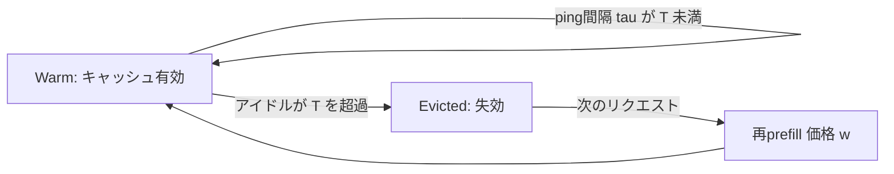
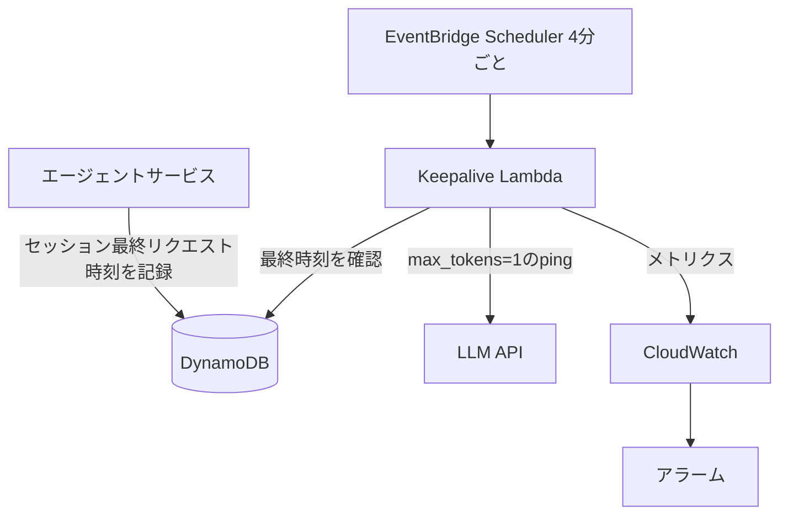

本記事は [Keeping the Cache Warm Pays: Keepalive Economics for Agentic Workloads (arXiv:2607.19214)](https://arxiv.org/abs/2607.19214) の解説記事です。

関連するZenn記事: [マルチターンAgent会話のプロンプトキャッシュ設計パターンとヒット率改善](https://zenn.dev/0h_n0/articles/d0cba2aa6f275e)

## 論文概要（Abstract）

LLMプロバイダは処理済みプロンプトのprefixをキャッシュし、キャッシュ読み出しトークンを通常の入力単価の約10%で課金する。しかしエージェントワークロードでは、ツール実行や人間の応答待ちといったアイドル期間中にキャッシュがTTL（Time To Live）で失効し、この割引を受けられなくなる。著者らは、クライアント側でprefixを定期的に再送する「keepalive」によって失効を防げることを示し、プロバイダごとの損益分岐時間と最適なping間隔を、4プロバイダでの実測とコストモデルで導出している。

## 情報源

- **arXiv ID**: 2607.19214
- **URL**: https://arxiv.org/abs/2607.19214
- **著者**: Maxim Khailo
- **発表年**: 2026年
- **対象プロバイダ**: Anthropic, OpenAI, Google, DeepSeek

## 背景と動機

プロンプトキャッシュは、長いシステムプロンプト・ツール定義・会話履歴をprefixとして再利用することで、入力トークンのコストとレイテンシを下げる機能である。多くのプロバイダでTTLは数分程度（Anthropicの標準tierは5分）に設定され、読み出しのたびに延長される。

チャットUIのように短い間隔で連続リクエストが来る用途では、TTLはほとんど問題にならない。一方、エージェントでは次のような「待ち」が頻繁に発生する。

- 長時間かかるツール呼び出し（ビルド、テスト、外部API）の完了待ち
- Human-in-the-loopでの承認待ち
- 並列サブエージェントの結果待ち

待ちがTTLを超えると、次のリクエストでは数万〜数十万トークンのprefixを再度prefillする必要があり、キャッシュ書き込み料金（Anthropicでは入力単価の1.25倍）が発生する。著者らはこの「失効による割引喪失」を系統的に測定し、クライアント側の対策の経済性を論じている。

## 主要な貢献

- 4プロバイダ（Anthropic, OpenAI, Google, DeepSeek）におけるkeepaliveの有効性の実測
- 最適なping間隔が「TTLを安全に下回る最大の間隔」であることの分析（約4分、Anthropicの5分TTLの場合）
- keepaliveと再prefillの損益分岐点の導出（Anthropicで約46分、OpenAI/DeepSeekで約36分）
- 全クライアントがkeepaliveを採用した場合の負の外部性（ゲーム理論的議論）の指摘

## 技術的詳細

### コストモデル

入力トークン1個あたりの基準単価（キャッシュなしの通常入力価格）を1に正規化する。変数を次のように定義する。

- $r$: キャッシュ読み出し価格比（基準単価に対する比。Anthropic・OpenAI・DeepSeekで0.10、Googleで0.25）
- $w$: 失効後の再prefill価格比（Anthropic 5分tierで1.25、OpenAI/Google/DeepSeekで1.00）
- $I$: アイドル期間（秒）
- $\tau$: ping間隔（秒）
- $T$: プロバイダのキャッシュTTL（秒）

アイドル期間 $I$ の間keepaliveを続けた場合、ping回数はおよそ $I/\tau$ 回で、各pingがprefix全体を読み出し価格 $r$ で課金される。さらにアイドル明けの本リクエストも読み出し価格で処理される。トークンあたりの「warmth cost」は次式となる（論文の記法に基づく）。

$$
C_{\text{keep}}(I) = \left(\frac{I}{\tau} + 1\right) r
$$

keepaliveなしでTTLを超えて待つと、本リクエストは再prefillとなる。

$$
C_{\text{evict}} = w
$$

### 損益分岐点

keepaliveが得になる条件は $C_{\text{keep}}(I) < C_{\text{evict}}$ である。これを解くと、損益分岐のアイドル期間（break-even horizon）が得られる。

$$
\left(\frac{I}{\tau} + 1\right) r < w \;\Longleftrightarrow\; I < I_{\max} = \tau\left(\frac{w}{r} - 1\right)
$$

$I_{\max}$ より短い待ちならkeepaliveが得で、それより長い待ちならキャッシュを手放して再prefillする方が安い。

数値例として $\tau = 240$ 秒とすると次のようになる。

- Anthropic（$r=0.10,\ w=1.25$）: $w/r = 12.5$、$I_{\max} = 240 \times 11.5 = 2760$ 秒、約46分
- OpenAI/DeepSeek（$r=0.10,\ w=1.00$）: $w/r = 10$、$I_{\max} = 240 \times 9 = 2160$ 秒、約36分
- Google implicit（$r=0.25,\ w=1.00$）: $w/r = 4$、$I_{\max} = 240 \times 3 = 720$ 秒、約12分

この計算は、著者らが報告する約46分・約36分と整合する。

### 最適なping間隔

keepaliveの目的はキャッシュを失効させないことなので、ping間隔はTTLを超えてはならない。ping回数は $I/\tau$ に比例してコストが増えるため、$\tau$ は大きいほど安い。制約は $\tau < T$ であり、ネットワーク遅延やプロバイダ側のTTL揺らぎに対する安全マージン $m$ を取ると、最適間隔は次式になる。

$$
\tau^{*} = T - m
$$

Anthropicの5分TTL（$T=300$）で $m=60$ とすれば $\tau^* = 240$ 秒、つまり約4分である。著者らは、慣行的に使われがちな30秒間隔のpingに比べて、keepalive支出が約8分の1になると報告している。なお、30秒間隔でもキャッシュ保持自体は有効で、著者らは「30秒のkeepaliveで、すべてのプロバイダ・サイズ・アイドル時間の組で中央値98%以上のプロンプトトークンがキャッシュされた」と報告している（40k〜100kトークンのprefix、最大600秒のアイドル）。

### コスト削減倍率

アイドル明けの最初のリクエストだけを比較すると、削減倍率は再prefill価格と読み出し価格の比で決まる。

$$
\text{speedup} = \frac{w}{r}
$$

Anthropicでは $1.25 / 0.10 = 12.5$ となり、これが「最大12.5倍」の出どころである。ただしこの倍率はpingの費用を含まない、ポスト・ポーズ・リクエスト単体の比較である点に注意が必要である。

### キャッシュ状態の遷移



### ゲーム理論的な議論

著者らは、keepaliveを個々のクライアントが採用するのは合理的だが、全員が採用すると集団として劣化する可能性を指摘している。プロバイダのキャッシュ層は容量が有限で、通常はLRU系の方針で追い出しを行う。全クライアントが常時pingすると全エントリが「最近使われた」状態になり、「LRUがランク付けすべき対象を失い、tierはfirst-in-first-out-of-luckに近づく」と著者らは述べている。

この背景には課金体系がある。キャッシュは滞留時間（token-hour）ではなく読み出し回数で課金されるため、滞留の混雑コストが価格に反映されない。結果として、他のテナントに対しTTLの実質的な短縮やヒット率低下という外部性が生じ得る。これは共有資源の悲劇に近い構造であり、著者らの測定は単一クライアント条件で行われたため、フリート全体で飽和した状況は実証されていない。

## 実装のポイント

keepaliveの実装は、(1) 最後にリクエストを送った時刻の追跡、(2) $\tau^*$ ごとの軽量ping、(3) 損益分岐 $I_{\max}$ を超えたら打ち切り、の3点で足りる。pingは `max_tokens=1` として出力コストを最小化し、prefixはバイト単位で本リクエストと同一にする（1文字違えばキャッシュミスとなる）。

```python
from __future__ import annotations

import asyncio
import time
from dataclasses import dataclass
from typing import Awaitable, Callable


@dataclass(frozen=True)
class ProviderParams:
    """プロバイダ別のコストパラメータ（論文の記法）。"""

    name: str
    r: float  # キャッシュ読み出し価格比
    w: float  # 再prefill価格比
    ttl_s: float  # キャッシュTTL（秒）
    margin_s: float = 60.0  # 安全マージン

    @property
    def tau_star(self) -> float:
        return self.ttl_s - self.margin_s

    @property
    def break_even_s(self) -> float:
        return self.tau_star * (self.w / self.r - 1.0)


ANTHROPIC = ProviderParams("anthropic", r=0.10, w=1.25, ttl_s=300)
OPENAI = ProviderParams("openai", r=0.10, w=1.00, ttl_s=300)


async def keepalive(
    params: ProviderParams,
    ping: Callable[[], Awaitable[None]],
    stop: asyncio.Event,
) -> None:
    """アイドルが損益分岐を超えるまで tau* 間隔でpingする。"""
    started = time.monotonic()
    while not stop.is_set():
        try:
            await asyncio.wait_for(stop.wait(), timeout=params.tau_star)
            return  # 本リクエストが来たので終了
        except asyncio.TimeoutError:
            pass
        if time.monotonic() - started > params.break_even_s:
            return  # これ以上は再prefillの方が安い
        await ping()
```

実運用では、pingのタイムアウト・指数バックオフ付きリトライ・キャンセル処理を追加し、リクエストIDを含む構造化ログを出力することが望ましい。また「次のリクエストがいつ来るか」の予測が立つ場合（例えば人間の承認待ちは長くなりがち）、損益分岐を待たずに最初からkeepaliveしない判断も有効である。

## Production Deployment Guide

ここからは論文の主張を踏まえた、筆者による運用設計の例である（論文には含まれない）。数値は価格比に基づく試算で、実際の単価はプロバイダの最新ページで確認が必要である。

### AWSでのアーキテクチャパターン

エージェントがセッション状態を持つ場合、keepaliveの担い手として次の3パターンが考えられる。

| パターン | 構成 | 向く用途 | 注意点 |
|---|---|---|---|
| A. エージェント内蔵 | ECS/Fargateのタスク内でasyncioタイマー | 常駐型エージェント | タスク停止でpingも停止 |
| B. Step Functions + Lambda | Waitステートで $\tau^*$ ごとにLambda起動 | ワークフロー型、長い承認待ち | 状態遷移課金、最小Wait粒度 |
| C. EventBridge Scheduler + SQS | セッションごとに繰り返しスケジュール | 多数の短命セッション | スケジュール数の上限、削除漏れ |

多数のセッションを扱う場合はパターンCが管理しやすい。セッション開始時に繰り返しスケジュールを作成し、最終リクエスト後に損益分岐時間が経過したらLambda側で自己削除する。



### コスト試算表

仮定: prefix 100kトークン、基準入力単価を1.00ドル/Mトークンとして正規化した試算（価格比は論文のTable記載のパラメータを使用、絶対額は説明用の仮定）。1回のアイドル明けリクエストあたりの入力コストを比較する。

| 待ち時間 | 戦略 | Anthropic (r=0.10, w=1.25) | OpenAI (r=0.10, w=1.00) |
|---|---|---|---|
| 10分 | keepaliveなし（失効） | 0.125ドル | 0.100ドル |
| 10分 | keepalive（$\tau$=4分、ping 2回+本体） | 0.030ドル | 0.030ドル |
| 30分 | keepaliveなし | 0.125ドル | 0.100ドル |
| 30分 | keepalive（ping 7回+本体） | 0.080ドル | 0.080ドル |
| 60分 | keepalive（ping 14回+本体） | 0.150ドル | 0.150ドル |

60分では、Anthropicでもkeepalive（0.150ドル）が再prefill（0.125ドル）を上回り、損益分岐の約46分を超えると逆転することが確認できる。AWS側の追加費用（Lambda実行、Scheduler呼び出し）は、1セッションあたり数十回のpingであれば相対的に小さい。ただし、ここでの計算は上記の仮定に基づく試算である。

### Terraform例

```hcl
variable "keepalive_rate_minutes" {
  type    = number
  default = 4 # tau* = TTL(5分) - マージン
}

resource "aws_iam_role" "keepalive" {
  name = "llm-keepalive-lambda"
  assume_role_policy = jsonencode({
    Version = "2012-10-17"
    Statement = [{
      Effect    = "Allow"
      Principal = { Service = "lambda.amazonaws.com" }
      Action    = "sts:AssumeRole"
    }]
  })
}

resource "aws_lambda_function" "keepalive" {
  function_name = "llm-keepalive"
  role          = aws_iam_role.keepalive.arn
  runtime       = "python3.12"
  handler       = "app.handler"
  filename      = "keepalive.zip"
  timeout       = 30
  environment {
    variables = {
      BREAK_EVEN_SECONDS = "2760" # Anthropic: tau*(w/r - 1)
      TABLE_NAME         = "agent-sessions"
    }
  }
}

resource "aws_scheduler_schedule" "keepalive" {
  name                = "llm-keepalive"
  schedule_expression = "rate(${var.keepalive_rate_minutes} minutes)"
  flexible_time_window { mode = "OFF" }
  target {
    arn      = aws_lambda_function.keepalive.arn
    role_arn = aws_iam_role.keepalive.arn
  }
}

resource "aws_cloudwatch_metric_alarm" "cache_hit_low" {
  alarm_name          = "llm-cache-hit-ratio-low"
  namespace           = "LLMAgent"
  metric_name         = "CacheHitRatio"
  comparison_operator = "LessThanThreshold"
  threshold           = 0.9
  evaluation_periods  = 3
  period              = 300
  statistic           = "Average"
}
```

上記は構成の骨子であり、Lambdaの呼び出し権限（`aws_lambda_permission`）やIAMポリシーは環境に合わせて追加が必要である。

### モニタリングコード

keepaliveの効果は、レスポンスのusageに含まれるキャッシュ読み出しトークン数で判定できる。

```python
import time

import boto3

cloudwatch = boto3.client("cloudwatch")


def publish_cache_metrics(
    cache_read_tokens: int,
    cache_creation_tokens: int,
    uncached_input_tokens: int,
    is_ping: bool,
) -> float:
    total = cache_read_tokens + cache_creation_tokens + uncached_input_tokens
    ratio = cache_read_tokens / total if total else 0.0
    cloudwatch.put_metric_data(
        Namespace="LLMAgent",
        MetricData=[
            {
                "MetricName": "CacheHitRatio",
                "Dimensions": [{"Name": "Kind", "Value": "ping" if is_ping else "request"}],
                "Value": ratio,
                "Unit": "None",
                "Timestamp": time.time(),
            }
        ],
    )
    return ratio
```

pingのヒット率が下がった場合は、prefixが変化している（タイムスタンプの混入など）か、TTLが想定と異なる可能性がある。

### コスト最適化チェックリスト

- 次リクエストまでの予測待ち時間が $I_{\max}$ 未満か（超えるならkeepaliveしない）
- ping間隔がTTL未満で、安全マージンが十分か
- pingが `max_tokens=1` で、prefixが本リクエストとバイト単位で一致しているか
- 最後の本リクエストから損益分岐時間後にpingが自動停止するか
- キャッシュ対象のprefixが十分長いか（プロバイダの最小キャッシュ長を満たすか）
- ping専用のログ・メトリクスを分離し、コストを別集計しているか
- 1時間tierなど長TTLの選択肢と、keepaliveのコストを比較したか
- 429やレート制限へのバックオフがあるか
- セッション終了時にスケジュールが確実に削除されるか

## 実験結果

著者らは、4プロバイダ（Anthropic, OpenAI, Google, DeepSeek）で40k〜100kトークンのprefixを使い、最大600秒のアイドル時間でkeepaliveの効果を測定している。論文の記載によれば、主な結果は次のとおりである。

| プロバイダ | 読み出し比 $r$ | 再prefill比 $w$ | TTL | 最適間隔 $\tau^*$ | 損益分岐 $I_{\max}$ |
|---|---|---|---|---|---|
| Anthropic（5分tier） | 0.10 | 1.25 | 300秒 | 約240秒 | 約46分 |
| OpenAI | 0.10 | 1.00 | 300〜600秒 | 約240秒 | 約36分 |
| Google（implicit） | 0.25 | 1.00 | 数分 | 約240秒 | 約12分 |
| DeepSeek | 0.10 | 1.00 | 600秒以下 | 約240秒 | 約36分 |

（論文Table および本文の記載より。Google・DeepSeekのTTLは論文では概数で示されている。）

- 30秒間隔のkeepaliveで、すべてのプロバイダ・サイズ・アイドル時間の組において、中央値98%以上のトークンがキャッシュされたと著者らは報告している。
- 600秒アイドル・100kトークンの条件で、Anthropicでは再prefillと比べ最大12.5倍安くなると報告されている。
- $\tau^* = T - m$ の間隔は、30秒間隔に対し約8分の1のkeepalive支出になると報告されている。

測定の限界として、著者らは次の点を挙げている。DeepSeekはOpenRouter経由でバックエンドを固定しているが、エンドポイントの固定は物理マシンの固定を意味しない。Googleはクォータ制約により1条件あたりの試行数が少ない（n=3〜7、他はn=24）。測定は単一クライアント条件で、同一run内の相関も認識されており、主張できるのはrun間の再現性に限られる。

## 実運用への応用

エージェント基盤では、まず待ち時間の分布を計測し、$I_{\max}$ 未満の待ちが多いワークロード（短いツール呼び出し、数十分以内の承認待ち）にkeepaliveを適用するのが現実的である。待ちが長く不規則な場合は、Anthropicの1時間tierのような長TTLの選択肢との比較が必要で、書き込み価格 $w$ が高いほどkeepaliveの損益分岐は延びる。

また、Googleのように読み出し比 $r$ が高いプロバイダでは損益分岐が短くなるため、同じ戦略を一律に適用できない。プロバイダごとに $(r, w, T)$ をパラメータとして持ち、設定として切り替える設計が望ましい。さらに、ゲーム理論的な議論を踏まえると、大規模にkeepaliveを展開する際は、プロバイダ側のレート制限や利用規約、キャッシュ層への影響にも配慮が必要である。

## 関連研究

- **Anthropic Prompt Caching / OpenAI Prompt Caching のドキュメント**: TTL、価格倍率、最小キャッシュ長などの仕様はプロバイダが公式に定めており、本論文のパラメータ $r, w, T$ の根拠となる。
- **PagedAttention (vLLM, Kwon et al., 2023, arXiv:2309.06180)**: KVキャッシュをページ単位で管理する手法で、prefix共有の基盤技術である。本論文が扱うTTL失効は、こうしたサーバ側のキャッシュ管理の上に載った課金・運用上の問題と位置づけられる。
- **SGLang / RadixAttention (Zheng et al., 2023, arXiv:2312.07104)**: radix木でprefixを再利用するLLM実行系で、LRU系の追い出し方針を採る。本論文のLRU劣化の議論と関係する。
- **Prompt Cache (Gim et al., 2023, arXiv:2311.04934)**: モジュール化したプロンプトの注意状態を再利用する研究で、キャッシュ再利用の効果を扱う点で関連する。

## まとめと今後の展望

本論文は、エージェントワークロードでのプロンプトキャッシュ失効に対し、クライアント側keepaliveの経済性をコストモデル $I_{\max} = \tau(w/r - 1)$ で定式化し、4プロバイダで実測した。最適なping間隔はTTLを安全に下回る最大の間隔（約4分）で、損益分岐はAnthropicで約46分、OpenAI/DeepSeekで約36分と報告されている。

一方で、全クライアントがkeepaliveを採用した場合の負の外部性は未検証であり、読み出し単位の課金が滞留コストを価格に反映しないという構造的な問題は残る。今後は、token-hour課金のような価格設計、プロバイダ側の明示的なキャッシュ保持API、フリート規模での測定が課題になると考えられる。

## 参考文献

- Maxim Khailo. "Keeping the Cache Warm Pays: Keepalive Economics for Agentic Workloads." arXiv:2607.19214, 2026. https://arxiv.org/abs/2607.19214
- Kwon et al. "Efficient Memory Management for Large Language Model Serving with PagedAttention." arXiv:2309.06180, 2023.
- Zheng et al. "SGLang: Efficient Execution of Structured Language Model Programs." arXiv:2312.07104, 2023.
- Gim et al. "Prompt Cache: Modular Attention Reuse for Low-Latency Inference." arXiv:2311.04934, 2023.
- 関連Zenn記事: https://zenn.dev/0h_n0/articles/d0cba2aa6f275e
