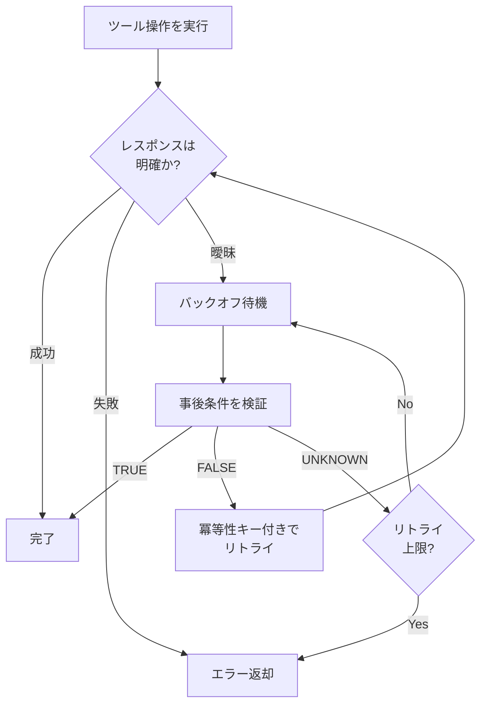

本記事は [Verified Tool Calls Improve LLM Agent Reliability Under Non-Atomic Failures (arXiv:2608.02645)](https://arxiv.org/abs/2608.02645) の解説記事です。

関連するZenn記事: [LangGraph×サーキットブレーカーで実装するAIエージェントのエラー回復設計](https://zenn.dev/0h_n0/articles/4b5b6e56c8b488)

## 論文概要（Abstract）

LLMエージェントが外部ツールを呼び出す際、既存のフレームワークはツール呼び出しを「成功か失敗か」の二値（原子的）として扱っている。しかし実際の分散システムでは、ディスパッチ後のタイムアウト、結果反映の遅延、部分的な状態更新といった非原子的な振る舞いが発生する。著者らは、事後条件検証（Postcondition Verification）、検証してからリトライ（Verify-Before-Retry）、冪等性キー（Idempotency Keys）の3原則に基づく軽量なツールラッパーフレームワークを提案し、タスク成功率の向上と重複副作用の削減を実験的に示している。

## 情報源

- **arXiv ID**: 2608.02645
- **URL**: [https://arxiv.org/abs/2608.02645](https://arxiv.org/abs/2608.02645)
- **著者**: Isham Kalappurackal Mansoor, Abhishek Phadke, Pratip Rana
- **発表年**: 2026年
- **分野**: cs.SE（ソフトウェア工学）, cs.AI（人工知能）

## 背景と動機

LLMエージェントがReActパターンなどで外部ツール（API、データベース、メッセージキュー）を呼び出すアーキテクチャは広く普及している。しかし、ToolformerやToolBench、AgentBenchといった既存のフレームワークは、ツール呼び出しの結果を「成功」または「失敗」の二値として扱う設計になっている。

現実の分散システムでは、エージェントが受け取るレスポンス（response channel）と、サーバー側で実際に起きた効果（effect channel）は独立している。タイムアウトでもサーバー側では処理完了済みの場合があり、逆にAPIが成功を返しても内部的に一部しか完了していない場合もある。この分離を無視してリトライすると二重課金やメール重複送信といった副作用が発生する。

著者らは、分散システム分野の冪等性キーやexactly-onceセマンティクスをLLMエージェントに体系的に導入し、モデル変更なしに信頼性を向上できると主張している。

## 主要な貢献

- **非原子的障害の体系的分類**: LLMエージェントのツール呼び出しにおける4つの障害モード（Timeout-After-Dispatch、Delayed Visibility、Partial Success、Stale Conflicts）を定義
- **Verified Tool Wrapperフレームワークの設計**: 事後条件検証・Verify-Before-Retry・冪等性キーの3原則に基づくツールラッパーを提案
- **定量的評価**: 300回の実験（25エピソード x 3障害レベル x 2手法）を通じて、高障害レベルでタスク成功率を+36ポイント向上、重複副作用を52ポイント削減したことを実証
- **アブレーション分析**: 「検証が改善の主要因」であるという知見を導出

## 技術的詳細

### 4つの障害モード

著者らは、分散システムにおけるツール呼び出しの障害を以下の4つに分類している。

#### 1. Timeout-After-Dispatch（ディスパッチ後タイムアウト）

サーバーが処理を開始した後にネットワークタイムアウトが発生し、レスポンスがエージェントに到達しない。サーバー側では処理が完了している可能性があるにもかかわらず、エージェントは失敗と判断しリトライすることで二重実行が発生する。

#### 2. Delayed Visibility（遅延可視性）

操作はサーバー側で成功するが、結果整合性（Eventual Consistency）により直後の検証クエリが古い状態を読み取り、エージェントが操作失敗と誤認する。

#### 3. Partial Success（部分的成功）

複合操作の一部のみが完了する。APIがステータスコード200を返す場合でも、内部的に一部操作が失敗している可能性がある。

#### 4. Stale Conflicts（陳腐な競合）

並行する操作がエージェントの前回の観測を無効化し、操作が競合する。

### Verified Tool Wrapperフレームワーク

著者らのフレームワークは、3つの設計原則で構成される。

#### 原則1: 事後条件検証（Postcondition Verification）

各ツール操作に対して、期待される事後条件を検証する関数を定義する。検証関数は3値（TRUE / FALSE / UNKNOWN）を返す。

```python
from enum import Enum
from typing import Any, Protocol


class VerificationResult(Enum):
    """事後条件検証の3値結果"""
    TRUE = "satisfied"       # 事後条件が満たされている
    FALSE = "not_satisfied"  # 事後条件が満たされていない
    UNKNOWN = "inconclusive" # 判定不能（DB接続エラー等）


class PostconditionVerifier(Protocol):
    """各ツール操作の事後条件をレスポンス非依存で検証する"""
    def verify(self, context: dict[str, Any]) -> VerificationResult: ...
```

例えば `activate_customer` タスクでは、事後条件を次のように定義する。

$$
\text{postcondition} = (\text{customer.status} = \text{ACTIVE}) \land (\text{customer.activated\_at} \neq \text{null})
$$

この条件が成立すれば操作は成功しているとみなし、レスポンスの内容に関係なくリトライを回避できる。

#### 原則2: Verify-Before-Retry（検証してからリトライ）

従来のリトライ戦略はレスポンスのみに基づいてリトライを判断する。著者らのアプローチでは、リトライの前に事後条件を検証し、操作が既に完了していないかを確認する。

以下は論文のアルゴリズムをPythonで表現した擬似コードである。

```python
import hashlib
import time
from typing import Any, Callable


def verify_before_retry(
    action: Callable[..., Any],
    verifier: PostconditionVerifier,
    context: dict[str, Any],
    max_retries: int = 3,
    base_backoff: float = 1.0,
) -> bool:
    """Verify-Before-Retryアルゴリズム

    リトライ前に事後条件を検証し、重複副作用を防ぐ。

    Args:
        action: 実行するツール操作（冪等性キー付き）
        verifier: 事後条件検証関数
        context: 操作の文脈情報
        max_retries: 最大リトライ回数
        base_backoff: バックオフの基準秒数
    """
    key = generate_idempotency_key(context)
    response = action(key=key)

    for attempt in range(max_retries):
        if response.is_definitive_success():
            return True
        if response.is_definitive_failure():
            return False

        time.sleep(base_backoff * (2 ** attempt))
        result = verifier.verify(context)

        if result == VerificationResult.TRUE:
            return True   # 操作は既に成功 → リトライ不要
        elif result == VerificationResult.FALSE:
            response = action(key=key)  # 未完了 → 同じキーでリトライ
        # UNKNOWN → 次のイテレーションで再検証

    return False


def generate_idempotency_key(context: dict[str, Any]) -> str:
    """冪等性キーを決定的に生成する"""
    key_material = (
        f"{context['agent_id']}:{context['action_type']}:"
        f"{context['payload']}:{context['timestamp_bucket']}"
    )
    return hashlib.sha256(key_material.encode()).hexdigest()
```

#### 原則3: 冪等性キー（Idempotency Keys）

冪等性キーは以下の式で決定的に生成される。

$$
k = \text{hash}(\text{agent\_id}, \text{action\_type}, \text{payload}, \text{timestamp\_bucket})
$$

ここで、
- $\text{agent\_id}$: エージェントの一意識別子
- $\text{action\_type}$: 操作の種別（例: `activate_customer`）
- $\text{payload}$: 操作のパラメータ
- $\text{timestamp\_bucket}$: 時間バケット（同一操作の意図を同じキーにまとめる）

サーバー側では、同一の冪等性キーを持つリクエストを最大1回のみ実行する。これにより、Timeout-After-Dispatch後のリトライで二重実行が防止される。

### フレームワーク全体の処理フロー



## 実装のポイント

著者らの実験実装に基づき、本フレームワークを実装する際の注意点を以下にまとめる。

**事後条件検証関数の設計**: 検証関数はツール操作ごとに手動で設計する必要がある。論文では `activate_customer` と `record_invoice` の2タスクについて検証関数を定義しているが、実運用では対象APIのドメイン知識に基づいて検証条件を定義することになる。検証関数自体がタイムアウトする可能性も考慮し、UNKNOWN状態のハンドリングが必要である。

**バックオフ戦略**: 検証のタイミングはDelayed Visibility（遅延可視性）と関係する。結果整合性のあるシステムでは、書き込み直後に読み取ると古い状態が返る場合があるため、十分なバックオフ時間を確保する必要がある。

**冪等性キーのtimestamp_bucket**: 粒度が細かすぎると同一意図の操作に異なるキーが割り当てられ、粗すぎると異なる意図が衝突するリスクがある。

**LLM非依存の設計**: 本フレームワークはモデル変更不要で、LangGraph等の既存フレームワークにラッパーとして追加可能であると著者らは述べている。

## Production Deployment Guide

本論文のVerified Tool Wrapperフレームワークは、LLMエージェントのツール呼び出し信頼性を向上させる実用的な手法である。以下にAWS上でのプロダクション環境構築ガイドを示す。

### AWS実装パターン（コスト最適化重視）

**トラフィック量別の推奨構成**:

| 構成 | トラフィック | サービス | 月額目安 |
|------|-------------|---------|---------|
| Small | ~100 req/日 | Lambda + DynamoDB + Bedrock | $50-150 |
| Medium | ~1,000 req/日 | ECS Fargate + ElastiCache + Bedrock | $300-800 |
| Large | 10,000+ req/日 | EKS + Karpenter (Spot) + ElastiCache Cluster | $2,000-5,000 |

**Small構成の詳細**: Lambda関数でエージェント処理を実行し、DynamoDBに冪等性キーと事後条件検証結果を保存する。冪等性キーのTTLはDynamoDBのTTL機能で自動削除する。Bedrockでの推論呼び出しはLambdaの15分タイムアウト内に収まるよう設計する。月額の内訳はLambda ($5-15)、DynamoDB On-Demand ($10-30)、Bedrock ($30-100)が目安となる。

**Large構成の詳細**: EKSクラスタ上でエージェントワーカーをコンテナとして稼働させ、KarpenterでSpot Instancesを優先的に割り当てる。ElastiCache (Redis) クラスタで冪等性キーの高速ルックアップと事後条件検証キャッシュを実現する。Spot Instancesの活用で最大90%のコンピュートコスト削減が見込める。Reserved InstancesやSavings Plansの適用で追加の最大72%削減も可能である。

**注意**: 上記は2026年10月時点のAWS東京リージョンの概算値。実際のコストはトラフィックパターンやモデル選択により変動するため、最新料金はAWS料金計算ツールで確認を推奨。

### Terraformインフラコード

**Small構成（Serverless）**:

```hcl
# Verified Tool Wrapper - Small構成 (Lambda + DynamoDB)
resource "aws_dynamodb_table" "idempotency_store" {
  name         = "agent-idempotency-keys"
  billing_mode = "PAY_PER_REQUEST"
  hash_key     = "idempotency_key"

  attribute {
    name = "idempotency_key"
    type = "S"
  }

  ttl {
    attribute_name = "expires_at"
    enabled        = true  # 冪等性キーの自動失効（24時間）
  }

  server_side_encryption {
    enabled     = true
    kms_key_arn = aws_kms_key.agent_key.arn
  }
}

resource "aws_lambda_function" "agent_worker" {
  function_name = "verified-agent-worker"
  runtime       = "python3.12"
  handler       = "handler.lambda_handler"
  timeout       = 300  # Bedrock呼び出し+検証ループ考慮
  memory_size   = 512

  environment {
    variables = {
      IDEMPOTENCY_TABLE = aws_dynamodb_table.idempotency_store.name
      BEDROCK_MODEL_ID  = "anthropic.claude-sonnet-4-20250514"
      MAX_RETRIES       = "3"
    }
  }

  tracing_config { mode = "Active" }
}

# IAMロール（最小権限: DynamoDB + Bedrock のみ）
resource "aws_iam_role_policy" "agent_policy" {
  name = "agent-worker-policy"
  role = aws_iam_role.agent_role.id
  policy = jsonencode({
    Version = "2012-10-17"
    Statement = [
      {
        Effect   = "Allow"
        Action   = ["dynamodb:GetItem", "dynamodb:PutItem", "dynamodb:UpdateItem"]
        Resource = aws_dynamodb_table.idempotency_store.arn
      },
      {
        Effect   = "Allow"
        Action   = ["bedrock:InvokeModel"]
        Resource = "arn:aws:bedrock:ap-northeast-1::foundation-model/*"
      },
    ]
  })
}
```

**Large構成（Container）**:

```hcl
# Verified Tool Wrapper - Large構成 (EKS + Karpenter + Spot)
module "eks" {
  source          = "terraform-aws-modules/eks/aws"
  version         = "~> 20.0"
  cluster_name    = "agent-cluster"
  cluster_version = "1.31"
  vpc_id          = module.vpc.vpc_id
  subnet_ids      = module.vpc.private_subnets
  cluster_endpoint_public_access = false
}

# Spot優先で最大90%コスト削減
resource "kubectl_manifest" "karpenter_nodepool" {
  yaml_body = yamlencode({
    apiVersion = "karpenter.sh/v1"
    kind       = "NodePool"
    metadata   = { name = "agent-workers" }
    spec = {
      template.spec.requirements = [
        { key = "karpenter.sh/capacity-type", operator = "In", values = ["spot", "on-demand"] },
        { key = "node.kubernetes.io/instance-type", operator = "In", values = ["m6i.xlarge", "m7i.xlarge"] },
      ]
      limits     = { cpu = "100", memory = "400Gi" }
      disruption = { consolidationPolicy = "WhenEmptyOrUnderutilized" }
    }
  })
}

# ElastiCache (Redis) - 冪等性キーの高速ルックアップ
resource "aws_elasticache_replication_group" "idempotency_cache" {
  replication_group_id       = "agent-idempotency"
  description                = "Idempotency key cache"
  node_type                  = "cache.r7g.large"
  num_cache_clusters         = 2
  at_rest_encryption_enabled = true
  transit_encryption_enabled = true
}
```

### 運用・監視設定

**CloudWatch Logs Insights クエリ**（冪等性キー重複検知）:

```
fields @timestamp, idempotency_key, verification_result
| filter verification_result = "TRUE"
| stats count(*) as duplicate_prevented by bin(1h) as hour
| sort hour desc
```

**CloudWatch アラーム**（検証失敗率の監視）:

```python
import boto3


def create_verification_alarm() -> None:
    """事後条件検証の失敗率が閾値を超えた場合のアラーム設定"""
    cw = boto3.client("cloudwatch", region_name="ap-northeast-1")
    cw.put_metric_alarm(
        AlarmName="high-verification-failure-rate",
        MetricName="VerificationFailureRate",
        Namespace="VerifiedToolWrapper",
        Statistic="Average",
        Period=300,
        EvaluationPeriods=3,
        Threshold=0.3,
        ComparisonOperator="GreaterThanThreshold",
        AlarmActions=["arn:aws:sns:ap-northeast-1:123456789:ops-alerts"],
    )
```

**X-Ray トレーシング**: `aws_xray_sdk` の `patch_all()` でboto3を自動計装し、`@xray_recorder.capture("verify_tool_call")` デコレータで各検証呼び出しのレイテンシ・結果をトレースする。アノテーションには `action_name` と `agent_id` を記録し、冪等性キーはメタデータとして保存する。

**Cost Explorer自動レポート**: `ce.get_cost_and_usage()` で日次コストを取得し、$100/日超過時にSNS通知を送信する。Bedrock/Lambda/DynamoDBのサービス別コストを抽出して異常検知に活用する。

### コスト最適化チェックリスト

**アーキテクチャ選択**:
- [ ] トラフィック量に基づき適切な構成を選択（~100 req/日: Serverless、~1,000 req/日: Hybrid、10,000+ req/日: Container）
- [ ] 冪等性キーストアの選択（低トラフィック: DynamoDB On-Demand、高トラフィック: ElastiCache Redis）

**リソース最適化**:
- [ ] EC2/EKS: Spot Instances優先（最大90%削減）
- [ ] Reserved Instances: 1年コミットで最大40%削減
- [ ] Savings Plans: コンピュートに対して最大72%割引
- [ ] Lambda: メモリサイズをPower Tuningで最適化
- [ ] ECS/EKS: Karpenterで未使用ノードの自動縮退

**LLMコスト削減**:
- [ ] Bedrock Batch API使用で50%削減（非リアルタイム処理）
- [ ] Prompt Caching有効化で30-90%削減
- [ ] モデル選択ロジック: 検証クエリにはHaikuクラスの軽量モデルを使用
- [ ] トークン数制限: max_tokensパラメータの適切な設定
- [ ] 不要なリトライの回避（Verify-Before-Retryで実現）

**監視・アラート**:
- [ ] AWS Budgets: 月次予算アラート設定
- [ ] CloudWatch アラーム: Lambda/ECSエラー率、Bedrockトークン使用量
- [ ] Cost Anomaly Detection有効化
- [ ] 日次コストレポートのSNS通知

**リソース管理**:
- [ ] 未使用リソースの定期削除（DynamoDB TTL、S3ライフサイクル）
- [ ] タグ戦略: Service / Env / Owner タグ必須
- [ ] CloudFormation/Terraform でのIaC管理
- [ ] 開発環境の夜間・週末停止スケジュール
- [ ] 冪等性キーのTTL設定（24時間が推奨値）

## 実験結果

著者らはGoogle Gemini Flash-Liteモデル（temperature=0.0, max_tokens=1024）を用いて、`activate_customer`（顧客有効化）と `record_invoice`（請求書記録）の2タスクで評価を行っている。

### 障害注入確率

障害注入は3段階で設定されている。

| 障害レベル | Timeout | Delayed Visibility | Partial Success | Conflict |
|-----------|---------|-------------------|----------------|----------|
| Low | 0.05 | 0.05 | 0.03 | 0.02 |
| Medium | 0.20 | 0.15 | 0.10 | 0.05 |
| High | 0.35 | 0.25 | 0.15 | 0.10 |

### タスク成功率

300回の実験結果（論文の実験結果より）。

**activate_customer タスク**:

| 障害レベル | ベースライン | Wrapped | 改善幅 |
|-----------|-------------|---------|--------|
| Low | 92% | 100% | +8pp |
| Medium | 80% | 100% | +20pp |
| High | 64% | 100% | +36pp |

**record_invoice タスク**:

| 障害レベル | ベースライン | Wrapped | 改善幅 |
|-----------|-------------|---------|--------|
| Low | 100% | 100% | 0pp |
| Medium | 96% | 96% | 0pp |
| High | 96% | 100% | +4pp |

### 重複副作用率

重複副作用（二重実行）の削減も報告されている（論文の実験結果より）。

**activate_customer タスク**:

| 障害レベル | ベースライン | Wrapped | 削減幅 |
|-----------|-------------|---------|--------|
| Low | 20% | 0% | -20pp |
| Medium | 44% | 16% | -28pp |
| High | 72% | 20% | -52pp |

**record_invoice タスク**:

| 障害レベル | ベースライン | Wrapped | 削減幅 |
|-----------|-------------|---------|--------|
| Low | 32% | 0% | -32pp |
| Medium | 52% | 16% | -36pp |
| High | 76% | 20% | -56pp |

### アブレーション分析

著者らは各コンポーネントの寄与を分析している（activate_customer, Medium障害）。

| 手法 | タスク成功率 | 重複副作用率 |
|------|------------|------------|
| Retry-Only | ~58% | ~42% |
| Verification-Only | ~80% | ~20% |
| Verify-Before-Retry | ~72% | ~28% |

著者らは「検証が改善の主要因である」と結論付けている。Verification-Onlyが完全な手法を成功率で上回っている点は注目に値し、リトライ制御のオーバーヘッドが成功率を若干低下させる可能性が示唆されている。

## 実運用への応用

本論文の知見は、関連するZenn記事「[LangGraph×サーキットブレーカーで実装するAIエージェントのエラー回復設計](https://zenn.dev/0h_n0/articles/4b5b6e56c8b488)」で解説しているエラー回復設計と補完的に活用できる。

**サーキットブレーカーとの組み合わせ**: Zenn記事のサーキットブレーカーは「外部サービスのダウン」に対処し、本論文のVerified Tool Wrapperは「結果が曖昧」な障害に対処する。両者の組み合わせで障害カバレッジを拡大できる。

**LangGraphへの統合**: LangGraphのRetryPolicyの前段にVerified Tool Wrapperを配置し、error_handlerがリトライ全失敗後のフォールバックを担う役割分担が自然である。

**課金・決済系への適用**: `activate_customer`や`record_invoice`のような二重実行が致命的なワークフローに、冪等性キーとPostcondition Verificationの組み合わせが直接応用できる。

## 関連研究

- **Reflexion (Shinn et al., 2023)**: 自己反省に基づくリトライ戦略。推論レベルの失敗が対象であり、本論文の実行レベルの曖昧な障害とは異なる層を扱う
- **Language Agent Tree Search (Zhou et al., 2023)**: 探索木によるプランニング改善。ツール呼び出しセマンティクスとは異なるアプローチ
- **ReAct (Yao et al., 2022)**: Reasoning + Acting統合フレームワーク。本論文はReAct上に構築可能な信頼性レイヤーと位置づけられる
- **分散システムの冪等性**: Stripe API冪等性キーやAWS Step FunctionsのExactly-onceセマンティクス等は確立された概念だが、LLMエージェントへの体系的導入は本論文が初であると著者らは述べている

## まとめと今後の展望

本論文は、LLMエージェントのツール呼び出しにおける非原子的障害という実務上重要な問題を定義し、事後条件検証・Verify-Before-Retry・冪等性キーの3原則に基づく軽量なフレームワークで対処可能であることを示した。高障害環境でタスク成功率を36ポイント向上させ、重複副作用を52ポイント削減したという実験結果は、モデル変更なしでエージェントの信頼性を改善できることを示唆している。

今後の課題として、(1) 本番APIでの評価、(2) 事後条件検証関数の自動生成、(3) 検証関数自体が古い状態を読む場合の対処が挙げられている。ツールインタラクションセマンティクスの強化は、エージェントの本番運用が進む中でますます重要になると考えられる。

## 参考文献

- **arXiv**: [https://arxiv.org/abs/2608.02645](https://arxiv.org/abs/2608.02645)
- **Related Zenn article**: [https://zenn.dev/0h_n0/articles/4b5b6e56c8b488](https://zenn.dev/0h_n0/articles/4b5b6e56c8b488)
