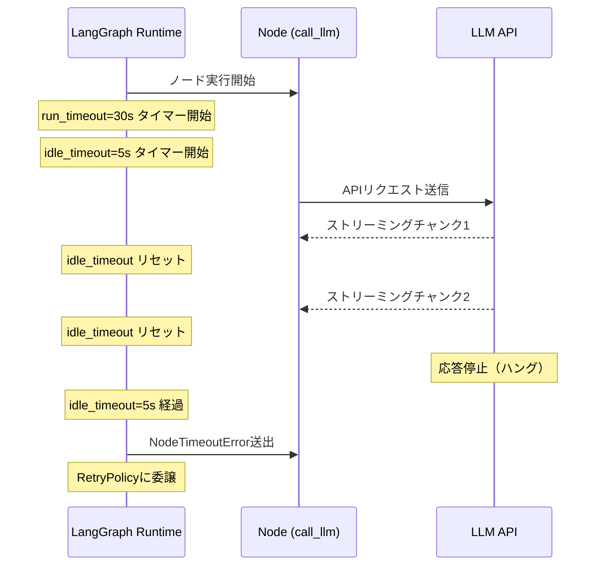
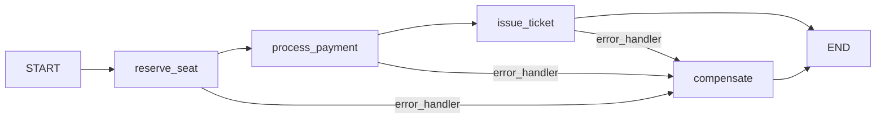

## ブログ概要（Summary）

本記事は [https://www.langchain.com/blog/fault-tolerance-in-langgraph](https://www.langchain.com/blog/fault-tolerance-in-langgraph) の解説記事です。

LangChainチーム（Quanzheng Long, Sydney Runkle）が2026年6月に公開したこのブログ記事は、LangGraphにおけるフォールトトレランスの3つのプリミティブ -- RetryPolicy、TimeoutPolicy、error_handler -- を体系的に解説している。本番環境のAIエージェントでは一時的な障害が複合的に蓄積し、1%の障害率でも数十ステップのワークフロー全体では深刻な影響を及ぼすため、ノード単位で組み合わせ可能な障害回復機構が不可欠であると著者らは述べている。さらに、SAGAパターンによる補償トランザクションの実装例（Flight Bookingワークフロー）を通じて、マルチステップ・エージェントの障害回復設計を具体的に示している。

この記事は [Zenn記事: LangGraph×サーキットブレーカーで実装するAIエージェントのエラー回復設計](https://zenn.dev/0h_n0/articles/4b5b6e56c8b488) の深掘りです。

## 情報源

- **種別**: 企業テックブログ
- **URL**: [https://www.langchain.com/blog/fault-tolerance-in-langgraph](https://www.langchain.com/blog/fault-tolerance-in-langgraph)
- **組織**: LangChain
- **著者**: Quanzheng Long, Sydney Runkle
- **発表日**: 2026年6月4日

## 技術的背景（Technical Background）

### なぜエージェントにフォールトトレランスが必要か

従来のWebアプリケーションにおけるエラーハンドリングは、リクエスト-レスポンスの1往復を対象とする単純な構造であった。一方、LLMベースのAIエージェントは複数のノード（LLM呼び出し、ツール実行、外部API連携）を連鎖的に実行するため、障害の影響範囲が根本的に異なる。

著者らは、この違いを定量的に説明している。個々のノードの一時的障害率が1%であっても、20ステップのワークフローでは全体の障害確率が $1 - (1 - 0.01)^{20} \approx 18.2\%$ に達する。本番環境のエージェントでは「まれな障害」が「日常的な障害」へと変貌するのである。

$$
P(\text{workflow failure}) = 1 - \prod_{i=1}^{N}(1 - p_i)
$$

ここで、
- $N$: ワークフロー内のノード数
- $p_i$: 各ノードの障害発生確率

この問題に対し、LangGraphはフォールトトレランスをグラフ全体ではなく**ノード単位**で定義する設計を採用している。これにより、LLM呼び出しノードには長めのタイムアウトとリトライを、外部API呼び出しノードには短いタイムアウトと即時フォールバックをといった、ノードの特性に応じた障害回復戦略を柔軟に構成できる。

### 3プリミティブの設計思想

著者らは、障害回復を3つの独立したプリミティブに分解している。

1. **RetryPolicy** -- 一時的障害の自動回復（いつ・何回・どの例外をリトライするか）
2. **TimeoutPolicy** -- 暴走や無応答の検知と停止（絶対時間制限と進捗ベースの制限）
3. **error_handler** -- リトライ失敗後の回復ワークフロー（縮退運転や補償トランザクション）

この3つはそれぞれ異なる障害シナリオに対応しており、組み合わせて使うことで段階的な回復が実現する。RetryPolicyだけでは暴走リトライのリスクがあり、TimeoutPolicyだけではリトライなしの即時失敗になる。error_handlerを加えることで「リトライ試行 → タイムアウト検知 → フォールバック実行」という多段階の回復パイプラインが構成される。

## 実装アーキテクチャ（Architecture）

### RetryPolicy: 指数バックオフによる一時的障害の自動回復

RetryPolicyは、ノード実行時に発生した一時的障害を指数バックオフとジッタで自動的にリトライする機構である。

```python
from langgraph.types import RetryPolicy

policy = RetryPolicy(
    initial_interval=0.5,    # 初回リトライまでの待機秒数
    backoff_factor=2.0,      # 指数的増加の倍率（0.5 → 1.0 → 2.0 → ...）
    max_interval=128.0,      # 待機時間の上限（秒）
    max_attempts=3,          # 最大試行回数
    jitter=True,             # 待機時間にランダムなゆらぎを付与
    retry_on=(ConnectionError, TimeoutError),  # リトライ対象の例外型
)
```

著者らが述べる重要な設計判断は、`retry_on` のデフォルト値が**保守的**に設定されている点である。デフォルトでは `ConnectionError`、`httpx`/`requests` の5xxレスポンス、および一部の汎用的な一時障害カテゴリのみがリトライ対象となる。`ValueError`、`TypeError`、`RuntimeError` などのプログラミングエラーは明示的にリトライ対象から除外されている。

この設計の背景には、障害の性質に応じたリトライ可否の判断がある。ネットワーク障害やサーバー過負荷は時間経過で回復する可能性が高い（一時的障害）。一方、コードのバグに起因するエラーはリトライしても同じ結果になるため、即座に開発者に通知すべき（永続的障害）である。

`retry_on` パラメータには例外型のタプルだけでなく、Callableを渡すこともできる。これにより、HTTPステータスコードやエラーメッセージに基づく柔軟なリトライ判定が可能となる。

```python
def should_retry(error: Exception) -> bool:
    """カスタムリトライ判定: レート制限とサーバーエラーのみリトライ"""
    if isinstance(error, ConnectionError):
        return True
    error_msg = str(error).lower()
    if "429" in error_msg or "rate limit" in error_msg:
        return True
    if "5" == error_msg[:1] and len(error_msg) >= 3:
        return True
    return False

custom_policy = RetryPolicy(
    max_attempts=4,
    backoff_factor=2.0,
    retry_on=should_retry,
)
```

#### ジッタの役割

`jitter=True` は、リトライの待機時間にランダムなゆらぎを追加する。複数のエージェントやノードが同時に同一サービスへリトライを送信する「Thundering Herd」問題を回避するためである。ジッタなしの場合、すべてのリトライが同一タイミングに集中し、障害を悪化させる可能性がある。

### TimeoutPolicy: 進捗ベースの暴走検知

TimeoutPolicyは2つのタイムアウト機構を提供する。

```python
from langgraph.types import TimeoutPolicy

timeout = TimeoutPolicy(
    run_timeout=30.0,      # 実行の絶対制限時間（ウォールクロック）
    idle_timeout=5.0,      # 進捗がない場合のタイムアウト
    refresh_on="auto",     # 進捗検知モード
)
```

- **`run_timeout`**: ノードの1回の実行に対するハードリミット。LLM推論が予期せず長時間化した場合や、外部APIが応答しない場合に、確実に実行を打ち切る
- **`idle_timeout`**: 最後の「進捗」からの経過時間制限。LLMがストリーミング応答を開始したが途中で停止した場合など、部分的なハングを検知する

`idle_timeout` の進捗検知は `refresh_on` パラメータで制御される。

| `refresh_on` | 進捗とみなすイベント | 用途 |
|---|---|---|
| `"auto"`（デフォルト） | チャネル書き込み、ストリーミングチャンク、LangChainコールバック | 標準的なLLM呼び出し |
| `"heartbeat"` | ノード内での明示的な `runtime.heartbeat()` 呼び出し | 長時間のバッチ処理やツール実行 |

タイムアウト発生時には `NodeTimeoutError` が送出され、RetryPolicyが設定されていればリトライ対象として処理される。著者らは、タイムアウトを一時的障害として扱うことで、ネットワーク遅延やサービスの一時的な高負荷に対する耐性が向上すると述べている。



### error_handler: リトライ失敗後の回復ワークフロー

error_handlerは、RetryPolicyのすべてのリトライが失敗した後に実行されるフォールバック関数である。

```python
from langgraph.errors import NodeError


def on_call_llm_failed(state: dict, error: NodeError) -> dict:
    """LLM呼び出し失敗時のフォールバック処理

    Args:
        state: 現在のグラフ状態
        error: NodeError（error.node: 失敗ノード名, error.error: 例外）

    Returns:
        状態の更新辞書
    """
    return {
        "status": "llm_unavailable",
        "error_log": [
            f"[{error.node}] {error.error.__class__.__name__}: {error.error}"
        ],
    }
```

著者らが強調する設計上の特徴は以下の3点である。

1. **リトライ後に実行**: error_handlerはRetryPolicyが全試行を消費した後にのみ呼ばれる。一時的障害が自然回復する機会を確保したうえで、真に回復不能な障害のみをerror_handlerに委ねる
2. **アトミックな状態遷移**: error_handlerによる状態更新はチェックポイントにアトミックにコミットされる。これにより、error_handler実行中のクラッシュでも状態が不整合にならない
3. **ネスト不可**: error_handler内でさらにerror_handlerを定義することはできない。障害回復の複雑化を防ぐ設計上の制約である

`set_node_defaults()` を使えば、グラフ内の全ノードにデフォルトのerror_handlerを設定できる。個別ノードで上書きも可能であるため、共通のフォールバックと特殊なフォールバックを使い分けられる。

### 3プリミティブの統合パターン

3つのプリミティブを組み合わせたノード定義の全体像を示す。

```python
from langgraph.graph import StateGraph
from langgraph.types import RetryPolicy, TimeoutPolicy
from langgraph.errors import NodeError


def handle_model_failure(state: dict, error: NodeError) -> dict:
    """モデル呼び出し失敗時: 縮退モードで応答を生成"""
    return {
        "status": "degraded",
        "messages": [{
            "role": "system",
            "content": (
                f"Tool '{error.node}' is unavailable after retries. "
                "Provide the best answer without this tool."
            ),
        }],
    }


graph = (
    StateGraph(AgentState)
    .add_node(
        "call_llm",
        call_llm,
        retry_policy=RetryPolicy(max_attempts=4, backoff_factor=2.0),
        timeout=TimeoutPolicy(run_timeout=30, idle_timeout=5),
        error_handler=handle_model_failure,
    )
)
```

この構成では、ノード `call_llm` は以下の順序で障害に対処する。

1. 実行開始。`run_timeout=30` 秒以内、かつ進捗が5秒以上途絶えなければ正常完了
2. 障害発生時、`retry_on` に合致する例外であれば最大4回リトライ（指数バックオフ: 0.5s → 1.0s → 2.0s）
3. タイムアウト発生時も `NodeTimeoutError` としてリトライ対象に
4. 全リトライ失敗後、`handle_model_failure` が呼ばれ、縮退モードの応答を状態に書き込む

## Flight Booking SAGAの実装解説

著者らは、フォールトトレランスの実践例としてFlight Bookingワークフロー（SAGAパターン）を詳細に紹介している。このワークフローでは、座席予約 → 決済 → 発券の3ステップを逐次実行し、途中で障害が発生した場合に完了済みステップを逆順に取り消す補償トランザクションを実装する。

### SAGAパターンの構造

```python
import operator
from typing import TypedDict, Annotated, Literal

from langgraph.graph import StateGraph, START, END
from langgraph.types import Command, RetryPolicy
from langgraph.errors import NodeError


class BookingState(TypedDict, total=False):
    """予約ワークフローの状態定義"""
    booking_id: str
    passenger: str
    flight: str
    seat: str
    amount: int
    payment_ref: str
    ticket_no: str
    completed: Annotated[list[str], operator.add]


RETRYABLE = RetryPolicy(
    max_attempts=3,
    backoff_factor=2.0,
    jitter=True,
    retry_on=(ConnectionError, TimeoutError),
)


def to_compensate(state: BookingState, error: NodeError) -> Command:
    """リトライ失敗時に補償ノードへ遷移する共通error_handler

    Args:
        state: 現在の予約状態
        error: NodeError（失敗ノード情報を含む）

    Returns:
        補償ノードへのCommand
    """
    return Command(
        update={"completed": [f"FAILED:{error.node}"]},
        goto="compensate",
    )


def reserve_seat(state: BookingState) -> BookingState:
    """座席予約: 在庫管理サービスへのAPI呼び出し"""
    return {"seat": "12A", "completed": ["reserve_seat"]}


def process_payment(state: BookingState) -> BookingState:
    """決済処理: 決済プロセッサへのAPI呼び出し"""
    return {"payment_ref": "pay_abc123", "completed": ["process_payment"]}


def issue_ticket(state: BookingState) -> BookingState:
    """発券処理: チケット発行サービスへのAPI呼び出し"""
    return {"ticket_no": "TKT-7788", "completed": ["issue_ticket"]}


def compensate(state: BookingState) -> Command[Literal["__end__"]]:
    """完了済みステップを逆順に取り消す補償トランザクション"""
    for step in reversed(state.get("completed", [])):
        if step.startswith("FAILED:"):
            continue
        if step == "issue_ticket":
            void_ticket(state)
        elif step == "process_payment":
            refund_payment(state)
        elif step == "reserve_seat":
            release_seat(state)
    return Command(goto=END)


graph = (
    StateGraph(BookingState)
    .set_node_defaults(retry_policy=RETRYABLE, error_handler=to_compensate)
    .add_node("reserve_seat", reserve_seat)
    .add_node("process_payment", process_payment)
    .add_node("issue_ticket", issue_ticket)
    .add_node("compensate", compensate)
    .add_edge(START, "reserve_seat")
    .add_edge("reserve_seat", "process_payment")
    .add_edge("process_payment", "issue_ticket")
    .add_edge("issue_ticket", END)
    .compile(checkpointer=checkpointer)
)
```

### SAGAの動作フロー



正常系ではSTART → reserve_seat → process_payment → issue_ticket → ENDと遷移する。いずれかのステップでリトライが全て失敗した場合、`to_compensate` error_handlerが `Command(goto="compensate")` を返し、compensateノードへアトミックに遷移する。

compensateノードでは `completed` リストを逆順に走査し、実行済みステップのみを取り消す。`FAILED:` プレフィックスが付いたステップ（失敗したステップ自体）はスキップされる。

この設計の重要なポイントを著者らは3点挙げている。

1. **ステップ単位の独立したリトライ**: 各ステップが独自のRetryPolicyでリトライし、一時的障害は自動回復を試みる
2. **アトミックな補償遷移**: error_handlerの状態更新はチェックポイントにアトミックにコミットされるため、遷移中の障害で状態が破損しない
3. **状態追跡による安全な補償**: `completed` リストにより、実行されていないステップの取り消しを防止する

## Production Deployment Guide

LangGraphのフォールトトレランス・プリミティブを本番環境にデプロイするためのAWS構成ガイドを示す。

### AWS実装パターン（コスト最適化重視）

LangGraphエージェントのフォールトトレランス機構を含むデプロイ構成を、トラフィック量別に示す。

| 構成 | トラフィック | 主要サービス | 月額概算 |
|---|---|---|---|
| **Small** | ~100 req/日 | Lambda + Bedrock + DynamoDB | $50-150 |
| **Medium** | ~1,000 req/日 | ECS Fargate + Bedrock + ElastiCache | $300-800 |
| **Large** | 10,000+ req/日 | EKS + Karpenter (Spot) + ElastiCache Cluster | $2,000-5,000 |

**Small構成の内訳**: Lambda（128MB, 月約300万ms実行: ~$2）、Bedrock Claude Sonnet（100 req x 4K tokens: ~$80）、DynamoDB On-Demand（チェックポイント保存: ~$5）、CloudWatch Logs（~$3）。合計$90程度。リトライ・タイムアウト制御はLambda内のLangGraphランタイムが処理し、追加インフラは不要である。

**Medium構成のポイント**: ECS Fargate（0.5 vCPU / 1GB RAM, 2タスク: ~$30）にLangGraphアプリケーションを常駐させ、ElastiCache（cache.t3.micro: ~$15）でサーキットブレーカーの状態とリトライ結果キャッシュを共有する。

**Large構成のポイント**: EKS上でKarpenter Provisionerを使い、Spot Instances（m5.xlarge: On-Demand比最大90%削減）を優先的に割り当てる。チェックポイントストレージにはDynamoDB DAXまたはElastiCache Clusterモードを使用し、高スループットの状態永続化を実現する。

**コスト削減テクニック**:
- Spot Instances活用でコンピュート費用を最大90%削減
- Reserved Instances（1年コミット）で最大72%削減
- Bedrock Batch APIで非リアルタイム処理のLLM費用を50%削減
- Prompt Caching有効化で繰り返しプロンプトのトークン費用を30-90%削減

**コスト試算の注意事項**: 上記は2026年10月時点のAWS ap-northeast-1（東京）リージョン料金に基づく概算値である。実際のコストはトラフィックパターン、バースト使用量、リージョンにより変動する。最新料金は[AWS料金計算ツール](https://calculator.aws/)で確認されたい。

### Terraformインフラコード

#### Small構成（Serverless: Lambda + Bedrock + DynamoDB）

```hcl
# LangGraph Fault Tolerance - Small構成 (Serverless)
# 対象: ~100 req/日、月額 $50-150

terraform {
  required_version = ">= 1.9"
  required_providers {
    aws = { source = "hashicorp/aws", version = "~> 5.70" }
  }
}

provider "aws" {
  region = "ap-northeast-1"
}

# --- IAMロール（最小権限） ---
resource "aws_iam_role" "langgraph_lambda" {
  name = "langgraph-fault-tolerance-lambda"
  assume_role_policy = jsonencode({
    Version = "2012-10-17"
    Statement = [{
      Action = "sts:AssumeRole"
      Effect = "Allow"
      Principal = { Service = "lambda.amazonaws.com" }
    }]
  })
}

resource "aws_iam_role_policy" "langgraph_lambda" {
  name = "langgraph-lambda-policy"
  role = aws_iam_role.langgraph_lambda.id
  policy = jsonencode({
    Version = "2012-10-17"
    Statement = [
      {
        Effect   = "Allow"
        Action   = ["bedrock:InvokeModel", "bedrock:InvokeModelWithResponseStream"]
        Resource = "arn:aws:bedrock:ap-northeast-1::foundation-model/anthropic.*"
      },
      {
        Effect   = "Allow"
        Action   = ["dynamodb:PutItem", "dynamodb:GetItem", "dynamodb:UpdateItem", "dynamodb:Query"]
        Resource = aws_dynamodb_table.checkpoints.arn
      },
      {
        Effect   = "Allow"
        Action   = ["logs:CreateLogGroup", "logs:CreateLogStream", "logs:PutLogEvents"]
        Resource = "arn:aws:logs:ap-northeast-1:*:*"
      }
    ]
  })
}

# --- DynamoDB（チェックポイント保存、On-Demandでコスト最適化） ---
resource "aws_dynamodb_table" "checkpoints" {
  name         = "langgraph-checkpoints"
  billing_mode = "PAY_PER_REQUEST"  # On-Demand: 低トラフィック時のコスト最適化
  hash_key     = "thread_id"
  range_key    = "checkpoint_ns"

  attribute {
    name = "thread_id"
    type = "S"
  }
  attribute {
    name = "checkpoint_ns"
    type = "S"
  }

  server_side_encryption { enabled = true }  # KMS暗号化
  point_in_time_recovery { enabled = true }

  ttl {
    attribute_name = "expires_at"
    enabled        = true
  }
}

# --- Lambda関数 ---
resource "aws_lambda_function" "langgraph_agent" {
  function_name = "langgraph-fault-tolerant-agent"
  role          = aws_iam_role.langgraph_lambda.arn
  handler       = "main.handler"
  runtime       = "python3.12"
  timeout       = 120  # error_handler実行時間を考慮
  memory_size   = 512  # LangGraphランタイム + リトライバッファ

  filename         = "lambda_package.zip"
  source_code_hash = filebase64sha256("lambda_package.zip")

  environment {
    variables = {
      CHECKPOINT_TABLE  = aws_dynamodb_table.checkpoints.name
      MAX_RETRY_ATTEMPTS = "4"
      RUN_TIMEOUT_SEC    = "30"
      IDLE_TIMEOUT_SEC   = "5"
    }
  }

  tracing_config { mode = "Active" }  # X-Ray有効化
}

# --- CloudWatchアラーム（コスト監視） ---
resource "aws_cloudwatch_metric_alarm" "lambda_errors" {
  alarm_name          = "langgraph-agent-errors"
  comparison_operator = "GreaterThanThreshold"
  evaluation_periods  = 2
  metric_name         = "Errors"
  namespace           = "AWS/Lambda"
  period              = 300
  statistic           = "Sum"
  threshold           = 10  # 5分間で10回以上のエラー
  alarm_description   = "LangGraphエージェントのエラー率監視"
  dimensions = {
    FunctionName = aws_lambda_function.langgraph_agent.function_name
  }
}
```

#### Large構成（Container: EKS + Karpenter + Spot）

```hcl
# LangGraph Fault Tolerance - Large構成 (Container)
# 対象: 10,000+ req/日、月額 $2,000-5,000

module "eks" {
  source          = "terraform-aws-modules/eks/aws"
  version         = "~> 20.24"
  cluster_name    = "langgraph-ft-cluster"
  cluster_version = "1.31"

  vpc_id     = module.vpc.vpc_id
  subnet_ids = module.vpc.private_subnets

  cluster_endpoint_public_access = false  # プライベートアクセスのみ
}

# --- Karpenter Provisioner（Spot優先で最大90%コスト削減） ---
resource "kubectl_manifest" "karpenter_nodepool" {
  yaml_body = yamlencode({
    apiVersion = "karpenter.sh/v1"
    kind       = "NodePool"
    metadata   = { name = "langgraph-agents" }
    spec = {
      template = {
        spec = {
          requirements = [
            { key = "karpenter.sh/capacity-type", operator = "In", values = ["spot", "on-demand"] },
            { key = "node.kubernetes.io/instance-type", operator = "In", values = ["m5.xlarge", "m5.2xlarge", "m6i.xlarge"] },
          ]
          nodeClassRef = { group = "karpenter.k8s.aws", kind = "EC2NodeClass", name = "default" }
        }
      }
      limits   = { cpu = "100", memory = "400Gi" }
      disruption = {
        consolidationPolicy = "WhenEmptyOrUnderutilized"
        consolidateAfter    = "30s"
      }
    }
  })
}

# --- Secrets Manager（Bedrock設定） ---
resource "aws_secretsmanager_secret" "bedrock_config" {
  name                    = "langgraph/bedrock-config"
  recovery_window_in_days = 7
}

# --- AWS Budgets（予算アラート） ---
resource "aws_budgets_budget" "langgraph_monthly" {
  name         = "langgraph-monthly-budget"
  budget_type  = "COST"
  limit_amount = "5000"
  limit_unit   = "USD"
  time_unit    = "MONTHLY"

  notification {
    comparison_operator       = "GREATER_THAN"
    threshold                 = 80
    threshold_type            = "PERCENTAGE"
    notification_type         = "ACTUAL"
    subscriber_email_addresses = ["ops-team@example.com"]
  }
}
```

### 運用・監視設定

#### CloudWatch Logs Insightsクエリ

```
# リトライ・タイムアウト発生状況の監視（1時間あたり）
fields @timestamp, @message
| filter @message like /RetryPolicy|NodeTimeoutError|error_handler/
| stats count() as event_count by bin(1h) as hour
| sort hour desc

# error_handler発動率の分析
fields @timestamp, node_name, error_type
| filter @message like /error_handler/
| stats count() as handler_invocations by node_name
| sort handler_invocations desc
```

#### CloudWatchアラーム設定（Python）

```python
import boto3

cloudwatch = boto3.client("cloudwatch", region_name="ap-northeast-1")


def create_retry_exhaustion_alarm(function_name: str, sns_topic_arn: str) -> None:
    """リトライ枯渇アラームの作成

    Args:
        function_name: Lambda関数名
        sns_topic_arn: 通知先SNSトピックARN
    """
    cloudwatch.put_metric_alarm(
        AlarmName=f"{function_name}-retry-exhaustion",
        MetricName="Errors",
        Namespace="AWS/Lambda",
        Statistic="Sum",
        Period=300,
        EvaluationPeriods=2,
        Threshold=5,
        ComparisonOperator="GreaterThanThreshold",
        AlarmActions=[sns_topic_arn],
        Dimensions=[{"Name": "FunctionName", "Value": function_name}],
    )
```

#### X-Rayトレーシング設定（Python）

```python
from aws_xray_sdk.core import xray_recorder, patch_all

patch_all()  # boto3, requests, httplib等を自動計装


def trace_langgraph_node(node_name: str, attempt: int) -> None:
    """LangGraphノード実行のトレーシング

    Args:
        node_name: ノード名
        attempt: リトライ試行回数（1-indexed）
    """
    subsegment = xray_recorder.begin_subsegment(f"langgraph.{node_name}")
    subsegment.put_annotation("node_name", node_name)
    subsegment.put_annotation("retry_attempt", attempt)
    subsegment.put_metadata("fault_tolerance", {
        "max_attempts": 4,
        "run_timeout": 30,
        "idle_timeout": 5,
    })
```

#### Cost Explorer自動レポート（Python）

```python
import datetime

import boto3


def get_daily_langgraph_cost(sns_topic_arn: str, threshold: float = 100.0) -> dict:
    """日次コストレポート取得。閾値超過時にSNS通知

    Args:
        sns_topic_arn: 通知先SNSトピックARN
        threshold: コスト閾値（USD/日）

    Returns:
        サービス別コスト辞書
    """
    ce = boto3.client("ce", region_name="us-east-1")
    today = datetime.date.today()
    yesterday = today - datetime.timedelta(days=1)

    response = ce.get_cost_and_usage(
        TimePeriod={"Start": yesterday.isoformat(), "End": today.isoformat()},
        Granularity="DAILY",
        Metrics=["UnblendedCost"],
        GroupBy=[{"Type": "DIMENSION", "Key": "SERVICE"}],
        Filter={
            "Tags": {"Key": "Project", "Values": ["langgraph-fault-tolerance"]}
        },
    )

    costs: dict[str, float] = {}
    total = 0.0
    for group in response["ResultsByTime"][0]["Groups"]:
        service = group["Keys"][0]
        amount = float(group["Metrics"]["UnblendedCost"]["Amount"])
        costs[service] = amount
        total += amount

    if total > threshold:
        sns = boto3.client("sns", region_name="ap-northeast-1")
        sns.publish(
            TopicArn=sns_topic_arn,
            Subject=f"LangGraph日次コスト警告: ${total:.2f}",
            Message=f"日次コストが閾値${threshold}を超過しました。詳細: {costs}",
        )
    return costs
```

### コスト最適化チェックリスト

**アーキテクチャ選択**:
- [ ] トラフィック量に応じた構成を選択（~100 req/日: Serverless、~1,000: Hybrid、10,000+: Container）
- [ ] フォールトトレランスのオーバーヘッド（リトライ分のLLMコスト）を見積もりに含める
- [ ] チェックポイントストレージのIOPS要件を確認

**リソース最適化**:
- [ ] EC2/EKS: Spot Instances優先（m5/m6i系、Karpenterで自動フォールバック）
- [ ] Reserved Instances: 1年コミットで72%削減
- [ ] Savings Plans: Compute Savings Plansで柔軟な割引
- [ ] Lambda: メモリサイズ最適化（512MB推奨、Power Tuningで検証）
- [ ] ECS/EKS: Karpenter consolidationPolicyでアイドル時自動スケールダウン

**LLMコスト削減**:
- [ ] Bedrock Batch API: 非リアルタイム処理で50%削減
- [ ] Prompt Caching有効化: 繰り返しシステムプロンプトで30-90%削減
- [ ] モデル選択ロジック: リトライ時により小さいモデルにフォールバック
- [ ] トークン数制限: max_tokens設定でコスト上限を設定
- [ ] リトライ時のコンテキスト圧縮: 全履歴再送信を避ける

**監視・アラート**:
- [ ] AWS Budgets: 月次予算アラート（80%/100%閾値）
- [ ] CloudWatch アラーム: リトライ枯渇率、error_handler発動率
- [ ] Cost Anomaly Detection: 異常なLLMトークン消費の自動検知
- [ ] 日次コストレポート: Cost Explorer APIで自動取得+SNS通知

**リソース管理**:
- [ ] 未使用リソース削除: 不要なLambda関数、ECSサービスの定期監査
- [ ] タグ戦略: `Project=langgraph-fault-tolerance` で全リソースにタグ付与
- [ ] ライフサイクルポリシー: チェックポイントDynamoDBのTTL設定（7日推奨）
- [ ] 開発環境夜間停止: EKSノードのスケジュールドスケーリング
- [ ] ログ保持期間: CloudWatch Logsの保持期間を30日に設定

## パフォーマンス最適化（Performance）

著者らのブログ記事には具体的なベンチマーク数値は記載されていないが、フォールトトレランス・プリミティブの設計からパフォーマンスに影響する要因を分析できる。

**リトライのレイテンシ影響**: `backoff_factor=2.0`, `initial_interval=0.5` の設定では、3回リトライ時の最大待機時間は $0.5 + 1.0 + 2.0 = 3.5$ 秒（ジッタなし）となる。`max_interval=128.0` の設定はリトライが多数回に及ぶ場合の安全弁として機能する。

**タイムアウトのチューニング**: `run_timeout` はノードの特性に応じた設定が必要である。LLM呼び出しノードでは30秒程度が推奨される一方、外部API呼び出しノードでは10秒程度に設定することで、異常検知の速度とリソース解放のバランスが取れる。

**チェックポイントのI/Oオーバーヘッド**: error_handlerのアトミック遷移はチェックポイントへの書き込みを伴う。DynamoDB On-Demandモードでは書き込みレイテンシは通常1桁ms程度であるが、高スループット環境ではDAXキャッシュの導入を検討すべきである。

**最適化の指針**:
- リトライ回数を増やすとレジリエンスは向上するが、レイテンシとLLMトークンコストが増加する
- `idle_timeout` を短くすると障害検知が速くなるが、正常なストリーミングの一時停止を誤検知するリスクがある
- error_handlerの処理時間はLambdaのタイムアウト設定に含まれるため、十分なマージンが必要

## 運用での学び（Production Lessons）

著者らのブログ記事と関連するZenn記事の内容から、本番運用における重要な学びを整理する。

### 障害分類の重要性

著者らが `retry_on` のデフォルトを保守的に設定している理由は、障害の種類に応じたリトライ可否の判断が本番運用で不可欠だからである。関連するZenn記事では、障害を5カテゴリ（実行エラー、セマンティックエラー、状態エラー、タイムアウト、依存エラー）に分類し、各カテゴリに最適な回復戦略を対応付ける手法が解説されている。

### リトライストームの防止

Zenn記事で詳述されている通り、ナイーブなリトライ実装は「リトライストーム」を引き起こす。LangGraphのRetryPolicyはノード単位で制御されるため、フレームワークレベルでのリトライ増幅は防止できる。ただし、LLMが自律的にエラーを確認して再度ツール呼び出しを行う「シャドウリトライ」は別途制御が必要である。会話レベルのツール呼び出し上限やサーキットブレーカーの導入がこの問題への対策となる。

### 補償トランザクションの冪等性

SAGAパターンの補償アクション自体も失敗する可能性がある。補償操作（キャンセル、返金）にも冪等性キーを付与し、リトライ時の二重実行を防止することが不可欠である。著者らの実装では `completed` リストによる状態追跡でこの問題に対処しているが、本番環境では永続ストレージ（Redis、DynamoDB）との併用が推奨される。

## 学術研究との関連（Academic Connection）

LangGraphのフォールトトレランス設計は、分散システムの研究で長年蓄積された知見に基づいている。

**SAGAパターン**: Garcia-Molinaらが1987年に提案した長時間トランザクションの管理手法（"Sagas", ACM SIGMOD 1987）が原型である。LangGraphの `Command(goto="compensate")` による補償遷移は、このSAGAパターンのステートマシン実装に相当する。

**サーキットブレーカー**: Michael Nygardが2007年の著書 "Release It!" で体系化したパターンである。Zenn記事ではこのパターンをLangGraphのerror_handlerと組み合わせる手法が解説されている。

**指数バックオフとジッタ**: AWSのアーキテクチャブログ（"Exponential Backoff And Jitter", 2015）で詳述されている。RetryPolicyの `backoff_factor` と `jitter` は、この研究成果を直接反映した実装である。

## まとめと実践への示唆

LangChain公式ブログは、LangGraphのフォールトトレランスを3つの独立したプリミティブ（RetryPolicy、TimeoutPolicy、error_handler）として体系化し、それぞれの設計判断と組み合わせパターンを詳細に解説した。

RetryPolicyの保守的なデフォルト（一時的障害のみリトライ）、TimeoutPolicyの進捗ベース検知（idle_timeout + refresh_on）、error_handlerのアトミック遷移（チェックポイント連携）という3つの設計思想は、本番環境のAIエージェントにおける障害回復の基盤となる。Flight Booking SAGAの実装例は、これらのプリミティブを組み合わせた補償トランザクションの具体的な設計指針を提供している。

実践においては、まず各ノードの障害特性を分類し、ノードごとにリトライ回数・タイムアウト値・フォールバック戦略を設計することが推奨される。副作用のあるツール呼び出しには冪等性キーを付与し、マルチステップ処理にはSAGAパターンによる補償トランザクションを導入することで、堅牢なエージェントワークフローが実現できる。

## 参考文献

- **Blog URL**: [Fault Tolerance in LangGraph（LangChain公式）](https://www.langchain.com/blog/fault-tolerance-in-langgraph)
- **Garcia-Molina, H. and Salem, K. (1987)**: "Sagas", ACM SIGMOD Record, 16(3), pp.249-259
- **Nygard, M. T. (2007)**: "Release It!", Pragmatic Bookshelf
- **AWS Architecture Blog (2015)**: [Exponential Backoff And Jitter](https://aws.amazon.com/blogs/architecture/exponential-backoff-and-jitter/)
- **Related Zenn article**: [LangGraph×サーキットブレーカーで実装するAIエージェントのエラー回復設計](https://zenn.dev/0h_n0/articles/4b5b6e56c8b488)

---

*本記事はAI（Claude Code）により自動生成されました。内容の正確性については複数の情報源で検証していますが、実際の利用時は公式ドキュメントもご確認ください。*
