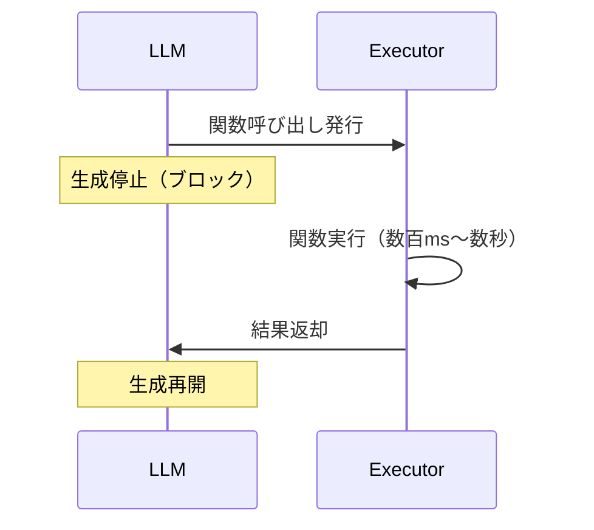
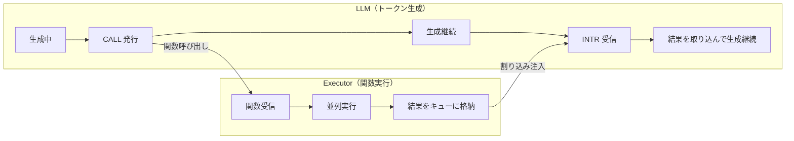
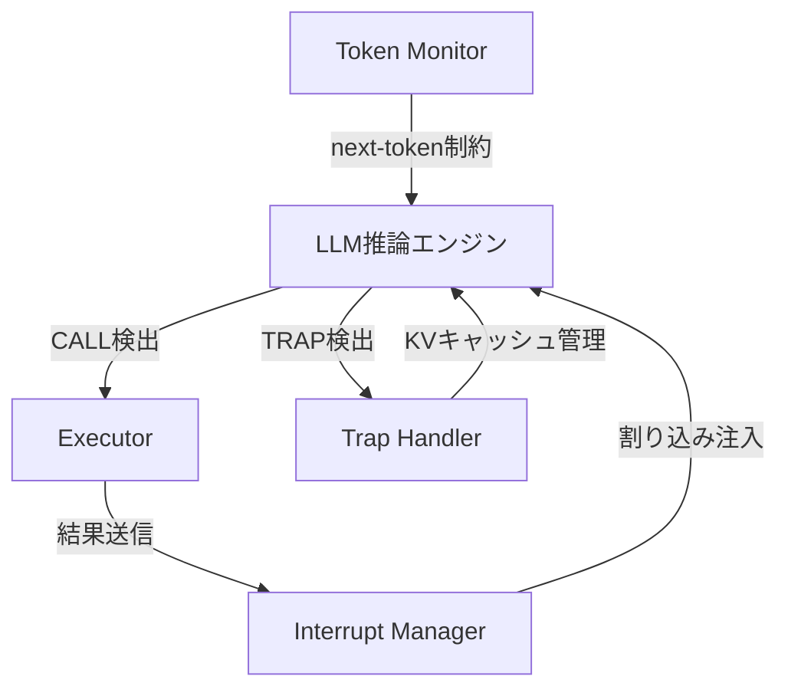

## 論文概要（Abstract）

本記事は [https://arxiv.org/abs/2412.07017](https://arxiv.org/abs/2412.07017) の解説記事です。

LLMがツール（関数）を呼び出す際、従来のアプローチでは関数の実行結果が返るまでLLMの生成がブロックされる。これは特に複数の独立した関数呼び出しが必要な場合や、外部APIの呼び出しに時間がかかる場合に深刻なレイテンシのボトルネックとなる。著者ら（In Gim, Seung-seob Lee, Lin Zhong）はこの問題に対し、LLMの関数呼び出しを非同期化するフレームワーク「AsyncLM」を提案している。AsyncLMでは、関数をバックグラウンドで実行しながらLLMがトークン生成を継続し、結果が返った時点で割り込み（interrupt）としてLLMのコンテキストに注入する。著者らの実験では、同期的な逐次実行と比較して最大5.4倍のレイテンシ削減が報告されている。

この記事は [Zenn記事: Python asyncioで実装するエージェント非同期並列実行の7パターンとレート制限設計](https://zenn.dev/0h_n0/articles/1ba3ffb07291ed) の深掘りです。

## 情報源

- **arXiv ID**: 2412.07017
- **URL**: [https://arxiv.org/abs/2412.07017](https://arxiv.org/abs/2412.07017)
- **著者**: In Gim, Seung-seob Lee, Lin Zhong
- **投稿日**: 2024年12月9日
- **分野**: cs.CL, cs.AI

## 背景と動機（Background & Motivation）

### LLM関数呼び出しの同期ボトルネック

2024年時点で、LLMのFunction Calling（ツール使用）は標準的な機能となっている。OpenAIのFunction Calling、AnthropicのTool Use、LangChainやLangGraphにおけるツールノードなど、LLMが外部関数を呼び出して結果を取得する仕組みは広く普及している。

しかし、既存のFunction Callingはすべて同期的なパラダイムに基づいている。典型的なフローは以下のとおりである。



この同期モデルには2つの問題がある。

**問題1: 並行実行の機会損失**。LLMが複数の独立した関数を呼び出す必要がある場合でも、1つずつ順番に呼び出して結果を待つ。例えば「東京の天気」と「大阪の天気」を取得する場合、2つのAPI呼び出しを並行して実行できるにもかかわらず、直列に処理される。

**問題2: LLM計算リソースの浪費**。関数の実行中、LLMのGPUは待機状態となり、計算リソースが無駄になる。特にクラウドAPIの呼び出し（数百ms〜数秒のレイテンシ）では、この浪費が顕著になる。

著者らは、この同期的パラダイムが「オペレーティングシステムにおけるブロッキングI/Oに相当する」と指摘している。OSがプロセスのI/O待ちを割り込みと非同期I/Oで解決したように、LLMの関数呼び出しにも同様の非同期化が可能であるという着想がAsyncLMの出発点である。

### 既存の並列化アプローチとの違い

LLMの関数呼び出しの並列化には、既存のアプローチが2つ存在する。

**Sync-Parallel（同期的並列）**: LLMがまず複数の関数呼び出しをまとめて発行し、すべての関数が並列実行される。全結果が揃ってからLLMが生成を再開する。OpenAIのparallel function callingがこれに該当する。しかし、LLMは結果が揃うまでブロックされるため、最も遅い関数に律速される。

**AsyncLM（非同期）**: LLMは関数呼び出しを発行した後も生成を継続する。各関数の結果は完了した時点で割り込みとしてLLMのコンテキストに注入される。LLMは一度もブロックされない。

著者らはこの違いを理論的に整理し、以下の関係を示している（Theorem 6.1）。

$$L_{\text{Async}} \leq L_{\text{Sync-Parallel}} < L_{\text{Sync}}$$

すなわち、AsyncLMのレイテンシはSync-Parallel以下であり、Sync-Parallelは逐次実行（Sync）よりも常に短い。

## 主要な貢献（Key Contributions）

著者らの貢献は以下の4点に集約される。

- **貢献1: 非同期関数呼び出しフレームワーク** -- LLMのトークン生成と関数実行を完全に分離（decouple）し、関数実行中もLLMが生成を継続できるAsyncLMフレームワークの設計
- **貢献2: In-Context Protocol（CML）** -- 割り込み（interrupt）、明示的待機（trap）、クリティカルセクションを表現する特殊トークンプロトコルの定義
- **貢献3: Fine-Tuning手法** -- 既存の同期的関数呼び出しデータセットからDAG（有向非巡回グラフ）を構築し、ランダムな実行時間でinterruptをシミュレートする訓練データ生成パイプライン
- **貢献4: 理論的分析** -- 同期・同期並列・非同期の3モデルのレイテンシ関係を形式的に証明し、スピードアップの上界を導出

## 技術的詳細（Technical Details）

### 非同期実行モデル

AsyncLMの中核は、LLMとExecutorの分離（decoupled execution）にある。従来のFunction CallingではLLMとExecutorが同期的に連動するが、AsyncLMでは両者が独立して動作する。



著者らは、この非同期実行を制御するために、OSの割り込み処理に着想を得た4つのメカニズムを導入している。

#### 1. Interrupt（割り込み）

Executorが関数の実行を完了すると、結果をキューに格納する。Interrupt Managerは結果の到着を検知し、LLMのトークンストリームに割り込みを注入する。LLMは次のトークンをサンプリングする前に、割り込みの有無をチェックする。割り込みが存在する場合、関数の結果がLLMのコンテキストに追加され、LLMはその結果を考慮して生成を継続する。

#### 2. Trap（明示的待機）

LLMが「ここで結果が必要」と判断した場合、`[TRAP]`トークンを生成して明示的に待機する。Trapが発行されると、保留中の関数結果が到着するまでLLMの生成が一時停止する。これはOSのシステムコールによるブロッキングに相当する。Trapが必要になるのは、次の関数呼び出しの引数が前の関数の結果に依存する場合（データ依存性がある場合）である。

#### 3. Critical Section（クリティカルセクション）

LLMが関数呼び出しブロック（`[CALL]`から`[END]`まで）を生成している最中は、割り込みの注入を延期する。これにより、関数呼び出しの構文的整合性が保証される。関数呼び出しブロックの生成が完了した時点で、延期されていた割り込みが注入される。

#### 4. Scheduling（スケジューリング）

複数の関数結果が同時に返った場合の注入順序として、著者らはLongest-Processing-Time（LPT）優先を採用している。実行時間の長い関数の結果を先に注入することで、LLMが依存関係のある次の処理をより早く開始できるようにしている。

### In-Context Protocol（CML）

AsyncLMの非同期実行を実現するために、著者らはConcurrent Markup Language（CML）と呼ばれるIn-Contextプロトコルを定義している。CMLは5つの特殊トークンで構成される。

| トークン | 役割 | OSにおける対応概念 |
|---------|------|-----------------|
| `[CALL]` | 関数呼び出しの開始を示す | fork / exec |
| `[END]` | 呼び出しブロックまたは割り込みブロックの終了 | -- |
| `[HEAD]` | 呼び出し内容または結果の開始区切り | -- |
| `[INTR]` | 割り込み（関数結果の到着）を示す | ハードウェア割り込み |
| `[TRAP]` | LLMによる明示的な待機要求 | システムコール / trap |

#### 関数呼び出しの構文

```
[CALL] (call_id) [HEAD] function_name(arg1, arg2) [END]
```

`call_id`は各呼び出しを一意に識別するための識別子であり、後の割り込みで結果と呼び出しを対応付けるために使用される。

#### 割り込みの構文

```
[INTR] call_id [HEAD] return_value [END]
```

割り込みはLLM自身が生成するのではなく、Interrupt Managerが外部からトークンストリームに注入する。著者らは、Token Monitorを用いてLLMが`[INTR]`トークンを自発的に生成することを防止している。これはLLMが結果を「幻覚」することを防ぐための重要な制約である。

#### 明示的待機の構文

```
[TRAP][END]
```

LLMが`[TRAP]`を生成すると、保留中のすべての関数結果が到着するまで生成が一時停止される。

#### 実行例

以下は、2つの独立した天気API呼び出しの非同期実行例である（論文の記述に基づく概念的な例）。

```
User: 東京と大阪の天気を教えて
Assistant:
  [CALL] (1) [HEAD] get_weather("Tokyo") [END]
  [CALL] (2) [HEAD] get_weather("Osaka") [END]
  両都市の天気を調べています。
  [INTR] 1 [HEAD] {"temp": 22, "condition": "sunny"} [END]
  東京は晴れで22度です。
  [INTR] 2 [HEAD] {"temp": 19, "condition": "cloudy"} [END]
  大阪は曇りで19度です。
```

同期モデルでは関数1の結果を待ってから関数2を呼び出すが、AsyncLMでは2つの呼び出しを連続して発行し、結果が返る順に処理する。LLMは関数実行中も「両都市の天気を調べています。」というテキストを生成し続けている点が重要である。

### Token Monitorと制約付きデコーディング

Token Monitorは、LLMのnext-token samplingにフックする有限状態機械（FSM）である。以下の制約を強制する。

1. **`[INTR]`の自発生成を禁止**: LLMが`[INTR]`トークンを生成しようとした場合、そのトークンの確率を0に設定する。割り込みはExecutorからの外部注入でのみ発生する
2. **クリティカルセクションの保護**: `[CALL]`トークンが生成されてから`[END]`が生成されるまでの間、割り込みの注入を延期する
3. **`[TRAP]`の文法チェック**: `[TRAP]`の後には`[END]`のみが許可される

この制約付きデコーディングにより、非同期実行の構造的正しさが保証される。

### Fine-Tuning戦略

AsyncLMのFine-Tuningは、既存の同期的関数呼び出しデータセットを非同期的なトレースに変換することで実現される。著者らは以下の手順を報告している。

**ステップ1: DAG構築**。BFCL、ToolSandbox、tau-benchの3つのデータセットから関数呼び出しトレースを取得し、関数間のデータ依存関係をDAG（有向非巡回グラフ）として表現する。依存関係のない関数呼び出しは並行実行可能とマークされる。

**ステップ2: 実行時間のシミュレーション**。各関数呼び出しにランダムな実行時間（1ms〜1s）を割り当て、割り込みの到着タイミングをシミュレートする。これにより、様々な実行時間パターンに対応できるモデルを訓練できる。

**ステップ3: 3つの行動の学習**。以下の3つの行動を学習する。
- **次の関数呼び出しの選択**: DAGのトポロジカル順序に基づき、依存関係が解決済みの関数を選択する
- **割り込みの処理**: 到着した結果を適切にコンテキストに統合する
- **Trapの発行**: データ依存性がある場合に、適切なタイミングで明示的な待機を発行する

著者らの実装では、Llama-3.2の1Bおよび3Bモデルに対してFine-Tuningを実施し、RTX 4090上で評価を行っている。

### 数式による理論分析

著者らは、AsyncLMのスピードアップを理論的に分析している（Theorem 6.2）。

同期実行のレイテンシ $L_{\text{Sync}}$ と非同期実行のレイテンシ $L_{\text{Async}}$ の比は、以下のように近似される。

$$\frac{L_{\text{Sync}}}{L_{\text{Async}}} \approx 1 + \frac{\bar{E}}{\bar{G}}$$

ここで、$\bar{E}$ は関数の平均実行時間、$\bar{G}$ はLLMの平均生成時間である。

この式は直観的に理解できる。関数の実行時間がLLMの生成時間に比べて長いほど（$\bar{E}/\bar{G}$ が大きいほど）、非同期化による恩恵が大きくなる。例えば、クラウドAPIの呼び出し（$\bar{E}$ が大きい）やトークン生成が高速なモデル（$\bar{G}$ が小さい）では、スピードアップが顕著になる。

### オーバーヘッド

著者らは、AsyncLMのオーバーヘッドについても報告している。

| 項目 | 値 | 説明 |
|------|-----|------|
| 追加トークン数 | 約20トークン/関数実行 | CMLの特殊トークンとメタデータ |
| 追加レイテンシ | 約90ms | Token MonitorのFSMチェック、KVキャッシュ操作 |
| 追加KVキャッシュ | 約27.5MB | Trap待機中のKVキャッシュ保持 |

これらのオーバーヘッドは、特に複数の関数呼び出しを含むマルチステップタスクでは、非同期化によるスピードアップに比べて十分に小さいと著者らは述べている。

## 実装のポイント（Implementation）

### システムアーキテクチャ

著者らの実装は、Python transformersライブラリをベースとしている。主要コンポーネントは以下の4つである。



**Token Monitor**: next-token samplingにフックし、有限状態機械で制約付きデコーディングを実施する。`[INTR]`の自発生成禁止とクリティカルセクション保護を担当する。

**Executor**: 関数呼び出しを受け取り、専用ワーカーで並列実行する。結果とcall_idをInterrupt Managerに送信する。

**Interrupt Manager**: Executorからの結果を受け取り、適切なタイミングでLLMのトークンストリームに割り込みを注入する。クリティカルセクション中は注入を延期し、LPTスケジューリングで注入順序を決定する。

**Trap Handler**: LLMが`[TRAP]`を発行した際のKVキャッシュ管理を担当する。著者らは3つの戦略を報告している。
- **保持（retain）**: KVキャッシュをGPUメモリに保持したまま待機する。最もレイテンシが低いが、メモリ消費が大きい
- **ホストメモリスワップ（swap）**: KVキャッシュをCPUメモリに退避し、再開時にGPUメモリに復元する
- **再計算（recompute）**: KVキャッシュを破棄し、再開時にプロンプトから再計算する。メモリ効率が最も高いがレイテンシが大きい

### 概念的な実装パターン（Python）

以下は、論文のアーキテクチャに基づく概念的なPython実装パターンである（論文の記述を参考にした擬似実装）。

```python
"""AsyncLMの概念的な実装パターン（論文の設計に基づく擬似実装）"""
from __future__ import annotations

import asyncio
import enum
from dataclasses import dataclass, field
from typing import Any


class TokenType(enum.Enum):
    """CML特殊トークン"""
    CALL = "[CALL]"
    END = "[END]"
    HEAD = "[HEAD]"
    INTR = "[INTR]"
    TRAP = "[TRAP]"


@dataclass
class FunctionResult:
    """関数実行結果"""
    call_id: int
    value: Any
    execution_time_ms: float


@dataclass
class InterruptManager:
    """割り込み管理（論文Section 4.2に基づく概念実装）"""
    pending_results: asyncio.Queue[FunctionResult] = field(
        default_factory=asyncio.Queue
    )
    in_critical_section: bool = False
    deferred_interrupts: list[FunctionResult] = field(default_factory=list)

    async def enqueue_result(self, result: FunctionResult) -> None:
        """Executorからの結果をキューに格納"""
        await self.pending_results.put(result)

    def enter_critical_section(self) -> None:
        """CALL生成開始 -> 割り込み延期"""
        self.in_critical_section = True

    def exit_critical_section(self) -> None:
        """END生成完了 -> 延期された割り込みを注入"""
        self.in_critical_section = False

    def check_interrupt(self) -> FunctionResult | None:
        """next-token sampling前に呼び出される"""
        if self.in_critical_section:
            return None
        try:
            result = self.pending_results.get_nowait()
            return result
        except asyncio.QueueEmpty:
            return None


@dataclass
class TokenMonitor:
    """制約付きデコーディング（有限状態機械）"""
    state: str = "normal"  # normal | in_call

    def constrain_next_token(
        self, logits: dict[str, float]
    ) -> dict[str, float]:
        """INTR自発生成を禁止"""
        # LLMがINTRトークンを生成しようとした場合、確率を0に設定
        logits[TokenType.INTR.value] = float("-inf")
        return logits

    def update_state(self, token: str) -> None:
        """FSM状態遷移"""
        if token == TokenType.CALL.value:
            self.state = "in_call"
        elif token == TokenType.END.value and self.state == "in_call":
            self.state = "normal"


async def execute_function(
    func_name: str,
    args: tuple[Any, ...],
    call_id: int,
    interrupt_mgr: InterruptManager,
) -> None:
    """関数をバックグラウンド実行し、結果をInterrupt Managerに送信"""
    import time
    start = time.monotonic()
    # 実際の関数実行（外部API呼び出し等）
    result_value = await _call_external_function(func_name, args)
    elapsed = (time.monotonic() - start) * 1000

    await interrupt_mgr.enqueue_result(
        FunctionResult(call_id=call_id, value=result_value,
                       execution_time_ms=elapsed)
    )


async def _call_external_function(
    func_name: str, args: tuple[Any, ...]
) -> Any:
    """外部関数の実行（実装は省略）"""
    raise NotImplementedError
```

この擬似実装は論文のアーキテクチャを示すためのものであり、実際の推論エンジンとの統合にはtransformersライブラリのgeneration hookへの接続が必要となる。

## Production Deployment Guide

本セクションでは、AsyncLMの非同期関数呼び出しパターンをAWS上で本番運用する際の構成を解説する。AsyncLMの論文はモデルレベルの非同期化を提案しているが、ここではそのアイデアをアプリケーションレイヤーで活用する場合の実装パターンを扱う。

### AWS実装パターン（コスト最適化重視）

AsyncLMのコンセプトを本番環境に適用する場合、LLMの関数呼び出しを非同期化するミドルウェアレイヤーが必要となる。トラフィック量に応じた推奨構成を以下に示す。

| 構成 | トラフィック | アーキテクチャ | 月額概算 |
|------|------------|-------------|---------|
| Small | ~100 req/日 | Lambda + SQS + Bedrock | $50-150 |
| Medium | ~1,000 req/日 | ECS Fargate + SQS + Bedrock + ElastiCache | $300-800 |
| Large | 10,000+ req/日 | EKS + Spot + SQS + Bedrock Batch + ElastiCache | $2,000-5,000 |

**Small構成（~100 req/日）の内訳:**
- Lambda（非同期関数ディスパッチャー + 結果コレクター）: $5-10/月
- API Gateway（WebSocket）: $5-10/月
- SQS（関数呼び出しキュー + 結果キュー）: $1-5/月
- Bedrock（LLM推論）: $30-80/月
- DynamoDB（呼び出し状態管理、冪等性キー）: $5-20/月
- CloudWatch: $5-10/月

**Medium構成（~1,000 req/日）の内訳:**
- ECS Fargate（非同期オーケストレーター + Executor Pool）: $80-150/月
- ALB: $30/月
- SQS FIFO（関数呼び出しの順序保証）: $5-10/月
- Bedrock: $100-350/月
- ElastiCache（KVキャッシュ相当の中間状態保持）: $30-60/月
- DynamoDB: $20-50/月

**Large構成（10,000+ req/日）の内訳:**
- EKS + Karpenter（Spot優先）: $400-1,000/月
- Bedrock Batch API（非リアルタイム処理）: $400-1,200/月（通常比50%削減）
- SQS + EventBridge（イベント駆動の割り込み管理）: $20-50/月
- ElastiCache（r7g.large x 2）: $300-600/月
- DynamoDB（Provisioned + Auto Scaling）: $150-400/月

**コスト削減テクニック:**
- Spot Instances活用（EKSワーカーノード）: 最大90%削減
- Bedrock Batch API: 結果を即時に必要としない関数実行で50%削減
- Prompt Caching: 同一セッション内の継続呼び出しで30-90%削減
- SQSバッチ処理: 複数の独立関数呼び出しをバッチ化して実行

> 注意: 上記コストは2026年10月時点のAWS ap-northeast-1（東京）リージョンの概算値です。実際のコストはトラフィックパターン、Bedrockモデル選択、関数の平均実行時間により変動します。最新料金は[AWS料金計算ツール](https://calculator.aws/)で確認してください。

### Terraformインフラコード

#### Small構成（Serverless）

```hcl
# AsyncLM-style Async Function Calling - Small構成（Lambda + SQS + Bedrock）
# 前提: VPC、サブネットは既存のものを使用

# --- IAMロール（最小権限） ---
resource "aws_iam_role" "async_dispatcher_lambda" {
  name = "async-fn-dispatcher-lambda-role"
  assume_role_policy = jsonencode({
    Version = "2012-10-17"
    Statement = [{
      Action = "sts:AssumeRole"
      Effect = "Allow"
      Principal = { Service = "lambda.amazonaws.com" }
    }]
  })
}

resource "aws_iam_role_policy" "async_dispatcher_permissions" {
  name = "async-fn-dispatcher-permissions"
  role = aws_iam_role.async_dispatcher_lambda.id
  policy = jsonencode({
    Version = "2012-10-17"
    Statement = [
      {
        Effect   = "Allow"
        Action   = ["bedrock:InvokeModel", "bedrock:InvokeModelWithResponseStream"]
        Resource = "arn:aws:bedrock:ap-northeast-1::foundation-model/*"
      },
      {
        Effect   = "Allow"
        Action   = ["sqs:SendMessage", "sqs:ReceiveMessage", "sqs:DeleteMessage"]
        Resource = [
          aws_sqs_queue.function_call_queue.arn,
          aws_sqs_queue.result_queue.arn,
        ]
      },
      {
        Effect = "Allow"
        Action = [
          "dynamodb:GetItem", "dynamodb:PutItem",
          "dynamodb:Query", "dynamodb:UpdateItem"
        ]
        Resource = aws_dynamodb_table.call_state.arn
      },
      {
        Effect   = "Allow"
        Action   = ["logs:CreateLogGroup", "logs:CreateLogStream", "logs:PutLogEvents"]
        Resource = "arn:aws:logs:*:*:*"
      }
    ]
  })
}

# --- SQS（関数呼び出しキュー） ---
resource "aws_sqs_queue" "function_call_queue" {
  name                       = "async-fn-call-queue"
  visibility_timeout_seconds = 60  # 関数実行の最大時間
  message_retention_seconds  = 3600
  redrive_policy = jsonencode({
    deadLetterTargetArn = aws_sqs_queue.dlq.arn
    maxReceiveCount     = 3
  })
}

resource "aws_sqs_queue" "result_queue" {
  name                       = "async-fn-result-queue"
  visibility_timeout_seconds = 30
  message_retention_seconds  = 3600
}

resource "aws_sqs_queue" "dlq" {
  name                      = "async-fn-dlq"
  message_retention_seconds = 604800  # 7日間保持
}

# --- Lambda（非同期ディスパッチャー） ---
resource "aws_lambda_function" "async_dispatcher" {
  function_name = "async-fn-dispatcher"
  runtime       = "python3.12"
  handler       = "dispatcher.lambda_handler"
  role          = aws_iam_role.async_dispatcher_lambda.arn
  memory_size   = 512
  timeout       = 60  # 複数関数の並行実行に十分な時間
  filename      = "dispatcher.zip"

  environment {
    variables = {
      CALL_QUEUE_URL   = aws_sqs_queue.function_call_queue.url
      RESULT_QUEUE_URL = aws_sqs_queue.result_queue.url
      DYNAMODB_TABLE   = aws_dynamodb_table.call_state.name
      BEDROCK_MODEL_ID = "anthropic.claude-sonnet-4-20250514-v1:0"
    }
  }

  tracing_config {
    mode = "Active"
  }
}

# --- Lambda（関数Executor） ---
resource "aws_lambda_function" "function_executor" {
  function_name = "async-fn-executor"
  runtime       = "python3.12"
  handler       = "executor.lambda_handler"
  role          = aws_iam_role.async_dispatcher_lambda.arn
  memory_size   = 256
  timeout       = 30
  filename      = "executor.zip"

  environment {
    variables = {
      RESULT_QUEUE_URL = aws_sqs_queue.result_queue.url
      DYNAMODB_TABLE   = aws_dynamodb_table.call_state.name
    }
  }
}

# SQSトリガー: 関数呼び出しキュー -> Executor Lambda
resource "aws_lambda_event_source_mapping" "call_trigger" {
  event_source_arn = aws_sqs_queue.function_call_queue.arn
  function_name    = aws_lambda_function.function_executor.arn
  batch_size       = 5  # 並行実行数
}

# --- DynamoDB（呼び出し状態管理） ---
resource "aws_dynamodb_table" "call_state" {
  name         = "async-fn-call-state"
  billing_mode = "PAY_PER_REQUEST"
  hash_key     = "session_id"
  range_key    = "call_id"

  attribute {
    name = "session_id"
    type = "S"
  }
  attribute {
    name = "call_id"
    type = "N"
  }

  ttl {
    attribute_name = "ttl"
    enabled        = true
  }

  server_side_encryption {
    enabled = true
  }
}

# --- CloudWatchアラーム ---
resource "aws_cloudwatch_metric_alarm" "executor_errors" {
  alarm_name          = "async-fn-executor-errors"
  comparison_operator = "GreaterThanThreshold"
  evaluation_periods  = 2
  metric_name         = "Errors"
  namespace           = "AWS/Lambda"
  period              = 300
  statistic           = "Sum"
  threshold           = 10
  alarm_description   = "Async function executor error threshold exceeded"

  dimensions = {
    FunctionName = aws_lambda_function.function_executor.function_name
  }
}
```

#### Large構成（Container）

```hcl
# AsyncLM-style Async Function Calling - Large構成（EKS + Spot + SQS）

# --- EKSクラスタ ---
module "eks" {
  source  = "terraform-aws-modules/eks/aws"
  version = "~> 20.0"

  cluster_name    = "async-fn-calling"
  cluster_version = "1.31"

  vpc_id     = var.vpc_id
  subnet_ids = var.private_subnet_ids

  enable_irsa = true
}

# --- Karpenter NodePool（Spot優先） ---
resource "kubectl_manifest" "karpenter_nodepool" {
  yaml_body = yamlencode({
    apiVersion = "karpenter.sh/v1"
    kind       = "NodePool"
    metadata   = { name = "async-fn-spot" }
    spec = {
      template = {
        spec = {
          requirements = [
            { key = "karpenter.sh/capacity-type", operator = "In", values = ["spot", "on-demand"] },
            { key = "node.kubernetes.io/instance-type", operator = "In",
              values = ["m7g.xlarge", "m6g.xlarge", "c7g.xlarge"] },
          ]
          nodeClassRef = { name = "default" }
        }
      }
      limits   = { cpu = "64", memory = "128Gi" }
      disruption = {
        consolidationPolicy = "WhenEmptyOrUnderutilized"
        consolidateAfter    = "60s"
      }
    }
  })
}

# --- AWS Budgets（月額アラート） ---
resource "aws_budgets_budget" "async_fn" {
  name         = "async-fn-calling-monthly"
  budget_type  = "COST"
  limit_amount = "5000"
  limit_unit   = "USD"
  time_unit    = "MONTHLY"

  notification {
    comparison_operator       = "GREATER_THAN"
    threshold                 = 80
    threshold_type            = "PERCENTAGE"
    notification_type         = "ACTUAL"
    subscriber_email_addresses = [var.alert_email]
  }
}
```

### 運用・監視設定

#### CloudWatch Logs Insights クエリ

```
# 非同期関数呼び出しのレイテンシ分析
fields @timestamp, call_id, function_name, execution_time_ms, status
| filter status in ["completed", "failed", "timeout"]
| stats avg(execution_time_ms) as avg_exec,
        p95(execution_time_ms) as p95_exec,
        count(*) as call_count
  by function_name
| sort avg_exec desc

# Trap発生率の監視（高頻度のTrapは依存関係設計の見直しを示唆）
fields @timestamp, session_id, trap_count, total_calls
| stats avg(trap_count / total_calls) as trap_ratio,
        count(*) as session_count
  by bin(1h)
```

#### CloudWatch アラーム設定（Python）

```python
import boto3

cloudwatch = boto3.client("cloudwatch", region_name="ap-northeast-1")

# 関数実行タイムアウト率の監視
cloudwatch.put_metric_alarm(
    AlarmName="async-fn-timeout-rate",
    MetricName="FunctionTimeoutRate",
    Namespace="AsyncFnCalling",
    Statistic="Average",
    Period=300,
    EvaluationPeriods=2,
    Threshold=0.10,  # 10%以上でアラート
    ComparisonOperator="GreaterThanThreshold",
    AlarmActions=[sns_topic_arn],
    Dimensions=[{"Name": "Environment", "Value": "production"}],
)

# DLQメッセージ数の監視
cloudwatch.put_metric_alarm(
    AlarmName="async-fn-dlq-messages",
    MetricName="ApproximateNumberOfMessagesVisible",
    Namespace="AWS/SQS",
    Statistic="Sum",
    Period=300,
    EvaluationPeriods=1,
    Threshold=5,
    ComparisonOperator="GreaterThanThreshold",
    AlarmActions=[sns_topic_arn],
    Dimensions=[
        {"Name": "QueueName", "Value": "async-fn-dlq"},
    ],
)
```

#### X-Ray トレーシング設定

```python
from aws_xray_sdk.core import xray_recorder, patch_all

patch_all()

@xray_recorder.capture("async_function_call")
def handle_function_call(session_id: str, call_id: int, func_name: str) -> dict:
    """非同期関数呼び出しをX-Rayでトレース"""
    subsegment = xray_recorder.current_subsegment()
    subsegment.put_annotation("session_id", session_id)
    subsegment.put_annotation("call_id", call_id)
    subsegment.put_annotation("function_name", func_name)
    # ... 実行ロジック
```

### コスト最適化チェックリスト

**アーキテクチャ選択:**
- [ ] トラフィック量でServerless / Hybrid / Containerを判断
- [ ] 関数の平均実行時間を計測し、SQS visibility_timeoutを適切に設定

**リソース最適化:**
- [ ] EKS: Spot Instances優先（Karpenter設定）
- [ ] Lambda: Power Tuningでメモリサイズ最適化
- [ ] ECS/EKS: アイドル時スケールダウン（夜間・週末）
- [ ] Savings Plans: Compute Savings Plans検討

**LLMコスト削減:**
- [ ] Bedrock Batch API: 結果を即時に必要としない関数実行に適用（50%削減）
- [ ] Prompt Caching: 同一セッション内の継続呼び出しでキャッシュ活用
- [ ] モデル選択: 関数呼び出し判断はHaiku、結果統合はSonnet
- [ ] トークン数制限: 関数結果のサイズに上限を設定

**監視・アラート:**
- [ ] AWS Budgets: 月額上限設定
- [ ] CloudWatch: 関数別実行時間・エラー率・Trap発生率
- [ ] Cost Anomaly Detection: 有効化
- [ ] DLQ監視: Dead Letter Queueのメッセージ数アラート

**リソース管理:**
- [ ] SQSメッセージ保持期間の適切な設定
- [ ] DynamoDB TTL: セッション状態に有効期限設定
- [ ] タグ戦略: Project / Environment / Function タグ付与
- [ ] 開発環境: 夜間自動停止（EventBridge Scheduler）
- [ ] ログ保持期間: CloudWatch Logs 30日 -> S3 Glacier

## 実験結果（Results）

著者らは、AsyncLMの性能を3つの実行モデル（Sync、Sync-Parallel、Async）で比較している。評価環境はRTX 4090上のLlama-3.2（1Bおよび3Bモデル）であり、BFCLデータセットのmulti-step parallelサブセットを使用している。

### レイテンシ削減

| 設定 | Async vs. Sync | Sync-Parallel vs. Sync |
|------|---------------|----------------------|
| Parallel, local（ローカル関数） | 1.6倍 | 1.3倍 |
| Parallel, cloud（クラウドAPI） | 2.1倍 | 1.7倍 |
| Multi-step parallel（複数ステップ） | 最大5.4倍 | 3.2倍 |

（論文 Table 1, Section 7.1 に基づく）

著者らは、クラウドAPIの呼び出し（レイテンシが大きいケース）でAsyncLMの優位性がより顕著になると報告している。これは前述のスピードアップの理論式 $1 + \bar{E}/\bar{G}$ と整合する。$\bar{E}$（関数実行時間）が大きいほどスピードアップが大きくなるためである。

Multi-step parallel（複数ステップにわたる並列呼び出し）で最大5.4倍のスピードアップが達成されている点は注目に値する。これは、複数ステップ間でもAsyncLMがLLMをブロックせずに生成を継続できるためである。Sync-Parallelでは各ステップの終了時にブロックが発生するが、AsyncLMではTrapが必要な場合のみブロックが発生する。

### 精度（AST matching）

| モデル | Sync | Async | 差分 |
|--------|------|-------|------|
| GPT-4o（ICL: In-Context Learning） | 57.84% | 59.61% | +1.77pp |
| Llama-3B（FT: Fine-Tuning） | 57.33% | 65.97% | +8.64pp |

（論文 Table 2, Section 7.2 に基づく。評価指標はBFCL multi-step parallel subsetでのAST matching accuracy）

注目すべきは、Asyncモデルの精度がSyncモデルと同等以上であるという点である。Llama-3B（Fine-Tuning）ではAsyncモデルの精度がSyncモデルを+8.64ポイント上回っている。著者らは、非同期実行により関数呼び出しの並行性が高まることで、DAG上の最適な実行順序をLLMが学習しやすくなった可能性を示唆している。ただし、この精度改善のメカニズムについてはさらなる分析が必要であると著者ら自身も述べている。

GPT-4o（ICL）ではIn-Context Learningのみで非同期実行を実現しており、Fine-Tuningなしでもある程度の非同期関数呼び出し能力を獲得できることを示している。ただし、ICLのみの場合はSync-ParallelとAsyncの精度差が小さく、Fine-Tuningによってより大きな改善が得られるとされている。

### 制約と限界

著者らの実験には以下の制約がある。

- **モデルサイズ**: 評価はLlama-3.2の1Bおよび3Bモデルに限定されており、より大規模なモデル（7B以上）での検証は行われていない
- **ベンチマーク**: BFCLデータセットのmulti-step parallelサブセットに限定されており、実世界のエージェントタスクでの汎用性は未検証である
- **KVキャッシュのスケーラビリティ**: Trap時のKVキャッシュ保持が必要であり、同時並行セッション数が増えるとGPUメモリが制約になる可能性がある
- **CMLトークンのオーバーヘッド**: 約20トークン/関数実行の追加トークンは、コンテキスト長の制約が厳しいモデルでは問題になりうる
- **学習データの前提**: Fine-Tuningデータの生成にはランダムな実行時間（1ms〜1s）を使用しているが、実世界の関数実行時間の分布はより偏りがある可能性がある

## 実運用への応用（Practical Applications）

### Zenn記事のasyncioパターンとの関連

関連するZenn記事では、Python asyncioを使ったエージェント非同期並列実行の7パターン（TaskGroup、Semaphore、レート制限付きバッチ実行等）が解説されている。AsyncLMの論文とZenn記事は、非同期実行というコンセプトを異なるレイヤーで扱っている。

| レイヤー | 対象 | 技術 |
|---------|------|------|
| **モデルレイヤー（AsyncLM）** | LLMのトークン生成と関数実行の分離 | CML特殊トークン、Token Monitor、interrupt/trap |
| **アプリケーションレイヤー（Zenn記事）** | エージェントオーケストレーションの並行制御 | Python asyncio、TaskGroup、Semaphore |

AsyncLMはLLMの推論エンジン内部での非同期化であり、個々の関数呼び出しのレイテンシを削減する。一方、Zenn記事のasyncioパターンは、複数のエージェントやAPI呼び出しをアプリケーションレベルで並行実行するための設計パターンである。

両者は排他的ではなく、組み合わせることでさらなる効率化が期待できる。例えば、AsyncLMでLLMの関数呼び出しを非同期化しつつ、アプリケーションレイヤーでSemaphoreによるレート制限を適用するといった構成が考えられる。

### エージェントフレームワークへの適用可能性

AsyncLMのコンセプトは、既存のエージェントフレームワーク（LangChain、LangGraph等）のツール実行レイヤーに統合できる可能性がある。

**現在のLangGraphのツール実行フロー（同期モデル）:**
1. LLMがtool_callを生成
2. ToolNodeが関数を実行（LLMはブロック）
3. 結果をLLMに返却
4. LLMが次のアクションを決定

**AsyncLMコンセプトを適用した場合:**
1. LLMがtool_callを生成
2. ToolNodeが関数をバックグラウンドで実行開始
3. LLMは次の関数呼び出しの検討や、部分的な応答の生成を継続
4. 結果が返った時点でLLMのコンテキストに注入

ただし、この適用には課題がある。現在のLLM API（OpenAI、Anthropic等）はすべてturn-basedの同期モデルであり、生成中に外部からコンテキストを注入する仕組みを持たない。AsyncLMの実現には、推論エンジンレベルでの対応（vLLM等のサービングフレームワークの拡張）が必要である。

### 新しいインタラクションパターン

著者らは、AsyncLMが可能にする新しいインタラクションパターンとして以下の3つを提示している。

**1. ユーザートリガー割り込み**: ユーザーがLLMの生成中に追加のリクエストや修正を送信できる。著者らの実験では、200msごとのタスク到着で2.4倍の高速化が報告されている。

**2. 中断可能なアシスタント**: ユーザーがLLMの生成を途中で中断し、別の指示を与えることができる。従来の同期モデルでは生成の完了を待つ必要があったが、AsyncLMではinterruptとして新しい指示を注入できる。

**3. マルチエージェント通信**: 複数のエージェント間でinterruptを介してメッセージを送受信できる。これにより、エージェント間の通信が同期的なリクエスト・レスポンスではなく、非同期的なメッセージパッシングとなる。

## 関連研究（Related Work）

- **Gorilla (Patil et al., 2023)**: LLMのAPI呼び出し能力を向上させるFine-Tuningアプローチ。関数呼び出しの精度改善に焦点を当てており、AsyncLMの非同期実行とは直交する研究である
- **ToolLLM (Qin et al., 2023)**: 大規模なツールベンチマークとFine-Tuningパイプライン。AsyncLMのFine-TuningデータセットとしてToolSandboxが使用されている点で関連がある
- **Parallel Function Calling (OpenAI, 2023)**: 同期的な並列実行であり、AsyncLMのSync-Parallelベースラインに相当する。LLMが複数の関数呼び出しをまとめて発行するが、全結果が揃うまでブロックされる点がAsyncLMと異なる
- **ReAct (Yao et al., 2022)**: 推論と行動を交互に実行するパラダイム。ReActの各アクション（ツール呼び出し）は同期的であり、AsyncLMはこのアクション実行を非同期化する位置づけにある
- **vLLM (Kwon et al., 2023)**: LLM推論の効率化フレームワーク。PagedAttentionによるKVキャッシュ管理はAsyncLMのTrap Handler（KVキャッシュの保持・スワップ）と関連する技術基盤である

## まとめと今後の展望

AsyncLMは、LLMの関数呼び出しを非同期化するフレームワークであり、OSの割り込みメカニズムに着想を得たinterrupt/trap機構とCMLプロトコルにより、関数実行中もLLMのトークン生成を継続可能にしている。同期実行と比較して最大5.4倍のレイテンシ削減と、精度の維持または改善（Llama-3B FTで+8.64pp）が報告されている。

今後の展望として、以下の研究方向が考えられる。

1. **大規模モデルへの拡張**: 現在の評価は1B/3Bモデルに限定されており、7B以上のモデルでの検証が必要である。大規模モデルではKVキャッシュのメモリ管理がより重要になる
2. **サービングフレームワークとの統合**: vLLMやTGI（Text Generation Inference）等の本番サービングフレームワークにAsyncLMを統合し、スループットとレイテンシの両面での評価が期待される
3. **マルチエージェント通信への応用**: 著者らが提示したエージェント間のinterruptベース通信は、大規模マルチエージェントシステムの効率化に寄与する可能性がある
4. **API標準化**: 現在のLLM APIは同期モデルであるが、AsyncLMのコンセプトをAPI仕様に取り込む動きが期待される

## 参考文献

- **arXiv**: [https://arxiv.org/abs/2412.07017](https://arxiv.org/abs/2412.07017)
- **Related Zenn article**: [https://zenn.dev/0h_n0/articles/1ba3ffb07291ed](https://zenn.dev/0h_n0/articles/1ba3ffb07291ed)
- **BFCL (Berkeley Function-Calling Leaderboard)**: [https://gorilla.cs.berkeley.edu/leaderboard.html](https://gorilla.cs.berkeley.edu/leaderboard.html)

---

:::message
この記事はAI（Claude Code）により自動生成されました。内容の正確性については論文の記述に基づいて記載していますが、実際の利用時は原論文もご確認ください。
:::
