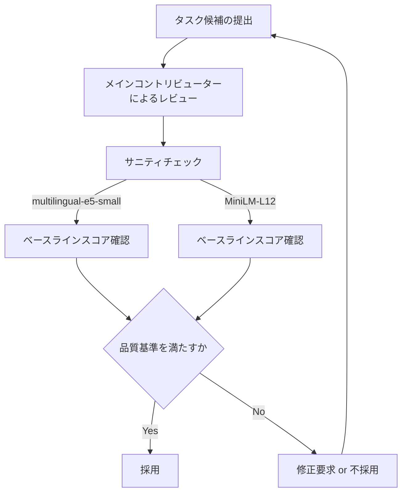
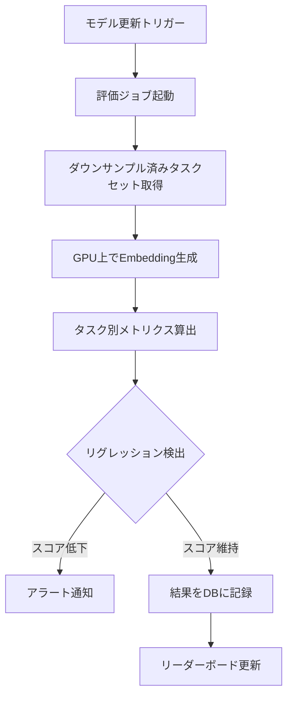

## 論文概要（Abstract）

本記事は [https://arxiv.org/abs/2502.13595](https://arxiv.org/abs/2502.13595) の解説記事です。

MMTEB（Massive Multilingual Text Embedding Benchmark）は、テキストEmbeddingモデルの多言語評価を目的としたベンチマークフレームワークである。著者ら（Kenneth Enevoldsen et al.、85名の共著者）は、既存のMTEB（Massive Text Embedding Benchmark）をコミュニティ駆動で拡張し、500以上の品質管理された評価タスクを250以上の言語でカバーする、現時点で最大規模の多言語テキストEmbedding評価コレクションを構築したと報告している。MMTEBでは、タスク間の相関に基づくダウンサンプリング手法によりランキング安定性を維持しつつ計算コストを大幅に削減し、効率的な評価パイプラインを実現している。本論文はICLRに採択されている。

この記事は [Zenn記事: Embeddingモデルの精度評価を3段階で実践する](https://zenn.dev/0h_n0/articles/53b0ab6e5b4af3) の深掘りです。

## 情報源

- **arXiv ID**: 2502.13595
- **URL**: [https://arxiv.org/abs/2502.13595](https://arxiv.org/abs/2502.13595)
- **著者**: Kenneth Enevoldsen et al.（85名の共著者によるコミュニティ駆動型プロジェクト）
- **発表**: ICLR採択
- **分野**: cs.CL, cs.AI, cs.IR

## 背景と動機（Background & Motivation）

### Embeddingモデル評価の課題

テキストEmbeddingモデルは、検索拡張生成（RAG）、意味検索、クラスタリング、分類など多岐にわたるタスクの基盤技術として普及している。しかし、モデル選定において「どのEmbeddingモデルが自分のタスクに最適か」を判断するための標準的な評価手法には、いくつかの構造的な課題が残されていた。

**課題1: 言語カバレッジの偏り**。2024年時点で広く使われていたMTEB v1は、英語中心のベンチマークであった。多言語Embeddingモデルの需要が拡大する中、中・低リソース言語（アラビア語、スワヒリ語、タガログ語など）の評価タスクは極めて限定的であり、モデルの多言語能力を正確に測定することが困難であった。

**課題2: タスクタイプの不足**。従来のMTEBは、検索・分類・クラスタリング・ペア分類・意味的類似度・要約・リランキングの7タスクタイプをカバーしていたが、実運用で重要な「instruction following」（指示に基づくEmbedding生成）、「long-document retrieval」（長文書の検索）、「code retrieval」（コード検索）などのタスクタイプは含まれていなかった。

**課題3: 評価コストのスケーリング**。タスク数と言語数を単純に増やすと評価の計算コストが爆発的に増加する。500タスクをナイーブに評価すれば、大規模モデル1つあたり数百GPU時間が必要となり、研究者個人やスタートアップにとっては現実的ではない。

著者らは、これらの課題を同時に解決するために、コミュニティ駆動のオープンコラボレーションによる大規模ベンチマーク構築と、タスク間相関を利用した効率的なダウンサンプリング手法を組み合わせるアプローチを採用している。

### MTEB v1からの進化

MTEB（Massive Text Embedding Benchmark）は2023年に発表され、Embeddingモデルの標準的な評価フレームワークとして広く利用されてきた。HuggingFace上のMTEB Leaderboardは月間数万のアクセスを集め、モデル選定の実質的な指標となっている。

しかし、MTEB v1には以下の制約があった。

- 英語のみ（または限定的な多言語対応）
- MS MARCOやNatural Questionsなど、ファインチューニングの学習データとしても使われるデータセットが評価に含まれており、過学習モデルが不当に高いスコアを獲得する問題
- タスク数の上限により、特定のドメイン（法律、医療、コードなど）の評価が不十分

MMTEBはこれらの制約を克服するために設計されている。

## 主要な貢献（Key Contributions）

著者らの貢献は以下の5点に集約される。

- **貢献1: 大規模多言語評価コレクション** -- 500以上のタスク、250以上の言語をカバーする品質管理されたEmbedding評価コレクションの構築。オープンコラボレーション（ポイントベースの著者帰属システム）により85名の研究者が参加
- **貢献2: 新タスクタイプの追加** -- instruction following、long-document retrieval、code retrievalなど、実運用で重要だが従来のMTEBで欠けていたタスクタイプの導入
- **貢献3: タスク間相関ベースのダウンサンプリング** -- 線形回帰による後方選択（backward selection）を用いて、モデルランキングの安定性を維持しつつタスク数を大幅に削減する手法の提案
- **貢献4: Hard-negative samplingによるデータ効率化** -- 検索タスクにおいて、BM25 + 複数のニューラルモデルによるTREC poolingでコーパスサイズを最大95%以上削減しつつ評価精度を維持
- **貢献5: ゼロショット英語ベンチマーク（MTEB eng v2）** -- MS MARCOとNatural Questionsを除外し、ファインチューニングによる過学習報酬を回避した新しい英語ベンチマークの設計

## 技術的詳細（Technical Details）

### ベンチマークの全体設計

MMTEBは4つのサブベンチマークで構成されている。

| ベンチマーク | タスク数 | 言語数 | 対象 |
|---|---|---|---|
| MTEB(Multilingual) | 131 | 250+ | 全言語横断評価 |
| MTEB(eng, v2) | 41 | 1 (英語) | 英語特化（v1からの改善版） |
| MTEB(Europe) | 74 | 欧州言語 | 欧州言語特化 |
| MTEB(Indic) | 23 | インド系言語 | インド系言語特化 |

MTEB(Multilingual)は、初期の550タスク候補から品質管理プロセスを経て343タスクに絞り込み、さらにタスク間相関ベースのダウンサンプリングにより131タスクに絞り込まれている。

### 品質管理パイプライン

著者らは、各タスクの品質を担保するために多段階のレビュープロセスを導入している。



サニティチェックでは、multilingual-e5-smallとMiniLM-L12の2モデルを用いて各タスクの妥当性を検証している。これらのモデルで極端に低いスコアや高すぎるスコアが出るタスクは、データの不備やタスク設計の問題がある可能性があるため、精査の対象としている。

### タスク間相関に基づくダウンサンプリング

MMTEBの設計における技術的な核心は、500以上のタスクを効率的に評価するためのダウンサンプリング手法である。著者らは、モデルのランキング順位がタスク間で強く相関することを利用し、少数のタスクでフルセットと同等のランキングを再現する手法を提案している。

#### 後方選択（Backward Selection）アルゴリズム

著者らは、線形回帰ベースの後方選択を採用している。手順は以下のとおりである。

1. 全タスクの評価スコア行列 $\mathbf{S} \in \mathbb{R}^{M \times T}$ を構築する（$M$: モデル数、$T$: タスク数）
2. 全タスクの平均スコア $\bar{s}_m = \frac{1}{T}\sum_{t=1}^{T} s_{m,t}$ をターゲット変数とする
3. 各タスクを1つずつ除去し、残りのタスクの線形結合でターゲット変数を予測する回帰モデルを構築する
4. 除去後のSpearman順位相関が閾値以上であれば、そのタスクを冗長と判断して除外する
5. 手順3-4を繰り返し、これ以上除去できなくなるまで続ける

Spearman相関の閾値は、MTEB(Multilingual)で $\rho \geq 0.8$、MTEB(eng, v2)で $\rho \geq 0.9$ に設定されている。英語ベンチマークでより厳しい閾値を設定しているのは、利用者数が多くランキングの安定性がより重要であるためと著者らは述べている。

この手法により、MTEB(Multilingual)では550タスクから131タスクへ約76%の削減を実現しつつ、フルセットとのSpearman相関0.8以上を維持している。

#### タスクタイプごとのダウンサンプリング

各タスクタイプ内でもデータレベルのダウンサンプリングが適用されている。

**クラスタリングタスク**: 全データの4%をサブサンプルしてエンコードすることで、最大100倍の高速化を実現している。著者らはこのサブサンプリングによるランキングへの影響を検証し、フルデータとのSpearman相関が0.96であると報告している。

**検索タスク（TREC pooling）**: コーパスサイズの削減が計算コストに直結する検索タスクでは、TREC poolingと呼ばれる手法を採用している。BM25、multilingual-e5-large、e5-Mistral-Instruct 7Bの3つの検索モデルの上位250文書をプールし、評価対象のコーパスを500万件から最大25万件に削減している。

$$\text{Pool}(q) = \bigcup_{r \in \{r_{\text{BM25}}, r_{\text{e5-large}}, r_{\text{e5-Mistral}}\}} \text{Top}_{250}(r(q))$$

ここで、$q$ はクエリ、$r$ は各検索モデルのランキング関数、$\text{Top}_{250}(r(q))$ はクエリ $q$ に対する各モデルの上位250文書を示す。

**Bitext mining**: キャッシュを活用して、410,000ペアから1,012ペアに削減している。

### MTEB(eng, v2)の設計変更

MTEB(eng, v2)はv1からの主要な変更として、MS MARCOとNatural Questionsの除外を行っている。これらのデータセットは多くのEmbeddingモデルのファインチューニングデータとして使用されており、評価データとしての公平性に疑問が呈されていた。著者らは、これらを除外した場合のv1との相関を検証し、Spearman相関0.90、Pearson相関0.96を報告している。この高い相関は、除外によるランキングの大幅な変動はないものの、過学習モデルの不当な優位性が排除されることを示唆している。

### ゼロショット英語ベンチマーク

著者らは、MTEB(eng, v2)の41タスク全体を評価しなくても、少数のタスクでフルバージョンと同等のランキングを得られる「ゼロショットベンチマーク」を提案している。これは、新しいモデルを迅速にスクリーニングするためのツールとして設計されている。

計算コストの比較として、MTEB(eng, v2)のフル評価はGritLM-7BでH100上3.11時間、MiniLM-L12で0.81時間を要するが、ゼロショットベンチマークではこれを大幅に短縮できると報告されている。

## 実験結果（Experimental Results）

### 主要ベンチマーク結果

著者らは、複数のEmbeddingモデルを各サブベンチマークで評価している。以下は論文Table 2に基づく主要結果である。

| ベンチマーク | 1位モデル | 平均スコア |
|---|---|---|
| MTEB(Multilingual) | multilingual-e5-large-instruct | 63.2 |
| MTEB(Europe) | GritLM-7B | 63.0 |
| MTEB(Indic) | multilingual-e5-large-instruct | 70.2 |

（論文Table 2より）

### モデルサイズと多言語性能の関係

実験結果から得られた重要な知見として、著者らは以下を報告している。

**知見1: 小型モデルの多言語優位性**。560Mパラメータのmultilingual-e5-large-instructが、7Bパラメータ規模のMistralベースモデルを中・低リソース言語で上回っている。著者らはこの原因として、multilingual-e5-large-instructのベースモデルであるXLM-Rが100言語以上のデータで事前学習されており、中・低リソース言語に対する頑健な表現を獲得していることを挙げている。

これは、パラメータ数の大きさが必ずしも多言語性能の向上につながるわけではなく、事前学習データの言語カバレッジが決定的に重要であることを示す結果である。

**知見2: Mistralベースモデルの英語・検索タスクでの強さ**。GritLM-7Bに代表されるMistralベースモデルは、英語タスクおよび検索タスクにおいて依然として高い性能を示している。これはMistralの事前学習が英語テキストに重点を置いていることと整合する。

**知見3: Instruction tuningの効果はタスクタイプに依存**。著者らは、instruction tuning（指示に基づくEmbedding生成の学習）の効果がタスクタイプによって大きく異なることを報告している。特にbitext miningとclusteringでinstruction tuningの利得が最大であり、これらのタスクでは指示によるタスク意図の明示化がEmbedding品質の向上に直結していると考えられる。

### データ効率の検証

ダウンサンプリングの効果について、著者らは以下の数値を報告している。

| ダウンサンプリング手法 | 元データ量 | 削減後 | 削減率 | ランキング相関 |
|---|---|---|---|---|
| クラスタリング（4%サブサンプル） | 100% | 4% | 96% | Spearman 0.96 |
| 検索（TREC pooling） | 5Mドキュメント | 最大250K | 95% | -- |
| Bitext mining（キャッシュ） | 410,000ペア | 1,012ペア | 99.8% | -- |
| タスク選択（後方選択） | 550タスク | 131タスク | 76% | Spearman 0.80以上 |

（論文のデータに基づく整理）

元のデータの約2%（文字数で6%）を使用しながら、フルセットと高い相関を維持しているという結果は、大規模ベンチマーク評価の計算コスト問題に対する実用的な解法を提示している。

## 実運用への応用

### Embeddingモデル選定への活用

MMTEBの結果は、RAGシステムやセマンティック検索のモデル選定に直接的な指針を与える。

**英語中心のシステム**: MTEB(eng, v2)のスコアを参照し、GritLM-7Bやe5-Mistral-Instruct 7Bなどの大規模モデルを検討する。検索タスクに特化する場合、7Bクラスのモデルが依然として有利である。

**多言語システム**: MTEB(Multilingual)のスコアを参照する。特に中・低リソース言語を含む場合、560Mパラメータのmultilingual-e5-large-instructが7Bクラスモデルよりも高い性能を示す可能性がある。推論コストも7Bモデルの約10分の1であり、コストパフォーマンスの観点からも有利である。

**タスク特化の選定**: MMTEBはタスクタイプごとのスコアも提供しているため、「検索のみ」「クラスタリングのみ」など特定タスクへの最適化が可能である。

### 自社データでの評価パイプライン構築

MMTEBの設計思想は、自社独自のEmbedding評価パイプラインを構築する際にも参考になる。以下はその概念的な手順である。

```python
"""MMTEBの設計に基づくEmbedding評価パイプラインの概念実装"""
from __future__ import annotations

from dataclasses import dataclass
from typing import Any

import numpy as np
from scipy.stats import spearmanr


@dataclass
class EmbeddingBenchmarkTask:
    """評価タスクの定義"""
    name: str
    task_type: str  # retrieval, classification, clustering, etc.
    language: str
    dataset: list[dict[str, Any]]
    metric: str  # ndcg@10, accuracy, v_measure, etc.


@dataclass
class BenchmarkSuite:
    """ベンチマークスイート（MMTEBの設計に基づく）"""
    tasks: list[EmbeddingBenchmarkTask]

    def evaluate_model(
        self, model_name: str, encode_fn: Any
    ) -> dict[str, float]:
        """モデルを全タスクで評価し、タスクごとのスコアを返す

        Args:
            model_name: モデル識別子
            encode_fn: テキストをEmbeddingに変換する関数

        Returns:
            タスク名をキー、スコアを値とする辞書
        """
        scores: dict[str, float] = {}
        for task in self.tasks:
            score = self._evaluate_single_task(task, encode_fn)
            scores[task.name] = score
        return scores

    def _evaluate_single_task(
        self, task: EmbeddingBenchmarkTask, encode_fn: Any
    ) -> float:
        """単一タスクの評価（実装は省略）"""
        raise NotImplementedError

    def downsample_tasks(
        self,
        score_matrix: np.ndarray,
        threshold: float = 0.8,
    ) -> list[int]:
        """タスク間相関に基づく後方選択でタスクを削減

        MMTEBのダウンサンプリング手法（論文Section 3.3）に基づく。
        線形回帰による後方選択を行い、Spearman相関が閾値以上を
        維持する最小タスクセットを返す。

        Args:
            score_matrix: モデル x タスクのスコア行列 (M x T)
            threshold: Spearman順位相関の閾値

        Returns:
            選択されたタスクのインデックスリスト
        """
        n_models, n_tasks = score_matrix.shape
        target = score_matrix.mean(axis=1)  # 全タスク平均
        selected = list(range(n_tasks))

        while len(selected) > 1:
            best_to_remove = -1
            best_correlation = -1.0

            for i, task_idx in enumerate(selected):
                candidate = [t for j, t in enumerate(selected) if j != i]
                subset_mean = score_matrix[:, candidate].mean(axis=1)
                corr, _ = spearmanr(target, subset_mean)

                if corr > best_correlation:
                    best_correlation = corr
                    best_to_remove = i

            if best_correlation >= threshold:
                selected.pop(best_to_remove)
            else:
                break

        return selected
```

この概念実装は、論文のダウンサンプリング手法の核となるアイデアを示している。実際のMMTEBではsklearnのLinearRegressionを用いた回帰ベースの選択を行っているが、上記のコードではSpearman相関のみを用いた簡略版を示している。

### ベンチマーク結果の解釈における注意点

MMTEBの結果を解釈する際には、以下の点に留意する必要がある。

**ベンチマークのドメイン偏り**: MMTEBは汎用的なベンチマークであり、特定のドメイン（法律文書、医療テキスト、ソースコードなど）の性能を正確に反映しない可能性がある。自社のドメインに特化した評価データセットを追加で用意することが推奨される。

**評価データの漏洩リスク**: MMTEBがMS MARCOとNatural Questionsを除外した理由と同様に、モデルのファインチューニングデータに評価データが含まれていないかを確認する必要がある。特にオープンソースモデルでは、学習データの詳細が公開されていない場合がある。

**スコアの絶対値よりもランキング**: 異なるタスクタイプ間でスコアの絶対値を比較することには意味がない。検索タスクのnDCG@10とクラスタリングのV-measureは異なる尺度であり、タスクタイプ内でのモデル間比較に限定すべきである。

## Production Deployment Guide

本セクションでは、MMTEBの設計に基づくEmbedding評価パイプラインを本番環境で運用する際の構成を解説する。MMTEBは評価フレームワークの論文であり、デプロイ対象のモデルそのものではないが、モデル選定パイプラインやCIに組み込む評価基盤としての実装パターンを扱う。

### 評価パイプラインのアーキテクチャ

Embeddingモデルの評価を自動化し、モデル更新時のリグレッション検出を行うパイプラインの構成を示す。



### AWS実装パターン

MMTEBの評価パイプラインを定期的に実行するための推奨構成を以下に示す。

| 構成 | 評価頻度 | アーキテクチャ | 月額概算 |
|---|---|---|---|
| Small | 月1回・数モデル | SageMaker Processing Job (Spot) | $50-200 |
| Medium | 週1回・10モデル | Step Functions + SageMaker Batch Transform | $500-1,500 |
| Large | 日次・リーダーボード運用 | EKS + Karpenter (GPU Spot) + S3 + RDS | $3,000-8,000 |

**Small構成（月1回・数モデル）の内訳:**
- SageMaker Processing Job (ml.g5.xlarge Spot): $30-100/月（使用時間に依存）
- S3（評価データセット + 結果保存）: $5-10/月
- Lambda（トリガー + 結果通知）: $1-5/月
- DynamoDB（評価結果の履歴管理）: $5-10/月
- CloudWatch + SNS（アラート）: $5-10/月

**Medium構成（週1回・10モデル）の内訳:**
- Step Functions（オーケストレーション）: $5-10/月
- SageMaker Batch Transform (ml.g5.2xlarge Spot): $200-600/月
- S3: $10-30/月
- ElastiCache（Embedding結果キャッシュ、bitext miningの効率化）: $60-120/月
- RDS PostgreSQL（メトリクス履歴、モデル比較）: $50-100/月
- CloudWatch: $10-20/月

### CI/CD統合パターン

Embeddingモデルの更新をCI/CDパイプラインに組み込み、リグレッションを自動検出するパターンを示す。

```python
"""CI/CDパイプラインでのEmbeddingモデル評価ゲートの概念実装"""
from __future__ import annotations

from dataclasses import dataclass


@dataclass
class EvalGateConfig:
    """評価ゲートの設定

    MMTEBの後方選択で絞り込んだタスクサブセットを
    CI/CDゲートとして使用する。
    """
    task_subset: list[str]  # ダウンサンプル済みタスク名リスト
    baseline_scores: dict[str, float]  # 既存モデルのスコア
    regression_threshold: float = 0.02  # 許容するスコア低下幅
    spearman_threshold: float = 0.9  # ランキング安定性の閾値


@dataclass
class EvalResult:
    """評価結果"""
    model_name: str
    task_scores: dict[str, float]
    mean_score: float
    passed: bool
    regression_details: list[str]


def run_eval_gate(
    config: EvalGateConfig,
    candidate_scores: dict[str, float],
    model_name: str,
) -> EvalResult:
    """モデル評価ゲートの実行

    Args:
        config: 評価ゲート設定
        candidate_scores: 候補モデルのタスク別スコア
        model_name: 候補モデル名

    Returns:
        評価結果（合否判定を含む）
    """
    regressions: list[str] = []
    for task in config.task_subset:
        baseline = config.baseline_scores.get(task, 0.0)
        candidate = candidate_scores.get(task, 0.0)
        diff = baseline - candidate

        if diff > config.regression_threshold:
            regressions.append(
                f"{task}: {candidate:.4f} (baseline: {baseline:.4f}, "
                f"diff: -{diff:.4f})"
            )

    mean_score = sum(
        candidate_scores.get(t, 0.0) for t in config.task_subset
    ) / len(config.task_subset)

    return EvalResult(
        model_name=model_name,
        task_scores={
            t: candidate_scores.get(t, 0.0) for t in config.task_subset
        },
        mean_score=mean_score,
        passed=len(regressions) == 0,
        regression_details=regressions,
    )
```

### TREC Poolingの本番実装パターン

検索タスクの評価で用いるTREC poolingは、本番環境のコーパスが大規模な場合に特に有用である。以下にその実装パターンを示す。

```python
"""TREC Poolingによる評価コーパスの効率的な構築（論文の手法に基づく概念実装）"""
from __future__ import annotations

from dataclasses import dataclass, field


@dataclass
class TRECPoolConfig:
    """TREC Poolingの設定

    論文では BM25 + multilingual-e5-large + e5-Mistral-Instruct 7B の
    3モデルを使用し、各モデルの上位250文書をプールしている。
    """
    pool_depth: int = 250  # 各モデルから取得する上位文書数
    retrieval_models: list[str] = field(default_factory=lambda: [
        "bm25",
        "multilingual-e5-large",
        "e5-mistral-instruct-7b",
    ])


@dataclass
class PooledCorpus:
    """プール済みコーパス"""
    original_size: int
    pooled_size: int
    reduction_rate: float
    document_ids: set[str]


def build_trec_pool(
    queries: list[str],
    config: TRECPoolConfig,
    retrieval_fn: dict[str, object],
) -> PooledCorpus:
    """TREC Poolingでコーパスをダウンサンプリング

    各検索モデルのTop-K文書をユニオンし、評価対象のコーパスを構築する。
    論文では5Mドキュメントから最大250Kに削減している。

    Args:
        queries: 評価クエリのリスト
        config: プール設定
        retrieval_fn: モデル名をキー、検索関数を値とする辞書

    Returns:
        プール済みコーパス情報
    """
    pooled_doc_ids: set[str] = set()

    for query in queries:
        for model_name in config.retrieval_models:
            retriever = retrieval_fn.get(model_name)
            if retriever is None:
                continue
            # 各モデルの上位pool_depth件を取得
            # 実際の実装ではretriever.search(query, top_k=config.pool_depth)
            # を呼び出す
            raise NotImplementedError(
                f"Retriever {model_name} の検索処理を実装してください"
            )

    raise NotImplementedError("プール済みコーパスの構築を実装してください")
```

### 運用上の注意点

**GPU Spotインスタンスの活用**: Embeddingの生成は推論タスクであり、チェックポイント不要のため中断耐性が高い。SageMaker Processing JobやEKS上のSpotインスタンスを活用することで、コストを50-70%削減できる。

**評価結果のキャッシュ**: MMTEBが採用しているbitext miningのキャッシュ戦略と同様に、同一モデル・同一タスクの評価結果はキャッシュして再利用する。モデルバージョンとタスクバージョンをキーとするキャッシュ設計が推奨される。

**ダウンサンプルタスクセットの定期更新**: 後方選択で決定したタスクサブセットは、新しいモデルが追加されるとランキング安定性が変化する可能性がある。四半期ごとにダウンサンプリングを再実行し、タスクサブセットの妥当性を検証することが望ましい。

## 関連研究

### MTEB v1

Muennighoff et al. (2023)によるMTEBは、英語テキストEmbeddingの評価ベンチマークとして広く利用されてきた。8つのタスクタイプ、58のデータセットを含む包括的なベンチマークであり、HuggingFace上のリーダーボードを通じてモデル間比較を容易にした。MMTEBはこのMTEB v1を多言語方向に拡張し、タスク品質管理やダウンサンプリング手法を新たに導入している。

### BEIR

Thakur et al. (2021)によるBEIR（Benchmarking IR）は、ゼロショット情報検索の評価ベンチマークである。18のデータセットを用いた検索モデルの汎化能力の評価に焦点を当てている。MMTEBの検索タスクの一部はBEIRのタスクを含んでいるが、TREC poolingによるコーパスダウンサンプリングにより効率化されている。

### XTREME / XGLUE

Hu et al. (2020)のXTREMEやLiang et al. (2020)のXGLUEは、多言語NLU（自然言語理解）の評価ベンチマークであるが、Embeddingモデルに特化したものではない。MMTEBはEmbeddingモデルの多言語評価に特化し、検索・クラスタリング・bitext miningなどEmbedding固有のタスクタイプを豊富に含んでいる点で差別化されている。

### GritLM

Muennighoff et al. (2024)によるGritLMは、生成と検索を統合したモデルであり、MTEB(Europe)で1位のスコアを記録している。Mistral-7Bをベースに、Embeddingタスクと生成タスクの両方で高い性能を実現しているが、中・低リソース言語では560MパラメータのXLM-Rベースモデルに劣後するという結果がMMTEBで示されている。

## 制約と限界

著者らは以下の制約を認識している。

- **言語カバレッジの不均衡**: 250以上の言語をカバーしているが、高リソース言語（英語、中国語、ドイツ語など）と低リソース言語のタスク数には依然として大きな差がある
- **タスク品質のばらつき**: コミュニティ駆動のため、タスクの品質はコントリビューターの専門性に依存する。サニティチェックで最低限の品質は担保されているが、高リソース言語と低リソース言語でタスクの難易度設計が異なる可能性がある
- **ダウンサンプリングの前提**: タスク間相関に基づくダウンサンプリングは、既存モデルの評価結果に基づいている。将来的に全く異なるアーキテクチャのモデルが登場した場合、ダウンサンプリング結果が適切でなくなる可能性がある
- **動的な評価の欠如**: MMTEBは静的なベンチマークであり、時間経過とともにデータの陳腐化（data staleness）が発生する

## まとめと今後の展望

MMTEBは、テキストEmbeddingモデルの多言語評価における標準的なフレームワークとしての地位を確立することを目指した大規模プロジェクトである。85名の研究者によるコミュニティ駆動の取り組みにより、500以上のタスク、250以上の言語をカバーする評価コレクションが構築された。

技術面では、タスク間相関に基づく後方選択によるダウンサンプリングが、計算コストの削減とランキング安定性の維持を両立させる効果的な手法であることが示された。クラスタリングの4%サブサンプル（Spearman 0.96）、TREC poolingによるコーパス95%削減など、各タスクタイプに適したダウンサンプリング戦略の組み合わせにより、元データの約2%の使用で実用的な評価が可能となっている。

実務的な観点では、560Mパラメータのmultilingual-e5-large-instructが7Bクラスモデルを多言語タスクで上回るという結果は、RAGシステムのモデル選定における重要な示唆である。パラメータ数の大きさよりも事前学習の言語カバレッジが多言語性能を決定するという知見は、コスト効率の高いシステム設計に直結する。

今後の展望として、動的な評価データの更新、ドメイン特化ベンチマークの追加、instruction tuningの効果の詳細な分析などが考えられる。また、MMTEBの設計思想であるタスク間相関ベースのダウンサンプリングは、Embeddingに限らずLLMの汎用評価フレームワーク（HELM、lm-evaluation-harnessなど）にも適用可能な手法であり、今後の評価手法研究への波及効果が期待される。

## 参考文献

1. Enevoldsen, K., et al. (2025). MMTEB: Massive Multilingual Text Embedding Benchmark. arXiv:2502.13595. ICLR採択.
2. Muennighoff, N., et al. (2023). MTEB: Massive Text Embedding Benchmark. EACL 2023.
3. Thakur, N., et al. (2021). BEIR: A Heterogeneous Benchmark for Zero-shot Evaluation of Information Retrieval Models. NeurIPS 2021.
4. Hu, J., et al. (2020). XTREME: A Massively Multilingual Multi-task Benchmark for Evaluating Cross-lingual Generalization. ICML 2020.
5. Muennighoff, N., et al. (2024). GritLM: Generative Representational Instruction Tuning. arXiv:2402.09906.
6. Wang, L., et al. (2024). Multilingual E5 Text Embeddings: A Technical Report. arXiv:2402.05672.
