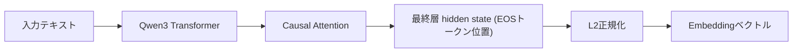
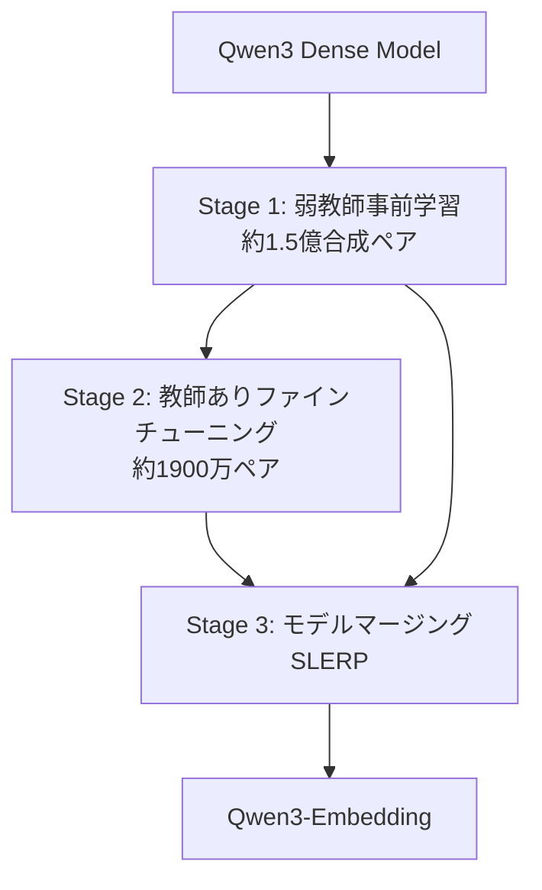
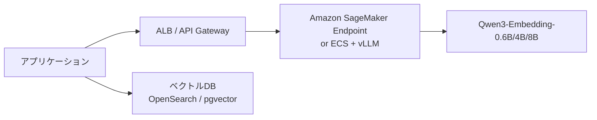

本記事は [arXiv:2506.05176](https://arxiv.org/abs/2506.05176) の解説記事です。本記事は解説であり、筆者自身による追実験は行っていません。

この記事は [Zenn記事: Embeddingモデルの精度評価を3段階で実践する](https://zenn.dev/0h_n0/articles/53b0ab6e5b4af3) の深掘りです。Zenn記事ではEmbeddingモデルの評価パイプラインを扱いましたが、本記事では評価対象となりうるOSSモデルの代表例として、Qwen3-Embeddingの内部構造と訓練手法を詳細に解説します。

## 情報源

- **arXiv ID**: 2506.05176
- **URL**: [arXiv:2506.05176](https://arxiv.org/abs/2506.05176)
- **タイトル**: Qwen3 Embedding: Advancing Text Embedding and Reranking Through Foundation Models
- **著者**: Alibaba Tongyi Lab
- **発表日**: 2025年6月
- **分野**: Computation and Language (cs.CL)
- **ライセンス**: Apache 2.0

## 背景と動機

### Embeddingモデルの現状と課題

テキストEmbeddingモデルは、RAG（Retrieval-Augmented Generation）の検索精度を左右する中核コンポーネントです。しかし、実運用では以下の課題が存在します。

1. **APIモデルへの依存**: OpenAI text-embedding-3やGemini Embeddingは高性能だが、データがクラウドに送信される。機密データを扱う企業やレイテンシ制約のあるユースケースではセルフホスティングが求められる
2. **多言語対応の不足**: 英語特化モデルが多く、日本語や中国語での性能が低下しがちである
3. **モデルサイズと性能のトレードオフ**: 大規模モデルは高精度だが推論コストが高い。ユースケースに応じた柔軟なサイズ選択が必要

Qwen3-Embeddingは、これらの課題に対して「Apache 2.0ライセンスのOSSモデルで、0.6B/4B/8Bの3サイズを提供し、100以上の言語に対応する」というアプローチで解決を図ったモデルシリーズです。

### GTE-Qwenシリーズからの進化

Qwen3-Embeddingは、Alibaba Tongyi Labが開発してきたGTE（General Text Embedding）-Qwenシリーズの後継として位置づけられています。前世代のGTE-Qwen2と比較して、著者らは以下の改善を報告しています。

- ベースモデルをQwen3 denseモデルに更新
- 訓練データの規模を大幅に拡大（約1.5億合成ペア + 約1900万ラベル付きペア）
- SLERP（Spherical Linear Interpolation）によるモデルマージング手法の導入
- Rerankingモデルとの統合提供

## 主要な貢献

著者らは以下の3点を主要な貢献として挙げています。

1. **3サイズのEmbedding・Rerankingモデル**: 0.6B、4B、8Bの3スケールでEmbeddingモデルとRerankingモデルを同時提供。用途に応じてコストと精度のバランスを選択可能
2. **大規模合成データによる弱教師事前学習**: Qwen3-32Bを教師モデルとして約1.5億の合成ペアを生成し、Stage 1の弱教師事前学習に活用
3. **SLERPモデルマージング**: Stage 1とStage 2の訓練済みチェックポイントをSLERPで統合し、汎化性能と精度の両立を実現
4. **Apache 2.0ライセンスでのOSS公開**: 商用利用を含むセルフホスティングが可能

## 技術的詳細

### モデルアーキテクチャ

Qwen3-Embeddingは、Qwen3のdense Transformerモデルをベースとしています。各サイズの仕様は以下の通りです。

| パラメータ | 0.6B | 4B | 8B |
|---|---|---|---|
| レイヤー数 | 28 | 36 | 36 |
| Embedding次元 | 1024 | 2560 | 4096 |
| 最大コンテキスト長 | 32,768トークン | 32,768トークン | 32,768トークン |

#### プーリング戦略

一般的なEmbeddingモデルではmean pooling（全トークンの平均）が広く使われますが、Qwen3-Embeddingは**Causal Attention + EOSトークンのhidden state**をEmbeddingベクトルとして採用しています。



Causal attentionでは、EOSトークンの位置から全ての先行トークンにアテンションが行われるため、EOSのhidden stateが入力全体の情報を集約したベクトルとなります。このアプローチにより、デコーダ型のQwen3アーキテクチャを変更なくEmbeddingモデルに転用できています。

#### Rerankingスコアの計算

Rerankingモデルは、クエリと文書のペアを入力として受け取り、関連度スコアを出力します。Qwen3-Embeddingでは**Pointwise方式**を採用し、"yes"と"no"の2トークンのソフトマックス確率でスコアを算出します。

$$
\text{score}(q, d) = \frac{\exp(z_{\text{yes}})}{\exp(z_{\text{yes}}) + \exp(z_{\text{no}})}
$$

ここで、$$z_{\text{yes}}$$ と $$z_{\text{no}}$$ はそれぞれ"yes"トークンと"no"トークンのロジットです。この方式は、ペアワイズやリストワイズの手法と比較して実装が単純であり、バッチ処理との相性も優れています。

### 損失関数：InfoNCEベースのContrastive Loss

Embeddingモデルの訓練には、InfoNCEロスのバリエーションが使用されています。

$$
\mathcal{L} = -\log \frac{\exp(\text{sim}(q, d^+) / \tau)}{\exp(\text{sim}(q, d^+) / \tau) + \sum_{j=1}^{N} \exp(\text{sim}(q, d_j^-) / \tau)}
$$

- $$q$$: クエリのEmbeddingベクトル
- $$d^+$$: 正例（positive）文書のEmbeddingベクトル
- $$d_j^-$$: 負例（negative）文書のEmbeddingベクトル（$$N$$個）
- $$\text{sim}(\cdot, \cdot)$$: コサイン類似度
- $$\tau$$: 温度パラメータ（学習可能）

#### Hard NegativeとIn-batch Negative

訓練の効率と品質を高めるため、以下の2種類のnegativeを組み合わせています。

- **Hard negative**: BM25やモデル自身の推論で、正例に近いがわずかに異なる文書を選択。容易なnegativeだけでは学習が進まない問題を回避する
- **In-batch negative**: ミニバッチ内の他のクエリの正例を自身のnegativeとして流用。追加の負例採掘コストなしでnegative数を増やせる

#### 偽陰性マスク（False Negative Masking）

In-batch negativeには「本来正例であるべきペアがnegativeとして扱われる」偽陰性の問題があります。著者らはこの問題への対策として、正例ペアのコサイン類似度よりも0.1以上高いスコアを持つin-batchペアをドロップする偽陰性マスクを導入しています。

### 3段階の訓練パイプライン

Qwen3-Embeddingの訓練は3段階で構成されています。



#### Stage 1：弱教師事前学習（Weakly-Supervised Pretraining）

Stage 1では、Qwen3-32Bを教師モデルとして約1.5億の合成テキストペアを生成し、訓練データとして使用しています。

**データの多様性確保**として、以下の4つのタスクタイプをカバーしています。

1. **Retrieval**: クエリと関連文書のペア
2. **Bitext mining**: 異言語間の対訳ペア
3. **STS（Semantic Textual Similarity）**: 意味的類似度つきの文ペア
4. **Classification**: テキストとラベルのペア

合成データ生成の工夫として、著者らはPersona Hubからクエリの役割（ペルソナ）を抽出し、多様な視点からのクエリ生成を行っています。これにより、特定のドメインに偏らない訓練データの構築を実現しています。

#### Stage 2：教師ありファインチューニング

Stage 2では、以下のデータソースから約1900万ペア（約700万のラベル付きデータ + 約1200万の高品質合成ペア）を使用しています。

- **MS MARCO**: Web検索クエリと関連文書
- **Natural Questions（NQ）**: Wikipedia検索の質問応答
- **HotpotQA**: マルチホップ推論を要する質問応答
- **DuReader**: 中国語の読解データ
- **MIRACL**: 多言語情報検索

高品質合成データについては、コサイン類似度が0.7を超えるペアのみを保持するフィルタリングが適用されています。

#### Stage 3：SLERPモデルマージング

最後のStageでは、Stage 1とStage 2で得られたチェックポイントを**SLERP（Spherical Linear Interpolation）**で統合します。

$$
\text{SLERP}(\theta_1, \theta_2, t) = \frac{\sin((1-t)\Omega)}{\sin(\Omega)} \theta_1 + \frac{\sin(t\Omega)}{\sin(\Omega)} \theta_2
$$

- $$\theta_1$$: Stage 1のモデルパラメータ
- $$\theta_2$$: Stage 2のモデルパラメータ
- $$t \in [0, 1]$$: 補間係数
- $$\Omega = \arccos\left(\frac{\theta_1 \cdot \theta_2}{\|\theta_1\| \|\theta_2\|}\right)$$: パラメータベクトル間の角度

通常の線形補間（LERP）ではパラメータベクトルのノルムが縮小する問題がありますが、SLERPはパラメータ空間の超球面上で補間を行うため、ノルムを保存しながら滑らかな統合が可能です。

この手法の狙いは、Stage 1の汎化性能（大量の合成データで学んだ幅広い知識）と、Stage 2のタスク特化性能（高品質ラベルデータで学んだ精度）の両立です。

## 実装のポイント

### Apache 2.0ライセンスとセルフホスティング

Qwen3-Embeddingの最大の実用的利点の一つが、Apache 2.0ライセンスでの公開です。これにより以下が可能になります。

- **商用利用**: ライセンス料なしで製品に組み込み可能
- **データプライバシー**: テキストデータを外部APIに送信する必要がない
- **カスタマイズ**: 自社ドメインのデータでファインチューニング可能
- **コスト予測**: APIの従量課金ではなく、インフラコストのみ

### Matryoshka Representation Learning対応

Qwen3-Embeddingは**Matryoshka表現学習**に対応しています。これは、フル次元のEmbeddingベクトルの先頭n次元を切り出しても、ある程度の精度を保つ性質です。

```python
import numpy as np


def truncate_embedding(embedding: np.ndarray, target_dim: int) -> np.ndarray:
    """Matryoshka方式でEmbedding次元を削減する。

    Args:
        embedding: 元のEmbeddingベクトル (shape: [full_dim])
        target_dim: 切り出し後の次元数

    Returns:
        L2正規化された低次元Embeddingベクトル (shape: [target_dim])

    Raises:
        ValueError: target_dimが元の次元数を超える場合
    """
    if target_dim > embedding.shape[0]:
        raise ValueError(
            f"target_dim ({target_dim}) exceeds embedding dim ({embedding.shape[0]})"
        )
    truncated = embedding[:target_dim]
    norm = np.linalg.norm(truncated)
    if norm == 0:
        return truncated
    return truncated / norm
```

これにより、ストレージコストや検索速度の要件に応じて、推論後にEmbedding次元を柔軟に調整できます。例えば、8Bモデル（4096次元）の出力を1024次元に削減することで、インデックスサイズを約75%削減しながら、0.6Bモデルよりも高い精度を維持できる可能性があります。

### Instruction-Aware Embedding

Qwen3-Embeddingは**Instruction-Aware**なモデルであり、入力テキストの前にタスクの説明（instruction）を付与することで、同じテキストでもタスクに応じた異なるEmbeddingを生成できます。

```python
from transformers import AutoTokenizer, AutoModel
import torch
import torch.nn.functional as F


def encode_with_instruction(
    model: AutoModel,
    tokenizer: AutoTokenizer,
    texts: list[str],
    instruction: str = "",
    max_length: int = 8192,
) -> torch.Tensor:
    """Instruction付きでテキストをエンコードする。

    Args:
        model: Qwen3-Embeddingモデル
        tokenizer: 対応するトークナイザ
        texts: エンコード対象のテキストリスト
        instruction: タスク説明（例: "Retrieve relevant passages"）
        max_length: 最大トークン長

    Returns:
        L2正規化されたEmbeddingテンソル (shape: [len(texts), hidden_dim])
    """
    if instruction:
        texts = [f"{instruction}: {text}" for text in texts]

    encoded = tokenizer(
        texts,
        padding=True,
        truncation=True,
        max_length=max_length,
        return_tensors="pt",
    )

    with torch.no_grad():
        outputs = model(**encoded)

    # EOSトークン位置のhidden stateを取得
    # Causal attentionモデルでは最後のトークンがEOS
    embeddings = outputs.last_hidden_state[:, -1, :]
    embeddings = F.normalize(embeddings, p=2, dim=1)
    return embeddings
```

検索タスクでは`"Retrieve relevant documents for the query"`、分類タスクでは`"Classify the text into categories"`のように使い分けることで、単一モデルで複数タスクに対応できます。

## Production Deployment Guide

### OSSモデルのAWSデプロイ

Qwen3-Embeddingのようなオープンソースモデルを本番環境にデプロイする場合、以下のアーキテクチャが考えられます。



#### サイズ選定の指針

| ユースケース | 推奨サイズ | 理由 |
|---|---|---|
| プロトタイプ、低レイテンシ要件 | 0.6B | 軽量でCPU推論も現実的 |
| 一般的なRAG、多言語対応 | 4B | 精度とコストのバランスが良好 |
| 高精度検索、コード検索 | 8B | MMTEBで高スコア、GPU必須 |

#### デプロイ時の考慮事項

- **バッチ処理**: 大量文書のインデックス作成時はバッチサイズを調整し、GPUメモリ使用量を最適化する
- **量子化**: INT8/INT4量子化により、精度をほぼ維持しながらメモリ使用量と推論速度を改善できる。ただし、量子化による精度への影響はタスクごとに検証が必要
- **コンテキスト長**: 32Kトークンの長文対応は強力だが、大半のRAGユースケースでは512-2048トークンのチャンクが一般的。不要に長い入力はレイテンシとコストを増加させる

## 実験結果

### MMTEB（Massive Multitask Text Embedding Benchmark）

論文Table 2より、MMTEBにおける主要モデルの比較結果は以下の通りです。

| モデル | Mean(Task) | Mean(Type) |
|---|---|---|
| Qwen3-Embedding-0.6B | 64.33 | 56.00 |
| Qwen3-Embedding-4B | 69.45 | 60.86 |
| Qwen3-Embedding-8B | 70.58 | 61.69 |
| Gemini Embedding（参考） | 68.37 | 59.59 |

著者らは、Qwen3-Embedding-8BがMean(Task)で70.58を達成し、APIモデルであるGemini Embeddingを上回ったと報告しています。0.6Bモデルでも64.33を達成しており、パラメータ数に対して競争力のある性能を示しています。

### 個別ベンチマーク

論文Table 3より、各ベンチマークでの結果を以下に示します。

| ベンチマーク | 0.6B | 4B | 8B | Gemini Embedding |
|---|---|---|---|---|
| MTEB(eng, v2) | 70.70 | 74.60 | 75.22 | 73.30 |
| CMTEB(中国語) | 66.33 | 72.26 | 73.83 | - |
| MTEB(Code) | 75.41 | 80.06 | 80.68 | 74.66 |

特筆すべき点として、コード検索タスク（MTEB Code）では0.6Bモデル（75.41）の時点でGemini Embedding（74.66）を上回っており、コード理解におけるQwen3-Embeddingの強みが示されています（論文Table 3より）。

### Ablation Study

論文Table 5より、0.6Bモデルを用いたablation studyの結果は以下の通りです。

| 設定 | MMTEB Mean(Task) |
|---|---|
| 合成データのみ（Stage 1のみ） | 58.49 |
| 合成データなし（Stage 2のみ） | 61.21 |
| モデルマージングなし（Stage 2のみ） | 62.56 |
| フルモデル（Stage 1 + Stage 2 + SLERP） | 64.33 |

このablation結果から、以下の知見が読み取れます。

1. **合成データのみ（58.49）は最も低い**: 大規模合成データだけでは精度が不十分であり、高品質なラベル付きデータが不可欠
2. **合成データなし（61.21）でも一定の性能**: Stage 2の高品質データだけでも成立するが、Stage 1の事前学習が+3.12ポイントの改善に寄与
3. **SLERPマージングの効果**: Stage 2のみ（62.56）とフルモデル（64.33）の差+1.77ポイントがSLERPの貢献。Stage 1の汎化性能を取り込むことで精度が向上

## 実運用への応用

### Zenn記事との接続

Zenn記事「Embeddingモデルの精度評価を3段階で実践する」で紹介されている評価パイプラインに、Qwen3-Embeddingを組み込む際の考慮事項を整理します。

1. **ベンチマーク選定**（Zenn記事Stage 1）: Qwen3-EmbeddingはMMTEB、MTEB、CMTEBで評価されており、自社データのドメインに近いベンチマークでの公開スコアを参照できる
2. **データセット評価**（Zenn記事Stage 2）: 0.6B/4B/8Bの3サイズを同一評価パイプラインで比較し、コストと精度のパレート最適解を見つける
3. **本番検証**（Zenn記事Stage 3）: Apache 2.0ライセンスのため、A/Bテスト環境にそのままデプロイして既存モデルとの比較が可能

### 多言語RAGでの活用

Qwen3-Embeddingの100以上の言語対応は、多言語RAGシステムにおいて大きな利点となります。日本語と英語の技術文書が混在するナレッジベースでは、単一モデルで両言語のEmbeddingを生成できるため、言語ごとにモデルを切り替える必要がありません。

### サイズ選択の実務判断

- **レイテンシ制約が厳しい**（リアルタイム検索）: 0.6Bを選択し、必要に応じてMatryoshkaで次元削減
- **精度重視**（法務・医療ドメイン）: 8Bを選択し、ドメイン固有データでファインチューニング
- **コストバランス**（一般的なRAG）: 4Bが性能とコストの両面で適している可能性が高い

## 制約と限界

- **Ablation studyが0.6Bモデルのみ**: 4B/8Bモデルでの各コンポーネントの寄与度は報告されていない
- **日本語単独の評価が限定的**: CMTEBは中国語ベンチマークであり、日本語タスクに特化したベンチマーク（JMTEB等）での評価は論文中に含まれていない
- **推論コストの詳細が未記載**: 実際のスループット（tokens/sec）やGPUメモリ使用量の定量的なデータは論文中に含まれていない
- **Matryoshkaの精度劣化度合い**: 次元削減時の精度変化の定量的なデータが限定的

## 関連研究

- **E5シリーズ**（Microsoft）: Instruction-Aware Embeddingの先駆的研究。Qwen3-Embeddingも同様のアプローチを採用
- **BGE（BAAI General Embedding）**: 中国語を含む多言語対応のOSSモデル。Qwen3-Embeddingとの直接比較がMMTEBで報告されている
- **GTE-Qwen2**: Qwen3-Embeddingの前世代モデル。Qwen2ベースで訓練データ規模がより小さかった
- **Gemini Embedding**: APIベースの商用モデル。Qwen3-Embedding-8Bに一部タスクで上回られたと報告されている（論文Table 2, 3より）

## まとめ

Qwen3-Embeddingは、Apache 2.0ライセンスで公開されたOSSの多言語Embeddingモデルシリーズです。著者らは以下の技術的特徴を報告しています。

- **3段階訓練**: 大規模合成データによる弱教師事前学習、高品質ラベルデータによるファインチューニング、SLERPモデルマージングの組み合わせにより、各コンポーネントが精度に寄与（論文Table 5のablationで確認）
- **柔軟なサイズ展開**: 0.6B/4B/8Bの3サイズ提供により、プロトタイプから本番環境まで同一アーキテクチャファミリでカバー可能
- **高いベンチマークスコア**: MMTEB Mean(Task)で8Bモデルが70.58を達成し、APIモデルであるGemini Embedding（68.37）を上回った（論文Table 2より）
- **実用的なOSS提供**: Apache 2.0ライセンス、Matryoshka対応、100+言語サポートにより、セルフホスティング環境での実運用に適している

Embeddingモデルの評価と選定においては、Zenn記事で紹介されている3段階評価パイプラインにQwen3-Embeddingを組み込み、自社データでの実測値に基づいた判断を行うことが推奨されます。

## 参考文献

1. Qwen3 Embedding: Advancing Text Embedding and Reranking Through Foundation Models, arXiv:2506.05176, [https://arxiv.org/abs/2506.05176](https://arxiv.org/abs/2506.05176)
2. Zenn記事: Embeddingモデルの精度評価を3段階で実践する, [https://zenn.dev/0h_n0/articles/53b0ab6e5b4af3](https://zenn.dev/0h_n0/articles/53b0ab6e5b4af3)
3. MMTEB: Massive Multitask Text Embedding Benchmark, [https://huggingface.co/spaces/mteb/leaderboard](https://huggingface.co/spaces/mteb/leaderboard)
4. Matryoshka Representation Learning, arXiv:2205.13147, [https://arxiv.org/abs/2205.13147](https://arxiv.org/abs/2205.13147)
