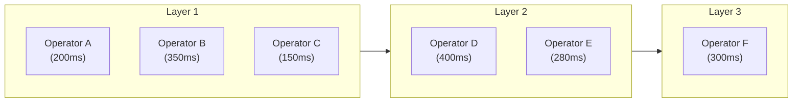

## 論文概要（Abstract）

本記事は [https://arxiv.org/abs/2601.10560](https://arxiv.org/abs/2601.10560) の解説記事です。

LLMベースのマルチエージェントシステム（MAS）は、複雑なタスクを複数の専門エージェントで分担処理することで高い精度を達成する一方、多段的なモデル呼び出しに起因する推論レイテンシが実運用上の大きな障壁となっている。著者らはこの問題に対し、LAMaS（Latency-Aware Multi-Agent System）フレームワークを提案している。LAMaSはクリティカルパス認識型のクレジット割り当てにより、タスク精度を維持しながらend-to-endレイテンシを38〜46%削減することに成功したと報告されている。具体的には、各レイヤのボトルネックオペレータにのみレイテンシペナルティを適用する報酬設計と、トークン出力長ベースのレイテンシプロキシ（CP_len）を導入し、実際のAPI呼び出しなしにレイテンシを推定可能にしている。

この記事は [Zenn記事: Python asyncioで実装するエージェント非同期並列実行の7パターンとレート制限設計](https://zenn.dev/0h_n0/articles/1ba3ffb07291ed) の深掘りです。

## 情報源

- **arXiv ID**: 2601.10560
- **URL**: [https://arxiv.org/abs/2601.10560](https://arxiv.org/abs/2601.10560)
- **著者**: Xi Shi, Mengxin Zheng, Qian Lou
- **投稿日**: 2026年1月15日
- **分野**: cs.MA, cs.AI, cs.CL

## 背景と動機（Background & Motivation）

### マルチエージェントシステムのレイテンシ問題

LLMベースのマルチエージェントシステムでは、タスクを複数のエージェント（オペレータ）に分担させて並列実行することで、単一モデルでは困難な複雑なタスクの精度向上が報告されてきた。しかし、著者らは既存研究がタスク性能（精度）とコスト（API呼び出し回数やトークン数）に焦点を当てる一方、end-to-endのレイテンシ最適化が見過ごされてきたと指摘している。

実運用のマルチエージェントシステムでは、レイテンシは単純な各オペレータの処理時間の合計ではない。並列実行されるレイヤ構造を持つため、end-to-endレイテンシは「各レイヤの最遅オペレータの処理時間の合計」で決まる。この性質はクリティカルパス問題として定式化でき、プロジェクト管理におけるPERT/CPM（Critical Path Method）と同様の構造を持つ。

### 既存手法の限界

著者らは、MaAS（Multi-Agent as a Service）やMetaGPT等の既存手法を以下の観点で分析している。

- **MaAS**: マーケットプレイスから最適なエージェント構成を動的に選択するが、レイテンシの最適化は目的関数に含まれていない
- **固定トポロジ手法**: Generate、Debate等の固定的なエージェント配置では、タスクの特性に応じた適応的な並列化ができない
- **コスト最適化手法**: API呼び出しコストの削減は間接的にレイテンシ削減に寄与しうるが、ボトルネックオペレータを特定して重点的に最適化する仕組みがない

これらの分析から、著者らは「レイテンシを明示的に目的関数に組み込み、クリティカルパス上のオペレータを重点的に最適化するフレームワーク」の必要性を主張している。

## 主要な貢献（Key Contributions）

著者らの貢献は以下の3点に集約される。

- **貢献1: レイテンシ認識型報酬設計** -- タスク精度・コスト・レイテンシを統合したグローバル報酬関数を定義し、レイテンシペナルティをクリティカルパス上のオペレータにのみ適用するクレジット割り当て手法を提案
- **貢献2: レイテンシプロキシ CP_len** -- 実際のAPI呼び出しなしにレイテンシを推定可能なトークン出力長ベースのプロキシ指標を導入。これにより、学習時のコストを大幅に削減
- **貢献3: LAMaSフレームワーク** -- 上記の報酬設計とプロキシを統合し、MaASスタイルのコントローラバックボーンと組み合わせた、レイテンシ認識型マルチエージェントオーケストレーションフレームワークを実装

## 技術的詳細（Technical Details）

### レイテンシモデル

マルチエージェントシステムを $$L$$ 層のレイヤ構造としてモデル化する。各レイヤ $$\ell$$ にはオペレータ集合 $$O_\ell$$ が配置され、同一レイヤ内のオペレータは並列実行される。

end-to-endレイテンシは、各レイヤの最遅オペレータの処理時間の合計として定式化される。

$$
T = \sum_{\ell=1}^{L} \max_{o \in O_\ell} t(o)
$$

ここで $$t(o)$$ はオペレータ $$o$$ の処理時間である。一方、コストは全オペレータの処理コストの単純合計となる。

$$
C = \sum_{\ell=1}^{L} \sum_{o \in O_\ell} c(o)
$$

この定式化が重要なのは、レイテンシとコストの最適化が本質的に異なる問題であることを明示している点にある。コスト削減はすべてのオペレータに均等に効果があるが、レイテンシ削減は各レイヤの最遅オペレータ（ボトルネック）にのみ効果がある。ボトルネックでないオペレータの処理時間を短縮しても、end-to-endレイテンシには影響しない。



上図の例では、end-to-endレイテンシは $$\max(200, 350, 150) + \max(400, 280) + 300 = 350 + 400 + 300 = 1050\text{ms}$$ となる。Operator Bの処理時間を200msに短縮すれば150ms削減されるが、Operator Aの処理時間を100msに短縮してもend-to-endレイテンシは変わらない。

### コントローラバックボーン（MaAS-style）

LAMaSはMaASスタイルのコントローラを採用し、入力 $$x$$ に対して動的にエージェントトポロジ $$G$$ を選択する。トポロジの生成確率は以下のように分解される。

$$
P_\theta(G \mid x) = \prod_{\ell=1}^{L} \pi_\theta(V_\ell \mid x, G_{1:\ell-1})
$$

ここで $$V_\ell$$ はレイヤ $$\ell$$ に配置されるオペレータの集合、$$G_{1:\ell-1}$$ はそれまでのレイヤのトポロジ情報である。各レイヤのオペレータ選択にはしきい値ベースのサンプリングが用いられる。

$$
V_\ell = \{ o \mid o \in \text{top-}k(O),\ \sum s_o > \tau \}
$$

しきい値 $$\tau$$ により、各レイヤに配置するオペレータ数が動的に調整される。著者らの実験では $$\tau = 0.3$$ が採用されている。

### 報酬設計

LAMaSのグローバル報酬関数は、タスク精度 $$S$$、コスト $$C$$、レイテンシ $$T$$ の3つを統合している。

$$
R = S - \lambda_c \cdot C - \lambda_t \cdot T
$$

ここで $$S \in \{0, 1\}$$ はタスクの正否を示す二値報酬、$$\lambda_c$$ と $$\lambda_t$$ はそれぞれコストとレイテンシの重みパラメータである。著者らの実験設定では $$\lambda_c = 3$$、$$\lambda_t = 0.005$$ が用いられている。

### クリティカルパス認識型クレジット割り当て

グローバル報酬を個々のオペレータに分配する際、著者らはクリティカルパスの概念を導入した。各レイヤの最遅オペレータ（クリティカルオペレータ）を以下のように定義する。

$$
o^*_\ell = \arg\max_{o \in O_\ell} \tilde{t}(o)
$$

ここで $$\tilde{t}(o)$$ はオペレータ $$o$$ のレイテンシ推定値である。オペレータごとの報酬は、そのオペレータがクリティカルパス上にあるかどうかで異なる。

**クリティカルオペレータの場合:**

$$
R(o) = S - \lambda_c \cdot C - \lambda_t \cdot \tilde{T}
$$

**非クリティカルオペレータの場合:**

$$
R(o) = S - \lambda_c \cdot C
$$

この設計の核心は、レイテンシペナルティ $$-\lambda_t \cdot \tilde{T}$$ をボトルネックオペレータにのみ課すことで、コントローラが「遅いオペレータをクリティカルパスから外す」方向に学習することを促進する点にある。非クリティカルオペレータにレイテンシペナルティを課しても意味がない（そのオペレータを高速化してもend-to-endレイテンシは変わらない）ため、この差別化は理論的にも合理的である。

### レイテンシプロキシ: CP_len

実際のLLM推論レイテンシはサーバー負荷、ネットワーク遅延、バッチスケジューリング等の外部要因に大きく影響される。著者らはこれらの非アルゴリズム的要因を排除し、純粋にタスク複雑度に起因するレイテンシを捉えるプロキシ指標 CP_len を提案している。

$$
\text{CP\_len} = \sum_{\ell=1}^{L} \max_{o \in O_\ell} \left( N_{\text{out}}(o) + \gamma \cdot t_{\text{tool}}(o) \right)
$$

ここで $$N_{\text{out}}(o)$$ はオペレータ $$o$$ の出力トークン数、$$t_{\text{tool}}(o)$$ はツール呼び出しに要する時間、$$\gamma$$ はツール時間のトークン数への変換係数（著者らの実験では $$\gamma = 50$$）である。

この設計の背景には、LLMの推論時間が出力トークン数にほぼ比例するという経験的な知見がある。入力トークンは並列処理されるため、レイテンシへの影響は出力トークンに比べて小さい。CP_lenは実際のAPI呼び出しをせずにレイテンシを推定でき、学習ループのコスト効率を大幅に改善する。

## 実装のポイント（Implementation Notes）

著者らの実験設定に基づく主要なハイパーパラメータは以下の通りである。

| パラメータ | 値 | 説明 |
|---|---|---|
| LLM | gpt-4o-mini-0718 | コントローラおよびオペレータのバックボーンモデル |
| temperature | 1 | サンプリング多様性の確保 |
| $$\lambda_t$$ | 0.005 | レイテンシペナルティの重み |
| $$\lambda_c$$ | 3 | コストペナルティの重み |
| $$\gamma$$ | 50 | ツール時間→トークン数変換係数 |
| $$L$$ | 4 | レイヤ数の上限 |
| $$K$$ | 4 | top-kサンプル数 |
| $$\tau$$ | 0.3 | オペレータ選択しきい値 |

著者らは $$\lambda_t$$ の値について、小さすぎるとレイテンシ最適化が効かず、大きすぎるとタスク精度が犠牲になるトレードオフがあると述べている。$$\lambda_t = 0.005$$ は精度を維持しつつレイテンシを削減する経験的なバランス点である。

### コントローラのアーキテクチャ

コントローラはLLMベースで、各レイヤのオペレータ選択を自己回帰的に行う。レイヤ $$\ell$$ の選択は、入力 $$x$$ とそれまでのトポロジ $$G_{1:\ell-1}$$ を条件として生成される。

```python
from dataclasses import dataclass


@dataclass
class Operator:
    """マルチエージェントシステムのオペレータ"""

    name: str
    score: float  # コントローラが出力する選択スコア
    output_tokens: int = 0  # 推定出力トークン数
    tool_time: float = 0.0  # ツール呼び出し時間（秒）


def select_operators(
    candidates: list[Operator],
    threshold: float = 0.3,
    top_k: int = 4,
) -> list[Operator]:
    """しきい値ベースのオペレータ選択（論文の記述に基づく概念実装）

    Args:
        candidates: 候補オペレータのリスト（スコア降順）
        threshold: 累積スコアのしきい値
        top_k: 上位k個から選択

    Returns:
        選択されたオペレータのリスト
    """
    sorted_ops = sorted(candidates, key=lambda o: o.score, reverse=True)[:top_k]
    selected: list[Operator] = []
    cumulative_score = 0.0

    for op in sorted_ops:
        cumulative_score += op.score
        selected.append(op)
        if cumulative_score > threshold:
            break

    return selected
```

### CP_lenの計算

```python
def compute_cp_len(
    layers: list[list[Operator]],
    gamma: float = 50.0,
) -> float:
    """クリティカルパス長（CP_len）を計算する

    Args:
        layers: レイヤごとのオペレータリスト
        gamma: ツール時間→トークン数変換係数

    Returns:
        CP_len値
    """
    cp_len = 0.0
    for layer in layers:
        max_latency = max(
            op.output_tokens + gamma * op.tool_time for op in layer
        )
        cp_len += max_latency
    return cp_len


def compute_operator_rewards(
    layers: list[list[Operator]],
    task_success: bool,
    total_cost: float,
    lambda_c: float = 3.0,
    lambda_t: float = 0.005,
    gamma: float = 50.0,
) -> dict[str, float]:
    """クリティカルパス認識型のオペレータ報酬を計算する

    Args:
        layers: レイヤごとのオペレータリスト
        task_success: タスクの成否
        total_cost: 総コスト
        lambda_c: コストペナルティの重み
        lambda_t: レイテンシペナルティの重み
        gamma: ツール時間→トークン数変換係数

    Returns:
        オペレータ名→報酬のマッピング
    """
    s = 1.0 if task_success else 0.0
    cp_len = compute_cp_len(layers, gamma)
    rewards: dict[str, float] = {}

    for layer in layers:
        # クリティカルオペレータ（最遅）を特定
        critical_op = max(
            layer,
            key=lambda op: op.output_tokens + gamma * op.tool_time,
        )

        for op in layer:
            if op.name == critical_op.name:
                # クリティカルオペレータ: レイテンシペナルティあり
                rewards[op.name] = s - lambda_c * total_cost - lambda_t * cp_len
            else:
                # 非クリティカルオペレータ: レイテンシペナルティなし
                rewards[op.name] = s - lambda_c * total_cost

    return rewards
```

## Production Deployment Guide

LAMaSの概念を実運用のマルチエージェントシステムに適用する際の設計指針を、論文の知見に基づいて整理する。

### 1. クリティカルパス分析の導入

本番環境でのマルチエージェントシステムにおいて、最も効果の高い最適化対象を特定するために、各レイヤのボトルネックオペレータを計測する仕組みを導入する。

```python
import asyncio
import time
from dataclasses import dataclass, field


@dataclass
class OperatorMetrics:
    """オペレータの実行メトリクス"""

    name: str
    layer: int
    start_time: float = 0.0
    end_time: float = 0.0
    output_tokens: int = 0
    is_critical: bool = False

    @property
    def duration_ms(self) -> float:
        return (self.end_time - self.start_time) * 1000


@dataclass
class LayerMetrics:
    """レイヤの実行メトリクス"""

    operators: list[OperatorMetrics] = field(default_factory=list)

    @property
    def critical_operator(self) -> OperatorMetrics:
        """最遅オペレータ（ボトルネック）を返す"""
        return max(self.operators, key=lambda op: op.duration_ms)

    @property
    def latency_ms(self) -> float:
        """レイヤのレイテンシ（= 最遅オペレータの処理時間）"""
        return self.critical_operator.duration_ms


class CriticalPathAnalyzer:
    """クリティカルパス分析器

    各レイヤの最遅オペレータを特定し、
    最適化すべきボトルネックを可視化する。
    """

    def __init__(self) -> None:
        self.layer_metrics: list[LayerMetrics] = []

    def record_layer(self, metrics: LayerMetrics) -> None:
        """レイヤの実行結果を記録する"""
        critical = metrics.critical_operator
        critical.is_critical = True
        self.layer_metrics.append(metrics)

    @property
    def end_to_end_latency_ms(self) -> float:
        """end-to-endレイテンシ"""
        return sum(lm.latency_ms for lm in self.layer_metrics)

    @property
    def critical_path(self) -> list[OperatorMetrics]:
        """クリティカルパス上のオペレータ一覧"""
        return [lm.critical_operator for lm in self.layer_metrics]

    def optimization_report(self) -> str:
        """最適化レポートを生成する"""
        lines = ["=== Critical Path Analysis ==="]
        total = self.end_to_end_latency_ms

        for i, lm in enumerate(self.layer_metrics):
            critical = lm.critical_operator
            pct = (critical.duration_ms / total) * 100 if total > 0 else 0
            lines.append(
                f"Layer {i}: {critical.name} "
                f"({critical.duration_ms:.0f}ms, {pct:.1f}% of total)"
            )
            for op in lm.operators:
                if not op.is_critical:
                    slack = critical.duration_ms - op.duration_ms
                    lines.append(
                        f"  - {op.name}: {op.duration_ms:.0f}ms "
                        f"(slack: {slack:.0f}ms)"
                    )

        lines.append(f"Total E2E latency: {total:.0f}ms")
        return "\n".join(lines)
```

### 2. レイテンシ認識型スケジューリング

論文のレイテンシモデルを参考に、asyncioベースのマルチエージェント実行において、ボトルネックを動的に検知してスケジューリングを調整する設計を示す。

```python
import asyncio
from collections.abc import Callable, Coroutine
from typing import Any


async def latency_aware_parallel_execution(
    operators: list[Callable[..., Coroutine[Any, Any, Any]]],
    timeout_ms: float = 30000,
) -> list[Any]:
    """レイテンシ認識型の並列実行

    全オペレータを並列に実行し、完了順にメトリクスを記録する。
    タイムアウトにより、極端に遅いオペレータがシステム全体を
    ブロックすることを防止する。

    Args:
        operators: 並列実行するオペレータのコルーチン関数リスト
        timeout_ms: タイムアウト（ミリ秒）

    Returns:
        各オペレータの実行結果リスト
    """
    tasks = [asyncio.create_task(op()) for op in operators]

    results: list[Any] = []
    try:
        done, pending = await asyncio.wait(
            tasks,
            timeout=timeout_ms / 1000,
            return_when=asyncio.ALL_COMPLETED,
        )

        for task in pending:
            task.cancel()

        results = [
            task.result() if task in done and not task.cancelled() else None
            for task in tasks
        ]
    except Exception:
        for task in tasks:
            task.cancel()
        raise

    return results
```

### 3. CP_lenベースのモデル選択

論文のCP_lenの知見を応用し、出力トークン数の推定に基づいてオペレータごとに異なるモデルを選択する戦略を取ることができる。クリティカルパス上のオペレータには高速なモデル（小さいモデルやキャッシュヒット率が高い設定）を割り当て、非クリティカルオペレータにはコスト効率の良いモデルを割り当てる。

```python
@dataclass
class ModelConfig:
    """モデル設定"""

    name: str
    tokens_per_second: float  # 推定出力速度
    cost_per_1k_tokens: float  # 1000トークンあたりのコスト


# モデル選択の例
FAST_MODEL = ModelConfig("gpt-4o-mini", tokens_per_second=150, cost_per_1k_tokens=0.15)
BALANCED_MODEL = ModelConfig("gpt-4o", tokens_per_second=80, cost_per_1k_tokens=2.5)


def select_model_for_operator(
    estimated_output_tokens: int,
    is_critical: bool,
    quality_threshold: float = 0.9,
) -> ModelConfig:
    """オペレータの特性に基づくモデル選択

    クリティカルパス上のオペレータには高速モデルを優先し、
    非クリティカルオペレータにはコスト効率を重視する。

    Args:
        estimated_output_tokens: 推定出力トークン数
        is_critical: クリティカルパス上か
        quality_threshold: 要求品質しきい値

    Returns:
        選択されたモデル設定
    """
    if is_critical:
        # クリティカルパス上: レイテンシ最小化を優先
        return FAST_MODEL
    else:
        # 非クリティカル: コスト効率を重視
        return BALANCED_MODEL
```

### 4. 監視とアラート

本番環境では、CP_lenのような静的な推定だけでなく、実際の実行レイテンシを継続的に監視し、ボトルネックの変動を検知する仕組みが不可欠である。

```python
import logging
from dataclasses import dataclass

logger = logging.getLogger(__name__)


@dataclass
class LatencyAlert:
    """レイテンシアラート"""

    layer: int
    operator_name: str
    actual_ms: float
    expected_ms: float
    severity: str  # "warning" | "critical"


class LatencyMonitor:
    """レイテンシ監視

    実行レイテンシを記録し、異常を検知する。
    """

    def __init__(
        self,
        warning_threshold: float = 1.5,
        critical_threshold: float = 3.0,
    ) -> None:
        self.warning_threshold = warning_threshold
        self.critical_threshold = critical_threshold
        self._baselines: dict[str, float] = {}

    def update_baseline(self, operator_name: str, latency_ms: float) -> None:
        """ベースラインを指数移動平均で更新"""
        alpha = 0.1
        if operator_name in self._baselines:
            self._baselines[operator_name] = (
                alpha * latency_ms + (1 - alpha) * self._baselines[operator_name]
            )
        else:
            self._baselines[operator_name] = latency_ms

    def check(
        self,
        operator_name: str,
        layer: int,
        actual_ms: float,
    ) -> LatencyAlert | None:
        """レイテンシ異常を検知する"""
        baseline = self._baselines.get(operator_name)
        if baseline is None:
            self.update_baseline(operator_name, actual_ms)
            return None

        ratio = actual_ms / baseline
        self.update_baseline(operator_name, actual_ms)

        if ratio >= self.critical_threshold:
            alert = LatencyAlert(
                layer=layer,
                operator_name=operator_name,
                actual_ms=actual_ms,
                expected_ms=baseline,
                severity="critical",
            )
            logger.critical(
                "Latency spike detected: %s (%.0fms vs baseline %.0fms)",
                operator_name,
                actual_ms,
                baseline,
            )
            return alert
        elif ratio >= self.warning_threshold:
            alert = LatencyAlert(
                layer=layer,
                operator_name=operator_name,
                actual_ms=actual_ms,
                expected_ms=baseline,
                severity="warning",
            )
            logger.warning(
                "Latency warning: %s (%.0fms vs baseline %.0fms)",
                operator_name,
                actual_ms,
                baseline,
            )
            return alert

        return None
```

## 実験結果（Experimental Results）

### MaASとの比較（Table 2）

著者らは3つのベンチマーク（GSM8K、HumanEval、MATH）でLAMaSとMaAS（ベースライン）を比較している。以下の結果はTable 2より引用する。

| ベンチマーク | 手法 | Score (%) | CP_len | CP_len削減率 |
|---|---|---|---|---|
| GSM8K | MaAS | 93.13 | 1474.6 | -- |
| GSM8K | **LAMaS** | **93.37** | **913.5** | **-38.0%** |
| HumanEval | MaAS | 93.00 | 1810.8 | -- |
| HumanEval | **LAMaS** | 92.11 | **1042.7** | **-42.4%** |
| MATH | MaAS | 51.23 | 2218.5 | -- |
| MATH | **LAMaS** | **52.26** | **1195.8** | **-46.1%** |

Table 2より、LAMaSはすべてのベンチマークでCP_lenを38〜46%削減しながら、タスク精度を同等以上に維持していることが確認できる。GSM8Kでは精度が0.24ポイント向上（93.13% → 93.37%）しつつCP_lenが38.0%削減、MATHでは精度が1.03ポイント向上（51.23% → 52.26%）しつつCP_lenが46.1%削減されている。HumanEvalでは精度が0.89ポイント低下（93.00% → 92.11%）しているが、CP_lenは42.4%削減されている。

著者らは、精度の維持・向上はレイテンシ最適化がコントローラの効率的なオペレータ選択を促した副次的効果である可能性を示唆している。冗長なオペレータの排除により、出力の矛盾が減少し、精度が改善されるケースがあるという解釈である。

### 固定トポロジとの比較（Table 3）

Table 3では、固定トポロジ手法（Generate、Debate等）とLAMaSの比較が報告されている。以下に主要な結果を引用する。

| ベンチマーク | 手法 | Score (%) | Cost | CP_len |
|---|---|---|---|---|
| GSM8K | Generate | 92.80 | 0.31 | 405.2 |
| GSM8K | LAMaS | 93.37 | 0.88 | 913.5 |
| HumanEval | Generate | 88.55 | 0.07 | 797.9 |
| HumanEval | LAMaS | 92.11 | 0.10 | 1042.7 |
| MATH | Generate | 50.00 | 0.32 | 1030.4 |
| MATH | LAMaS | 52.26 | 0.99 | 1195.8 |

Table 3より、LAMaSは単純なGenerate（単一エージェント）と比較してCP_lenが長くなるが、これは複数オペレータの並列実行によるものである。重要なのは、LAMaSがGenerateを精度で上回っている点にある。特にHumanEvalでは3.56ポイントの精度向上（88.55% → 92.11%）が報告されている。コストは増加するものの、精度向上がそれを正当化するケースが多い。

### アブレーション研究

著者らはLAMaSの各コンポーネントの寄与を検証するアブレーション実験を報告している。

- **$$\lambda_t = 0$$（レイテンシ最適化なし）**: GSM8Kにおいて CP_len = 1215.9（LAMaS: 913.5）。レイテンシペナルティを除去すると、CP_lenが33%増加する
- **CPクレジット割り当てなし（全オペレータ均等ペナルティ）**: HumanEvalにおいて CP_len = 1197.5（LAMaS: 1042.7）。クリティカルパス認識型の差別化されたペナルティが、均等ペナルティより約13%効果的であることが示されている

これらの結果から、レイテンシペナルティの導入とクリティカルパス認識型クレジット割り当ての両方がLAMaSの性能に寄与していることが確認できる。特に、レイテンシペナルティの寄与が相対的に大きく、CP認識型クレジット割り当てはさらなる改善を加える役割を果たしている。

## 実運用への応用（Practical Applications）

### asyncioベースのマルチエージェントシステムへの適用

Zenn記事「Python asyncioで実装するエージェント非同期並列実行の7パターンとレート制限設計」で解説されているasyncioの並列実行パターンに、LAMaSのクリティカルパス認識を統合することで、より洗練されたレイテンシ最適化が可能になる。

具体的には以下の統合ポイントが考えられる。

1. **asyncio.gather + CP分析**: 並列実行の各タスクにメトリクス収集を追加し、実行後にクリティカルパス分析を行う。ボトルネックオペレータが特定されれば、次回の実行ではそのオペレータに対して高速モデルへの切り替えやプロンプト短縮等の対策を適用できる

2. **レート制限とCP_len予測の統合**: レート制限下では、APIリクエストの待機時間がオペレータの処理時間に加算される。CP_lenにレート制限の待機時間を組み込むことで、レート制限を考慮したクリティカルパス予測が可能になる

3. **動的リトライ戦略**: クリティカルパス上のオペレータが失敗した場合はend-to-endレイテンシへの影響が大きいため、積極的にリトライする。非クリティカルオペレータの失敗はレイテンシへの影響が小さいため、リトライよりもフォールバック戦略を優先できる

### LangGraphへの適用

LangGraphのStateGraphにおいて、LAMaSのレイテンシモデルは以下のように適用可能である。

- **ノード並列化**: StateGraphのブランチングでは、条件分岐後の並列ノードが同一レイヤのオペレータに対応する。各ノードの実行時間を計測し、ボトルネックノードを特定する
- **動的ルーティング**: コントローラの学習結果を基に、タスクの特性に応じてルーティングを最適化する。計算集約的なタスクには最小限のノード構成を、精度が求められるタスクにはDebateパターンを選択する等

### 制約と注意点

著者らが論文中で明示的に述べている制約として、LAMaSが最適化するのはアルゴリズム的レイテンシ（出力トークン数やツール呼び出し回数に起因するもの）であり、実世界のレイテンシ（ネットワーク遅延、サーバー負荷、バッチスケジューリング等）は対象外である。本番環境ではこれらの外部要因が支配的になるケースも多く、LAMaSのアプローチだけでは不十分な場合がある。

また、CP_lenは出力トークン数を主要な推定因子としているが、プロンプトキャッシュの有無やKVキャッシュの状態によって、同じ出力トークン数でもレイテンシが大きく変動する可能性がある。本番環境での適用にあたっては、CP_lenと実測レイテンシの相関を検証し、必要に応じてキャリブレーションを行うことが推奨される。

## 関連研究（Related Work）

LAMaSの位置づけを理解するため、関連する研究領域を整理する。

### マルチエージェントオーケストレーション

MaAS（Multi-Agent as a Service）は、マーケットプレイスからエージェントを動的に選択・組み合わせるフレームワークとして提案された。LAMaSはMaASのコントローラアーキテクチャを拡張し、レイテンシ認識型の報酬設計を追加した関係にある。MetaGPTはソフトウェア開発タスクに特化したマルチエージェントフレームワークであり、固定的な役割分担（プロダクトマネージャー、アーキテクト、エンジニア等）を採用している。

### LLM推論の高速化

推論レイテンシの削減は、モデルレベル（量子化、蒸留、Speculative Decoding）とシステムレベル（バッチスケジューリング、KVキャッシュ最適化、PagedAttention）の両面で活発に研究されている。LAMaSはこれらのモデル・システムレベルの最適化とは直交する、ワークフローレベルの最適化アプローチとして位置づけられる。両者を組み合わせることで、さらなるレイテンシ削減が期待できる。

### 強化学習によるワークフロー最適化

コントローラの学習にREINFORCEを用いる点は、Neural Architecture Search（NAS）やAutoML等の先行研究と共通する。LAMaSの独自性は、報酬関数にレイテンシを組み込み、かつクリティカルパス認識型のクレジット割り当てにより効率的な勾配推定を実現している点にある。

## まとめ

LAMaSは、LLMベースのマルチエージェントシステムにおいて、タスク精度を維持しながらend-to-endレイテンシを大幅に削減するフレームワークである。Table 2より、GSM8K、HumanEval、MATHの3ベンチマークでCP_lenを38〜46%削減しながら、精度を同等以上に維持したことが報告されている。

本論文の中核的な知見は、レイテンシ最適化においてすべてのオペレータを均等に扱うのではなく、クリティカルパス上のボトルネックオペレータにペナルティを集中させることが効果的であるという点にある。この知見は、asyncioベースの並列実行やLangGraphのワークフロー設計においても、ボトルネック特定と選択的最適化という形で応用可能である。

一方で、CP_lenが推定するのはアルゴリズム的レイテンシであり、実世界のネットワーク・サーバー要因は対象外である点は、本番適用時に留意が必要である。

## 参考文献

1. Xi Shi, Mengxin Zheng, Qian Lou. "Learning Latency-Aware Orchestration for Multi-Agent Systems." arXiv:2601.10560, 2026.
2. [Zenn記事: Python asyncioで実装するエージェント非同期並列実行の7パターンとレート制限設計](https://zenn.dev/0h_n0/articles/1ba3ffb07291ed)
