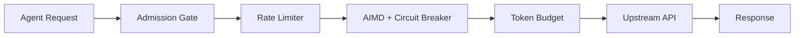

本記事は [HiveMind: OS-Inspired Scheduling for Concurrent LLM Agent Workloads (arXiv:2604.17111)](https://arxiv.org/abs/2604.17111) の解説記事です。関連するZenn記事「[Python asyncioで実装するエージェント非同期並列実行の7パターンとレート制限設計](https://zenn.dev/0h_n0/articles/1ba3ffb07291ed)」の深掘りとして、並列LLMエージェントのスケジューリング問題に対するOS設計からのアプローチを解説する。

## 論文概要（Abstract）

著者らは、複数のLLMエージェントが1つのAPIキーを共有して並列実行される際に発生するレート制限違反・接続リセット・HTTP 502エラーといった競合障害を、OSのスケジューリング理論に基づく5つのプリミティブで解消するシステム「HiveMind」を提案している。HiveMindは透過的HTTPリバースプロキシとして動作し、エージェントのコード変更を一切必要としない。著者らの実験では、直接API呼び出しで27〜100%であった失敗率が、HiveMind経由で0〜18%に低減されたと報告されている。また、トークン浪費の削減を通じてAPIコストを96〜97%削減できたと報告している。

## 情報源

| 項目 | 内容 |
|------|------|
| arXiv ID | 2604.17111 |
| URL | [https://arxiv.org/abs/2604.17111](https://arxiv.org/abs/2604.17111) |
| 著者 | Justice Owusu Agyemang, Jerry John Kponyo, Obed Kwasi Somuah, Elliot Amponsah, Godfred Manu Addo Boakye, Kwame Opuni-Boachie Obour Agyekum |
| 発表年 | 2026年 |
| 分野 | 分散コンピューティング (cs.DC)、人工知能 (cs.AI) |

## 背景と動機

LLMエージェントの並列実行は、開発生産性向上のために広く行われている。たとえばClaude Codeのような開発支援エージェントを複数同時に起動し、異なるタスクを並行処理させるケースが一般的になりつつある。しかし、これらのエージェントが同一のAPIキーを共有する場合、レート制限・接続数上限・トークン予算の競合が発生する。

著者らがこの研究の直接的な動機として挙げているのは、2026年4月15日に発生したインシデントである。11個の並列Claude Codeエージェントが1つのAnthropic APIキーを共有していたところ、3つのエージェントが死亡した（ECONNRESET 2件、HTTP 502 1件）。これは27%の失敗率に相当する。各エージェントの死亡時点で約45Kトークンが消費済みであり、合計約135Kトークンが浪費されたと著者らは報告している。

この問題の本質は、個々のエージェントがAPI利用状況のグローバルな状態を把握できないことにある。OSのプロセススケジューリングと同様に、共有リソース（ここではAPIのレート制限枠）へのアクセスを調停するスケジューラが必要となる。著者らはこの類推からHiveMindを設計している。

## 主要な貢献

- 並列LLMエージェントの障害を、OSスケジューリングの枠組みで定式化した。
- コード変更不要の透過的HTTPリバースプロキシとして5つのスケジューリングプリミティブ（Admission Control、Rate-limit Tracking、AIMD Backpressure + Circuit Breaking、Token Budget Management、Priority Queue with DAG）を実装した。
- `asyncio.Semaphore`の実行時リサイズにおけるCPython未定義動作を発見し、`asyncio.Condition`ベースの代替実装を提案した。
- 最大50エージェントまでのスケールで失敗率を0〜18%に低減し、トークン浪費コストを96〜97%削減したと報告している。
- Python 3.11 + asyncio + Uvicorn + Starlette + httpxで実装し、MITライセンスで公開している。

## 技術的詳細

### アーキテクチャ

HiveMindは `localhost:8765` で動作する透過的HTTPリバースプロキシである。エージェントはAPIエンドポイントをHiveMindのアドレスに向けるだけでよく、コード変更は不要である。リクエストは以下のパイプラインを通過する。



各コンポーネントはasyncioのコルーチンとして実装されており、ノンブロッキングに動作する。

### 5つのスケジューリングプリミティブ

#### 1. Admission Control

同時アクティブエージェント数 $A$ が上限 $C_{\max}$ 未満の場合にリクエストを受け入れ、それ以外は条件変数で待機させる。後述するAIMDメカニズムが $C_{\max}$ を動的に調整するため、この上限値はランタイム中に変化する。

#### 2. Rate-limit Tracking

2つのアプローチを組み合わせている。

- **リアクティブ**: APIレスポンスヘッダ（`x-ratelimit-remaining` 等）をパースし、残りクォータを把握する。
- **プロアクティブ**: スライディングウィンドウでRPM（Requests Per Minute）とTPM（Tokens Per Minute）をローカルにカウントし、プロバイダの制限に達する前に自主的にスロットリングする。

#### 3. AIMD Backpressure + Circuit Breaking

TCP輻輳制御で知られるAIMD（Additive Increase / Multiplicative Decrease）アルゴリズムを、同時接続数の制御に適用している。

**同時接続数 $c$ の更新則:**

$$
c \leftarrow \begin{cases}
\min(C_{\max},\; c + \alpha) & \text{if } \bar{L} \le L_{\text{target}} \\
\max(C_{\min},\; c \cdot \beta) & \text{if } \bar{L} > L_{\text{target}} \\
\max(C_{\min},\; c \cdot \beta) & \text{on error}
\end{cases}
$$

ここで $\bar{L}$ は直近リクエストの平均レイテンシ、$L_{\text{target}}$ は目標レイテンシである。著者らのデフォルトパラメータは $\alpha = 0.5$、$\beta = 0.5$、$L_{\text{target}} = 2000\,\text{ms}$ である。

レイテンシが目標以下であれば接続数を線形に増加させ（Additive Increase）、目標を超過するかエラーが発生した場合は半減させる（Multiplicative Decrease）。TCPのcwnd制御と同じ原理で、安定点への収束を図っている。

**Circuit Breaker**は、直近 $N = 20$ リクエストのスライディングウィンドウでエラー率を監視する。

$$
\frac{e}{n} \ge \tau = 0.50 \implies \text{Circuit Open}
$$

エラー率がしきい値 $\tau$ 以上になるとCircuitを開放し、$T_{\text{cool}} = 10\,\text{s}$ のクールダウン期間中は新規リクエストを送出しない。クールダウン後、Half-Open状態で1リクエストを試行し、成功すればClosedに遷移する。

#### 4. Token Budget Management

グローバルなトークンプールから各エージェントにトークン上限を割り当てる。使用率が85%に達すると警告を発し、100%に達するとそのエージェントを停止する。これにより、1つのエージェントの暴走が他のエージェントのトークン予算を圧迫する事態を防いでいる。

#### 5. Priority Queue with DAG

複数のリクエストが待機している場合の順序決定に、3段階の優先度付けを適用している。

1. **優先度**: ユーザー定義の優先度（例: CI/CDパイプラインのクリティカルパスを優先）
2. **推定トークンコスト**: Shortest Job First（SJF）の原理で、トークンコストが小さいリクエストを優先
3. **作成時刻**: 同一優先度・同一コストの場合はFIFO

また、タスク間の依存関係をDAG（Directed Acyclic Graph）で表現し、先行タスクが完了するまで後続タスクの実行を抑制する機能も備えている。

### asyncio.Semaphore問題と修正

著者らは、HiveMindの開発過程で `asyncio.Semaphore` に関する重要な問題を発見したと報告している。

当初のAdmission Controllerは `asyncio.Semaphore` を使用していた。しかし、AIMDメカニズムが同時接続上限 $C_{\max}$ をランタイム中に変更する際、Semaphoreの内部属性 `_value` を直接操作する必要があった。この操作はCPythonの**未定義動作**であり、並列負荷下でバックプレッシャーが同時接続数を減少させる際にサイレントに壊れたと著者らは報告している。

具体的には、Semaphoreの `_value` を減らしても、既にacquire済みのタスクは解放されず、実際の同時実行数が新しい上限を超過する状態が発生した。

**修正として**、著者らは `asyncio.Condition`（内部で `asyncio.Lock` をラップ）で明示的なカウンタ $A$ を保護する方式に切り替えている。

```python
class AdmissionController:
    def __init__(self, c_max: int) -> None:
        self._cond = asyncio.Condition()
        self._active = 0       # カウンタ A
        self._c_max = c_max    # 動的に変更可能

    async def acquire(self) -> None:
        async with self._cond:
            while self._active >= self._c_max:
                await self._cond.wait()
            self._active += 1

    async def release(self) -> None:
        async with self._cond:
            self._active -= 1
            self._cond.notify(1)

    def set_max(self, new_max: int) -> None:
        """AIMDから呼ばれる。O(1)でリサイズ。"""
        async def _resize():
            async with self._cond:
                self._c_max = new_max
                if new_max > self._c_max:
                    self._cond.notify_all()
        asyncio.create_task(_resize())
```

この設計のポイントは以下の通りである。

- **Acquire**: $A < C_{\max}$ になるまで `wait()` で待機
- **Release**: $A$ をデクリメントし `notify(1)` で1つの待機タスクを起床
- **$C_{\max}$ 増加時**: `notify_all()` で全待機タスクを起床させ、条件を再評価させる
- **$C_{\max}$ 減少時**: 特別な処理は不要。既にacquire済みのタスクが `release()` するまで自然に超過分が解消される
- **リサイズコスト**: $O(1)$。条件変数のオーバーヘッドは約50 $\mu$s/acquire+release

### プロバイダプロファイル

HiveMindはプロバイダごとに異なるレート制限パラメータをプロファイルとして管理している。著者らが報告しているデフォルトプロファイルは以下の通りである。

| Provider | RPM | TPM | Max CC | $L_{\text{target}}$ |
|----------|-----|-----|--------|---------------------|
| Anthropic | 50 | 80K | 5 | 3000ms |
| OpenAI | 60 | 150K | 10 | 2000ms |
| Ollama | 1000 | 10M | 2 | 10000ms |

OllamaのMax CCが2と低いのは、ローカルGPUのメモリ制約によるものである。$L_{\text{target}}$ もOllamaは10秒と長く設定されており、ローカル推論の特性を反映している。

## 実装のポイント

HiveMindの実装スタックはPython 3.11、asyncio、Uvicorn（ASGIサーバー）、Starlette（Webフレームワーク）、httpx（非同期HTTPクライアント）である。

設計上の特筆すべき点は以下の通りである。

- **透過プロキシ**: エージェントのHTTPリクエストをそのまま中継するため、OpenAI互換API・Anthropic API・Ollama APIのいずれにも対応できる。新しいプロバイダの追加はプロファイル設定の追加のみで済む。
- **シングルプロセス・シングルスレッド**: asyncioのイベントループ上で全コンポーネントが動作する。GILの制約下でもI/Oバウンドな処理であるため十分な性能が出る。
- **状態の一元管理**: レート制限カウンタ、AIMDの同時接続数、Token Budget、Circuit Breakerの状態がすべて1つのプロセス内に存在するため、分散ロックや外部ストアが不要である。

## Production Deployment Guide

本セクションでは、HiveMind論文のアーキテクチャをAWS上で本番運用する際の構成、コスト、運用設定を解説する。HiveMindはシングルプロセスの透過プロキシであるため、デプロイ構成は比較的シンプルである。

### AWS実装パターン（コスト最適化重視）

HiveMindはエージェントとLLM APIの間に配置するリバースプロキシであるため、主要コストはコンピュートリソースとネットワーク転送量である。

**トラフィック量別の推奨構成:**

| 構成 | エージェント数 | アーキテクチャ | 月額概算 |
|------|-------------|-------------|---------|
| Small | 1-10 | EC2 t4g.micro + systemd | $5-15 |
| Medium | 10-50 | ECS Fargate + ALB | $80-200 |
| Large | 50-200+ | EKS + Karpenter + NLB | $400-1,200 |

**Small構成（1-10エージェント）の内訳:**
- EC2 t4g.micro（ARM, 2vCPU, 1GB）: $3-6/月（Spot: $1-2/月）
- EBS gp3 10GB: $1/月
- CloudWatch Logs: $1-3/月
- NAT不要（パブリックサブネット + Security Group制限）

**Medium構成（10-50エージェント）の内訳:**
- ECS Fargate（0.5vCPU, 1GB x 2タスク）: $30-60/月
- ALB: $20/月
- CloudWatch（メトリクス + Logs）: $10-30/月
- VPC NAT Gateway: $30-50/月

**Large構成（50-200+エージェント）の内訳:**
- EKS（コントロールプレーン）: $73/月
- Karpenter NodePool（t4g.medium Spot x 2-4）: $30-100/月
- NLB: $20/月
- CloudWatch Container Insights: $30-50/月
- ElastiCache（Redis, t4g.micro, メトリクス集約用）: $12/月
- Prometheus + Grafana（AIMD/CB状態の可視化）: $50-100/月

**コスト削減テクニック:**
- Spot Instances活用（Small/Large構成）: 最大70%削減
- ARM（Graviton）インスタンス: x86比で約20%安価
- HiveMind自体のコスト < LLM API浪費削減額が一般的（論文Table 5のコスト試算を参照）

> 注意: 上記コストは2026年10月時点のAWS ap-northeast-1（東京）リージョンの概算値です。実際のコストはエージェント数、リクエスト頻度、プロバイダのレート制限枠により変動します。最新料金は[AWS料金計算ツール](https://calculator.aws/)で確認してください。

### Terraformインフラコード

#### Small構成（EC2 Single Instance）

```hcl
# HiveMind Proxy - Small構成（EC2 t4g.micro + systemd）
# 前提: VPC、サブネットは既存のものを使用

# --- Security Group（プロキシポートのみ許可） ---
resource "aws_security_group" "hivemind" {
  name        = "hivemind-proxy-sg"
  description = "HiveMind proxy - agent access only"
  vpc_id      = var.vpc_id

  ingress {
    description = "HiveMind proxy port"
    from_port   = 8765
    to_port     = 8765
    protocol    = "tcp"
    cidr_blocks = [var.agent_subnet_cidr]  # エージェント実行サブネットのみ
  }

  ingress {
    description = "SSH"
    from_port   = 22
    to_port     = 22
    protocol    = "tcp"
    cidr_blocks = [var.admin_cidr]
  }

  egress {
    from_port   = 0
    to_port     = 0
    protocol    = "-1"
    cidr_blocks = ["0.0.0.0/0"]  # LLM APIへのアウトバウンド
  }
}

# --- EC2 Instance（ARM Graviton） ---
resource "aws_instance" "hivemind" {
  ami                    = data.aws_ami.ubuntu_arm64.id
  instance_type          = "t4g.micro"
  subnet_id              = var.public_subnet_id
  vpc_security_group_ids = [aws_security_group.hivemind.id]
  key_name               = var.key_name

  user_data = <<-EOF
    #!/bin/bash
    apt-get update && apt-get install -y python3.11 python3.11-venv
    python3.11 -m venv /opt/hivemind/venv
    /opt/hivemind/venv/bin/pip install hivemind-proxy
    # systemdユニット作成
    cat > /etc/systemd/system/hivemind.service <<'UNIT'
    [Unit]
    Description=HiveMind LLM Agent Proxy
    After=network.target
    [Service]
    Type=simple
    User=hivemind
    ExecStart=/opt/hivemind/venv/bin/uvicorn hivemind:app --host 0.0.0.0 --port 8765
    Restart=always
    RestartSec=5
    Environment=HIVEMIND_PROVIDER=anthropic
    Environment=HIVEMIND_RPM=50
    Environment=HIVEMIND_TPM=80000
    Environment=HIVEMIND_MAX_CC=5
    [Install]
    WantedBy=multi-user.target
    UNIT
    useradd -r -s /usr/sbin/nologin hivemind
    systemctl daemon-reload && systemctl enable --now hivemind
  EOF

  root_block_device {
    volume_size = 10
    volume_type = "gp3"
  }

  tags = {
    Name    = "hivemind-proxy"
    Project = "hivemind"
  }
}

# --- CloudWatchアラーム ---
resource "aws_cloudwatch_metric_alarm" "hivemind_cpu" {
  alarm_name          = "hivemind-cpu-high"
  comparison_operator = "GreaterThanThreshold"
  evaluation_periods  = 3
  metric_name         = "CPUUtilization"
  namespace           = "AWS/EC2"
  period              = 300
  statistic           = "Average"
  threshold           = 80
  alarm_description   = "HiveMind proxy CPU > 80%"

  dimensions = {
    InstanceId = aws_instance.hivemind.id
  }
}
```

#### Large構成（EKS + Karpenter）

```hcl
# HiveMind Proxy - Large構成（EKS + Karpenter + Spot）

# --- EKSクラスタ ---
module "eks" {
  source  = "terraform-aws-modules/eks/aws"
  version = "~> 20.0"

  cluster_name    = "hivemind-proxy"
  cluster_version = "1.31"

  vpc_id     = var.vpc_id
  subnet_ids = var.private_subnet_ids

  enable_irsa = true
}

# --- Karpenter NodePool（Spot優先、ARM） ---
resource "kubectl_manifest" "hivemind_nodepool" {
  yaml_body = yamlencode({
    apiVersion = "karpenter.sh/v1"
    kind       = "NodePool"
    metadata   = { name = "hivemind-spot" }
    spec = {
      template = {
        spec = {
          requirements = [
            { key = "karpenter.sh/capacity-type", operator = "In", values = ["spot", "on-demand"] },
            { key = "node.kubernetes.io/instance-type", operator = "In",
              values = ["t4g.medium", "t4g.large", "m7g.medium"] },
            { key = "kubernetes.io/arch", operator = "In", values = ["arm64"] }
          ]
          nodeClassRef = { name = "default" }
        }
      }
      limits = { cpu = "16", memory = "32Gi" }
      disruption = {
        consolidationPolicy = "WhenEmptyOrUnderutilized"
        consolidateAfter    = "120s"
      }
    }
  })
}

# --- AWS Budgets ---
resource "aws_budgets_budget" "hivemind" {
  name         = "hivemind-proxy-monthly"
  budget_type  = "COST"
  limit_amount = "1200"
  limit_unit   = "USD"
  time_unit    = "MONTHLY"

  notification {
    comparison_operator       = "GREATER_THAN"
    threshold                 = 80
    threshold_type            = "PERCENTAGE"
    notification_type         = "ACTUAL"
    subscriber_email_addresses = [var.alert_email]
  }
}
```

### 運用・監視設定

#### CloudWatch Logs Insights クエリ

```
# AIMDの同時接続数の推移
fields @timestamp, aimd_concurrency, avg_latency_ms, circuit_state
| filter component = "aimd_controller"
| stats avg(aimd_concurrency) as avg_cc,
        max(aimd_concurrency) as max_cc,
        avg(avg_latency_ms) as latency
  by bin(5m)
| sort @timestamp desc

# Circuit Breakerの状態遷移
fields @timestamp, circuit_state, error_rate, cooldown_remaining_s
| filter component = "circuit_breaker"
| filter circuit_state in ["open", "half_open"]
| sort @timestamp desc
| limit 50
```

#### CloudWatch カスタムメトリクス送信（Python）

```python
import boto3
from datetime import datetime

cloudwatch = boto3.client("cloudwatch", region_name="ap-northeast-1")


def publish_hivemind_metrics(
    active_agents: int,
    aimd_concurrency: float,
    circuit_state: str,
    error_rate: float,
    token_usage_pct: float,
) -> None:
    """HiveMindの内部状態をCloudWatchカスタムメトリクスとして送信"""
    cloudwatch.put_metric_data(
        Namespace="HiveMind",
        MetricData=[
            {
                "MetricName": "ActiveAgents",
                "Value": active_agents,
                "Unit": "Count",
                "Timestamp": datetime.utcnow(),
            },
            {
                "MetricName": "AIMDConcurrency",
                "Value": aimd_concurrency,
                "Unit": "Count",
                "Timestamp": datetime.utcnow(),
            },
            {
                "MetricName": "CircuitOpen",
                "Value": 1.0 if circuit_state == "open" else 0.0,
                "Unit": "None",
                "Timestamp": datetime.utcnow(),
            },
            {
                "MetricName": "ErrorRate",
                "Value": error_rate,
                "Unit": "Percent",
                "Timestamp": datetime.utcnow(),
            },
            {
                "MetricName": "TokenUsagePercent",
                "Value": token_usage_pct,
                "Unit": "Percent",
                "Timestamp": datetime.utcnow(),
            },
        ],
    )


# アラーム: エラー率15%超過
cloudwatch.put_metric_alarm(
    AlarmName="hivemind-error-rate-high",
    MetricName="ErrorRate",
    Namespace="HiveMind",
    Statistic="Average",
    Period=300,
    EvaluationPeriods=2,
    Threshold=15.0,
    ComparisonOperator="GreaterThanThreshold",
    AlarmActions=[sns_topic_arn],
)

# アラーム: Circuit Breaker Open
cloudwatch.put_metric_alarm(
    AlarmName="hivemind-circuit-open",
    MetricName="CircuitOpen",
    Namespace="HiveMind",
    Statistic="Maximum",
    Period=60,
    EvaluationPeriods=1,
    Threshold=0.5,
    ComparisonOperator="GreaterThanThreshold",
    AlarmActions=[sns_topic_arn],
)
```

#### X-Ray トレーシング設定

```python
from aws_xray_sdk.core import xray_recorder, patch_all

patch_all()


@xray_recorder.capture("hivemind_proxy")
def handle_request(agent_id: str, provider: str, endpoint: str) -> dict:
    """プロキシリクエストをX-Rayでトレース"""
    subsegment = xray_recorder.current_subsegment()
    subsegment.put_annotation("agent_id", agent_id)
    subsegment.put_annotation("provider", provider)
    subsegment.put_annotation("endpoint", endpoint)
    subsegment.put_metadata("queue_wait_ms", queue_wait_ms)
    subsegment.put_metadata("aimd_concurrency", current_concurrency)
    # ... プロキシロジック
```

### コスト最適化チェックリスト

**アーキテクチャ選択:**
- [ ] エージェント数でSmall / Medium / Largeを判断
- [ ] 単一プロセスで十分か、HA構成が必要かを評価
- [ ] HiveMindのコスト < LLM API浪費削減額であることを確認

**リソース最適化:**
- [ ] ARM（Graviton）インスタンスを優先（約20%安価）
- [ ] Spot Instances活用（Small/Large構成、最大70%削減）
- [ ] Small構成: t4g.micro（$3-6/月）で十分な場合が多い
- [ ] Large構成: Karpenter + Spotで自動スケーリング
- [ ] Savings Plans: Compute Savings Plans検討（1年コミット）

**LLM API コスト削減（HiveMind効果）:**
- [ ] Token Budget設定: エージェントごとの上限を適切に設定
- [ ] AIMD パラメータ調整: $\alpha$, $\beta$, $L_{\text{target}}$ をプロバイダに合わせる
- [ ] Circuit Breaker: $\tau$, $T_{\text{cool}}$ を負荷パターンに合わせる
- [ ] Priority Queue: CI/CDクリティカルパスに高優先度を設定

**監視・アラート:**
- [ ] CloudWatch: ActiveAgents、AIMDConcurrency、ErrorRate、CircuitOpen
- [ ] AWS Budgets: 月額上限設定
- [ ] Cost Anomaly Detection: 有効化
- [ ] X-Ray: プロキシリクエストのレイテンシ分布

**リソース管理:**
- [ ] ログ保持期間: CloudWatch Logs 14日 → S3 Glacier
- [ ] タグ戦略: Project / Environment タグ付与
- [ ] 開発環境: 夜間自動停止（EventBridge Scheduler）
- [ ] HiveMindバージョン管理: セマンティックバージョニングで追跡

## 実験結果（Results）

著者らは、マイクロベンチマーク（合成負荷）とリプレイ実験（実インシデント再現）の2種類の実験を実施している。

### 失敗率の比較

論文のTable 3より、以下の結果が報告されている。

| シナリオ | エージェント数 | RPM | Direct（失敗率） | HiveMind（失敗率） | 浪費削減 |
|---------|-------------|-----|-----------------|-------------------|---------|
| micro-10 | 10 | 50 | 100% | 10% | -100% |
| micro-20 | 20 | 50 | 100% | 10% | -94% |
| micro-50 | 50 | 50 | 100% | 0% | -100% |
| replay-11 | 11 | 60 | 73% | 18% | -48% |
| stress | 20 | 20 | 100% | 10% | -100% |

micro-10/20/50シナリオでは、Direct（HiveMindなし）の失敗率が100%である。これは、全エージェントが同時にAPIを叩くため、RPM制限（50 req/min）を即座に超過するためである。HiveMindを介すると、Admission ControlとRate-limit Trackingにより、RPM枠内に収まるようリクエストが調停される。

replay-11はインシデント再現実験であり、実際のトラフィックパターンを再生している。Direct（73%失敗）に対してHiveMind（18%失敗）と、完全ではないものの大幅な改善が報告されている。18%の残存失敗は、バースト的なトークン消費がToken Budgetを超過したケースであると著者らは分析している。

### アブレーション実験

replay-11シナリオで各コンポーネントの寄与を分離した結果が報告されている（論文Table 4より）。

| 構成 | 生存エージェント数 | 失敗率 |
|-----|----------------|-------|
| Full HiveMind | 11 | 0% |
| No retry | 4 | 63.6% |
| Admission only | 2 | 81.8% |

この結果から、Admission Controlだけでは不十分であり、AIMD + Circuit Breaker + Retry の組み合わせが不可欠であることが示されている。特にRetryの除去（No retry）で63.6%の失敗率に悪化することから、一時的なレート制限エラーからの自動回復が大きな役割を果たしていることがわかる。

### コスト削減効果

著者らは、日次10回実行を想定した場合のコスト比較を報告している（論文Table 5より）。

| Model | Direct | HiveMind | Savings |
|-------|--------|----------|---------|
| Haiku | $0.35 | $0.01 | 97% |
| Sonnet | $1.31 | $0.05 | 96% |
| Opus | $6.55 | $0.24 | 96% |

このコスト削減は主にトークン浪費の排除に起因する。Directの場合、エージェントが途中で死亡すると消費済みトークンが全て浪費される。HiveMindはエージェントの死亡自体を防ぐため、この浪費が発生しない。

## 実運用への応用

HiveMindのアーキテクチャは、以下のような実運用シナリオに直接適用可能である。

**CI/CDパイプラインでの並列エージェント実行**: 複数のClaude CodeやCopilot Workspaceエージェントを並列に起動してコードレビュー・テスト生成・リファクタリングを行う場合、HiveMindを間に挟むことでレート制限エラーによるジョブ失敗を防げる。Priority Queue機能でクリティカルパスのタスクを優先することも可能である。

**マルチエージェントアプリケーション**: LangGraphやCrewAIで構築されたマルチエージェントシステムでは、複数のエージェントが同一のLLM APIを共有する。HiveMindの透過プロキシアプローチにより、フレームワーク側のコード変更なしにスケジューリングを導入できる。

**開発チームでのAPIキー共有**: チーム全員が同一のAPIキーを使う組織では、個人の利用が他のメンバーに影響を与えうる。Token Budget ManagementとAdmission Controlにより、公平な配分が可能になる。

ただし、著者らも認めているように、HiveMindにはいくつかの制約がある。シングルプロセス設計のため、プロキシ自体が単一障害点（SPOF）となる。高可用性が求められる環境では、HA構成の検討が必要である。また、ストリーミングレスポンス（SSE）への対応やWebSocket接続のサポートについては論文で明示的に議論されていない。

## 関連研究

- **Orca: A Distributed Serving System for Transformer-Based Generative Models (Yu et al., 2022)**: 推論サーバー側でのバッチスケジューリング手法。HiveMindがクライアント側のプロキシであるのに対し、Orcaはサーバー側のスケジューリングを扱う点で補完的な関係にある。
- **vLLM / PagedAttention (Kwon et al., 2023)**: KVキャッシュのメモリ管理をページング方式で効率化する推論エンジン。HiveMindとは異なるレイヤーの最適化であるが、HiveMindのToken Budget ManagementはvLLMのメモリ管理と類似した考え方（有限リソースの公平な配分）を採用している。
- **SGLang (Zheng et al., 2023)**: RadixAttentionによるプレフィックスキャッシュ共有。複数リクエスト間でKVキャッシュを効率的に再利用する。HiveMindのRate-limit Trackingと組み合わせることで、さらなる効率化が見込める。
- **TCP輻輳制御 (Jacobson, 1988; Chiu & Jain, 1989)**: HiveMindのAIMDメカニズムの理論的基盤。ネットワーク帯域の公平な共有を実現するAIMDアルゴリズムを、LLM APIの同時接続制御に適用した点がHiveMindの新規性の一つである。

## まとめと今後の展望

著者らは、並列LLMエージェントのAPI競合障害をOSスケジューリングの5つのプリミティブ（Admission Control、Rate-limit Tracking、AIMD + Circuit Breaking、Token Budget、Priority Queue with DAG）で解消するHiveMindを提案している。透過的HTTPリバースプロキシとしてエージェントのコード変更不要で導入でき、最大50エージェントの並列実行で失敗率を0〜18%に低減したと報告している。

特に、`asyncio.Semaphore`のランタイムリサイズがCPythonの未定義動作である点の発見と、`asyncio.Condition`ベースの代替実装は、asyncioを用いた並行制御の実装者にとって実用的な知見である。

今後の課題としては、マルチプロセス/マルチノード構成でのHAサポート、ストリーミングレスポンスへの最適化、異なるプロバイダ間でのリクエスト自動ルーティング（フェイルオーバー）などが考えられる。また、論文の実験はClaude Codeエージェントを主な対象としており、より多様なエージェントフレームワーク（LangGraph、CrewAI、AutoGen等）での検証が今後の方向性として挙げられる。

## 参考文献

1. Agyemang, J. O., Kponyo, J. J., Somuah, O. K., Amponsah, E., Boakye, G. M. A., Agyekum, K. O. O. "HiveMind: OS-Inspired Scheduling for Concurrent LLM Agent Workloads." arXiv:2604.17111, 2026. [https://arxiv.org/abs/2604.17111](https://arxiv.org/abs/2604.17111)
2. Yu, G. I. et al. "Orca: A Distributed Serving System for Transformer-Based Generative Models." OSDI 2022.
3. Kwon, W. et al. "Efficient Memory Management for Large Language Model Serving with PagedAttention." SOSP 2023.
4. Zheng, L. et al. "SGLang: Efficient Execution of Structured Language Model Programs." arXiv:2312.07104, 2023.
5. Jacobson, V. "Congestion Avoidance and Control." ACM SIGCOMM 1988.
6. Chiu, D. M. & Jain, R. "Analysis of the Increase and Decrease Algorithms for Congestion Avoidance in Computer Networks." Computer Networks and ISDN Systems, 1989.
7. 関連Zenn記事: [Python asyncioで実装するエージェント非同期並列実行の7パターンとレート制限設計](https://zenn.dev/0h_n0/articles/1ba3ffb07291ed)
