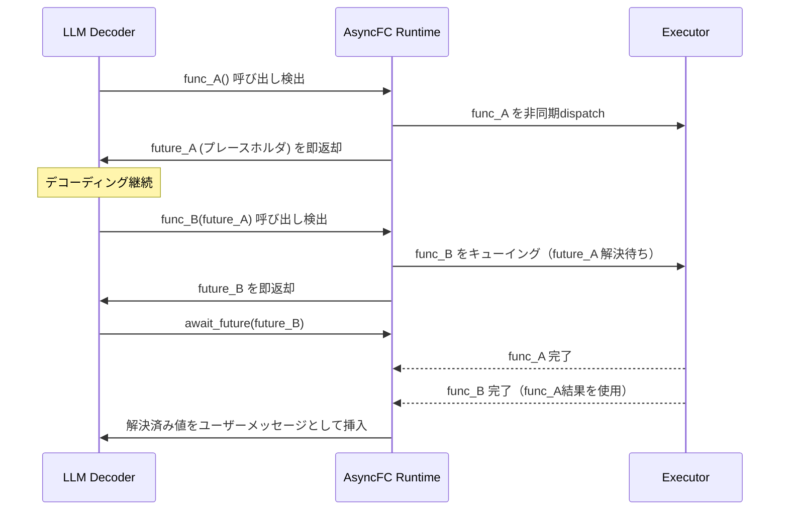

## 論文概要（Abstract）

本記事は [https://arxiv.org/abs/2605.15077](https://arxiv.org/abs/2605.15077) の解説記事です。

LLMが外部ツール（関数）を呼び出す際、標準的な同期方式ではモデルのデコーディングが関数実行の完了を待って停止し、end-to-endレイテンシが増大する。著者ら（Feng, Mao, Dutta, Gonzalez）は、モデルの微調整や再学習を一切行わずに、Futureベースの非同期関数呼び出しフレームワーク「AsyncFC」を提案している。AsyncFCは関数呼び出しの結果をFuture IDとして即座に返し、LLMのデコーディングと関数実行を並行化する。さらに、read/writeラベルに基づく依存関係認識スケジューリングにより関数間の並列実行も実現する。BFCL v3/v4、SWE-bench Lite、HotpotQAの各ベンチマークで精度を維持しつつ1.12倍から1.44倍のスピードアップが報告されている。

この記事は [Zenn記事: Python asyncioで実装するエージェント非同期並列実行の7パターンとレート制限設計](https://zenn.dev/0h_n0/articles/1ba3ffb07291ed) の深掘りです。

## 情報源

- **arXiv ID**: 2605.15077
- **URL**: [https://arxiv.org/abs/2605.15077](https://arxiv.org/abs/2605.15077)
- **著者**: Guangyu Feng, Huanzhi Mao, Prabal Dutta, Joseph E. Gonzalez
- **発表年**: 2026年（2026年5月14日投稿）
- **分野**: cs.CL, cs.AI, cs.LG

## 背景と動機（Background & Motivation）

### 同期関数呼び出しのボトルネック

LLMにおけるFunction Calling（関数呼び出し）は、ReActパターンやTool Useとして広く普及している。しかし、標準的な実装では関数呼び出しは同期的に処理される。モデルが関数呼び出しを生成すると、その関数が結果を返すまでデコーディングは完全に停止する。Web検索やAPI呼び出しなど、外部I/Oを伴う関数ではこの待機時間が支配的になり、end-to-endレイテンシの大部分を占める。

OpenAI等が提供するParallel Function Calling（同一ターン内で複数の関数を並列呼び出し）は部分的な解決策だが、著者らはこれにも2つの制約があると指摘している。第一に、モデルが1ターンで複数の関数を「同時に」生成する必要があり、前の関数の結果に依存する呼び出しは次のターンに先送りされる。第二に、デコーディングと関数実行のオーバーラップ（デコード中に既にデコード済みの関数を先行実行する）は考慮されていない。

AsyncFCはこれらの制約を、ソフトウェアエンジニアリングにおけるFuture/Promiseパターンを応用して解決する。モデル自体を変更することなく、推論フレームワーク側の変更のみで非同期並列化を実現する点が特徴である。

### Zenn記事との関連

Zenn記事ではPython asyncioを用いたエージェントの非同期並列実行パターン（Fan-out/Fan-in、パイプライン、セマフォによるレート制限など）を解説しているが、本論文はその基盤となるLLM推論レベルでの非同期化メカニズムを扱う。アプリケーションレベルの`asyncio`パターンと、推論フレームワークレベルのFutureベース非同期化は相補的な関係にあり、両方を組み合わせることで多段階エージェントのレイテンシを大幅に削減できる。

## 主要な貢献（Key Contributions）

著者らの貢献は以下の4点に集約される。

- **貢献1: Futureベース非同期関数呼び出しフレームワーク** -- 関数呼び出しの結果をFuture IDプレースホルダとして即座に返し、LLMデコーディングと関数実行をオーバーラップさせるアーキテクチャの提案
- **貢献2: 自動スキーマ変換** -- 既存の関数スキーマを自動的に書き換え、入力にFuture IDを受け付け、出力がFuture IDを返す形式に変換する仕組み。開発者がサンプル戻り値を提供するだけで動作する
- **貢献3: 依存関係認識スケジューリング** -- read/writeラベルとState Treeに基づく依存関係解析により、安全に並列実行可能な関数を自動判定するスケジューラ
- **貢献4: LLMのFuture推論能力の実証** -- 微調整なしでLLMがシンボリックなFutureプレースホルダに対してネイティブに推論できることをベンチマークで実証

## 技術的詳細（Technical Details）

### Futureベース非同期アーキテクチャ

AsyncFCの核心は、デコーディングと関数実行の分離にある。従来の同期方式との違いを以下に示す。



アーキテクチャは5つのコンポーネントで構成される。

#### 1. Non-blocking Dispatch

LLMのデコーディング中に関数呼び出しが検出されると、AsyncFCランタイムは呼び出しをバックエンドExecutorに非同期で送信し、Future IDを即座にLLMに返す。LLMは結果を待たずにデコーディングを継続できる。

#### 2. Schema Transformation

著者らは、既存の関数スキーマを自動的に書き換える仕組みを提案している。変換規則は以下の通りである。

- **出力側**: 関数の戻り値の型がFuture IDに変更される
- **入力側**: 各引数の型が「concrete値 | Future ID」のunion型に拡張される

開発者はサンプル戻り値（Structured Output Annotations）を提供するだけでよい。ランタイムがこれをFuture IDに自動変換し、LLMに提示するスキーマに反映する。

#### 3. Structured Output Annotations

開発者が関数のサンプル戻り値を型アノテーションとして記述する。例えば検索関数であれば`{"results": [{"title": "...", "url": "..."}]}`のようなサンプルJSONを提供する。ランタイムはこのサンプル値をFuture IDプレースホルダ（例: `fut_search_001`）に変換し、LLMのコンテキストに挿入する。これにより、LLMは関数の実際の戻り値を知らなくても、Future IDを使って後続の関数呼び出しを生成できる。

#### 4. `await_future` 補助関数

LLMが具象値を必要とする時点（例: ユーザーへの最終回答生成時）で、1つ以上のFutureの解決を要求する補助関数である。この関数が呼ばれると、ランタイムは指定されたFutureが解決されるまで待機し、解決済みの値をユーザーメッセージとしてLLMのコンテキストに挿入する。

#### 5. Result Integration

ターン境界（LLMのデコーディングが一旦停止し、次のターンが始まる時点）で、ランタイムはすべての未解決Future IDを解決済みの値にバインドするユーザーメッセージを挿入する。これによりLLMは具象値に基づいて次のターンの生成を行う。

### 理論的スピードアップモデル

著者らは、AsyncFCによるスピードアップを以下の数式で定式化している。

同期方式のend-to-endレイテンシ $T_{\text{sync}}$ は以下の通りである。

$$
T_{\text{sync}} = T_{\text{LLM}} + T_{\text{tool}}
$$

ここで、
- $T_{\text{LLM}}$: LLMデコーディングの総時間
- $T_{\text{tool}}$: すべての関数実行の総時間（直列実行）

AsyncFCによる理想的なレイテンシ $T_{\text{async}}$ は以下の通りである。

$$
T_{\text{async}} = \max(T_{\text{LLM}}, T_{\text{cp}})
$$

ここで、$T_{\text{cp}}$ は関数実行の依存グラフにおけるクリティカルパス時間である。すべての関数が独立であれば $T_{\text{cp}}$ は最も遅い単一関数の実行時間に等しく、完全に直列な依存関係であれば $T_{\text{cp}} = T_{\text{tool}}$ となる。

最大スピードアップ比 $R$ は以下で表される。

$$
R = \frac{T_{\text{LLM}} + T_{\text{tool}}}{\max(T_{\text{LLM}}, T_{\text{cp}})}
$$

総レイテンシ節約は2つの要因に分解される。

$$
\Delta T = \underbrace{\Delta_{F \| F}}_{\text{関数間並列性}} + \underbrace{\Delta_{D \| E}}_{\text{デコード-実行オーバーラップ}}
$$

- $\Delta_{F \| F}$: 独立な関数同士を並列実行することによる節約
- $\Delta_{D \| E}$: LLMデコーディング中に関数を先行実行することによる節約

### 依存関係認識スケジューリング

AsyncFCでは関数間の依存関係を3つのモードで管理する。

#### デフォルトモード（直列化）

すべての関数呼び出しをデコード順に直列化する。デコーディングと実行のオーバーラップ（$\Delta_{D \| E}$）は得られるが、関数間の並列実行（$\Delta_{F \| F}$）は行わない。安全性が最優先の場合のモードである。

#### ラベリング（read/writeアノテーション）

開発者が各関数にデコレータベースのread/writeラベルを付与する。ラベルは階層的なパスアドレス空間で表現される。

```python
from asyncfc import read_label, write_label

@read_label("db/users")
@write_label("db/logs")
def search_users(query: str) -> list[dict]:
    """ユーザー検索（usersテーブルread、logsテーブルwrite）

    Args:
        query: 検索クエリ文字列

    Returns:
        ユーザー情報の辞書リスト
    """
    ...

@read_label("db/users")
def get_user_profile(user_id: str) -> dict:
    """ユーザープロフィール取得（usersテーブルreadのみ）

    Args:
        user_id: ユーザーID

    Returns:
        プロフィール情報の辞書
    """
    ...
```

この例では、`search_users`と`get_user_profile`はともに`db/users`をreadするだけなので並列実行可能である。一方、`search_users`が`db/logs`にwriteするため、同じく`db/logs`にアクセスする関数とは直列化される。

#### パイプラインスケジューリング（State Tree）

ラベル情報に基づく自動スケジューリングの詳細アルゴリズムである。著者らはState Treeと呼ぶデータ構造を導入している。

1. デコードされた関数呼び出しはキューに追加される
2. キュー順にState Treeへの入場を試みる
3. 先行する呼び出しのwrite領域と、自身のread/write領域に重複がある場合、先行呼び出しのFutureが解決されるまで待機する
4. 重複がなければ即座に並列実行を開始する

```python
from dataclasses import dataclass, field
from typing import Any
import asyncio


@dataclass
class FunctionCall:
    """非同期関数呼び出しの内部表現

    Attributes:
        func_id: 関数呼び出しの一意識別子
        read_paths: この関数がreadするリソースパスの集合
        write_paths: この関数がwriteするリソースパスの集合
        future: 結果を格納するFutureオブジェクト
        depends_on: 依存する先行呼び出しのfunc_idリスト
    """

    func_id: str
    read_paths: set[str]
    write_paths: set[str]
    future: asyncio.Future[Any] = field(default_factory=lambda: asyncio.get_event_loop().create_future())
    depends_on: list[str] = field(default_factory=list)


class StateTree:
    """依存関係認識スケジューラ

    関数呼び出しのread/writeラベルに基づき、
    安全に並列実行可能な呼び出しを判定する。
    """

    def __init__(self) -> None:
        self._pending: dict[str, FunctionCall] = {}
        self._active_writes: dict[str, str] = {}  # path -> func_id

    def can_execute(self, call: FunctionCall) -> bool:
        """指定した関数呼び出しが即座に実行可能か判定する

        Args:
            call: 判定対象の関数呼び出し

        Returns:
            依存関係が解決済みで実行可能ならTrue
        """
        for path in call.read_paths | call.write_paths:
            for active_path, active_id in self._active_writes.items():
                if self._paths_overlap(path, active_path):
                    call.depends_on.append(active_id)
                    return False
        return True

    @staticmethod
    def _paths_overlap(path_a: str, path_b: str) -> bool:
        """階層パスの重複を判定する

        Args:
            path_a: 比較パス1
            path_b: 比較パス2

        Returns:
            一方が他方の祖先またはパスが一致する場合True
        """
        return path_a.startswith(path_b) or path_b.startswith(path_a)
```

#### エラー処理

関数実行が失敗した場合、AsyncFCは推移的依存関係のみをキャンセルする。失敗した関数に直接・間接に依存する呼び出しのFutureをキャンセルし、独立した呼び出しは影響を受けずに実行を継続する。これにより障害の影響範囲が最小限に抑えられる。

### LLMによるFuture推論

著者らは、LLMが微調整なしでシンボリックなFutureプレースホルダに対して推論できると主張している。その根拠は、LLMの事前学習コーパスにPromise/Futureパターンを用いたソフトウェアコード（JavaScript、Python、Rustなど）が大量に含まれているため、非同期プログラミングの概念を「事前知識」として獲得しているという仮説である。

具体的には、LLMは`fut_search_001`のようなシンボリックIDを見て、それが未解決の計算結果を表すプレースホルダであることを理解し、そのIDを後続の関数呼び出しの引数として適切に渡すことができる。この能力はGPT-4o、GPT-5.2、Gemini 3.1 Proの各モデルで確認されたと著者らは報告している。

### LLM生成アノテーション

著者らは、read/writeラベルを手動で付与する代わりに、LLMに自動生成させるアプローチも評価している。1,812の関数ペアに対して、LLM生成アノテーションは以下の性能を示したと報告されている。

- **精度（Accuracy）**: 0.925
- **適合率 / 再現率（Precision / Recall）**: 0.791
- **過剰直列化率**: 0.038（本来並列実行可能な関数を直列化してしまう割合）
- **依存性見落とし率**: 0.038（本来直列化すべき関数を並列実行してしまう割合）

過剰直列化は性能低下のみで安全性には影響しないが、依存性見落としはデータ不整合のリスクがある。著者らは3.8%の依存性見落とし率は「write-onlyアクション（予約、メール送信等）を主対象とする用途では許容範囲」としている。

## 実装のポイント（Implementation）

AsyncFCを実装する際の注意点を以下に整理する。

### Future ID管理

Future IDの一意性保証が重要である。著者らの設計では`fut_{function_name}_{sequential_id}`の形式を採用しているが、マルチテナント環境ではリクエストIDを接頭辞に含めるなどの対策が必要になる。

### スキーマ変換の互換性

既存のFunction Callingスキーマ（OpenAI format等）との互換性を維持するため、スキーマ変換はランタイム側で透過的に行う設計が推奨される。開発者から見えるAPIは変更せず、ランタイムがLLMに提示するスキーマのみを書き換える。

### デッドロック防止

循環依存がある場合にデッドロックが発生しうる。著者らの設計ではState Treeのパス階層構造により循環を構造的に排除しているが、動的に生成されるパスを扱う場合はタイムアウト機構の併用が推奨される。

### `await_future`の配置戦略

`await_future`の呼び出しタイミングがレイテンシに直結する。早すぎる`await`はデコード-実行オーバーラップを損ない、遅すぎると不必要な投機的デコーディングが発生する。著者らの実験では、LLMが自然なタイミングで`await_future`を呼び出す能力を持つことが示されているが、アプリケーション側でのヒント（システムプロンプトに「可能な限り`await`を遅延させよ」と記述するなど）も有効であると述べている。

## Production Deployment Guide

AsyncFCの非同期関数呼び出しパターンをプロダクション環境に展開する際のAWSベースの構成ガイドを以下に示す。

### AWS実装パターン（コスト最適化重視）

AsyncFCの特性上、関数実行のバックエンドExecutorと、LLM推論のフロントエンドを分離した構成が自然な設計となる。

**トラフィック量別の推奨構成**:

| 構成 | トラフィック | 主要サービス | 月額概算 |
|------|-----------|------------|---------|
| **Small** | ~100 req/日 | Lambda + Bedrock + SQS + DynamoDB | $50-150 |
| **Medium** | ~1,000 req/日 | ECS Fargate + Bedrock + ElastiCache + SQS | $300-800 |
| **Large** | 10,000+ req/日 | EKS + Karpenter(Spot) + Bedrock Batch + ElastiCache | $2,000-5,000 |

**Small構成の詳細**:
- Lambda（ARM64, 512MB, 最大300秒）: 関数Executorとして非同期dispatch。SQSからのイベント駆動。月額$5-15
- Bedrock（Claude Sonnet）: LLM推論。Prompt Caching有効化で30-90%トークンコスト削減。月額$30-100
- SQS: Future IDをメッセージとしてキューイング。Executorへの非同期dispatch用。月額$1未満
- DynamoDB（On-Demand）: Future ID -> 解決済み値のマッピングストア。月額$5-20

**Large構成の詳細**:
- EKS（m7g.xlarge Control Plane）: AsyncFCランタイムをPodとしてデプロイ。Karpenter + Spot Instances（c7g.2xlarge）でExecutorをオートスケール。月額$800-2,000
- Bedrock Batch API: 非リアルタイムの関数実行結果を利用するケースで50%コスト削減。月額$500-1,500
- ElastiCache（Redis, r7g.large）: Future ID -> 値のキャッシュ。TTL付きで解決済みFutureを保持。月額$200-400
- SQS FIFO: 依存関係順序を保証したキューイング。月額$5-20

**コスト試算の注意事項**: 上記は2026年10月時点のAWS ap-northeast-1（東京）リージョン料金に基づく概算値である。実際のコストはトラフィックパターン、バースト使用量、Bedrockモデル選択により変動する。最新料金はAWS料金計算ツール（calculator.aws）で確認を推奨する。

**コスト削減テクニック**:
- Spot Instances活用（Executor Pod）: On-Demand比で最大90%削減。関数Executorはステートレスなためスポット中断の影響が小さい
- Reserved Instances（EKSコントロールプレーン）: 1年コミットで最大72%削減
- Bedrock Batch API: 非リアルタイムバッチ処理で50%削減
- Prompt Caching: 同一スキーマ定義の繰り返しキャッシュで30-90%トークン削減

### Terraformインフラコード

**Small構成（Serverless）**:

```hcl
# AsyncFC Serverless構成 - Lambda + Bedrock + SQS + DynamoDB

# --- IAMロール（最小権限） ---
resource "aws_iam_role" "asyncfc_executor" {
  name = "asyncfc-executor-role"
  assume_role_policy = jsonencode({
    Version = "2012-10-17"
    Statement = [{
      Action = "sts:AssumeRole"
      Effect = "Allow"
      Principal = { Service = "lambda.amazonaws.com" }
    }]
  })
}

resource "aws_iam_role_policy" "asyncfc_executor_policy" {
  name = "asyncfc-executor-policy"
  role = aws_iam_role.asyncfc_executor.id
  policy = jsonencode({
    Version = "2012-10-17"
    Statement = [
      {
        Effect   = "Allow"
        Action   = ["bedrock:InvokeModel", "bedrock:InvokeModelWithResponseStream"]
        Resource = "arn:aws:bedrock:ap-northeast-1::foundation-model/anthropic.claude-*"
      },
      {
        Effect   = "Allow"
        Action   = ["dynamodb:GetItem", "dynamodb:PutItem", "dynamodb:UpdateItem"]
        Resource = aws_dynamodb_table.future_store.arn
      },
      {
        Effect   = "Allow"
        Action   = ["sqs:ReceiveMessage", "sqs:DeleteMessage", "sqs:GetQueueAttributes"]
        Resource = aws_sqs_queue.executor_queue.arn
      },
      {
        Effect   = "Allow"
        Action   = ["logs:CreateLogGroup", "logs:CreateLogStream", "logs:PutLogEvents"]
        Resource = "arn:aws:logs:ap-northeast-1:*:*"
      }
    ]
  })
}

# --- DynamoDB: Future ID -> 解決済み値ストア ---
resource "aws_dynamodb_table" "future_store" {
  name         = "asyncfc-future-store"
  billing_mode = "PAY_PER_REQUEST" # On-Demand: コスト最適化
  hash_key     = "future_id"

  attribute {
    name = "future_id"
    type = "S"
  }

  ttl {
    attribute_name = "expires_at"
    enabled        = true # 解決済みFutureの自動削除
  }

  server_side_encryption {
    enabled = true # KMS暗号化
  }
}

# --- SQS: 関数呼び出しキュー ---
resource "aws_sqs_queue" "executor_queue" {
  name                       = "asyncfc-executor-queue"
  visibility_timeout_seconds = 360 # Lambda timeout + buffer
  message_retention_seconds  = 86400
  sqs_managed_sse_enabled    = true # SSE暗号化

  redrive_policy = jsonencode({
    deadLetterTargetArn = aws_sqs_queue.executor_dlq.arn
    maxReceiveCount     = 3
  })
}

resource "aws_sqs_queue" "executor_dlq" {
  name                    = "asyncfc-executor-dlq"
  sqs_managed_sse_enabled = true
}

# --- Lambda: 関数Executor ---
resource "aws_lambda_function" "executor" {
  function_name = "asyncfc-executor"
  runtime       = "python3.12"
  handler       = "handler.lambda_handler"
  role          = aws_iam_role.asyncfc_executor.arn
  architectures = ["arm64"] # Graviton: コスト20%削減
  memory_size   = 512
  timeout       = 300

  environment {
    variables = {
      FUTURE_TABLE = aws_dynamodb_table.future_store.name
      LOG_LEVEL    = "INFO"
    }
  }

  tracing_config {
    mode = "Active" # X-Ray有効化
  }
}

# --- CloudWatchアラーム ---
resource "aws_cloudwatch_metric_alarm" "executor_errors" {
  alarm_name          = "asyncfc-executor-errors"
  comparison_operator = "GreaterThanThreshold"
  evaluation_periods  = 2
  metric_name         = "Errors"
  namespace           = "AWS/Lambda"
  period              = 300
  statistic           = "Sum"
  threshold           = 5
  alarm_description   = "AsyncFC Executor error rate spike"

  dimensions = {
    FunctionName = aws_lambda_function.executor.function_name
  }
}
```

**Large構成（Container）**:

```hcl
# AsyncFC Container構成 - EKS + Karpenter + Spot

module "eks" {
  source          = "terraform-aws-modules/eks/aws"
  version         = "~> 20.0"
  cluster_name    = "asyncfc-cluster"
  cluster_version = "1.31"

  vpc_id     = module.vpc.vpc_id
  subnet_ids = module.vpc.private_subnets

  cluster_endpoint_public_access = false # プライベートアクセスのみ
}

# --- Karpenter: Spot優先オートスケーリング ---
resource "kubectl_manifest" "karpenter_provisioner" {
  yaml_body = yamlencode({
    apiVersion = "karpenter.sh/v1"
    kind       = "NodePool"
    metadata   = { name = "asyncfc-executors" }
    spec = {
      template = {
        spec = {
          requirements = [
            { key = "karpenter.sh/capacity-type", operator = "In", values = ["spot", "on-demand"] },
            { key = "kubernetes.io/arch", operator = "In", values = ["arm64"] },
            { key = "node.kubernetes.io/instance-type", operator = "In",
              values = ["c7g.xlarge", "c7g.2xlarge", "m7g.xlarge"] }
          ]
          nodeClassRef = { name = "default" }
        }
      }
      limits   = { cpu = "64", memory = "128Gi" }
      disruption = {
        consolidationPolicy = "WhenEmptyOrUnderutilized"
        consolidateAfter    = "30s"
      }
    }
  })
}

# --- Secrets Manager: Bedrock設定 ---
resource "aws_secretsmanager_secret" "bedrock_config" {
  name                    = "asyncfc/bedrock-config"
  recovery_window_in_days = 7
}

# --- AWS Budgets: 予算アラート ---
resource "aws_budgets_budget" "asyncfc_monthly" {
  name         = "asyncfc-monthly-budget"
  budget_type  = "COST"
  limit_amount = "5000"
  limit_unit   = "USD"
  time_unit    = "MONTHLY"

  notification {
    comparison_operator       = "GREATER_THAN"
    threshold                 = 80
    threshold_type            = "PERCENTAGE"
    notification_type         = "ACTUAL"
    subscriber_email_addresses = ["ops-team@example.com"]
  }
}
```

### 運用・監視設定

**CloudWatch Logs Insights クエリ**（コスト異常検知）:

```
fields @timestamp, future_id, function_name, duration_ms, token_count
| filter event = "function_execution_complete"
| stats sum(token_count) as total_tokens, avg(duration_ms) as avg_latency,
        count(*) as invocations by bin(1h)
| filter total_tokens > 100000
| sort @timestamp desc
```

**CloudWatch Logs Insights クエリ**（レイテンシ分析）:

```
fields @timestamp, future_id, duration_ms
| filter event = "future_resolved"
| stats percentile(duration_ms, 95) as p95,
        percentile(duration_ms, 99) as p99,
        avg(duration_ms) as avg_ms by function_name
| sort p99 desc
```

**CloudWatchアラーム設定（Python）**:

```python
import boto3


def create_token_spike_alarm(function_name: str, threshold: int = 50000) -> dict:
    """Bedrockトークン使用量スパイク検知アラームを作成する

    Args:
        function_name: 監視対象のLambda関数名
        threshold: 5分間のトークン使用量閾値

    Returns:
        CloudWatch put_metric_alarm APIのレスポンス
    """
    cw = boto3.client("cloudwatch", region_name="ap-northeast-1")
    return cw.put_metric_alarm(
        AlarmName=f"asyncfc-token-spike-{function_name}",
        MetricName="InputTokenCount",
        Namespace="AWS/Bedrock",
        Statistic="Sum",
        Period=300,
        EvaluationPeriods=2,
        Threshold=threshold,
        ComparisonOperator="GreaterThanThreshold",
        AlarmActions=["arn:aws:sns:ap-northeast-1:ACCOUNT:ops-alerts"],
    )
```

**X-Rayトレーシング設定（Python）**:

```python
from aws_xray_sdk.core import xray_recorder, patch_all

patch_all()  # boto3, requests等の自動計装


@xray_recorder.capture("resolve_future")
def resolve_future(future_id: str, value: dict) -> None:
    """Future IDを解決済み値にバインドする

    Args:
        future_id: 解決対象のFuture ID
        value: 解決値
    """
    xray_recorder.current_subsegment().put_annotation("future_id", future_id)
    xray_recorder.current_subsegment().put_metadata("resolved_value", value)
    # DynamoDBへの書き込み処理
```

**Cost Explorer自動レポート（Python）**:

```python
import boto3
from datetime import date, timedelta


def get_daily_cost_report() -> dict:
    """日次コストレポートを取得しSNS通知する

    Returns:
        コストデータを含む辞書
    """
    ce = boto3.client("ce", region_name="us-east-1")
    today = date.today()
    yesterday = today - timedelta(days=1)

    response = ce.get_cost_and_usage(
        TimePeriod={"Start": str(yesterday), "End": str(today)},
        Granularity="DAILY",
        Metrics=["UnblendedCost"],
        Filter={
            "Tags": {"Key": "Project", "Values": ["asyncfc"], "MatchOptions": ["EQUALS"]}
        },
        GroupBy=[{"Type": "DIMENSION", "Key": "SERVICE"}],
    )

    total = sum(
        float(g["Metrics"]["UnblendedCost"]["Amount"])
        for r in response["ResultsByTime"]
        for g in r["Groups"]
    )

    if total > 100.0:
        sns = boto3.client("sns", region_name="ap-northeast-1")
        sns.publish(
            TopicArn="arn:aws:sns:ap-northeast-1:ACCOUNT:cost-alerts",
            Subject="AsyncFC Daily Cost Alert",
            Message=f"Daily cost: ${total:.2f} (threshold: $100)",
        )

    return {"date": str(yesterday), "total_cost": total, "services": response["ResultsByTime"]}
```

### コスト最適化チェックリスト

**アーキテクチャ選択**:
- [ ] トラフィック量に応じた構成選択（~100 req/日: Serverless、~1,000 req/日: Hybrid、10,000+ req/日: Container）
- [ ] 関数ExecutorのステートレスネスによりSpot活用可能性を確認

**リソース最適化**:
- [ ] EC2/EKS: Spot Instances優先（Executor Podはステートレスのため中断耐性あり）
- [ ] Reserved Instances: EKSコントロールプレーン・ElastiCacheに1年コミット
- [ ] Savings Plans: Fargate/Lambdaの予測可能な使用量に適用
- [ ] Lambda: メモリサイズを128MB刻みで最適化（Power Tuning活用）
- [ ] EKS: Karpenterのconsolidation設定でアイドルノード自動削除

**LLMコスト削減**:
- [ ] Bedrock Batch API: 非リアルタイム処理で50%削減
- [ ] Prompt Caching: スキーマ定義部分をキャッシュ（30-90%削減）
- [ ] モデル選択ロジック: 簡単な関数ルーティングにはHaiku、複雑な推論にはSonnet/Opus
- [ ] トークン数制限: max_tokensを用途に応じて設定
- [ ] Future解決時のコンテキスト圧縮: 解決済みFutureの中間値を要約

**監視・アラート**:
- [ ] AWS Budgets: 月次予算アラート（80%/100%/120%の3段階）
- [ ] CloudWatch アラーム: Lambda Errors、DynamoDB ThrottledRequests
- [ ] Cost Anomaly Detection: サービス別の異常コスト自動検知
- [ ] 日次コストレポート: Cost Explorer APIによる自動集計・SNS通知

**リソース管理**:
- [ ] 未使用リソース削除: 未解決Futureの定期クリーンアップ（DynamoDB TTL）
- [ ] タグ戦略: `Project=asyncfc`, `Environment=prod/staging`, `CostCenter=xxx`
- [ ] ライフサイクルポリシー: CloudWatch Logsの保持期間を30日に設定
- [ ] 開発環境夜間停止: EKSのCronJobでExecutor Podを0にスケールダウン
- [ ] SQS DLQの定期チェック: 滞留メッセージの調査・再処理

## 実験結果（Results）

著者らは、AsyncFCの有効性を複数のベンチマークで検証している。以下の結果はすべて論文の実験セクションからの引用である。

### ベンチマーク結果

| ベンチマーク | モデル | ベースライン | 設定 | スピードアップ | 精度変化 |
|------------|--------|-----------|------|------------|---------|
| BFCL v4 Web Search | GPT-4o | Sequential FC | AsyncFC(S) | 1.26x | 54.8% -> 53.2% |
| BFCL v4 Web Search | GPT-4o | Parallel FC | AsyncFC(P) | 1.12x | 50.0%維持 |
| BFCL v3 (5s delay) | GPT-4o | Par/Seq FC | AsyncFC全設定 | スピードアップあり | 変化なし (p>0.05) |
| BFCL v3 (10s delay) | Gemini 3.1 Pro | Parallel FC | AsyncFC(P) | 1.17x | 62.0% -> 65.3% |
| SWE-bench Lite (2x latency) | GPT-5.2 | SWE Agent | +AsyncFC | 1.44x | 47.6% -> 44.3% |
| HotpotQA | GPT-4o | Sequential FC | AsyncFC(S) | 1.24x | 75.0%維持 |
| BFCL v3 (LLM annotations) | GPT-4o | Parallel FC | AsyncFC(P) | 1.22x | 精度維持 |

### 結果分析

**スピードアップの特性**: 著者らは、スピードアップの大きさが関数実行時間とデコーディング時間の比率に依存すると報告している。BFCL v3の5秒遅延設定から10秒遅延設定に変更した場合にスピードアップが増加する傾向は、関数実行時間が長いほどAsyncFCの恩恵が大きくなることを示唆している。

**精度への影響**: ほとんどのベンチマークで統計的に有意な精度低下は見られていない（p>0.05）。一方、SWE-bench LiteではAsyncFC適用後に47.6%から44.3%へ3.3ポイントの低下が報告されている。著者らはこれをSWE-benchタスクの長い依存チェーンと、Future推論の複雑性に起因すると分析している。

**Gemini 3.1 Proの精度向上**: BFCL v3でGemini 3.1 Proを使用した場合、AsyncFC(P)で精度が62.0%から65.3%に向上している。著者らはこれについて、非同期化によるターン数削減がコンテキストウィンドウの有効活用につながった可能性を示唆しているが、統計的に決定的な結論は出していない。

**SWE-bench Liteでの最大スピードアップ**: 1.44xという最大のスピードアップはSWE-bench Liteで達成されている。SWEエージェントは多数の関数呼び出し（ファイル読み書き、テスト実行等）を行うため、デコード-実行オーバーラップと関数間並列性の両方が大きく寄与していると著者らは分析している。ただし、2xのレイテンシ倍率を適用した条件下での結果であり、実際のレイテンシ構成では異なるスピードアップになる可能性がある。

## 実運用への応用（Practical Applications）

### マルチエージェントシステムへの適用

Zenn記事で解説されているPython asyncioベースのエージェント非同期実行パターンと、AsyncFCは異なるレイヤーで同じ「非同期並列化」の目標を追求している。実運用では以下の組み合わせが考えられる。

- **アプリケーションレイヤー**（Zenn記事の範囲）: `asyncio.gather()`や`Semaphore`によるエージェント間の並列実行・レート制限
- **推論レイヤー**（本論文の範囲）: AsyncFCによる単一エージェント内の関数呼び出し非同期化

両レイヤーを組み合わせることで、例えば5つのエージェントが並列実行され、各エージェント内で3つの関数呼び出しが非同期化される場合、理論的には15の関数実行が並行して進む構成が実現できる。

### 適用に向いているユースケース

著者らは、AsyncFCが特に有効なユースケースとして以下を挙げている。

- **Write-onlyアクション**: 予約登録、メール送信、通知配信など、関数間の依存関係が少ないタスク
- **Web検索エージェント**: 複数の検索クエリを並列にdispatchし、結果を集約するパターン
- **SWEエージェント**: ファイル操作とテスト実行を並行化するコーディングエージェント

一方、厳密に逐次的なタスク（各ステップが前のステップの結果に完全に依存する場合）や、レイテンシが問題にならないバッチ処理では、AsyncFCのスピードアップは限定的であると著者らは述べている。

### レイテンシに敏感なシステムへの展開

著者らは、ロボティクスやサイバーフィジカルシステムなど、リアルタイム性が求められるドメインへの適用可能性にも言及している。物理的なアクチュエータ操作（ロボットアームの移動等）のレイテンシをデコーディングとオーバーラップさせることで、制御ループの応答性を改善できる可能性がある。

## 関連研究（Related Work）

- **Parallel Function Calling（OpenAI, 2023）**: 同一ターンで複数の関数を並列に呼び出す仕組み。AsyncFCはこれを拡張し、ターンをまたいだ非同期化とデコード-実行オーバーラップを追加している
- **ReAct（Yao et al., 2023）**: Reasoning + Acting パターン。関数呼び出しは同期的であり、AsyncFCが解決する遅延問題を内包している
- **LangGraph / LangChain**: Pythonベースのエージェントフレームワーク。アプリケーションレベルの非同期処理をサポートするが、推論レベルのFutureベース非同期化は提供していない。AsyncFCはこれらのフレームワークの下層で動作する補完的な仕組みとして位置づけられる
- **Gorilla（Patil et al., 2023）**: LLMのAPI呼び出し正確性を向上させるための微調整手法。AsyncFCは微調整不要というアプローチで対照的であり、Gorillaで学習済みのモデルにAsyncFCを適用することも可能である

## まとめと今後の展望

AsyncFCは、LLMの関数呼び出しにおける同期的な待機ボトルネックを、Futureベースの非同期化により解決するフレームワークである。モデルの微調整を要しない点、既存のFunction Callingインターフェースとの互換性を維持する点が実用上の大きな利点といえる。

実務への示唆としては、特にWeb検索やAPI呼び出しを多用するLLMエージェントにおいて、推論フレームワーク側の変更のみで1.1-1.4倍程度のレイテンシ改善が見込める点が重要である。Zenn記事で解説されているPython asyncioパターンとの組み合わせにより、アプリケーション全体のレイテンシ最適化に寄与する。

今後の研究方向として、著者らはLLM生成アノテーションの精度向上（現在の依存性見落とし率3.8%の改善）、より複雑な依存パターン（条件分岐を含む依存グラフ）への対応、サイバーフィジカルシステムへの実適用を挙げている。

## 参考文献

- **arXiv**: [https://arxiv.org/abs/2605.15077](https://arxiv.org/abs/2605.15077)
- **Related Zenn article**: [https://zenn.dev/0h_n0/articles/1ba3ffb07291ed](https://zenn.dev/0h_n0/articles/1ba3ffb07291ed)
