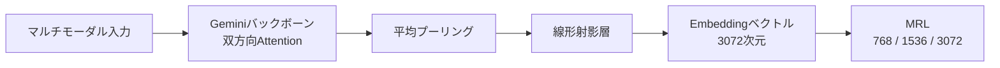
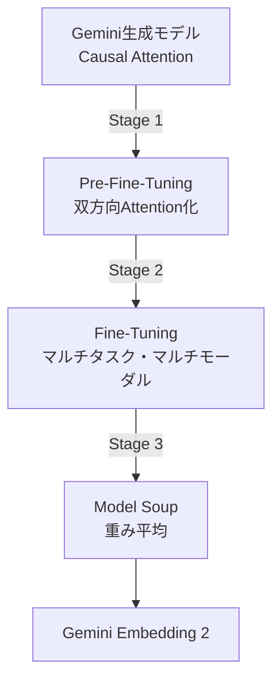

本記事は [Gemini Embedding 2: A Native Multimodal Embedding Model from Gemini (arXiv:2605.27295)](https://arxiv.org/abs/2605.27295) の解説記事です。関連するZenn記事「[Embeddingモデルの精度評価を3段階で実践する：ベンチマーク選定から本番検証まで](https://zenn.dev/0h_n0/articles/53b0ab6e5b4af3)」の深掘りとして、テキスト・画像・動画・音声を単一のベクトル空間にマッピングするマルチモーダルEmbeddingモデルのアーキテクチャと訓練手法を解説する。

## 論文概要（Abstract）

著者らは、テキスト・画像・動画・音声を1つの共有ベクトル空間にマッピングするマルチモーダルEmbeddingモデル「Gemini Embedding 2」を提案している。Geminiの生成モデルが持つマルチモーダル理解能力を活用し、任意の組み合わせのインターリーブ入力（テキストと画像が混在するドキュメント等）をEmbeddingに変換できる点が特徴である。テキスト検索（MMTEB）、マルチモーダル検索（MSCOCO, Vatex等）、音声検索（MSEB）の各ベンチマークにおいて、既存の商用マルチモーダルEmbeddingモデルを上回る性能を達成したと報告されている。

## 情報源

| 項目 | 内容 |
|------|------|
| arXiv ID | 2605.27295 |
| URL | [https://arxiv.org/abs/2605.27295](https://arxiv.org/abs/2605.27295) |
| 著者 | Madhuri Shanbhogue et al.（88名） |
| 発表年 | 2026年5月 |
| 分野 | コンピュータビジョン (cs.CV) |
| ライセンス | CC BY 4.0 |

## 背景と動機

Embeddingモデルは検索・推薦・分類・クラスタリングなど多くのNLPタスクの基盤技術であるが、従来のモデルはテキストのみを対象とするものが大半であった。画像・動画・音声を含むマルチモーダルなコンテンツが増加する中、異なるモダリティを横断的に検索できるEmbeddingモデルの需要が高まっている。

既存のマルチモーダルEmbeddingモデル（CLIP系、ImageBind等）は、モダリティごとに専用のエンコーダを訓練し、対照学習で共有空間にアラインするアプローチを採っていた。しかし、この方式には以下の課題がある。

- **モダリティ間の情報損失**: テキストと画像が混在するドキュメント（論文のFigure+キャプション等）を一体として扱えない
- **新モダリティへの拡張コスト**: 新しいモダリティを追加するたびに専用エンコーダの設計・訓練が必要
- **タスク指示の欠如**: 同じ入力でも「分類用Embedding」と「検索用Embedding」では最適なベクトル表現が異なるが、区別できない

Gemini Embedding 2は、Geminiの生成モデルをバックボーンとして活用することで、これらの課題を同時に解決するアプローチを採っている。生成モデルが既に獲得しているマルチモーダル理解能力をEmbeddingタスクに転用するため、モダリティごとの専用エンコーダが不要であり、タスク指示文字列によるEmbeddingの制御も可能である。

## 主要な貢献

- テキスト・画像・動画・音声・コードを1つの共有ベクトル空間にマッピングする統一Embeddingモデルを実現した。任意の組み合わせのインターリーブ入力に対応している。
- 生成モデル（Gemini）をEmbeddingモデルに変換する3段階訓練レシピ（Pre-Fine-Tuning、Fine-Tuning、Model Soup）を提案した。
- Matryoshka Representation Learning（MRL）により、768次元・1,536次元・3,072次元の柔軟な出力次元をサポートし、ストレージコストと精度のトレードオフを制御可能にした。
- マルチモーダル検索（全体平均77.2）、テキスト検索（MMTEB）、コード検索（CoIR: 82.3）、音声検索（MSEB）の各ベンチマークで既存商用モデルを上回る性能を報告している。
- タスク指示文字列のランダムドロップにより、指示なしでも動作する頑健性を実現した。

## 技術的詳細

### アーキテクチャ

Gemini Embedding 2のアーキテクチャは、Geminiの生成モデルを起点としたEncoder構造である。



各コンポーネントの詳細は以下の通りである。

**バックボーン**: Geminiの生成モデルから初期化したTransformerを使用している。生成モデルはcausal（左から右への一方向）Attentionを使用するが、Embeddingモデルでは入力全体の文脈を捉える必要があるため、**双方向Attention**に変更している。これはPre-Fine-Tuning段階で実施される重要な変換である。

**プーリング**: 最終層のトークンEmbeddingに対して平均プーリング（Mean Pooling）を適用する。CLSトークンを用いるBERT系のアプローチとは異なり、全トークンの情報を均等に集約する。

$$
\mathbf{e} = \frac{1}{T} \sum_{t=1}^{T} \mathbf{h}_t^{(L)}
$$

ここで、$\mathbf{h}_t^{(L)}$ はTransformerの最終層 $L$ における $t$ 番目のトークンの隠れ状態、$T$ はトークン数である。

**線形射影層**: ランダム初期化された線形層で、プーリング後のベクトルを出力次元（デフォルト3,072次元）にマッピングする。

### 損失関数: Noise-Contrastive Estimation (NCE)

訓練にはNCE lossをベースとした対照学習を採用している。クエリ $q$ と正例ターゲット $t^+$ のペアに対し、バッチ内の他のターゲットを負例として使用する。

$$
\mathcal{L}_{\text{NCE}} = -\log \frac{\exp(\text{sim}(q, t^+) / \tau)}{\exp(\text{sim}(q, t^+) / \tau) + \sum_{j=1}^{K} \exp(\text{sim}(q, t_j^-) / \tau)}
$$

ここで、
- $\text{sim}(a, b) = \frac{\mathbf{a} \cdot \mathbf{b}}{\|\mathbf{a}\| \|\mathbf{b}\|}$ はコサイン類似度
- $\tau$ は温度パラメータ（低いほど分布が尖鋭になり、正例と負例の区別が厳しくなる）
- $K$ はバッチ内の負例数
- $t_j^-$ は $j$ 番目の負例ターゲット

**Hard negatives**: クエリに類似しているが正解ではない例（Hard negatives）も負例として追加し、モデルの識別能力を強化している。

**偽陰性マスク**: 大規模バッチでのin-batch negatives使用時、バッチ内に偶然正例と同じ内容のサンプルが含まれる場合がある（偽陰性）。著者らはこの問題に対処するマスク機能を実装していると報告している。

### Matryoshka Representation Learning (MRL)

MRLは、1つのモデルから複数の次元のEmbeddingを生成する手法である。ロシアの入れ子人形（マトリョーシカ）のように、高次元ベクトルの先頭部分が低次元の有効なEmbeddingとなるよう訓練する。

$$
\mathcal{L}_{\text{MRL}} = \sum_{d \in \mathcal{D}} \mathcal{L}_{\text{NCE}}(\mathbf{e}_{1:d})
$$

ここで、$\mathcal{D} = \{768, 1536, 3072\}$ はサポートする次元の集合、$\mathbf{e}_{1:d}$ はEmbeddingベクトルの先頭 $d$ 次元を切り出したサブベクトルである。各次元に対して個別にNCE lossを計算し、合算することで、どの次元で切り出しても有効なEmbeddingが得られるよう訓練される。

実運用では、ストレージコストとレイテンシの制約に応じて次元を選択できる。著者らの報告によれば、768次元でも3,072次元と比較して大きな性能低下なく利用可能である。

### 3段階訓練レシピ

Gemini Embedding 2の訓練は、生成モデルをEmbeddingモデルに変換するための3段階で構成される。



#### Stage 1: Pre-Fine-Tuning (PFT)

生成モデルをエンコーダモデルに変換する段階である。主な変更点は以下の通り。

- **Attentionマスクの変更**: Causal（一方向）AttentionからBidirectional（双方向）Attentionへ切り替える。これにより、各トークンが入力全体の文脈を参照できるようになる。
- **訓練データ**: 画像・テキスト・コードにわたるノイジーなquery-targetペアを使用する。この段階ではデータの品質よりも多様性を重視し、モデルに対照学習の基本的なパターンを学習させる。
- **指示文字列のドロップ**: タスク指示文字列をランダムにドロップすることで、指示なしでも妥当なEmbeddingを生成できるよう訓練する。これにより、APIでタスク指示を省略した場合でも性能が大きく劣化しない頑健性が得られる。

#### Stage 2: Fine-Tuning (FT)

高品質なデータを用いたマルチタスク・マルチモーダル訓練である。

- **対象モダリティ**: テキスト、コード、ドキュメント（PDF等）、画像、音声、動画の6モダリティ
- **対象タスク**: 検索、分類、クラスタリング、意味的類似度など
- **合成データの活用**: 特にコード検索において、合成データの効果が顕著であったと報告されている（後述のAblation参照）
- **Hard negatives**: この段階ではHard negativesを積極的に使用し、fine-grainedな識別能力を獲得させる

#### Stage 3: Model Soup

Fine-Tuningで得られた複数のチェックポイント（異なるハイパーパラメータ設定や訓練ランの成果物）の重みを平均する手法である。

$$
\theta_{\text{soup}} = \frac{1}{M} \sum_{m=1}^{M} \theta_m
$$

ここで、$\theta_m$ は $m$ 番目のチェックポイントの重み、$M$ はチェックポイント数である。

Model Soupの利点は、個々のチェックポイントが特定のタスクやデータセットにoverfitしている場合でも、重み平均により汎化性能を回復できる点である。著者らは、Fine-Tuning段階でタスク特化の性能が向上する一方で他タスクの性能が低下する現象を観察しており、Model Soupがこの問題を緩和すると報告している。

### タスク指示文字列

Gemini Embedding 2は、入力にタスク指示文字列（task instruction）を付与することで、同じ入力に対してもタスクに応じた最適なEmbeddingを生成できる。たとえば、検索クエリには「Retrieve relevant documents for: 」、分類には「Classify the following text: 」のような指示を付与する。

PFT段階での指示ドロップ訓練により、指示なしでも動作するが、指示を付与した方が精度は向上する。この設計は、E5やGTE等の最近のテキストEmbeddingモデルと同様のアプローチである。

## 実装のポイント

### Embedding API利用時の注意点

```python
from google import genai
from google.genai import types


def embed_multimodal(
    client: genai.Client,
    texts: list[str],
    images: list[bytes] | None = None,
    output_dimensionality: int = 3072,
    task_type: str = "RETRIEVAL_DOCUMENT",
) -> list[list[float]]:
    """Gemini Embedding 2でマルチモーダルEmbeddingを生成する。

    Args:
        client: Google GenAI クライアント
        texts: テキスト入力のリスト
        images: 画像バイナリのリスト（オプション）
        output_dimensionality: 出力次元数（768, 1536, 3072）
        task_type: タスクタイプ（RETRIEVAL_QUERY, RETRIEVAL_DOCUMENT等）

    Returns:
        Embeddingベクトルのリスト
    """
    contents = []
    for i, text in enumerate(texts):
        parts = [types.Part(text=text)]
        if images and i < len(images):
            parts.append(types.Part(inline_data=types.Blob(
                mime_type="image/png",
                data=images[i],
            )))
        contents.append(types.Content(parts=parts))

    result = client.models.embed_content(
        model="gemini-embedding-exp-03-07",
        contents=contents,
        config=types.EmbedContentConfig(
            task_type=task_type,
            output_dimensionality=output_dimensionality,
        ),
    )
    return [embedding.values for embedding in result.embeddings]
```

### MRL次元選択の指針

- **768次元**: ストレージ制約が厳しい場合（モバイルデバイス、大規模インデックス）。3,072次元比でストレージ75%削減、検索性能は数%の低下
- **1,536次元**: バランス型。多くのプロダクション環境で推奨
- **3,072次元**: 最高精度が必要な場合。ただしインデックスサイズと検索レイテンシが増大

### バッチサイズとHard negatives

対照学習の性能はバッチサイズに大きく依存する。バッチが大きいほどin-batch negativesの多様性が増し、識別性能が向上する。一方で、大規模バッチでは偽陰性の問題が顕在化するため、著者らが実装した偽陰性マスクのような対策が必要となる。

### 制約・限界

- **入力長制限**: APIの入力トークン数には上限がある。長大なドキュメントの場合はチャンク分割が必要
- **動画・音声の長さ制約**: 動画・音声入力の最大長は公開情報に記載がない
- **コスト**: マルチモーダル入力（特に動画）はテキストのみの場合と比較してAPIコストが高い
- **クローズドモデル**: モデルの重みは非公開であり、自社環境へのデプロイやファインチューニングはできない

## Production Deployment Guide

本セクションでは、Gemini Embedding 2をプロダクション環境で活用するマルチモーダル検索システムのAWSデプロイ構成を解説する。Gemini Embedding 2はGoogle Cloud経由のAPIアクセスであるため、AWSからのクロスクラウド呼び出しとなる。

### AWS実装パターン（コスト最適化重視）

マルチモーダルEmbedding検索システムは、Embeddingの生成（API呼び出し）とベクトル検索（インデックス管理）の2つのコンポーネントで構成される。

**トラフィック量別の推奨構成:**

| 構成 | ドキュメント数 | アーキテクチャ | 月額概算 |
|------|-------------|-------------|---------|
| Small | ~10K | Lambda + OpenSearch Serverless | $80-200 |
| Medium | ~100K | ECS Fargate + OpenSearch | $500-1,200 |
| Large | 1M+ | EKS + OpenSearch + pgvector | $2,000-5,000 |

**Small構成（~10Kドキュメント）の内訳:**
- Lambda（Embedding生成、バッチインデスト）: $5-15/月
- OpenSearch Serverless（ベクトル検索、2 OCU最小）: $50-100/月
- API Gateway: $5-10/月
- S3（元ドキュメント保存）: $1-5/月
- Gemini API費用（別途）: $10-50/月

**Medium構成（~100Kドキュメント）の内訳:**
- ECS Fargate（0.5vCPU, 1GB x 2タスク、API + Worker）: $30-60/月
- OpenSearch（r6g.large.search x 2ノード）: $300-500/月
- SQS（非同期Embedding生成キュー）: $5/月
- ElastiCache Redis（キャッシュ）: $30-50/月
- Gemini API費用（別途）: $100-500/月

**Large構成（1M+ドキュメント）の内訳:**
- EKS（コントロールプレーン）: $73/月
- Karpenter NodePool（r6g.xlarge Spot x 4-8）: $200-600/月
- OpenSearch（r6g.2xlarge x 3ノード + UltraWarm）: $800-1,500/月
- pgvector on Aurora（補助インデックス）: $200-400/月
- Gemini API費用（別途）: $500-2,000/月

**コスト削減テクニック:**
- MRL 768次元の利用: ストレージ・検索コスト75%削減（3,072次元比）
- Embeddingキャッシュ（Redis/DynamoDB）: 同一ドキュメントの再計算回避
- バッチEmbedding生成: リアルタイム不要なドキュメントはSQSキュー経由でバッチ処理
- OpenSearch UltraWarm: アクセス頻度の低いインデックスを低コストストレージに移行

> 注意: 上記コストは2026年10月時点のAWS ap-northeast-1（東京）リージョンの概算値です。Gemini APIの費用はGoogle Cloudの料金体系に依存し、使用量により大きく変動します。最新料金は[AWS料金計算ツール](https://calculator.aws/)および[Google AI Studio料金](https://ai.google.dev/pricing)で確認してください。

### Terraformインフラコード

#### Small構成（Lambda + OpenSearch Serverless）

```hcl
# Gemini Embedding 2 マルチモーダル検索 - Small構成
# Lambda + OpenSearch Serverless + S3

# --- IAMロール（Lambda実行用、最小権限） ---
resource "aws_iam_role" "embedding_lambda" {
  name = "gemini-embedding-lambda-role"

  assume_role_policy = jsonencode({
    Version = "2012-10-17"
    Statement = [{
      Action = "sts:AssumeRole"
      Effect = "Allow"
      Principal = { Service = "lambda.amazonaws.com" }
    }]
  })
}

resource "aws_iam_role_policy" "embedding_lambda" {
  name = "gemini-embedding-lambda-policy"
  role = aws_iam_role.embedding_lambda.id

  policy = jsonencode({
    Version = "2012-10-17"
    Statement = [
      {
        Effect = "Allow"
        Action = [
          "logs:CreateLogGroup",
          "logs:CreateLogStream",
          "logs:PutLogEvents"
        ]
        Resource = "arn:aws:logs:*:*:*"
      },
      {
        Effect   = "Allow"
        Action   = ["s3:GetObject", "s3:PutObject"]
        Resource = "${aws_s3_bucket.documents.arn}/*"
      },
      {
        Effect   = "Allow"
        Action   = ["secretsmanager:GetSecretValue"]
        Resource = aws_secretsmanager_secret.gemini_api_key.arn
      },
      {
        Effect = "Allow"
        Action = ["aoss:APIAccessAll"]
        Resource = aws_opensearchserverless_collection.embeddings.arn
      }
    ]
  })
}

# --- Secrets Manager（Gemini APIキー） ---
resource "aws_secretsmanager_secret" "gemini_api_key" {
  name                    = "gemini-embedding/api-key"
  recovery_window_in_days = 7
}

# --- S3バケット（元ドキュメント保存） ---
resource "aws_s3_bucket" "documents" {
  bucket = "${var.project_name}-documents"

  tags = { Project = var.project_name }
}

resource "aws_s3_bucket_server_side_encryption_configuration" "documents" {
  bucket = aws_s3_bucket.documents.id

  rule {
    apply_server_side_encryption_by_default {
      sse_algorithm = "aws:kms"
    }
  }
}

# --- OpenSearch Serverless（ベクトル検索） ---
resource "aws_opensearchserverless_security_policy" "encryption" {
  name = "gemini-embedding-encryption"
  type = "encryption"
  policy = jsonencode({
    Rules = [{ ResourceType = "collection", Resource = ["collection/gemini-embeddings"] }]
    AWSOwnedKey = true
  })
}

resource "aws_opensearchserverless_collection" "embeddings" {
  name = "gemini-embeddings"
  type = "VECTORSEARCH"

  depends_on = [aws_opensearchserverless_security_policy.encryption]
}

# --- Lambda関数（Embedding生成） ---
resource "aws_lambda_function" "embedding_generator" {
  function_name = "gemini-embedding-generator"
  role          = aws_iam_role.embedding_lambda.arn
  handler       = "handler.lambda_handler"
  runtime       = "python3.12"
  timeout       = 300  # マルチモーダル入力は処理時間が長い
  memory_size   = 512  # 画像デコード用にメモリ確保

  environment {
    variables = {
      GEMINI_SECRET_ARN       = aws_secretsmanager_secret.gemini_api_key.arn
      OPENSEARCH_ENDPOINT     = aws_opensearchserverless_collection.embeddings.collection_endpoint
      OUTPUT_DIMENSIONALITY   = "768"  # コスト最適化: MRL 768次元
      DOCUMENT_BUCKET         = aws_s3_bucket.documents.id
    }
  }

  filename = "lambda_package.zip"

  tags = { Project = var.project_name }
}

# --- CloudWatchアラーム ---
resource "aws_cloudwatch_metric_alarm" "lambda_errors" {
  alarm_name          = "gemini-embedding-lambda-errors"
  comparison_operator = "GreaterThanThreshold"
  evaluation_periods  = 2
  metric_name         = "Errors"
  namespace           = "AWS/Lambda"
  period              = 300
  statistic           = "Sum"
  threshold           = 5
  alarm_description   = "Lambda Embedding生成エラー検知"

  dimensions = {
    FunctionName = aws_lambda_function.embedding_generator.function_name
  }
}
```

#### Large構成（EKS + OpenSearch）

```hcl
# Gemini Embedding 2 マルチモーダル検索 - Large構成
# EKS + Karpenter + OpenSearch + pgvector

# --- EKSクラスタ ---
module "eks" {
  source  = "terraform-aws-modules/eks/aws"
  version = "~> 20.0"

  cluster_name    = "gemini-embedding-cluster"
  cluster_version = "1.31"

  vpc_id     = var.vpc_id
  subnet_ids = var.private_subnet_ids

  # Karpenter用のIAMロール
  enable_irsa = true

  eks_managed_node_groups = {
    system = {
      instance_types = ["t4g.medium"]
      capacity_type  = "ON_DEMAND"
      min_size       = 2
      max_size       = 2
      desired_size   = 2
    }
  }

  tags = { Project = var.project_name }
}

# --- Karpenter Provisioner（Spot優先、ARM Graviton） ---
resource "kubectl_manifest" "karpenter_nodepool" {
  yaml_body = yamlencode({
    apiVersion = "karpenter.sh/v1"
    kind       = "NodePool"
    metadata   = { name = "embedding-workers" }
    spec = {
      template = {
        spec = {
          requirements = [
            { key = "karpenter.sh/capacity-type", operator = "In", values = ["spot", "on-demand"] },
            { key = "kubernetes.io/arch", operator = "In", values = ["arm64"] },
            { key = "node.kubernetes.io/instance-type", operator = "In",
              values = ["r6g.xlarge", "r6g.2xlarge", "r7g.xlarge"] }
          ]
          nodeClassRef = { name = "default" }
        }
      }
      limits   = { cpu = "64", memory = "256Gi" }
      disruption = {
        consolidationPolicy = "WhenEmptyOrUnderutilized"
        consolidateAfter    = "30s"
      }
    }
  })
}

# --- Secrets Manager ---
resource "aws_secretsmanager_secret" "gemini_api_key_large" {
  name                    = "gemini-embedding-large/api-key"
  recovery_window_in_days = 7
}

# --- AWS Budgets ---
resource "aws_budgets_budget" "monthly" {
  name         = "gemini-embedding-monthly"
  budget_type  = "COST"
  limit_amount = "5000"
  limit_unit   = "USD"
  time_unit    = "MONTHLY"

  notification {
    comparison_operator       = "GREATER_THAN"
    threshold                 = 80
    threshold_type            = "PERCENTAGE"
    notification_type         = "ACTUAL"
    subscriber_email_addresses = [var.alert_email]
  }

  notification {
    comparison_operator       = "GREATER_THAN"
    threshold                 = 100
    threshold_type            = "PERCENTAGE"
    notification_type         = "FORECASTED"
    subscriber_email_addresses = [var.alert_email]
  }
}
```

### 運用・監視設定

**CloudWatch Logs Insights クエリ（Embedding生成の異常検知）:**

```
# 1時間あたりのEmbedding生成レイテンシ分析
fields @timestamp, @message
| filter @message like /embedding_latency/
| stats avg(latency_ms) as avg_lat,
        pct(latency_ms, 95) as p95_lat,
        pct(latency_ms, 99) as p99_lat,
        count(*) as req_count
  by bin(1h)
| sort @timestamp desc
```

**CloudWatch アラーム設定（Python）:**

```python
import boto3


def create_embedding_alarms(
    function_name: str,
    sns_topic_arn: str,
) -> list[str]:
    """Gemini Embedding Lambda用のCloudWatchアラームを作成する。

    Args:
        function_name: Lambda関数名
        sns_topic_arn: 通知先SNSトピックARN

    Returns:
        作成したアラームARNのリスト
    """
    cw = boto3.client("cloudwatch")
    alarm_arns: list[str] = []

    # Embedding生成レイテンシ異常検知（P95 > 10秒）
    cw.put_metric_alarm(
        AlarmName=f"{function_name}-high-latency",
        MetricName="Duration",
        Namespace="AWS/Lambda",
        Statistic="p95",
        Period=300,
        EvaluationPeriods=2,
        Threshold=10000,
        ComparisonOperator="GreaterThanThreshold",
        Dimensions=[{"Name": "FunctionName", "Value": function_name}],
        AlarmActions=[sns_topic_arn],
        AlarmDescription="Embedding生成P95レイテンシが10秒超過",
    )

    # API呼び出しエラー率（5%超過）
    cw.put_metric_alarm(
        AlarmName=f"{function_name}-error-rate",
        MetricName="Errors",
        Namespace="AWS/Lambda",
        Statistic="Average",
        Period=300,
        EvaluationPeriods=3,
        Threshold=0.05,
        ComparisonOperator="GreaterThanThreshold",
        Dimensions=[{"Name": "FunctionName", "Value": function_name}],
        AlarmActions=[sns_topic_arn],
        AlarmDescription="Embedding生成エラー率5%超過",
    )

    return alarm_arns
```

**X-Ray トレーシング設定（Python）:**

```python
from aws_xray_sdk.core import xray_recorder, patch_all


def configure_xray_tracing(service_name: str = "gemini-embedding") -> None:
    """X-Rayトレーシングを設定する。

    Args:
        service_name: X-Rayのサービス名
    """
    xray_recorder.configure(service=service_name)
    patch_all()  # boto3, requests等を自動計装


@xray_recorder.capture("generate_embedding")
def generate_embedding_with_trace(
    text: str,
    modality: str = "text",
) -> dict:
    """トレーシング付きでEmbeddingを生成する。

    Args:
        text: 入力テキスト
        modality: 入力モダリティ（text, image, video, audio）

    Returns:
        Embeddingとメタデータの辞書
    """
    subsegment = xray_recorder.current_subsegment()
    if subsegment:
        subsegment.put_annotation("modality", modality)
        subsegment.put_metadata("input_length", len(text))

    # Embedding生成処理（省略）
    return {"embedding": [], "modality": modality}
```

**Cost Explorer自動レポート（Python）:**

```python
import datetime

import boto3


def get_daily_embedding_cost(
    days: int = 7,
    cost_threshold: float = 100.0,
    sns_topic_arn: str | None = None,
) -> list[dict]:
    """日次のEmbedding関連コストを取得し、閾値超過時にSNS通知する。

    Args:
        days: 過去何日分を取得するか
        cost_threshold: 日次コスト閾値（USD）
        sns_topic_arn: 通知先SNSトピックARN

    Returns:
        日次コストレポートのリスト
    """
    ce = boto3.client("ce")
    end = datetime.date.today()
    start = end - datetime.timedelta(days=days)

    response = ce.get_cost_and_usage(
        TimePeriod={"Start": start.isoformat(), "End": end.isoformat()},
        Granularity="DAILY",
        Metrics=["UnblendedCost"],
        Filter={
            "Tags": {
                "Key": "Project",
                "Values": ["gemini-embedding"],
            }
        },
        GroupBy=[{"Type": "DIMENSION", "Key": "SERVICE"}],
    )

    reports: list[dict] = []
    sns = boto3.client("sns") if sns_topic_arn else None

    for result in response["ResultsByTime"]:
        daily_total = sum(
            float(g["Metrics"]["UnblendedCost"]["Amount"])
            for g in result["Groups"]
        )
        report = {
            "date": result["TimePeriod"]["Start"],
            "total_usd": round(daily_total, 2),
            "services": {
                g["Keys"][0]: float(g["Metrics"]["UnblendedCost"]["Amount"])
                for g in result["Groups"]
            },
        }
        reports.append(report)

        if daily_total > cost_threshold and sns:
            sns.publish(
                TopicArn=sns_topic_arn,
                Subject=f"Embedding Cost Alert: ${daily_total:.2f}/day",
                Message=f"日次コスト${daily_total:.2f}が閾値${cost_threshold}を超過",
            )

    return reports
```

### コスト最適化チェックリスト

**アーキテクチャ選択:**
- [ ] ドキュメント数10K以下 → Serverless構成（Lambda + OpenSearch Serverless）
- [ ] ドキュメント数100K以下 → Hybrid構成（ECS + OpenSearch）
- [ ] ドキュメント数1M以上 → Container構成（EKS + OpenSearch + pgvector）

**リソース最適化:**
- [ ] EC2/EKSノード: Spot Instances優先（最大70%削減）
- [ ] ARM（Graviton）インスタンス使用（x86比約20%安価）
- [ ] Reserved Instances: 1年コミットで最大40%削減
- [ ] Savings Plans: Compute Savings Plansでクロスリージョン対応
- [ ] Lambda: メモリサイズ512MB-1024MBで最適化（Power Tuning推奨）
- [ ] OpenSearch: UltraWarmで低頻度データのストレージコスト90%削減

**Embedding/LLMコスト削減:**
- [ ] MRL 768次元を優先利用（3,072次元比でストレージ75%削減）
- [ ] Embeddingキャッシュ（Redis/DynamoDB）で同一ドキュメント再計算回避
- [ ] バッチEmbedding生成（SQSキュー経由で非同期処理）
- [ ] タスク指示文字列の標準化（キャッシュヒット率向上）

**監視・アラート:**
- [ ] AWS Budgets設定（月額予算の80%/100%で通知）
- [ ] CloudWatch アラーム（Lambda Duration P95、エラー率）
- [ ] Cost Anomaly Detection有効化
- [ ] 日次コストレポート（Cost Explorer API + SNS通知）
- [ ] X-Rayトレーシング（モダリティ別レイテンシ分析）

**リソース管理:**
- [ ] 未使用OpenSearchインデックス削除（Index Lifecycle Management）
- [ ] タグ戦略（Project, Environment, Modality）
- [ ] S3ライフサイクルポリシー（90日でGlacier移行）
- [ ] 開発環境の夜間停止（EKSノードスケールダウン）
- [ ] CloudWatch Logs保持期間設定（30日でExpire）

## 実験結果

### マルチモーダル検索（論文Table 1より）

著者らは、テキスト-画像、テキスト-動画、ドキュメント検索の各ベンチマークで評価を行っている。

| ベンチマーク | Gemini Embedding 2 | Amazon Nova MME | Voyage-3.5-multimodal |
|---|---|---|---|
| MSCOCO text-to-image (R@1) | 62.9 | 57.2 | 58.1 |
| MSCOCO image-to-text (R@1) | 78.8 | 68.3 | 74.5 |
| Vatex text-to-video (NDCG@10) | 68.8 | 60.3 | 55.2 |
| ViDoRe V2 document (NDCG@10) | 64.9 | 60.6 | 65.5 |
| Overall mean | 77.2 | 68.2 | 70.0 |

Gemini Embedding 2は全体平均77.2で、Amazon Nova MME（68.2）およびVoyage-3.5-multimodal（70.0）を上回っている。特にテキストから動画への検索（Vatex）では68.8と、2位のAmazon Nova MME（60.3）に対して8.5ポイントの差をつけている。動画モダリティの理解においてGeminiバックボーンの優位性が示唆される結果である。

一方、ViDoRe V2（ドキュメント検索）ではVoyage-3.5-multimodal（65.5）とほぼ同等の64.9であり、ドキュメント理解においては僅差であると報告されている。

### テキスト検索（論文Table 2より）

| ベンチマーク | Gemini Embedding 2 |
|---|---|
| MTEB Multilingual mean(task) | 69.9 |
| MTEB Code | 84.0 |
| CoIR | 82.3 |

テキスト検索においても高い性能を示している。特にコード検索（MTEB Code: 84.0、CoIR: 82.3）が注目に値する。これは後述するAblationで示されるように、合成データの活用が寄与していると著者らは分析している。

### 音声検索（論文Table 3より）

| 手法 | MSEB average (mrr@10) |
|---|---|
| Gemini Embedding 2（Native audio） | 73.99 |
| ASR-then-embed（音声認識後にテキストEmbedding） | 70.40 |

音声をネイティブに処理するGemini Embedding 2（73.99）は、音声認識（ASR）でテキスト化してからEmbeddingする従来手法（70.40）を3.59ポイント上回っている。ASRの変換誤差が累積しない点が優位性の一因と考えられる。

### Ablation（論文より）

著者らは以下のAblation実験の結果を報告している。

- **合成データの効果**: 合成データなしではCode average 73.0であったものが、合成データありでは86.3に向上。13.3ポイントの改善であり、コード検索における合成データの寄与は極めて大きい。
- **Model Soupの効果**: Fine-Tuning後に特定タスクで性能低下が発生するケースにおいて、Model Soup（複数チェックポイントの重み平均）により汎化性能が回復したと報告されている。

## 実運用への応用

### RAG（Retrieval-Augmented Generation）

Zenn記事「Embeddingモデルの精度評価を3段階で実践する」で解説されているEmbedding評価の文脈において、Gemini Embedding 2はマルチモーダルRAGの基盤として活用できる。従来のテキストのみのRAGパイプラインでは、画像・図表・動画を含むドキュメントからの情報検索が困難であった。Gemini Embedding 2により、テキストと画像が混在するドキュメント（技術文書のFigure+キャプション等）を一体としてEmbeddingし、テキストクエリで図表を含むドキュメントを直接検索できる。

### 動画推薦・音声検索

動画コンテンツをEmbedding化することで、テキストクエリによる動画検索や、類似動画の推薦が実現できる。音声コンテンツ（ポッドキャスト、会議録音等）もASRを介さずにネイティブにEmbedding化できるため、音声認識の精度に依存しない検索が可能となる。

### エージェンティックRAG

著者らは、エージェンティックRAGへの応用も言及している。LLMエージェントが自律的にマルチモーダルな情報源を検索し、テキスト・画像・動画を横断的に活用して回答を生成するユースケースである。統一されたベクトル空間により、モダリティを意識せずに検索クエリを発行できる点が利点となる。

### Embedding評価への示唆

Zenn記事で解説されているEmbedding評価の3段階（ベンチマーク評価、タスク固有評価、本番検証）は、マルチモーダルEmbeddingにもそのまま適用できる。ただし、マルチモーダルの場合は各モダリティの組み合わせごとに評価が必要となり、評価の組み合わせ爆発に注意が必要である。

## 関連研究

- **CLIP (Radford et al., 2021)**: テキストと画像の対照学習によるマルチモーダルEmbeddingの先駆的研究。Gemini Embedding 2はCLIPのデュアルエンコーダ構成ではなく、統一バックボーンを採用している点が異なる。
- **ImageBind (Girdhar et al., 2023)**: 6つのモダリティ（画像、テキスト、音声、深度、熱、IMU）を統一空間にバインドするモデル。画像をアンカーモダリティとして使用する点がGemini Embedding 2と異なる。
- **E5-Mistral (Wang et al., 2024)**: LLMをEmbeddingモデルに変換するアプローチの先行研究。タスク指示付きのテキストEmbeddingモデルであり、Gemini Embedding 2のテキスト部分と類似したアプローチを採っている。
- **Matryoshka Representation Learning (Kusupati et al., 2022)**: 柔軟な次元のEmbeddingを生成するMRLの原論文。Gemini Embedding 2はこの手法を採用している。

## まとめと今後の展望

Gemini Embedding 2は、生成モデルのマルチモーダル理解能力をEmbeddingタスクに転用することで、テキスト・画像・動画・音声を統一的に扱えるEmbeddingモデルを実現した。3段階訓練レシピ（PFT、FT、Model Soup）、MRLによる柔軟な次元選択、タスク指示によるEmbedding制御が主要な技術的特徴である。

実務への示唆としては、マルチモーダルRAGの実現が最も直接的な応用であり、テキスト中心のRAGパイプラインから画像・動画・音声を含むマルチモーダルRAGへの移行を加速する可能性がある。一方で、クローズドモデルであること、APIコスト（特に動画入力）、入力長制約といった制約も考慮が必要である。

今後の研究方向としては、より多くのモダリティ（3Dデータ、センサーデータ等）への拡張、オープンソースのマルチモーダルEmbeddingモデルの発展、MRLのさらなる低次元化（256次元等）が期待される。

## 参考文献

- **arXiv**: [https://arxiv.org/abs/2605.27295](https://arxiv.org/abs/2605.27295)
- **Related Zenn article**: [Embeddingモデルの精度評価を3段階で実践する](https://zenn.dev/0h_n0/articles/53b0ab6e5b4af3)
- **CLIP**: Radford, A. et al. (2021). Learning Transferable Visual Models From Natural Language Supervision. ICML 2021.
- **ImageBind**: Girdhar, R. et al. (2023). ImageBind: One Embedding Space To Bind Them All. CVPR 2023.
- **E5-Mistral**: Wang, L. et al. (2024). Improving Text Embeddings with Large Language Models. ACL 2024.
- **MRL**: Kusupati, A. et al. (2022). Matryoshka Representation Learning. NeurIPS 2022.
