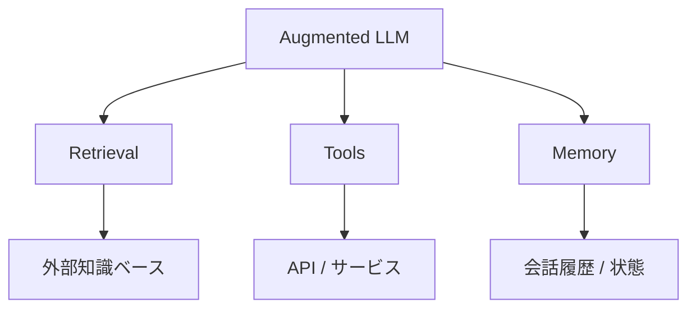
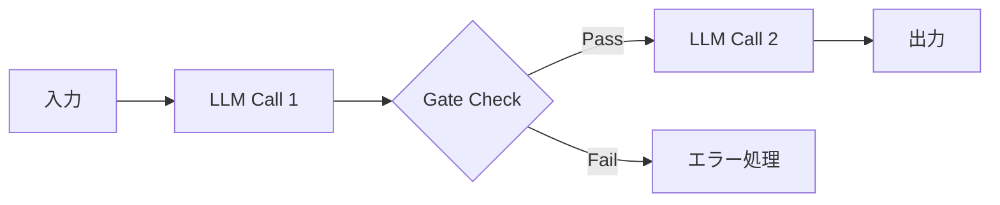
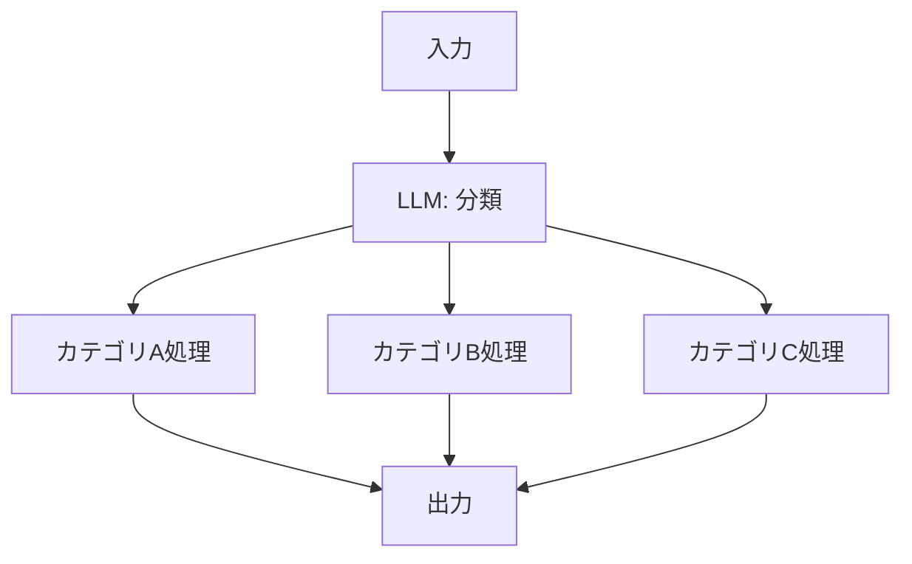
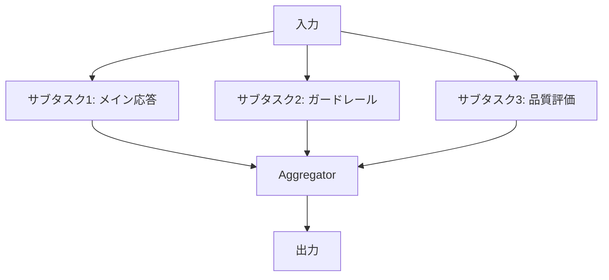
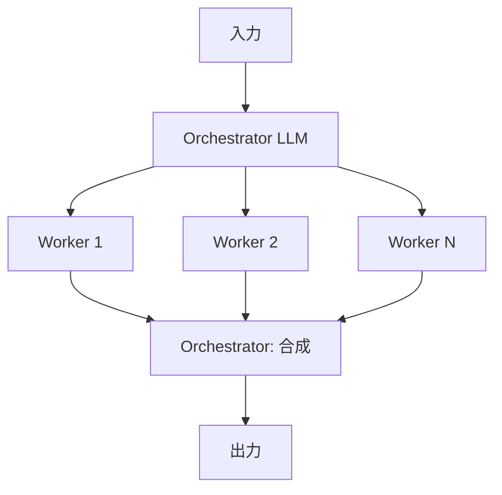
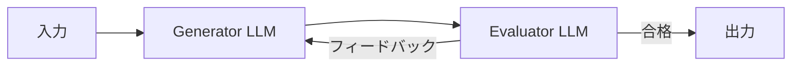

## ブログ概要（Summary）

本記事は [https://www.anthropic.com/research/building-effective-agents](https://www.anthropic.com/research/building-effective-agents) の解説記事です。

Anthropicの Erik S. と Barry Zhang が2024年12月19日に公開したこのブログ記事は、LLMベースのエージェントシステムを構築する際の設計パターンを体系的に整理したものである。著者らは数十のチームとの協業経験から、最も成功した実装は複雑なフレームワークではなく**シンプルで組み合わせ可能なパターン**を用いたものであったと述べている。ブログでは「ワークフロー」（事前定義されたコードパスでLLMとツールをオーケストレーション）と「エージェント」（LLMが動的に自身のプロセスとツール使用を指示）を明確に区別し、5つのワークフローパターン（Prompt Chaining、Routing、Parallelization、Orchestrator-Workers、Evaluator-Optimizer）とエージェントの設計指針を具体的に解説している。

この記事は [Zenn記事: Python asyncioで実装するエージェント非同期並列実行の7パターンとレート制限設計](https://zenn.dev/0h_n0/articles/1ba3ffb07291ed) の深掘りです。

## 情報源

- **種別**: 企業テックブログ
- **URL**: [https://www.anthropic.com/research/building-effective-agents](https://www.anthropic.com/research/building-effective-agents)
- **組織**: Anthropic
- **著者**: Erik S., Barry Zhang
- **発表日**: 2024年12月19日

## 技術的背景（Technical Background）

### なぜエージェントの設計パターンが重要か

LLMの能力が向上するにつれ、単一のプロンプトでは処理しきれない複雑なタスクをLLMに委ねる需要が高まっている。しかし、「エージェント」という用語の定義は業界内で統一されておらず、完全自律型のシステムから事前定義されたワークフローまで幅広い意味で使われている。

Anthropicはこのブログ記事において、これらを総称して「エージェンティックシステム（agentic systems）」と呼び、その中を2つのカテゴリに分類している。

- **ワークフロー（Workflows）**: 事前定義されたコードパスでLLMとツールをオーケストレーションするシステム
- **エージェント（Agents）**: LLMが動的に自身のプロセスとツール使用を指示し、タスクの完了方法を制御するシステム

この区別が重要である理由は、設計判断の根本に関わるからである。ワークフローは予測可能性と一貫性に優れるが柔軟性に欠け、エージェントは柔軟だがコストとエラー蓄積のリスクが高い。

### Augmented LLM: 基盤ブロック

著者らは、すべてのパターンの基盤となる概念として「Augmented LLM（拡張されたLLM）」を提示している。これは素のLLMに以下の3つの機能を付与したものである。

1. **検索（Retrieval）**: 外部知識ベースからの情報取得
2. **ツール（Tools）**: 外部APIやサービスの呼び出し
3. **メモリ（Memory）**: 過去のインタラクション履歴の保持

著者らは、現在のモデルはこれらの能力を能動的に利用でき、自ら検索クエリを生成し、適切なツールを選択し、保持すべき情報を判断できると述べている。実装手段の一つとしてModel Context Protocol（MCP）が言及されており、サードパーティツールとの接続を標準化する手法として紹介されている。



### ワークフロー vs. エージェント: 使い分けの判断基準

著者らは「まずシンプルに始める」ことを強く推奨している。多くのアプリケーションでは、検索とインコンテキスト例を組み合わせた最適化済みの単一LLM呼び出しで十分であり、エージェンティックシステムはそれでは不十分な場合にのみ導入すべきであると述べている。

判断基準として以下が示されている。

- **ワークフローを選ぶべき場合**: タスクが明確に定義されており、予測可能性と一貫性が重要な場合
- **エージェントを選ぶべき場合**: オープンエンドな問題で柔軟性が必要であり、ステップ数を事前に予測できない場合

ただし著者らは、エージェントにはコストの増加、エラーの複合的蓄積、モデルの判断に対する信頼の必要性という課題があるとも指摘している。サンドボックス環境での十分なテストとガードレールの設置を推奨している。

## 実装アーキテクチャ（Architecture）

### パターン1: Prompt Chaining（プロンプト連鎖）

タスクを逐次的なステップに分解し、各LLM呼び出しが前の出力を処理するパターンである。中間ステップにプログラム的な「ゲート」チェックを挿入することで、後続処理の品質を担保する。



**トレードオフ**: レイテンシが増加する代わりに、各ステップの精度が向上する。タスクを細分化することで、1回の呼び出しの難易度が下がるためである。

著者らが挙げる適用例は以下の通りである。

- マーケティングコピーを生成してから翻訳する
- アウトラインを作成し、基準に照らしてチェックし、本文を執筆する

**設計上の考慮点**: 各ステップのLLM呼び出しは独立しているため、asyncioの`await`で逐次実行する形式と自然に対応する。Zenn記事で解説されている非同期パターンでは、これはシンプルな`async/await`チェーンとして実装される。

### パターン2: Routing（ルーティング）

入力を分類し、その分類結果に基づいて専門化された後続処理に振り分けるパターンである。関心の分離を実現し、あるタイプの入力用のプロンプトが他のタイプの性能を劣化させることを防ぐ。



分類にはLLMを用いる方法と従来の分類器を用いる方法の両方が可能であると著者らは述べている。

著者らが挙げる適用例は以下の通りである。

- カスタマーサービスの問い合わせを一般質問・返金・技術サポートに振り分ける
- 簡単な質問には小さいモデル（Claude Haiku 4.5）を、難しい質問には高性能モデル（Claude Sonnet 4.5）を割り当てる

**コスト最適化の観点**: モデルサイズに基づくルーティングは、LLMの推論コストを大幅に削減する手法として注目に値する。全リクエストに高性能モデルを使うのではなく、難易度に応じてモデルを切り替えることで、品質を維持しつつコストを抑制できる。

### パターン3: Parallelization（並列化）

このパターンは、Zenn記事のテーマである非同期並列実行と最も直接的に関連する。著者らは2つのバリエーションを提示している。

#### Sectioning（セクショニング）

独立したサブタスクを同時に実行する。各サブタスクは異なるLLM呼び出しとして並列に処理される。



著者らが挙げる適用例は以下の通りである。

- ガードレールモデルがユーザー入力をスクリーニングしつつ、メインモデルが応答を生成する
- 自動評価において、各LLM呼び出しが異なる観点でスコアリングする

著者らは、「各考慮事項を個別のLLM呼び出しにする方が、1回の呼び出しで多くを処理するよりも優れている場合が多い」と述べている。この知見は実装上の重要な指針となる。

#### Voting（投票）

同一タスクを複数回実行し、多様な出力を集約する。

著者らが挙げる適用例は以下の通りである。

- 複数のプロンプトでコードの脆弱性をレビューする
- 異なるプロンプトでコンテンツの適切性を判定し、投票閾値で最終判断する

**asyncioとの対応**: Pythonの`asyncio.gather()`は、このSectioning/Votingの両パターンを自然に実装できる。Zenn記事で解説されている`asyncio.Semaphore`によるレート制限は、並列LLM呼び出しの実行数を制御する上で不可欠な機構である。

```python
import asyncio
from typing import Any


async def parallel_sectioning(
    input_data: str,
    tasks: list[callable],
    semaphore: asyncio.Semaphore,
) -> list[Any]:
    """Sectioningパターン: 独立サブタスクの並列実行

    Args:
        input_data: 入力データ
        tasks: 並列実行するタスク関数のリスト
        semaphore: 同時実行数を制限するセマフォ

    Returns:
        各タスクの結果リスト
    """
    async def run_with_limit(task: callable) -> Any:
        async with semaphore:
            return await task(input_data)

    return await asyncio.gather(
        *(run_with_limit(task) for task in tasks)
    )
```

### パターン4: Orchestrator-Workers（オーケストレータ-ワーカー）

中央のLLM（オーケストレータ）がタスクを動的に分解し、ワーカーLLMに委任し、結果を合成するパターンである。



**Parallelizationとの違い**: Parallelizationではサブタスクが事前に定義されているのに対し、Orchestrator-Workersではオーケストレータが入力に基づいてサブタスクを動的に決定する。この違いは設計上の柔軟性と予測可能性のトレードオフに直結する。

著者らが挙げる適用例は以下の通りである。

- 複数ファイルを変更するコーディングタスク
- 複数ソースから情報を収集する検索タスク

**asyncioによる実装**: オーケストレータの出力に基づいてワーカーを動的に生成する場合、`asyncio.create_task()`でワーカーを非同期に起動し、`asyncio.gather()`で結果を収集する構造となる。Zenn記事で解説されているタスクキュー・パターンはこの動的生成に適している。

```python
import asyncio
from dataclasses import dataclass


@dataclass
class SubTask:
    """オーケストレータが動的に生成するサブタスク定義"""
    description: str
    worker_prompt: str


async def orchestrator_workers(
    input_data: str,
    orchestrate: callable,
    execute_worker: callable,
    synthesize: callable,
    max_concurrent: int = 5,
) -> str:
    """Orchestrator-Workersパターンの実装

    Args:
        input_data: 入力データ
        orchestrate: サブタスク分解を行うオーケストレータ関数
        execute_worker: 各サブタスクを実行するワーカー関数
        synthesize: ワーカー結果を合成する関数
        max_concurrent: 最大同時実行ワーカー数

    Returns:
        合成された最終出力
    """
    subtasks: list[SubTask] = await orchestrate(input_data)

    semaphore = asyncio.Semaphore(max_concurrent)

    async def run_worker(task: SubTask) -> str:
        async with semaphore:
            return await execute_worker(task)

    results = await asyncio.gather(
        *(run_worker(task) for task in subtasks)
    )
    return await synthesize(results)
```

### パターン5: Evaluator-Optimizer（評価者-最適化者）

1つのLLMが応答を生成し、別のLLMがそれを評価してフィードバックを提供する。このプロセスをループで繰り返すことで、出力品質を反復的に改善する。



著者らは、このパターンが適している2つの条件を挙げている。

1. 人間のフィードバックがLLMの出力を実証的に改善できること
2. LLM自身がそのようなフィードバックを生成できること

著者らが挙げる適用例は以下の通りである。

- 文学翻訳において、翻訳→批評のループで品質を向上させる
- 検索タスクにおいて、評価者が追加検索の必要性を判断する

**制約と限界**: このパターンは反復回数に応じてコストとレイテンシが線形に増加する。停止条件（最大反復回数や品質閾値）の設計が不可欠であり、無限ループのリスクを考慮する必要がある。

### エージェント: 自律的なタスク実行

ワークフローパターンが事前定義された制御フローに依存するのに対し、エージェントは人間のコマンドから始まり、独立して計画・実行を行う。著者らは以下の設計原則を提示している。

1. **環境からのグラウンドトゥルース**: 各ステップでツール実行結果やコード実行結果から「真の状態」を収集する
2. **チェックポイント**: ブロッカーや重要な判断点で人間にフィードバックを求める
3. **停止条件**: 最大反復回数など、エージェントの暴走を防ぐ安全弁を設ける

著者らは、エージェントの実装は「ツールを使用するLLMをループ内に配置し、環境からのフィードバックに基づいて動作させる」というシンプルな構造であると述べている。そのため、**ツール設計がエージェントの性能を大きく左右する**と強調している。

## Agent-Computer Interface（ACI）の設計

著者らは、エージェントが使用するツールのインターフェース設計に、人間向けのHCI（Human-Computer Interface）と同等の注意を払うべきであると述べている。

### ツール設計の原則

1. **明確な記述**: ツールの説明文には使用例、エッジケース、入力形式の要件、他ツールとの境界を含める
2. **パラメータの設計**: 名前と説明は、ジュニア開発者向けのDocstringを書くように丁寧に記述する
3. **ポカヨケ（mistake-proofing）**: エラーを起こしにくい設計にする。著者らは、SWE-benchにおいてエージェントがルートディレクトリを離れた後に相対パスでエラーを起こす問題を、絶対パスの要求で解決した事例を紹介している

著者らは、プロンプト本体よりもツールの最適化に多くの時間を費やしたと述べている。この知見は、エージェント開発においてツール設計が過小評価されがちであることを示唆している。

### フォーマットに関する推奨事項

- モデルが出力にコミットする前に推論する余地を与える形式を使う
- オンライン上のテキストに近い形式を選ぶ
- diff形式のようなチャンク行数の事前計算が必要なフォーマットや、JSON内にコードを埋め込む際のエスケープ処理が必要なフォーマットは避ける

## Production Deployment Guide

Anthropicのワークフローパターンに基づくエージェンティックシステムを本番環境にデプロイするためのAWS構成ガイドを示す。

### AWS実装パターン（コスト最適化重視）

5つのワークフローパターンとエージェントを含むデプロイ構成を、トラフィック量別に示す。

| 構成 | トラフィック | 主要サービス | 月額概算 |
|---|---|---|---|
| **Small** | ~100 req/日 | Lambda + Bedrock + DynamoDB | $50-200 |
| **Medium** | ~1,000 req/日 | ECS Fargate + Bedrock + ElastiCache | $400-1,200 |
| **Large** | 10,000+ req/日 | EKS + Karpenter (Spot) + ElastiCache Cluster | $3,000-8,000 |

**Small構成の内訳**: Lambda（256MB, ルーティング+並列実行対応: ~$5）、Bedrock Claude Sonnet（100 req x 8K tokens: ~$160）、DynamoDB On-Demand（タスク状態管理: ~$5）、Step Functions（ワークフローオーケストレーション: ~$3）、CloudWatch Logs（~$3）。合計$176程度。Prompt Chaining・Routingは単一Lambda内で処理し、Parallelizationは`asyncio.gather()`でLambda内並列化する。

**Medium構成のポイント**: ECS Fargate（1 vCPU / 2GB RAM, 2タスク: ~$60）にエージェントアプリケーションを常駐させ、ElastiCache（cache.t3.micro: ~$15）でルーティング分類結果のキャッシュとレート制限カウンタを管理する。Orchestrator-Workersパターンはタスクキュー（SQS）経由でワーカーコンテナに分散する。

**Large構成のポイント**: EKS上でKarpenter Provisionerを使い、Spot Instances（m5.xlarge: On-Demand比最大90%削減）を優先的に割り当てる。Evaluator-Optimizerパターンの反復実行にはSQS FIFOキューによる順序保証を使用する。

**コスト削減テクニック**:
- Spot Instances活用でコンピュート費用を最大90%削減
- Routingパターンによるモデルサイズ最適化で推論費用を50-70%削減
- Bedrock Batch APIで非リアルタイムのVoting処理を50%削減
- Prompt Caching有効化で繰り返しシステムプロンプトのトークン費用を30-90%削減

**コスト試算の注意事項**: 上記は2026年10月時点のAWS ap-northeast-1（東京）リージョン料金に基づく概算値である。実際のコストはトラフィックパターン、並列化の度合い、Evaluator-Optimizerの反復回数により大きく変動する。最新料金は[AWS料金計算ツール](https://calculator.aws/)で確認されたい。

### Terraformインフラコード

#### Small構成（Serverless: Lambda + Step Functions + Bedrock）

```hcl
# Agentic Workflows - Small構成 (Serverless)
# 対象: ~100 req/日、月額 $50-200

terraform {
  required_version = ">= 1.9"
  required_providers {
    aws = { source = "hashicorp/aws", version = "~> 5.70" }
  }
}

provider "aws" {
  region = "ap-northeast-1"
}

# --- IAMロール（最小権限） ---
resource "aws_iam_role" "agent_lambda" {
  name = "agentic-workflow-lambda"
  assume_role_policy = jsonencode({
    Version = "2012-10-17"
    Statement = [{
      Action = "sts:AssumeRole"
      Effect = "Allow"
      Principal = { Service = "lambda.amazonaws.com" }
    }]
  })
}

resource "aws_iam_role_policy" "agent_lambda" {
  name = "agent-lambda-policy"
  role = aws_iam_role.agent_lambda.id
  policy = jsonencode({
    Version = "2012-10-17"
    Statement = [
      {
        Effect   = "Allow"
        Action   = ["bedrock:InvokeModel", "bedrock:InvokeModelWithResponseStream"]
        Resource = "arn:aws:bedrock:ap-northeast-1::foundation-model/anthropic.*"
      },
      {
        Effect   = "Allow"
        Action   = ["dynamodb:PutItem", "dynamodb:GetItem", "dynamodb:UpdateItem", "dynamodb:Query"]
        Resource = aws_dynamodb_table.task_state.arn
      },
      {
        Effect   = "Allow"
        Action   = ["logs:CreateLogGroup", "logs:CreateLogStream", "logs:PutLogEvents"]
        Resource = "arn:aws:logs:ap-northeast-1:*:*"
      }
    ]
  })
}

# --- DynamoDB（タスク状態管理、On-Demandでコスト最適化） ---
resource "aws_dynamodb_table" "task_state" {
  name         = "agentic-workflow-tasks"
  billing_mode = "PAY_PER_REQUEST"
  hash_key     = "task_id"
  range_key    = "step_id"

  attribute {
    name = "task_id"
    type = "S"
  }
  attribute {
    name = "step_id"
    type = "S"
  }

  server_side_encryption { enabled = true }
  point_in_time_recovery { enabled = true }

  ttl {
    attribute_name = "expires_at"
    enabled        = true
  }
}

# --- Lambda関数（ワークフローエンジン） ---
resource "aws_lambda_function" "workflow_engine" {
  function_name = "agentic-workflow-engine"
  role          = aws_iam_role.agent_lambda.arn
  handler       = "main.handler"
  runtime       = "python3.12"
  timeout       = 300  # Evaluator-Optimizerの反復を考慮
  memory_size   = 256  # asyncio並列実行バッファ

  filename         = "lambda_package.zip"
  source_code_hash = filebase64sha256("lambda_package.zip")

  environment {
    variables = {
      TASK_TABLE         = aws_dynamodb_table.task_state.name
      MAX_EVAL_ITERATIONS = "5"
      ROUTING_CACHE_TTL   = "300"
      MAX_PARALLEL_CALLS  = "10"
    }
  }

  tracing_config { mode = "Active" }
}

# --- CloudWatchアラーム（コスト監視） ---
resource "aws_cloudwatch_metric_alarm" "lambda_errors" {
  alarm_name          = "agentic-workflow-errors"
  comparison_operator = "GreaterThanThreshold"
  evaluation_periods  = 2
  metric_name         = "Errors"
  namespace           = "AWS/Lambda"
  period              = 300
  statistic           = "Sum"
  threshold           = 10
  alarm_description   = "エージェントワークフローのエラー率監視"
  dimensions = {
    FunctionName = aws_lambda_function.workflow_engine.function_name
  }
}
```

#### Large構成（Container: EKS + Karpenter + Spot）

```hcl
# Agentic Workflows - Large構成 (Container)
# 対象: 10,000+ req/日、月額 $3,000-8,000

module "eks" {
  source          = "terraform-aws-modules/eks/aws"
  version         = "~> 20.24"
  cluster_name    = "agentic-workflow-cluster"
  cluster_version = "1.31"

  vpc_id     = module.vpc.vpc_id
  subnet_ids = module.vpc.private_subnets

  cluster_endpoint_public_access = false
}

# --- Karpenter Provisioner（Spot優先で最大90%コスト削減） ---
resource "kubectl_manifest" "karpenter_nodepool" {
  yaml_body = yamlencode({
    apiVersion = "karpenter.sh/v1"
    kind       = "NodePool"
    metadata   = { name = "agentic-workers" }
    spec = {
      template = {
        spec = {
          requirements = [
            { key = "karpenter.sh/capacity-type", operator = "In", values = ["spot", "on-demand"] },
            { key = "node.kubernetes.io/instance-type", operator = "In", values = ["m5.xlarge", "m5.2xlarge", "m6i.xlarge"] },
          ]
          nodeClassRef = { group = "karpenter.k8s.aws", kind = "EC2NodeClass", name = "default" }
        }
      }
      limits   = { cpu = "100", memory = "400Gi" }
      disruption = {
        consolidationPolicy = "WhenEmptyOrUnderutilized"
        consolidateAfter    = "30s"
      }
    }
  })
}

# --- SQS（Orchestrator-Workers用タスクキュー） ---
resource "aws_sqs_queue" "worker_tasks" {
  name                       = "agentic-worker-tasks"
  visibility_timeout_seconds = 300
  message_retention_seconds  = 86400
  receive_wait_time_seconds  = 20

  redrive_policy = jsonencode({
    deadLetterTargetArn = aws_sqs_queue.worker_dlq.arn
    maxReceiveCount     = 3
  })
}

resource "aws_sqs_queue" "worker_dlq" {
  name                      = "agentic-worker-tasks-dlq"
  message_retention_seconds = 1209600  # 14日
}

# --- AWS Budgets（予算アラート） ---
resource "aws_budgets_budget" "monthly" {
  name         = "agentic-workflow-monthly-budget"
  budget_type  = "COST"
  limit_amount = "8000"
  limit_unit   = "USD"
  time_unit    = "MONTHLY"

  notification {
    comparison_operator       = "GREATER_THAN"
    threshold                 = 80
    threshold_type            = "PERCENTAGE"
    notification_type         = "ACTUAL"
    subscriber_email_addresses = ["ops-team@example.com"]
  }
}
```

### 運用・監視設定

#### CloudWatch Logs Insightsクエリ

```
# ワークフローパターン別の実行状況監視（1時間あたり）
fields @timestamp, @message
| filter @message like /prompt_chaining|routing|parallelization|orchestrator|evaluator/
| stats count() as invocations by pattern_type, bin(1h) as hour
| sort hour desc

# Routingパターンのモデル振り分け比率
fields @timestamp, model_id, routing_category
| filter @message like /routing_decision/
| stats count() as request_count by model_id
| sort request_count desc

# Evaluator-Optimizerの反復回数分布
fields @timestamp, task_id, iteration_count
| filter @message like /evaluator_loop_complete/
| stats avg(iteration_count) as avg_iterations, max(iteration_count) as max_iterations
```

#### CloudWatchカスタムメトリクス（Python）

```python
import boto3

cloudwatch = boto3.client("cloudwatch", region_name="ap-northeast-1")


def put_workflow_metrics(
    pattern_type: str,
    duration_ms: float,
    llm_calls: int,
    total_tokens: int,
) -> None:
    """ワークフロー実行メトリクスの送信

    Args:
        pattern_type: ワークフローパターン名
        duration_ms: 実行時間（ミリ秒）
        llm_calls: LLM呼び出し回数
        total_tokens: 総トークン数
    """
    dimensions = [{"Name": "PatternType", "Value": pattern_type}]
    cloudwatch.put_metric_data(
        Namespace="AgenticWorkflow",
        MetricData=[
            {
                "MetricName": "ExecutionDuration",
                "Value": duration_ms,
                "Unit": "Milliseconds",
                "Dimensions": dimensions,
            },
            {
                "MetricName": "LLMCallCount",
                "Value": llm_calls,
                "Unit": "Count",
                "Dimensions": dimensions,
            },
            {
                "MetricName": "TotalTokens",
                "Value": total_tokens,
                "Unit": "Count",
                "Dimensions": dimensions,
            },
        ],
    )
```

#### Cost Explorer自動レポート（Python）

```python
import datetime

import boto3


def get_daily_agentic_cost(sns_topic_arn: str, threshold: float = 200.0) -> dict:
    """日次コストレポート取得。閾値超過時にSNS通知

    Args:
        sns_topic_arn: 通知先SNSトピックARN
        threshold: コスト閾値（USD/日）

    Returns:
        サービス別コスト辞書
    """
    ce = boto3.client("ce", region_name="us-east-1")
    today = datetime.date.today()
    yesterday = today - datetime.timedelta(days=1)

    response = ce.get_cost_and_usage(
        TimePeriod={"Start": yesterday.isoformat(), "End": today.isoformat()},
        Granularity="DAILY",
        Metrics=["UnblendedCost"],
        GroupBy=[{"Type": "DIMENSION", "Key": "SERVICE"}],
        Filter={
            "Tags": {"Key": "Project", "Values": ["agentic-workflow"]}
        },
    )

    costs: dict[str, float] = {}
    total = 0.0
    for group in response["ResultsByTime"][0]["Groups"]:
        service = group["Keys"][0]
        amount = float(group["Metrics"]["UnblendedCost"]["Amount"])
        costs[service] = amount
        total += amount

    if total > threshold:
        sns = boto3.client("sns", region_name="ap-northeast-1")
        sns.publish(
            TopicArn=sns_topic_arn,
            Subject=f"Agentic Workflow日次コスト警告: ${total:.2f}",
            Message=f"日次コストが閾値${threshold}を超過しました。詳細: {costs}",
        )
    return costs
```

### コスト最適化チェックリスト

**アーキテクチャ選択**:
- [ ] トラフィック量に応じた構成を選択（~100 req/日: Serverless、~1,000: Hybrid、10,000+: Container）
- [ ] ワークフローパターンの選択による追加LLM呼び出しコストを見積もりに含める
- [ ] Evaluator-Optimizerの最大反復回数によるコスト上限を設計

**Routingによるモデルコスト最適化**:
- [ ] 入力分類器の精度検証（誤分類率が高いとコスト増加または品質低下）
- [ ] 小モデル（Haiku）/大モデル（Sonnet）の振り分け比率を監視
- [ ] 分類結果のキャッシュ（ElastiCache）で重複分類を削減

**並列化のコスト管理**:
- [ ] `asyncio.Semaphore`で同時実行LLM呼び出し数を制限
- [ ] Voting回数の上限設定（3-5回が推奨、それ以上は費用対効果が低下）
- [ ] Sectioning時の各サブタスクのトークン数を個別に監視

**LLMコスト削減**:
- [ ] Bedrock Batch API: 非リアルタイムのVoting処理で50%削減
- [ ] Prompt Caching有効化: 繰り返しシステムプロンプトで30-90%削減
- [ ] Evaluator-Optimizerの早期終了条件を品質メトリクスで設計
- [ ] トークン数制限: max_tokens設定でコスト上限を設定

**監視・アラート**:
- [ ] AWS Budgets: 月次予算アラート（80%/100%閾値）
- [ ] CloudWatch: パターン別実行メトリクスの可視化
- [ ] Cost Anomaly Detection: Evaluator-Optimizerの異常反復を検知
- [ ] 日次コストレポート: Cost Explorer APIで自動取得+SNS通知

**リソース管理**:
- [ ] 未使用リソース削除: 不要なLambda関数、ECSサービスの定期監査
- [ ] タグ戦略: `Project=agentic-workflow` で全リソースにタグ付与
- [ ] DynamoDBのTTL設定（タスク状態: 7日、ルーティングキャッシュ: 1日）
- [ ] 開発環境夜間停止: EKSノードのスケジュールドスケーリング
- [ ] CloudWatch Logsの保持期間を30日に設定

## パフォーマンス最適化（Performance）

著者らのブログ記事では具体的なベンチマーク数値は記載されていないが、各パターンのパフォーマンス特性を分析できる。

**Prompt Chainingのレイテンシ**: N段のチェーンでは、全体のレイテンシは各LLM呼び出しのレイテンシの合計 $L_{\text{total}} = \sum_{i=1}^{N} L_i$ となる。ゲートチェックの処理時間は通常LLM呼び出しに比べて無視できる程度である。

**Parallelizationの高速化**: Sectioningパターンでは、全体のレイテンシは最も遅いサブタスクに律速される。$L_{\text{total}} = \max(L_1, L_2, \ldots, L_K)$ となり、逐次実行に比べてK倍に近い高速化が期待できる。ただし、Zenn記事で解説されているように、レート制限により実効的な並列度は制限される。

$$
L_{\text{parallel}} = \max_{i \in \{1,\ldots,K\}} L_i \quad \text{vs.} \quad L_{\text{sequential}} = \sum_{i=1}^{K} L_i
$$

**Evaluator-Optimizerのコスト増**: 反復回数を $R$ とすると、LLM呼び出し回数は $2R$（生成1回+評価1回 x R回）となる。平均的な反復回数が2-3回であれば4-6回のLLM呼び出しが発生し、コストとレイテンシはそれに比例する。

**Routingのオーバーヘッド**: 分類のためのLLM呼び出しが1回追加される。ただし、分類結果に基づいてより小さいモデルにルーティングできる場合、全体的なコストは削減される。分類の精度と振り分け比率が総コストを決定する重要なパラメータとなる。

**最適化の指針**:
- 独立したサブタスクは常にParallelization（Sectioning）で並列化する
- Routingの分類結果はキャッシュ可能な場合が多く、TTL付きキャッシュで分類コストを削減できる
- Evaluator-Optimizerの停止条件は、品質メトリクスのプラトー検出で実装する

## 運用での学び（Production Lessons）

### フレームワークの選択

著者らは、フレームワークの使用について慎重な姿勢を示している。フレームワークはLLM呼び出し、ツール定義、チェーン構成を簡素化する一方で、抽象化レイヤーがプロンプトと応答を隠蔽し、デバッグを困難にすると述べている。

具体的な推奨事項として以下が挙げられている。

1. **LLM APIの直接呼び出しから始める**: 多くのパターンは数行のコードで実装可能
2. **フレームワークを使う場合は内部を理解する**: 内部動作の誤解がエラーの一般的な原因
3. **本番移行時に抽象化レイヤーを削減する**: 制御可能性と透明性を優先

著者らが言及しているフレームワークには、Claude Agent SDK、AWS Strands Agents SDK、Rivet（ドラッグ&ドロップ式GUI）、Vellum（ワークフロー構築・テストGUI）がある。

### シンプルさの価値

著者らは3つのコア原則を提示している。

1. **シンプルさ**: エージェントの設計をシンプルに保つ
2. **透明性**: エージェントの計画ステップを可視化する
3. **慎重なACI設計**: ツールのドキュメントとテストに注力する

最も成功した実装は複雑なフレームワークではなくシンプルで組み合わせ可能なパターンを用いたものであったという著者らの知見は、過度なエンジニアリングへの警告として重要である。

### エラーの複合的蓄積

エージェンティックシステムでは、各ステップのエラーが後続ステップに伝播し複合する。特にOrchestrator-Workersパターンでは、オーケストレータの分解判断の誤りがすべてのワーカーに影響する。Evaluator-Optimizerパターンでは、評価者の判断基準の誤りが生成物の品質を一貫して劣化させる。この問題に対し、著者らはサンドボックス環境での広範なテストを推奨している。

## 学術研究との関連（Academic Connection）

Anthropicのブログ記事で提示されたパターンは、ソフトウェアエンジニアリングと分散システムの研究に根ざしている。

**パイプラインパターン（Prompt Chaining）**: Unix哲学の「1つのことをうまくやるプログラムを書き、パイプで接続する」に相当する。ソフトウェアアーキテクチャにおけるPipes and Filtersパターン（Buschmann et al., 1996, "Pattern-Oriented Software Architecture"）の系譜にある。

**MapReduceとの関連（Parallelization）**: SectioningはMapフェーズに、Aggregatorの合成処理はReduceフェーズに対応する。Dean and Ghemawat (2004) "MapReduce: Simplified Data Processing on Large Clusters"（OSDI 2004）で提案された大規模データ処理の並列化パラダイムが、LLM呼び出しの並列化に応用されている。

**マスターワーカーパターン（Orchestrator-Workers）**: 分散コンピューティングにおけるMaster-Workerパターンの変種である。動的なタスク分解は、Blumofe and Leiserson (1999) "Scheduling Multithreaded Computations by Work Stealing"（JACM）で提案されたwork-stealingアルゴリズムの概念に通じる。

**反復的改善（Evaluator-Optimizer）**: 機械学習におけるGAN（Goodfellow et al., 2014）のGenerator-Discriminator構造と概念的に類似する。また、自然言語処理における自己改善ループ（Self-Refine: Madaan et al., 2023, NeurIPS 2023）の実装パターンと直接的に対応する。

## まとめと実践への示唆

Anthropicのブログ記事は、LLMベースのエージェンティックシステムの設計パターンを5つのワークフロー（Prompt Chaining、Routing、Parallelization、Orchestrator-Workers、Evaluator-Optimizer）とエージェントに分類し、各パターンの適用場面とトレードオフを体系的に整理した。

実践において最も重要な示唆は以下の3点である。

1. **シンプルに始める**: 最適化済みの単一LLM呼び出しで十分な場合が多く、エージェンティックシステムの導入はそれが不十分な場合にのみ行う
2. **ツール設計に投資する**: エージェントの性能はプロンプトよりもツールのインターフェース設計に大きく依存する
3. **パターンを組み合わせる**: 各パターンは排他的ではなく、Routing + Parallelization、Orchestrator-Workers + Evaluator-Optimizer のように組み合わせて使うことで、複雑なタスクに対応できる

ただし、本ブログ記事にはいくつかの制約がある。具体的なベンチマーク数値やコスト試算は示されておらず、パターン選択の定量的な判断基準は各組織が独自に検証する必要がある。また、ブログの主要な焦点はAnthropicのClaudeモデルとの組み合わせにあり、他のLLMプロバイダとの互換性や比較については言及されていない。

Zenn記事で解説されているPython asyncioの非同期パターンは、特にParallelization（Sectioning/Voting）とOrchestrator-Workersの実装において直接的に活用でき、レート制限設計と組み合わせることで本番環境で安定したエージェント並列実行を実現する基盤となる。

## 参考文献

- **Blog URL**: [Building Effective Agents（Anthropic公式）](https://www.anthropic.com/research/building-effective-agents)
- **Buschmann, F. et al. (1996)**: "Pattern-Oriented Software Architecture", Wiley
- **Dean, J. and Ghemawat, S. (2004)**: "MapReduce: Simplified Data Processing on Large Clusters", OSDI 2004
- **Blumofe, R. D. and Leiserson, C. E. (1999)**: "Scheduling Multithreaded Computations by Work Stealing", JACM, 46(5)
- **Goodfellow, I. et al. (2014)**: "Generative Adversarial Nets", NeurIPS 2014
- **Madaan, A. et al. (2023)**: "Self-Refine: Iterative Refinement with Self-Feedback", NeurIPS 2023
- **Related Zenn article**: [Python asyncioで実装するエージェント非同期並列実行の7パターンとレート制限設計](https://zenn.dev/0h_n0/articles/1ba3ffb07291ed)

---

*本記事はAI（Claude Code）により自動生成されました。内容の正確性については複数の情報源で検証していますが、実際の利用時は公式ドキュメントもご確認ください。*
