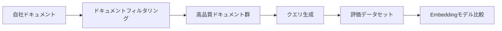
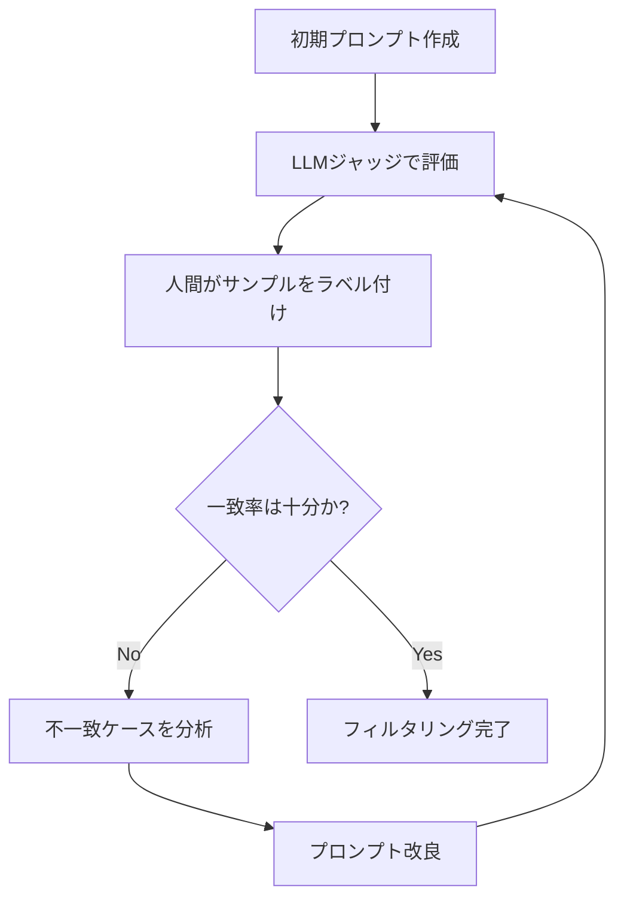

## ブログ概要（Summary）

本記事は [https://www.trychroma.com/research/generative-benchmarking](https://www.trychroma.com/research/generative-benchmarking) の解説記事です。

ChromaとWeights & Biasesが2025年4月頃に公開した技術レポート「Generative Benchmarking」は、公開ベンチマーク（MTEB、BEIRなど）がEmbeddingモデルの本番環境での性能を正確に反映しないという問題に対し、LLMを活用してユーザー自身のドキュメントから評価データセットを自動生成する手法を提案している。著者らは、LLMジャッジによるドキュメントフィルタリングとクエリ生成の2段階パイプラインを構築し、公開データセット9種での検証に加え、Weights & BiasesのチャットボットWandBotでの本番ケーススタディを通じて、生成された評価セットがモデル間の相対的なランキングを維持できることを示した。

この記事は [Zenn記事: Embeddingモデルの精度評価を3段階で実践する](https://zenn.dev/0h_n0/articles/53b0ab6e5b4af3) の深掘りです。

## 情報源

- **種別**: 企業テックブログ（技術レポート）
- **URL**: [https://www.trychroma.com/research/generative-benchmarking](https://www.trychroma.com/research/generative-benchmarking)
- **組織**: Chroma + Weights & Biases
- **発表日**: 2025年4月頃

## 技術的背景（Technical Background）

### なぜ公開ベンチマークでは不十分なのか

Embeddingモデルの評価において、MTEB（Massive Text Embedding Benchmark）やBEIRといった公開ベンチマークは業界標準として広く使われている。しかし、Chromaの著者らはこれらのベンチマークに根本的な限界があると指摘している。

第一に、**データ汚染（Data Contamination）の問題**がある。公開ベンチマークのデータはインターネット上で広くアクセス可能であるため、Embeddingモデルの学習データに含まれている可能性がある。モデルがベンチマークデータを「記憶」している場合、ベンチマーク上のスコアは汎化性能ではなく記憶力を測定していることになる。

第二に、**ドメインミスマッチ**の問題がある。公開ベンチマークはWikipedia、科学論文、一般的なニュース記事といったジェネリックなドメインのデータで構成されている。しかし、企業が実際にRAGシステムで扱うドメイン（社内ドキュメント、APIリファレンス、サポートチケットなど）とは大きく異なる。あるモデルがWikipediaベースのベンチマークで高スコアを出しても、社内の技術ドキュメント検索で同等の性能を発揮する保証はない。

第三に、**クエリ分布のずれ**がある。公開ベンチマークのクエリは、学術的に設計されたものであり、実際のユーザーが発する検索クエリのパターンや語彙とは異なる。たとえば、WandBot（Weights & Biasesのサポートチャットボット）のユーザーは「W&Bでsweepの結果をcompareするにはどうすればいいですか」のような具体的で略語を含むクエリを投げるが、公開ベンチマークにはこのようなクエリパターンは含まれていない。

著者らの報告で注目に値するのは、MTEBの英語タスクでtext-embedding-3-largeを上回るスコアを持つjina-embeddings-v3が、WandBotの本番データではtext-embedding-3-largeを下回ったという事実である。これは「ベンチマークでのランキングが本番環境のランキングと一致しない」ことの端的な証拠と言える。

### Generative Benchmarkingの着想

この問題に対する著者らのアプローチは明快である。本番環境での性能を測りたいのであれば、**本番環境のデータからベンチマークを生成すればよい**。具体的には、ユーザー自身のドキュメントコーパスからLLMを使って検索クエリを自動生成し、`(クエリ, 正解ドキュメント)` のペアからなる評価データセットを構築する。これにより、モデル選定時にドメイン固有のデータで評価でき、公開ベンチマークの限界を回避できる。



## 実装アーキテクチャ（Architecture）

Generative Benchmarkingのパイプラインは2段階で構成される。第1段階でドキュメントをフィルタリングし、第2段階でフィルタ済みドキュメントからクエリを生成する。

### 第1段階：LLMジャッジによるドキュメントフィルタリング

すべてのドキュメントが検索クエリの正解文書として適切とは限らない。たとえば、目次ページ、リダイレクトページ、内容が断片的なページなどは評価セットのノイズとなる。著者らはLLMジャッジ（Claude 3.5 Sonnet）を使って、各ドキュメントを以下の3つの基準で評価している。

1. **関連性（Relevance）**: ドキュメントがユーザーのユースケースに関連する情報を含んでいるか
2. **完全性（Completeness）**: ドキュメントが自己完結した情報を提供しているか（断片的でないか）
3. **意図（Intent）**: ドキュメントがユーザーの検索意図に応えうる内容を持っているか

#### EvalGENスタイルの反復改良

著者らは、LLMジャッジのプロンプトを一度作って終わりにするのではなく、**EvalGENスタイルの反復プロセス**で改良している。具体的には以下の手順である。

1. 初期プロンプトでLLMジャッジにドキュメントを評価させる
2. 人間がランダムサンプルをラベル付けし、LLMジャッジの判定と比較する
3. 不一致のケースを分析し、プロンプトを改良する
4. ステップ1-3を繰り返す

Chromaの報告によると、この反復を5イテレーション行った結果、人間ラベルとLLMジャッジの一致率が**46%から75.2%**に向上した。WandBotのケースでは、13,319のドキュメントから8,490のドキュメントに絞り込まれた（約36%を除外）。



この反復プロセスは一見すると手間がかかるように見えるが、著者らは全ドキュメントに人間がラベル付けするコストと比較すれば大幅に効率的であると述べている。ランダムサンプルへのラベル付けだけで済むためである。

#### フィルタリングの数学的定式化

LLMジャッジの判定を形式的に記述すると、ドキュメント $d$ に対する判定関数 $J$ は以下のように定義できる。

$$
J(d) = \begin{cases} 1 & \text{if } s_{\text{rel}}(d) \geq \tau_{\text{rel}} \land s_{\text{comp}}(d) \geq \tau_{\text{comp}} \land s_{\text{int}}(d) \geq \tau_{\text{int}} \\ 0 & \text{otherwise} \end{cases}
$$

ここで、$s_{\text{rel}}(d)$、$s_{\text{comp}}(d)$、$s_{\text{int}}(d)$ はそれぞれLLMジャッジが評価する関連性、完全性、意図のスコアであり、$\tau_{\text{rel}}$、$\tau_{\text{comp}}$、$\tau_{\text{int}}$ はそれぞれの閾値である。フィルタリング後のドキュメント集合 $D'$ は次のようになる。

$$
D' = \{d \in D \mid J(d) = 1\}
$$

WandBotの例では $|D| = 13{,}319$、$|D'| = 8{,}490$ であり、フィルタリング率は約36.3%であった。

### 第2段階：クエリ生成

フィルタリングされた各ドキュメント $d \in D'$ に対して、LLMが検索クエリを1つ生成する。このとき、単にドキュメントの内容を要約するようなクエリではなく、**実際のユーザーが発するであろう検索クエリ**を生成することが重要である。

著者らは2つのクエリ生成方式を比較している。

#### ナイーブ生成（Naive Generation）

ドキュメントのみをLLMに渡し、クエリを生成させる最もシンプルな方式である。しかし、この方式には重大な問題がある。生成されたクエリ同士の類似度が高くなりすぎる傾向がある。著者らの報告によると、英語Wikipediaデータセットでは生成されたクエリペアの**11.91%がquery-query類似度0.9超**であった。これは、LLMが似たようなテンプレート的クエリを繰り返し生成してしまうことを意味する。

#### Distinct生成（Distinct Generation）

ナイーブ生成の問題を解決するため、著者らはground-truthのクエリ（実際のユーザークエリの例）を**ネガティブ例**としてプロンプトに追加する方式を提案している。すなわち、「このようなクエリとは異なるクエリを生成せよ」という制約を与える。

この方式により、生成クエリ間の平均query-query類似度が**0.716から0.628に低下**した。これは、より多様なクエリが生成されていることを示す。

加えて、著者らは**ユースケースコンテキスト**と**実際のユーザークエリの例**をプロンプトに含めることで、生成されるクエリの分布を本番環境のクエリ分布に近づけている。

```python
from dataclasses import dataclass


@dataclass
class QueryGenerationPrompt:
    """Generative Benchmarkingにおけるクエリ生成プロンプトの構造。

    Chromaの手法に基づき、ドキュメント・コンテキスト・
    ネガティブ例を組み合わせてクエリを生成する。
    """

    document: str
    use_case_context: str
    example_queries: list[str]
    negative_examples: list[str]

    def build_prompt(self) -> str:
        """LLMに渡すプロンプトを構築する。

        Returns:
            str: クエリ生成用プロンプト文字列
        """
        negative_section = ""
        if self.negative_examples:
            examples = "\n".join(
                f"- {q}" for q in self.negative_examples
            )
            negative_section = (
                f"\n以下のようなクエリとは異なるクエリを生成してください:\n"
                f"{examples}\n"
            )

        example_section = ""
        if self.example_queries:
            examples = "\n".join(
                f"- {q}" for q in self.example_queries
            )
            example_section = (
                f"\n実際のユーザークエリの例:\n{examples}\n"
            )

        return (
            f"ユースケース: {self.use_case_context}\n\n"
            f"以下のドキュメントに対して、ユーザーが検索エンジンに"
            f"入力しそうなクエリを1つ生成してください。\n\n"
            f"ドキュメント:\n{self.document}\n"
            f"{example_section}"
            f"{negative_section}"
        )
```

#### クエリ品質の評価指標

生成されたクエリセット $Q_{\text{gen}}$ の品質を評価するために、著者らは主に以下の指標を用いている。

**query-query類似度**: 生成されたクエリ間の類似度分布。高すぎる場合はクエリの多様性が不足している。

$$
\text{sim}(q_i, q_j) = \frac{\mathbf{e}(q_i) \cdot \mathbf{e}(q_j)}{\|\mathbf{e}(q_i)\| \cdot \|\mathbf{e}(q_j)\|}
$$

ここで $\mathbf{e}(q)$ はクエリ $q$ のEmbeddingベクトルである。

**KL divergence**: 生成クエリによるモデルランキング分布と、ground-truthクエリによるモデルランキング分布の乖離度。

$$
D_{\text{KL}}(P_{\text{gt}} \| P_{\text{gen}}) = \sum_{m \in \mathcal{M}} P_{\text{gt}}(m) \log \frac{P_{\text{gt}}(m)}{P_{\text{gen}}(m)}
$$

ここで $\mathcal{M}$ は評価対象のモデル集合、$P_{\text{gt}}(m)$ はground-truthクエリでのモデル $m$ のRecall@10を正規化した分布、$P_{\text{gen}}(m)$ は生成クエリでのそれである。KL divergenceが小さいほど、生成クエリがground-truthクエリと同等のモデルランキングを再現できていることを意味する。

## パフォーマンス（Performance）

### 公開データセットでの検証

著者らは手法の妥当性を検証するため、まず9つの公開データセットで実験を行っている。

**使用データセット**:
- Wikipedia多言語（英語、フランス語、ドイツ語、スペイン語、イタリア語、ポルトガル語の6言語）
- LegalBench（法律ドメイン）
- SciFact（科学論文ドメイン）
- MedicalQA（医療ドメイン）

**評価対象モデル**: 5つのEmbeddingモデル（具体的なモデル名は報告中で言及）

#### ナイーブ生成 vs Distinct生成

| 指標 | ナイーブ生成 | Distinct生成 |
|------|------------|-------------|
| 平均query-query類似度 | 0.716 | 0.628 |
| query-query類似度 > 0.9の割合（英語Wikipedia） | 11.91% | 低減 |

Distinct生成により、クエリの多様性が向上していることが確認された。

#### モデルランキングの再現性

著者らの報告によると、生成クエリはground-truthクエリと**相対的なモデルランキングを維持**している。KL divergenceは0.0532から0.217の範囲であった。この値は、生成クエリによるモデルの相対的な序列が、ground-truthクエリによるそれと概ね一致していることを示す。

### WandBot本番ケーススタディ

より実践的な検証として、著者らはWeights & BiasesのサポートチャットボットWandBotのデータを用いたケーススタディを実施している。

**データ規模**:
- ドキュメント数: 13,319（フィルタリング後: 8,490）
- Ground-truthクエリ: 2,003ユニーククエリ
- 手動ラベル: 693件

#### Recall@10の比較

以下の表は、ground-truthクエリと生成クエリそれぞれでのRecall@10を示している。

| モデル | Ground Truth | Generated | 差分 |
|--------|-------------|-----------|------|
| text-embedding-3-small | 0.439 | 0.530 | +0.091 |
| text-embedding-3-large | 0.552 | 0.602 | +0.050 |
| jina-embeddings-v3 | 0.511 | 0.532 | +0.021 |
| voyage-3-large | 0.670 | 0.679 | +0.009 |

Chromaの報告によると、生成クエリでのRecall@10は全モデルでground-truthよりも高めに出ている。これは生成されたクエリがドキュメントから直接生成されるため、ground-truthのクエリよりもドキュメントとの関連が強いことに起因すると考えられる。

しかし、**モデル間の相対的な順位は一致している**。すなわち、voyage-3-large > text-embedding-3-large > jina-embeddings-v3 > text-embedding-3-small という序列は、ground-truthでも生成クエリでも同じである。これが最も重要な知見であり、モデル選定という目的においては絶対的なスコアよりも相対的なランキングが重要だからである。

#### コンテキストと例の効果

著者らは、クエリ生成時にユースケースコンテキストと実際のユーザークエリの例を提供することの効果も検証している。

| 生成方式 | KL divergence |
|---------|--------------|
| コンテキスト・例あり | 0.159 |
| ナイーブ生成 | 0.207 |

コンテキストと例を提供した場合、KL divergenceが0.207から0.159に改善しており、より正確なモデルランキングの再現が可能になっている。

#### ベンチマーク vs 本番の乖離

WandBotのケースで特に注目すべきは、MTEBベンチマークと本番データでのモデルランキングの乖離である。

> **jina-embeddings-v3はMTEBの英語タスクではtext-embedding-3-largeを上回るスコアを持つが、WandBotの本番データでは下回った。**

この事実は、Generative Benchmarkingの必要性を端的に示している。公開ベンチマークのスコアだけでモデルを選定すると、本番環境で最適でないモデルを採用するリスクがある。

```python
from dataclasses import dataclass


@dataclass
class BenchmarkResult:
    """ベンチマーク結果のデータクラス。

    ground-truthと生成クエリの両方の結果を保持し、
    モデルランキングの一致度を計算する。
    """

    model_name: str
    recall_at_10_gt: float
    recall_at_10_gen: float

    @property
    def rank_consistent(self) -> bool:
        """ランキングの一貫性を判定する。

        Returns:
            bool: 相対ランキングが一致していればTrue
        """
        return (self.recall_at_10_gt > 0.5) == (
            self.recall_at_10_gen > 0.5
        )


def compute_kl_divergence(
    gt_scores: list[float],
    gen_scores: list[float],
    epsilon: float = 1e-10,
) -> float:
    """モデルスコア分布間のKL divergenceを計算する。

    Args:
        gt_scores: ground-truthクエリでの各モデルのスコア
        gen_scores: 生成クエリでの各モデルのスコア
        epsilon: ゼロ除算防止用の微小値

    Returns:
        float: KL divergence値（小さいほどランキングが一致）
    """
    import math

    total_gt = sum(gt_scores)
    total_gen = sum(gen_scores)

    p_gt = [s / total_gt for s in gt_scores]
    p_gen = [s / total_gen for s in gen_scores]

    kl = 0.0
    for p, q in zip(p_gt, p_gen):
        q_safe = max(q, epsilon)
        if p > 0:
            kl += p * math.log(p / q_safe)

    return kl
```

## 運用での学び（Production Lessons）

### 制約と注意点

著者らは本手法の限界についても率直に述べている。

**1. 本番データセットでの検証が限定的**: WandBotという1つの本番データセットでのみ検証されている。他のドメイン（医療、法律、金融など）や他のアプリケーション形態（コード検索、画像検索など）での有効性は未確認である。

**2. マッチング文書のないクエリの除外**: 評価時に、コーパス内にマッチする文書がないクエリはground-truthから除外されている。実際の本番環境では、ユーザーがコーパスに存在しない情報を検索することは珍しくなく、このようなクエリへの対応（例: 検索結果なしと適切に返す能力）は評価対象外となっている。

**3. LLMジャッジの品質への依存**: フィルタリングの品質はLLMジャッジの性能に依存する。著者らはClaude 3.5 Sonnetを使用しているが、異なるLLMを使用した場合の結果の安定性については検証されていない。

**4. クエリの多様性の限界**: Distinct生成によりクエリの多様性は改善されるが、LLMが生成するクエリは本質的にLLMの「想像力」に制約される。実際のユーザーが発する予期しないクエリパターン（タイポ、略語、複数言語の混在など）を完全に再現することは難しい。

### 実運用で考慮すべき点

著者らの知見を踏まえ、実運用においては以下の点を考慮すべきである。

- **定期的な再生成**: ドキュメントが更新されるたびに評価セットも再生成する必要がある。古い評価セットでは新しいドキュメントとのマッチングが評価されない
- **ユーザークエリの収集**: 可能であれば、実際のユーザークエリを収集してDistinct生成のネガティブ例やコンテキスト例として活用する。これによりKL divergenceが低下する（0.207 -> 0.159）ことが示されている
- **複数ドメインでの検証**: 自社のドキュメントが複数ドメイン（例: APIリファレンスとチュートリアル）にまたがる場合、ドメインごとに評価セットを生成し、ドメイン別のモデル性能を確認することが望ましい

## 学術研究との関連（Academic Connection）

Generative Benchmarkingは、いくつかの学術的な研究の流れを汲んでいる。

**EvalGEN（Kim et al.）**: 著者らが明示的に参照しているのがEvalGENのフレームワークである。EvalGENは、LLMベースの評価器を人間のフィードバックで反復的に改良するプロセスを体系化したものであり、Generative Benchmarkingのドキュメントフィルタリング段階はこの手法を応用している。

**MTEB（Muennighoff et al., 2023）**: Massive Text Embedding Benchmarkは、Embeddingモデルの評価を標準化した重要な取り組みである。Generative Benchmarkingはこれを否定するものではなく、**補完する**ものと位置づけられる。MTEBで汎用的な性能を確認した上で、Generative Benchmarkingでドメイン固有の性能を検証するという使い分けが適切である。

**BEIR（Thakur et al., 2021）**: BEIRはゼロショットの情報検索ベンチマークであり、ドメイン外での汎化性能を測定する。Generative Benchmarkingが対処する「ドメイン内での性能」とは逆のアプローチであり、両者は相互補完的な関係にある。

**Synthetic Data Generation**: 近年、LLMを用いた合成データ生成の研究が活発であり、Generative Benchmarkingもこの流れに位置づけられる。ただし、一般的な合成データ生成が学習データの拡張を目的とするのに対し、Generative Benchmarkingは**評価データの生成**に特化している点が特徴である。

## Production Deployment Guide

Generative Benchmarkingの評価パイプラインをAWS上にデプロイするためのガイドを示す。本パイプラインは（1）ドキュメントフィルタリング、（2）クエリ生成、（3）Embeddingモデル評価の3フェーズで構成される。

### AWS実装パターン（コスト最適化重視）

**トラフィック量別の推奨構成**:

- **Small（週次評価、~100ドキュメント）**: Lambda + Bedrock構成。ドキュメントフィルタリングとクエリ生成をLambdaで実行し、LLMジャッジにはBedrock（Claude 3.5 Sonnet）を使用する。Embeddingの計算はSageMaker Serverless Endpointで実行。月額$50-150。
  - Lambda: フィルタリング・クエリ生成のオーケストレーション
  - Bedrock: LLMジャッジ（ドキュメント評価・クエリ生成）
  - SageMaker Serverless: Embeddingモデルの推論
  - S3: ドキュメント・評価セット・結果の保存
  - DynamoDB: 評価履歴の管理

- **Medium（日次評価、~1,000ドキュメント）**: ECS Fargate + Bedrock構成。バッチ処理でドキュメントを並列フィルタリングし、クエリ生成も並列化する。月額$300-800。
  - ECS Fargate: バッチ処理のオーケストレーション
  - Bedrock Batch API: LLMジャッジの大量処理（50%コスト削減）
  - SageMaker Real-time Endpoint: Embeddingモデルの推論
  - Step Functions: パイプライン全体のワークフロー管理

- **Large（継続的評価、10,000+ドキュメント）**: EKS + Spot + Bedrock構成。大規模ドキュメントの継続的な評価パイプラインを運用する。月額$2,000-5,000。
  - EKS + Karpenter: コンテナオーケストレーション（Spot優先）
  - Bedrock Batch API: 大量のLLMジャッジ処理
  - SageMaker Multi-Model Endpoint: 複数Embeddingモデルの同時評価
  - MWAA (Managed Airflow): パイプラインスケジューリング

**コスト試算の注意事項**: 上記のコストは記事生成時点のAWS ap-northeast-1（東京）リージョン料金に基づく概算値である。実際のコストはドキュメント数、LLMジャッジの呼び出し回数、Embeddingモデルの推論回数により変動する。最新料金はAWS料金計算ツールで確認を推奨する。

### Terraformインフラコード

#### Small構成（Serverless）

```hcl
# Generative Benchmarking評価パイプライン - Small構成
# Lambda + Bedrock + SageMaker Serverless

terraform {
  required_version = ">= 1.5"
  required_providers {
    aws = {
      source  = "hashicorp/aws"
      version = "~> 5.0"
    }
  }
}

provider "aws" {
  region = "ap-northeast-1"
}

# S3バケット: ドキュメント・評価セット・結果の保存
resource "aws_s3_bucket" "eval_data" {
  bucket = "gen-benchmark-eval-data-${data.aws_caller_identity.current.account_id}"

  tags = {
    Project = "generative-benchmarking"
    Env     = "small"
  }
}

resource "aws_s3_bucket_versioning" "eval_data" {
  bucket = aws_s3_bucket.eval_data.id
  versioning_configuration {
    status = "Enabled"
  }
}

# DynamoDB: 評価履歴の管理
resource "aws_dynamodb_table" "eval_history" {
  name         = "gen-benchmark-eval-history"
  billing_mode = "PAY_PER_REQUEST"
  hash_key     = "eval_id"
  range_key    = "timestamp"

  attribute {
    name = "eval_id"
    type = "S"
  }

  attribute {
    name = "timestamp"
    type = "S"
  }

  tags = {
    Project = "generative-benchmarking"
  }
}

# IAMロール: Lambda実行用（最小権限）
resource "aws_iam_role" "lambda_exec" {
  name = "gen-benchmark-lambda-exec"

  assume_role_policy = jsonencode({
    Version = "2012-10-17"
    Statement = [{
      Action = "sts:AssumeRole"
      Effect = "Allow"
      Principal = {
        Service = "lambda.amazonaws.com"
      }
    }]
  })
}

resource "aws_iam_role_policy" "lambda_policy" {
  name = "gen-benchmark-lambda-policy"
  role = aws_iam_role.lambda_exec.id

  policy = jsonencode({
    Version = "2012-10-17"
    Statement = [
      {
        Effect = "Allow"
        Action = [
          "bedrock:InvokeModel",
          "bedrock:InvokeModelWithResponseStream"
        ]
        Resource = "arn:aws:bedrock:ap-northeast-1::foundation-model/anthropic.claude-3-5-sonnet-*"
      },
      {
        Effect = "Allow"
        Action = [
          "s3:GetObject",
          "s3:PutObject",
          "s3:ListBucket"
        ]
        Resource = [
          aws_s3_bucket.eval_data.arn,
          "${aws_s3_bucket.eval_data.arn}/*"
        ]
      },
      {
        Effect = "Allow"
        Action = [
          "dynamodb:PutItem",
          "dynamodb:GetItem",
          "dynamodb:Query"
        ]
        Resource = aws_dynamodb_table.eval_history.arn
      },
      {
        Effect = "Allow"
        Action = [
          "logs:CreateLogGroup",
          "logs:CreateLogStream",
          "logs:PutLogEvents"
        ]
        Resource = "arn:aws:logs:*:*:*"
      }
    ]
  })
}

# Lambda関数: ドキュメントフィルタリング
resource "aws_lambda_function" "doc_filter" {
  function_name = "gen-benchmark-doc-filter"
  role          = aws_iam_role.lambda_exec.arn
  handler       = "handler.filter_documents"
  runtime       = "python3.12"
  timeout       = 900
  memory_size   = 1024

  filename         = "lambda/doc_filter.zip"
  source_code_hash = filebase64sha256("lambda/doc_filter.zip")

  environment {
    variables = {
      EVAL_BUCKET    = aws_s3_bucket.eval_data.id
      HISTORY_TABLE  = aws_dynamodb_table.eval_history.name
      BEDROCK_MODEL  = "anthropic.claude-3-5-sonnet-20241022-v2:0"
    }
  }

  tags = {
    Project = "generative-benchmarking"
  }
}

# Lambda関数: クエリ生成
resource "aws_lambda_function" "query_gen" {
  function_name = "gen-benchmark-query-gen"
  role          = aws_iam_role.lambda_exec.arn
  handler       = "handler.generate_queries"
  runtime       = "python3.12"
  timeout       = 900
  memory_size   = 512

  filename         = "lambda/query_gen.zip"
  source_code_hash = filebase64sha256("lambda/query_gen.zip")

  environment {
    variables = {
      EVAL_BUCKET   = aws_s3_bucket.eval_data.id
      HISTORY_TABLE = aws_dynamodb_table.eval_history.name
      BEDROCK_MODEL = "anthropic.claude-3-5-sonnet-20241022-v2:0"
    }
  }

  tags = {
    Project = "generative-benchmarking"
  }
}

# CloudWatchアラーム: Lambda実行時間
resource "aws_cloudwatch_metric_alarm" "lambda_duration" {
  alarm_name          = "gen-benchmark-lambda-duration"
  comparison_operator = "GreaterThanThreshold"
  evaluation_periods  = 2
  metric_name         = "Duration"
  namespace           = "AWS/Lambda"
  period              = 300
  statistic           = "Average"
  threshold           = 600000
  alarm_description   = "Lambda execution time exceeds 10 minutes"

  dimensions = {
    FunctionName = aws_lambda_function.doc_filter.function_name
  }
}

data "aws_caller_identity" "current" {}
```

#### Large構成（Container）

```hcl
# Generative Benchmarking評価パイプライン - Large構成
# EKS + Karpenter + Spot Instances

# EKSクラスタ
module "eks" {
  source  = "terraform-aws-modules/eks/aws"
  version = "~> 20.0"

  cluster_name    = "gen-benchmark-cluster"
  cluster_version = "1.30"

  vpc_id     = module.vpc.vpc_id
  subnet_ids = module.vpc.private_subnets

  eks_managed_node_groups = {
    system = {
      instance_types = ["m6i.large"]
      min_size       = 2
      max_size       = 3
      desired_size   = 2

      labels = {
        role = "system"
      }
    }
  }

  tags = {
    Project = "generative-benchmarking"
    Env     = "large"
  }
}

# Karpenter Provisioner（Spot優先）
resource "kubectl_manifest" "karpenter_provisioner" {
  yaml_body = <<-YAML
    apiVersion: karpenter.sh/v1beta1
    kind: NodePool
    metadata:
      name: gen-benchmark-workers
    spec:
      template:
        spec:
          requirements:
            - key: karpenter.sh/capacity-type
              operator: In
              values: ["spot", "on-demand"]
            - key: node.kubernetes.io/instance-type
              operator: In
              values: ["m6i.xlarge", "m6i.2xlarge", "m5.xlarge", "m5.2xlarge"]
          nodeClassRef:
            name: default
      limits:
        cpu: "128"
        memory: 512Gi
      disruption:
        consolidationPolicy: WhenUnderutilized
        expireAfter: 720h
  YAML
}

# Secrets Manager: APIキー管理
resource "aws_secretsmanager_secret" "embedding_api_keys" {
  name = "gen-benchmark/embedding-api-keys"

  tags = {
    Project = "generative-benchmarking"
  }
}

# Cost Explorerアラート
resource "aws_ce_anomaly_monitor" "cost_monitor" {
  name              = "gen-benchmark-cost-monitor"
  monitor_type      = "DIMENSIONAL"
  monitor_dimension = "SERVICE"
}

resource "aws_ce_anomaly_subscription" "alert" {
  name = "gen-benchmark-cost-alert"

  monitor_arn_list = [aws_ce_anomaly_monitor.cost_monitor.arn]

  frequency = "DAILY"

  threshold_expression {
    dimension {
      key           = "ANOMALY_TOTAL_IMPACT_ABSOLUTE"
      values        = ["100"]
      match_options = ["GREATER_THAN_OR_EQUAL"]
    }
  }

  subscriber {
    type    = "EMAIL"
    address = "alerts@example.com"
  }
}
```

### 運用・監視設定

```
# CloudWatch Logs Insights: 評価パイプラインのコスト異常検知
fields @timestamp, @message
| filter @message like /bedrock_cost/
| stats sum(bedrock_cost_usd) as total_cost by bin(1h)
| sort @timestamp desc
| limit 24
```

```
# CloudWatch Logs Insights: フィルタリング精度のモニタリング
fields @timestamp, filter_rate, agreement_rate, iteration
| filter @message like /filter_summary/
| stats avg(filter_rate) as avg_filter_rate,
        avg(agreement_rate) as avg_agreement
  by bin(1d)
| sort @timestamp desc
```

```hcl
# CloudWatchアラーム: Bedrockトークン使用量
resource "aws_cloudwatch_metric_alarm" "bedrock_tokens" {
  alarm_name          = "gen-benchmark-bedrock-token-usage"
  comparison_operator = "GreaterThanThreshold"
  evaluation_periods  = 1
  metric_name         = "InputTokenCount"
  namespace           = "AWS/Bedrock"
  period              = 3600
  statistic           = "Sum"
  threshold           = 1000000
  alarm_description   = "Bedrock input token usage exceeds 1M tokens/hour"

  alarm_actions = [aws_sns_topic.alerts.arn]
}

# X-Rayトレーシング設定
resource "aws_xray_sampling_rule" "gen_benchmark" {
  rule_name      = "gen-benchmark"
  priority       = 1000
  reservoir_size = 10
  fixed_rate     = 0.1
  url_path       = "*"
  host           = "*"
  http_method    = "*"
  service_type   = "*"
  service_name   = "gen-benchmark-*"
  resource_arn   = "*"
  version        = 1
}
```

```python
import boto3
from aws_xray_sdk.core import xray_recorder  # type: ignore[import-untyped]
from aws_xray_sdk.core import patch_all  # type: ignore[import-untyped]


patch_all()


@xray_recorder.capture("filter_documents")
def filter_documents_with_tracing(
    documents: list[dict[str, str]],
    bedrock_client: boto3.client,
) -> list[dict[str, str]]:
    """X-Rayトレーシング付きドキュメントフィルタリング。

    Args:
        documents: フィルタリング対象のドキュメントリスト
        bedrock_client: Bedrock APIクライアント

    Returns:
        list[dict[str, str]]: フィルタリング済みドキュメント
    """
    subsegment = xray_recorder.current_subsegment()
    if subsegment:
        subsegment.put_annotation("doc_count", len(documents))
        subsegment.put_metadata("model", "claude-3-5-sonnet")

    filtered = []
    for doc in documents:
        # LLMジャッジによる評価（実装は省略）
        if _judge_document(doc, bedrock_client):
            filtered.append(doc)

    if subsegment:
        subsegment.put_annotation("filtered_count", len(filtered))
        subsegment.put_annotation(
            "filter_rate",
            1.0 - len(filtered) / max(len(documents), 1),
        )

    return filtered
```

### コスト最適化チェックリスト

**アーキテクチャ選択**:
- [ ] 評価頻度に応じた構成選択（週次: Serverless、日次: Fargate、継続: EKS）
- [ ] ドキュメント数に応じたバッチサイズの調整
- [ ] リージョン選択（Bedrockモデルの可用性を確認）

**リソース最適化**:
- [ ] EKS使用時はSpot Instancesを優先（最大90%削減）
- [ ] Karpenterによる自動スケーリングで未使用リソースを削減
- [ ] Lambda使用時はメモリサイズの最適化（128MB単位で調整）

**LLMコスト削減**:
- [ ] Bedrock Batch API使用で50%コスト削減（非リアルタイム処理に適用）
- [ ] Prompt Caching有効化で30-90%削減（同一プロンプトの再利用時）
- [ ] ドキュメントフィルタリングの閾値調整でLLM呼び出し回数を最適化
- [ ] クエリ生成時のトークン上限設定

**監視・アラート**:
- [ ] AWS Budgetsで月額上限設定
- [ ] CloudWatch Logsでトークン使用量をモニタリング
- [ ] Cost Anomaly Detectionで異常コストを自動検知
- [ ] 日次コストレポートをSNS通知で配信

**リソース管理**:
- [ ] 古い評価セットのS3ライフサイクルポリシー設定（90日で低頻度アクセスクラスへ移行）
- [ ] DynamoDBのTTL設定で古い評価履歴を自動削除
- [ ] 未使用のSageMaker Endpointの自動停止スケジュール

## まとめと実践への示唆

Chromaが提唱するGenerative Benchmarkingは、Embeddingモデルの評価における「公開ベンチマークと本番環境の乖離」という実務的に重要な課題に対する実践的な解決策である。LLMジャッジによるドキュメントフィルタリング（EvalGENスタイルの反復改良で人間との一致率75.2%を達成）とクエリ生成の2段階パイプラインにより、ドメイン固有の評価セットを低コストで構築できる。

WandBotでの検証により、生成された評価セットがモデル間の相対的なランキングを維持すること、そしてMTEBでの順位と本番での順位が異なりうることが実証された。モデル選定において「自社データでの評価」が不可欠であるという知見は、RAGシステムを構築するすべてのチームにとって示唆に富む。

ただし、本番データセットでの検証が1つのみであること、マッチング文書のないクエリが除外されていることなど、手法の適用範囲には制約がある。自社への導入時には、まず小規模なサブセットで試行し、生成されたクエリの品質を人手で確認した上で本格運用に移行することを推奨する。

## 参考文献

- **Blog URL**: [https://www.trychroma.com/research/generative-benchmarking](https://www.trychroma.com/research/generative-benchmarking)
- **Chroma**: [https://www.trychroma.com/](https://www.trychroma.com/)
- **Weights & Biases**: [https://wandb.ai/](https://wandb.ai/)
- **MTEB**: Muennighoff et al., "MTEB: Massive Text Embedding Benchmark," 2023. [https://arxiv.org/abs/2210.07316](https://arxiv.org/abs/2210.07316)
- **BEIR**: Thakur et al., "BEIR: A Heterogeneous Benchmark for Zero-shot Evaluation of Information Retrieval Models," 2021. [https://arxiv.org/abs/2104.08663](https://arxiv.org/abs/2104.08663)
- **Related Zenn article**: [https://zenn.dev/0h_n0/articles/53b0ab6e5b4af3](https://zenn.dev/0h_n0/articles/53b0ab6e5b4af3)
