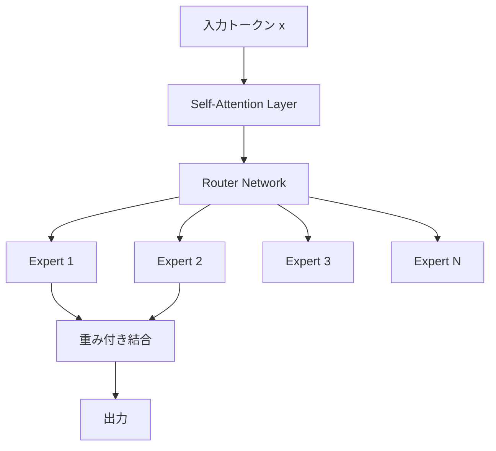
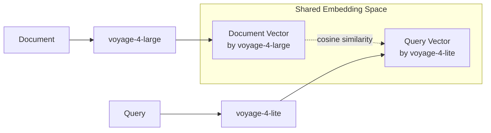

## ブログ概要（Summary）

本記事は [https://mongodb.com/company/blog/technical/moe-shared-embedding-spaces-how-voyage-4-scales-smarter](https://mongodb.com/company/blog/technical/moe-shared-embedding-spaces-how-voyage-4-scales-smarter) の解説記事です。

MongoDB と Voyage AI が共同で公開したこのテックブログでは、Voyage 4ファミリーのEmbeddingモデルに採用された2つの技術的革新を解説している。第一に、フラッグシップモデル voyage-4-large が採用する **Mixture of Experts（MoE）アーキテクチャ** により、TransformerのFFN層を複数のエキスパートネットワークに分割し、トークンごとに最適なエキスパートのみを活性化させることで、推論コストを抑えつつモデル容量を拡大している。第二に、**Shared Embedding Space** という設計により、ファミリー全モデル（large / base / lite / nano）が同一のベクトル空間にマッピングされ、異なるモデル間で互換性のあるEmbeddingを生成できる。この2つの組み合わせにより、ドキュメント埋め込みには高精度なlargeモデル、クエリ埋め込みには低コストなliteモデルを使う**非対称検索**が実現される。

この記事は [Zenn記事: Embeddingモデルの精度評価を3段階で実践する](https://zenn.dev/0h_n0/articles/53b0ab6e5b4af3) の深掘りです。

## 情報源

- **種別**: 企業テックブログ
- **URL**: [https://mongodb.com/company/blog/technical/moe-shared-embedding-spaces-how-voyage-4-scales-smarter](https://mongodb.com/company/blog/technical/moe-shared-embedding-spaces-how-voyage-4-scales-smarter)
- **組織**: MongoDB（Voyage AIとの共同記事）
- **発表年**: 2026年

## 技術的背景（Technical Background）

### Embeddingモデルのスケーリング課題

Embeddingモデルの品質を高めるためにモデルを大規模化すると、推論時の計算コストが線形以上に増大するという根本的な課題がある。テキストEmbeddingはRAG（Retrieval-Augmented Generation）パイプラインの検索品質を左右する基盤技術であり、検索精度の向上は直接的にLLMの生成品質に影響する。

従来のdenseモデル（すべてのパラメータを毎回の推論で使用するアーキテクチャ）では、モデルの全パラメータ数がそのまま推論コストに反映される。たとえば、パラメータ数を2倍にすれば計算量もおおむね2倍となる。これは、数百万件のドキュメントを埋め込む必要があるプロダクション環境では、コストとレイテンシの両面で深刻なボトルネックとなる。

Voyage 4ファミリーが取り組んだのは、この「精度とコストのトレードオフ」をアーキテクチャレベルで打破することである。具体的には、MoEによる効率的なパラメータ活用と、Shared Embedding Spaceによるモデル間互換性の2つのアプローチを組み合わせている。

### Voyage 4ファミリーの構成

MongoDB/Voyage AIのブログによると、Voyage 4ファミリーは以下の5つのモデルで構成される。

| モデル | アーキテクチャ | 特徴 |
|--------|---------------|------|
| voyage-4-large | MoE | フラッグシップ、ファミリー唯一のMoEモデル |
| voyage-4 | Dense（最適化済み） | ファミリーの標準モデル |
| voyage-4-base | Dense（最適化済み） | ファミリーメンバー |
| voyage-4-lite | Dense（最適化済み） | 低コスト・低レイテンシ、クエリEmbedding推奨 |
| voyage-4-nano | Dense（最適化済み） | オープンウェイト |

注目すべき点は、MoEアーキテクチャを採用しているのは voyage-4-large のみであり、他のモデルは最適化されたdenseアーキテクチャを使用していることである。これは、MoEの恩恵が十分なパラメータ規模を持つモデルで発揮されるという設計判断を反映していると考えられる。

## 実装アーキテクチャ（Architecture）

### Mixture of Experts（MoE）の基本構造

MoEの核心は、TransformerブロックのFeed-Forward Network（FFN）層を複数の小さなエキスパートネットワークに置換する設計にある。標準的なTransformerでは、各ブロックにSelf-Attention層とFFN層が含まれ、FFN層はすべてのトークンに対して同一のパラメータで処理を行う。MoEでは、このFFN層を $N$ 個のエキスパートネットワーク $\{E_1, E_2, \ldots, E_N\}$ に分割し、各トークンに対して top-$k$ 個のエキスパートのみを活性化させる。



### ルーティングメカニズム

MongoDB/Voyage AIのブログによると、各MoE層にはルーターネットワークが配置され、入力トークンごとにどのエキスパートを使用するかを決定する。ルーティングの数学的定式化は以下のようになる。

入力トークンの表現を $\mathbf{x} \in \mathbb{R}^{d}$ とする。ルーターは線形変換とsoftmaxにより、各エキスパートに対するルーティング確率を計算する。

$$
\mathbf{g} = \text{softmax}(\mathbf{W}_r \mathbf{x})
$$

ここで、
- $\mathbf{W}_r \in \mathbb{R}^{N \times d}$: ルーターの重み行列
- $\mathbf{g} \in \mathbb{R}^{N}$: 各エキスパートへのゲート値（ルーティング確率）
- $d$: トークンの隠れ次元数
- $N$: エキスパートの総数

ゲート値のうち上位 $k$ 個のエキスパートのみが選択され、MoE層の出力 $\mathbf{y}$ は選択されたエキスパートの出力の重み付き和として計算される。

$$
\mathbf{y} = \sum_{i \in \text{top-}k(\mathbf{g})} \tilde{g}_i \cdot E_i(\mathbf{x})
$$

ここで、
- $\text{top-}k(\mathbf{g})$: ゲート値が上位 $k$ 個であるエキスパートのインデックス集合
- $\tilde{g}_i$: 選択されたエキスパート間で再正規化されたゲート値
- $E_i(\mathbf{x})$: エキスパート $i$ の出力

再正規化は次のように行う。

$$
\tilde{g}_i = \frac{g_i}{\sum_{j \in \text{top-}k(\mathbf{g})} g_j}
$$

ブログでは、このルーティングが**トークン単位**で行われることが強調されている。すなわち、同一シーケンス内であっても、異なるトークンが異なるエキスパートの組み合わせによって処理される。これにより、文脈に応じたきめ細かい処理が可能となる。

### MoEルーティングの実装例

以下に、MoE層のルーティングと出力計算の概念的な実装を示す。

```python
import torch
import torch.nn as nn
import torch.nn.functional as F


class MoELayer(nn.Module):
    """Mixture of Experts Layer

    TransformerのFFN層を複数のエキスパートに置換し、
    ルーターネットワークがトークンごとにtop-kエキスパートを選択する。

    Args:
        d_model: 入力・出力の次元数
        d_ff: 各エキスパートのFFN中間次元数
        num_experts: エキスパートの総数
        top_k: 各トークンが使用するエキスパートの数
    """

    def __init__(
        self,
        d_model: int,
        d_ff: int,
        num_experts: int,
        top_k: int = 2,
    ) -> None:
        super().__init__()
        self.num_experts = num_experts
        self.top_k = top_k

        # ルーターネットワーク（線形変換）
        self.router = nn.Linear(d_model, num_experts, bias=False)

        # 各エキスパートは独立したFFN
        self.experts = nn.ModuleList([
            nn.Sequential(
                nn.Linear(d_model, d_ff),
                nn.GELU(),
                nn.Linear(d_ff, d_model),
            )
            for _ in range(num_experts)
        ])

    def forward(self, x: torch.Tensor) -> torch.Tensor:
        """MoE層の順伝播

        Args:
            x: 入力テンソル (batch_size, seq_len, d_model)

        Returns:
            出力テンソル (batch_size, seq_len, d_model)
        """
        batch_size, seq_len, d_model = x.shape

        # ルーティング確率の計算
        router_logits = self.router(x)  # (batch_size, seq_len, num_experts)

        # top-kエキスパートの選択
        top_k_logits, top_k_indices = torch.topk(
            router_logits, self.top_k, dim=-1
        )  # (batch_size, seq_len, top_k)

        # 選択されたエキスパート間でsoftmax正規化
        top_k_weights = F.softmax(top_k_logits, dim=-1)

        # 各トークンについてtop-kエキスパートの出力を重み付き結合
        output = torch.zeros_like(x)
        for k in range(self.top_k):
            expert_indices = top_k_indices[:, :, k]  # (batch_size, seq_len)
            weights = top_k_weights[:, :, k].unsqueeze(-1)  # (batch_size, seq_len, 1)

            for expert_idx in range(self.num_experts):
                mask = (expert_indices == expert_idx)
                if mask.any():
                    expert_input = x[mask]  # 該当トークンのみ抽出
                    expert_output = self.experts[expert_idx](expert_input)
                    output[mask] += weights[mask] * expert_output

        return output
```

### エキスパートの専門化

MongoDB/Voyage AIのブログでは、エキスパートが学習する「専門性」の性質について重要な指摘がなされている。各エキスパートは**トピックの専門家ではない**。すなわち、「医療テキスト専門のエキスパート」や「法律文書専門のエキスパート」といった意味的な専門化が起こるわけではない。

ブログによると、エキスパートが学習するのは以下のような**統計的パターン**である。

- **空間関係**: テキスト内の位置や構造に関するパターン
- **数値パターン**: 数値データの分布や関係性
- **トークン頻度**: 出現頻度に基づくトークンの特性
- **共起トークン**: トークン間の共起関係

この理解は実運用において重要な意味を持つ。MoEモデルは特定のドメインに偏った学習をしているわけではないため、汎用的なEmbeddingモデルとしての性質を維持しつつ、低レベルの統計的特徴を効率的に捉える能力を獲得している。

### MoEの計算効率

MoEアーキテクチャの計算効率上の利点を定量的に整理する。パラメータ総数が $P_{\text{total}}$ のMoEモデルにおいて、各推論ステップで実際に活性化されるパラメータ数は以下のようになる。

$$
P_{\text{active}} = P_{\text{shared}} + \frac{k}{N} \cdot P_{\text{expert}}
$$

ここで、
- $P_{\text{shared}}$: 共有パラメータ（Self-Attention層、ルーターなど）
- $P_{\text{expert}}$: 全エキスパートのパラメータ総数
- $k$: 各トークンが使用するエキスパート数
- $N$: エキスパートの総数

たとえば、$N = 8$, $k = 2$ の場合、エキスパート部分のパラメータの $2/8 = 25\%$ のみが各推論で使用される。これにより、モデルの知識容量（$P_{\text{total}}$）と推論コスト（$P_{\text{active}}$）を分離し、少ない計算量で大きなモデル容量を利用できる。

MongoDB/Voyage AIのブログによると、voyage-4-largeのサービングコストは同等のdenseモデルより**約40%低い**と報告されている。ただし、ブログではこの比較の具体的な条件（比較対象のdenseモデルの規模、ベンチマーク条件など）は明記されていない。

## Shared Embedding Space（共有ベクトル空間）

### 設計思想

Voyage 4ファミリーの第二の技術的革新が、**Shared Embedding Space** である。MongoDB/Voyage AIのブログによると、Voyage 4ファミリーの全モデル（large, base, lite, nano）が**同一の座標系**にEmbeddingをマッピングする。

通常、異なるEmbeddingモデルは独立した学習過程を経るため、それぞれ固有のベクトル空間を持つ。モデルAで埋め込んだベクトルとモデルBで埋め込んだベクトルの間でコサイン類似度を計算しても、意味のある結果は得られない。Voyage 4ファミリーでは、ファミリー内の全モデルが共通のベクトル空間を共有するよう訓練されているため、**異なるモデルで生成されたEmbedding間の比較が可能**である。



### 非対称検索（Asymmetric Retrieval）

Shared Embedding Spaceが実現する最も重要なユースケースが**非対称検索**である。ブログによると、ドキュメントの埋め込みには高精度な voyage-4-large を使用し、クエリの埋め込みには低コスト・低レイテンシの voyage-4-lite を使用できる。この組み合わせにおいて、**再インデックス（ドキュメントの再埋め込み）は不要**である。

この非対称検索が経済的に合理的である理由は、ドキュメントとクエリの埋め込みコスト構造の非対称性にある。

- **ドキュメント埋め込み**: インデックス構築時に**1回のみ**実行される。数百万件であっても初期コストとして許容できる
- **クエリ埋め込み**: ユーザーリクエストのたびに**継続的に**実行される。リクエスト数に比例してコストが増加する

したがって、継続的コストが発生するクエリ側を安価なモデルに置き換えることで、検索品質を維持しつつ運用コストを大幅に削減できる。

```python
from typing import Any


def asymmetric_embedding_cost_analysis(
    num_documents: int,
    daily_queries: int,
    days: int,
    cost_per_token_large: float,
    cost_per_token_lite: float,
    avg_doc_tokens: int = 512,
    avg_query_tokens: int = 32,
) -> dict[str, Any]:
    """非対称検索のコスト分析

    ドキュメントをlargeモデル、クエリをliteモデルで埋め込んだ場合の
    コスト比較を計算する。

    Args:
        num_documents: ドキュメント総数
        daily_queries: 1日あたりのクエリ数
        days: 運用日数
        cost_per_token_large: largeモデルのトークン単価
        cost_per_token_lite: liteモデルのトークン単価
        avg_doc_tokens: ドキュメントの平均トークン数
        avg_query_tokens: クエリの平均トークン数

    Returns:
        コスト分析結果の辞書
    """
    # ドキュメント埋め込みコスト（1回のみ、largeモデル）
    doc_embedding_cost = num_documents * avg_doc_tokens * cost_per_token_large

    # クエリ埋め込みコスト（継続的）
    total_queries = daily_queries * days
    # 非対称: liteモデル使用
    query_cost_asymmetric = total_queries * avg_query_tokens * cost_per_token_lite
    # 対称: largeモデル使用
    query_cost_symmetric = total_queries * avg_query_tokens * cost_per_token_large

    total_asymmetric = doc_embedding_cost + query_cost_asymmetric
    total_symmetric = doc_embedding_cost + query_cost_symmetric
    savings_pct = (1 - total_asymmetric / total_symmetric) * 100

    return {
        "doc_embedding_cost": doc_embedding_cost,
        "query_cost_asymmetric": query_cost_asymmetric,
        "query_cost_symmetric": query_cost_symmetric,
        "total_asymmetric": total_asymmetric,
        "total_symmetric": total_symmetric,
        "savings_percent": round(savings_pct, 1),
    }
```

### Shared Embedding Spaceの実現手法に関する考察

ブログでは Shared Embedding Space の訓練手法の詳細は公開されていない。しかし、一般的にこのような共有空間を実現する手法としては以下が考えられる（筆者の解釈）。

1. **知識蒸留（Knowledge Distillation）**: 大規模モデル（teacher）の出力空間に小規模モデル（student）を合わせる
2. **共通の射影層**: 異なるバックボーンの出力を共通の射影行列で同一空間に写像する
3. **マルチタスク学習**: 共有空間への射影を目的関数に含めた同時学習

いずれの手法であっても、核心的な制約は「小規模モデルの表現力が大規模モデルに比べて限定的である」ことであり、Shared Embedding Spaceの品質は最も能力の低いモデルの表現力によってある程度制約される可能性がある。ブログではモデル間の精度差に関する具体的な比較データは示されていない。

## パフォーマンス（Performance）

### 検索品質

MongoDB/Voyage AIのブログによると、voyage-4-largeはOpenAI v3 Largeを検索品質で**14.05%上回る**と報告されている。ただし、この数値については以下の点に留意が必要である。

- **データセット**: RTEBベンチマーク（29データセット: medical, code, web, finance, documentation, legal, conversational, long-document）を使用
- **評価指標**: ブログ内で具体的な指標（nDCG@10、MRR等）は明記されていない
- **per-domainスコア**: ドメインごとの詳細スコアは公開されていない
- **比較条件**: 次元数やコンテキスト長の設定など、比較条件の詳細は記載されていない

RTEBは多様なドメインと言語をカバーする包括的なEmbeddingベンチマークであり、29データセットでの評価は一定の信頼性がある。しかし、個別のユースケース（たとえば日本語テキストの検索）における性能は、このベンチマーク結果から直接推測することはできない。

### コスト効率

ブログが報告するコスト面の改善は以下の通りである。

| 指標 | 改善率 | 比較対象 |
|------|--------|----------|
| トークンあたりコスト | **33%削減** | voyage-3-large比 |
| サービングコスト | **約40%削減** | 同等denseモデル比 |

サービングコストの40%削減はMoEアーキテクチャの効果として理解できる。前述の通り、推論時に活性化されるパラメータがモデル全体の一部に限定されるため、GPU計算量が削減される。ただし、ブログではAPI価格、レイテンシの具体的な数値は明記されていない。

## Production Deployment Guide（MoE Embeddingモデルの非対称デプロイ）

Voyage 4ファミリーの非対称検索をAWS上で実現するための具体的なデプロイ構成を示す。

### AWS実装パターン（コスト最適化重視）

**トラフィック量別の推奨構成**:

| 規模 | 構成 | 月額概算 | 主要サービス |
|------|------|----------|-------------|
| Small (~100 req/日) | Serverless | $50-150 | Lambda + Voyage API + OpenSearch Serverless |
| Medium (~1,000 req/日) | Hybrid | $300-800 | ECS Fargate + Voyage API + OpenSearch |
| Large (10,000+ req/日) | Container | $2,000-5,000 | EKS + Spot + Voyage API + OpenSearch |

**Small構成の詳細**:
- Lambda: 128MB, 30秒タイムアウト, クエリEmbedding + 検索ロジック
- Voyage API: voyage-4-lite でクエリ埋め込み（外部API呼び出し）
- OpenSearch Serverless: ベクトルインデックス保持（voyage-4-largeで事前埋め込み済み）
- DynamoDB: メタデータ・キャッシュ（On-Demandモード）
- 月額内訳: Lambda $5 + OpenSearch Serverless $30-80 + Voyage API $10-50 + DynamoDB $5

**Large構成の詳細**:
- EKS: コントロールプレーン + Karpenter自動スケーリング
- Spot Instances: c6i.xlarge（4 vCPU, 8GB RAM）推論ワーカー
- OpenSearch: r6g.large.search x 3ノード（レプリカ構成）
- ElastiCache Redis: クエリEmbeddingキャッシュ（ヒット率向上でAPI呼び出し削減）
- 月額内訳: EKS $73 + Spot $150-400 + OpenSearch $800-1,500 + Redis $200 + Voyage API $500-2,000

**コスト削減テクニック**:
- Spot Instances活用で推論ワーカーコストを最大90%削減
- クエリEmbeddingキャッシュでVoyage API呼び出しを50-80%削減（同一クエリパターンの再利用）
- OpenSearch Reserved Instancesで最大36%削減（1年コミット）
- 非対称検索自体がコスト削減: クエリ側をvoyage-4-lite（voyage-4-largeの数分の一の価格）に置換

**コスト試算の注意事項**: 上記は2026年10月時点のAWS ap-northeast-1（東京）リージョン料金に基づく概算値である。実際のコストはトラフィックパターン、リージョン、Voyage APIの価格改定により変動する。最新料金はAWS料金計算ツールおよびVoyage AIの価格ページで確認を推奨する。

### Terraformインフラコード

**Small構成（Serverless）**:

```hcl
# Voyage 4 非対称検索 - Small構成 (Serverless)
# Lambda + Voyage API + OpenSearch Serverless

terraform {
  required_version = ">= 1.9"
  required_providers {
    aws = {
      source  = "hashicorp/aws"
      version = "~> 5.70"
    }
  }
}

provider "aws" {
  region = "ap-northeast-1"
}

# --- IAMロール（最小権限） ---
resource "aws_iam_role" "embedding_lambda" {
  name = "voyage-embedding-lambda-role"
  assume_role_policy = jsonencode({
    Version = "2012-10-17"
    Statement = [{
      Action = "sts:AssumeRole"
      Effect = "Allow"
      Principal = { Service = "lambda.amazonaws.com" }
    }]
  })
}

resource "aws_iam_role_policy" "lambda_policy" {
  name = "voyage-embedding-policy"
  role = aws_iam_role.embedding_lambda.id
  policy = jsonencode({
    Version = "2012-10-17"
    Statement = [
      {
        Effect   = "Allow"
        Action   = ["logs:CreateLogGroup", "logs:CreateLogStream", "logs:PutLogEvents"]
        Resource = "arn:aws:logs:*:*:*"
      },
      {
        Effect   = "Allow"
        Action   = ["secretsmanager:GetSecretValue"]
        Resource = aws_secretsmanager_secret.voyage_api_key.arn
      },
      {
        Effect   = "Allow"
        Action   = ["aoss:APIAccessAll"]
        Resource = "*"  # OpenSearch Serverless collection
      },
      {
        Effect   = "Allow"
        Action   = ["dynamodb:GetItem", "dynamodb:PutItem", "dynamodb:Query"]
        Resource = aws_dynamodb_table.embedding_cache.arn
      }
    ]
  })
}

# --- Secrets Manager（Voyage API Key） ---
resource "aws_secretsmanager_secret" "voyage_api_key" {
  name                    = "voyage-embedding/api-key"
  recovery_window_in_days = 7
}

# --- DynamoDB（クエリEmbeddingキャッシュ） ---
resource "aws_dynamodb_table" "embedding_cache" {
  name         = "voyage-embedding-cache"
  billing_mode = "PAY_PER_REQUEST"  # On-Demand: コスト最適化
  hash_key     = "query_hash"

  attribute {
    name = "query_hash"
    type = "S"
  }

  ttl {
    attribute_name = "expires_at"
    enabled        = true
  }

  server_side_encryption {
    enabled = true  # KMS暗号化
  }
}

# --- Lambda関数 ---
resource "aws_lambda_function" "query_embedding" {
  function_name = "voyage-query-embedding"
  runtime       = "python3.12"
  handler       = "handler.lambda_handler"
  role          = aws_iam_role.embedding_lambda.arn
  timeout       = 30
  memory_size   = 128  # クエリ埋め込みは軽量

  environment {
    variables = {
      VOYAGE_MODEL       = "voyage-4-lite"  # 非対称: クエリ側は軽量モデル
      VOYAGE_SECRET_NAME = aws_secretsmanager_secret.voyage_api_key.name
      CACHE_TABLE        = aws_dynamodb_table.embedding_cache.name
    }
  }
}

# --- CloudWatchアラーム（コスト監視） ---
resource "aws_cloudwatch_metric_alarm" "lambda_duration" {
  alarm_name          = "voyage-lambda-duration-high"
  comparison_operator = "GreaterThanThreshold"
  evaluation_periods  = 3
  metric_name         = "Duration"
  namespace           = "AWS/Lambda"
  period              = 300
  statistic           = "Average"
  threshold           = 10000  # 10秒超過でアラート
  dimensions = {
    FunctionName = aws_lambda_function.query_embedding.function_name
  }
}
```

**Large構成（Container）**:

```hcl
# Voyage 4 非対称検索 - Large構成 (Container)
# EKS + Karpenter + Spot Instances

module "eks" {
  source  = "terraform-aws-modules/eks/aws"
  version = "~> 20.24"

  cluster_name    = "voyage-embedding-cluster"
  cluster_version = "1.31"

  vpc_id     = module.vpc.vpc_id
  subnet_ids = module.vpc.private_subnets

  # コントロールプレーンのみ（ノードはKarpenterが管理）
  cluster_endpoint_public_access = false
}

# --- Karpenter Provisioner（Spot優先） ---
resource "kubectl_manifest" "karpenter_nodepool" {
  yaml_body = yamlencode({
    apiVersion = "karpenter.sh/v1"
    kind       = "NodePool"
    metadata   = { name = "embedding-workers" }
    spec = {
      template = {
        spec = {
          requirements = [
            { key = "karpenter.sh/capacity-type", operator = "In", values = ["spot", "on-demand"] },
            { key = "node.kubernetes.io/instance-type", operator = "In",
              values = ["c6i.xlarge", "c6i.2xlarge", "c7i.xlarge"] },
          ]
          nodeClassRef = { name = "default" }
        }
      }
      limits   = { cpu = "64", memory = "128Gi" }
      disruption = {
        consolidationPolicy = "WhenEmptyOrUnderutilized"
        consolidateAfter    = "30s"
      }
    }
  })
}

# --- AWS Budgets（予算アラート） ---
resource "aws_budgets_budget" "monthly" {
  name         = "voyage-embedding-monthly"
  budget_type  = "COST"
  limit_amount = "5000"
  limit_unit   = "USD"
  time_unit    = "MONTHLY"

  notification {
    comparison_operator       = "GREATER_THAN"
    threshold                 = 80
    threshold_type            = "PERCENTAGE"
    notification_type         = "ACTUAL"
    subscriber_email_addresses = ["admin@example.com"]
  }
}
```

### 運用・監視設定

**CloudWatch Logs Insights クエリ**（Voyage API呼び出し監視）:

```
# 1時間あたりのVoyage API呼び出し回数とトークン使用量
fields @timestamp, @message
| filter @message like /voyage/
| stats count() as api_calls,
        sum(tokens_used) as total_tokens,
        avg(latency_ms) as avg_latency
  by bin(1h) as hour
| sort hour desc
```

**CloudWatch アラーム設定コード（Python）**:

```python
import boto3


def create_embedding_alarms(function_name: str, sns_topic_arn: str) -> None:
    """Voyage Embedding Lambda用のCloudWatchアラームを作成

    Args:
        function_name: Lambda関数名
        sns_topic_arn: 通知先SNSトピックARN
    """
    cw = boto3.client("cloudwatch", region_name="ap-northeast-1")

    # Lambda実行時間異常検知（P95が5秒超過）
    cw.put_metric_alarm(
        AlarmName=f"{function_name}-latency-p95",
        MetricName="Duration",
        Namespace="AWS/Lambda",
        Statistic="p95",
        Period=300,
        EvaluationPeriods=3,
        Threshold=5000,
        ComparisonOperator="GreaterThanThreshold",
        Dimensions=[{"Name": "FunctionName", "Value": function_name}],
        AlarmActions=[sns_topic_arn],
    )

    # Lambda エラー率検知
    cw.put_metric_alarm(
        AlarmName=f"{function_name}-error-rate",
        MetricName="Errors",
        Namespace="AWS/Lambda",
        Statistic="Sum",
        Period=300,
        EvaluationPeriods=2,
        Threshold=10,
        ComparisonOperator="GreaterThanThreshold",
        Dimensions=[{"Name": "FunctionName", "Value": function_name}],
        AlarmActions=[sns_topic_arn],
    )
```

**X-Ray トレーシング設定コード（Python）**:

```python
from aws_xray_sdk.core import xray_recorder, patch_all


def configure_xray_tracing() -> None:
    """X-Rayトレーシングの初期化

    Voyage API呼び出しとOpenSearch検索のレイテンシを可視化する。
    """
    xray_recorder.configure(service="voyage-embedding-service")
    patch_all()  # boto3, requests等を自動計装


@xray_recorder.capture("voyage_embed_query")
def embed_query_with_tracing(query: str, model: str = "voyage-4-lite") -> list[float]:
    """X-Rayトレース付きクエリ埋め込み

    Args:
        query: 検索クエリテキスト
        model: 使用するVoyageモデル名

    Returns:
        Embeddingベクトル
    """
    subsegment = xray_recorder.current_subsegment()
    if subsegment:
        subsegment.put_annotation("model", model)
        subsegment.put_metadata("query_length", len(query))

    # Voyage API呼び出し（実装は省略）
    embedding = call_voyage_api(query, model)

    if subsegment:
        subsegment.put_metadata("embedding_dim", len(embedding))

    return embedding
```

**Cost Explorer自動レポート（Python）**:

```python
import boto3
from datetime import datetime, timedelta


def daily_cost_report(sns_topic_arn: str, threshold_usd: float = 100.0) -> None:
    """日次コストレポートを生成し、閾値超過時にSNS通知

    Args:
        sns_topic_arn: 通知先SNSトピックARN
        threshold_usd: アラート閾値（USD/日）
    """
    ce = boto3.client("ce", region_name="us-east-1")
    sns = boto3.client("sns", region_name="ap-northeast-1")

    today = datetime.utcnow().strftime("%Y-%m-%d")
    yesterday = (datetime.utcnow() - timedelta(days=1)).strftime("%Y-%m-%d")

    response = ce.get_cost_and_usage(
        TimePeriod={"Start": yesterday, "End": today},
        Granularity="DAILY",
        Metrics=["UnblendedCost"],
        Filter={
            "Tags": {
                "Key": "Project",
                "Values": ["voyage-embedding"],
            }
        },
        GroupBy=[{"Type": "DIMENSION", "Key": "SERVICE"}],
    )

    total_cost = sum(
        float(g["Metrics"]["UnblendedCost"]["Amount"])
        for result in response["ResultsByTime"]
        for g in result["Groups"]
    )

    if total_cost > threshold_usd:
        sns.publish(
            TopicArn=sns_topic_arn,
            Subject=f"[ALERT] Voyage Embedding daily cost: ${total_cost:.2f}",
            Message=f"Daily cost ${total_cost:.2f} exceeded threshold ${threshold_usd:.2f}",
        )
```

### コスト最適化チェックリスト

**アーキテクチャ選択**:
- [ ] トラフィック量に応じた構成選択（~100 req/日: Serverless, ~1,000: Hybrid, 10,000+: Container）
- [ ] 非対称検索の採用（ドキュメント: large, クエリ: lite）
- [ ] クエリEmbeddingキャッシュの導入（DynamoDB/Redis）

**リソース最適化**:
- [ ] EC2/EKS: Spot Instances優先（最大90%削減）
- [ ] OpenSearch: Reserved Instances 1年コミット（最大36%削減）
- [ ] Lambda: メモリサイズ最適化（128MB~で十分か検証）
- [ ] ECS/EKS: Karpenterでアイドル時スケールダウン
- [ ] Savings Plans: Compute Savings Plans検討

**Embedding APIコスト削減**:
- [ ] 非対称検索でクエリ側をvoyage-4-liteに
- [ ] クエリEmbeddingキャッシュでAPI呼び出し削減（50-80%）
- [ ] バッチ埋め込み: ドキュメント埋め込みはバッチAPIで実行
- [ ] トークン数制限: 不要な長文の切り詰め

**監視・アラート**:
- [ ] AWS Budgets: 月額予算アラート設定
- [ ] CloudWatch: Lambda実行時間・エラー率アラーム
- [ ] Cost Anomaly Detection: 異常コスト検知
- [ ] 日次コストレポート: Cost Explorer + SNS通知

**リソース管理**:
- [ ] 未使用OpenSearchインデックス削除
- [ ] タグ戦略: `Project=voyage-embedding` タグ統一
- [ ] DynamoDB TTL: キャッシュのライフサイクルポリシー
- [ ] 開発環境: 夜間・週末のEKSノード停止
- [ ] 古いEmbeddingバージョンのS3アーカイブ

## 運用での学び（Production Lessons）

### Voyage 3からVoyage 4への移行

MongoDB/Voyage AIのブログでは、Voyage 3からVoyage 4への移行に関する重要な制約が明記されている。**Voyage 3とVoyage 4ではEmbedding空間が異なる**ため、移行時にはすべてのドキュメントの再Embeddingが必要となる。

これは実運用において以下の影響をもたらす。

1. **移行コスト**: 数百万件のドキュメントを再埋め込みするコストと時間
2. **ダウンタイム**: インデックスの再構築中に検索品質が低下する可能性
3. **段階的移行の困難さ**: Voyage 3のEmbeddingとVoyage 4のEmbeddingを混在させることができない

一方、**Voyage 4ファミリー内での移行は容易**である。Shared Embedding Spaceにより、たとえばvoyage-4からvoyage-4-largeへのアップグレードは再インデックスなしで実行できる。これは、新しいファミリーへの移行コストを一度支払えば、その後のモデル切り替えの柔軟性が確保されることを意味する。

### ブログに記載されていない情報

本記事の透明性のために、ブログで明記されていない情報を列挙する。

- **Embeddingの次元数**: 各モデルの出力ベクトルの次元数
- **最大コンテキスト長**: 入力可能なトークン数の上限
- **API価格**: 各モデルのトークンあたり価格
- **レイテンシ**: 各モデルの推論速度
- **RTEBのper-domainスコア**: 29データセットの個別スコア
- **MoEの具体的なエキスパート数とtop-k値**: voyage-4-largeの構成詳細
- **Shared Embedding Spaceの訓練手法**: 共有空間を実現するための具体的な学習方法
- **非対称検索時の精度低下**: largeでクエリを埋め込む場合との性能差

これらの情報はプロダクションでの採用判断に影響するため、Voyage AIの公式ドキュメントやAPIリファレンスでの確認を推奨する。

## 学術研究との関連（Academic Connection）

### MoE in NLP

Mixture of Expertsの概念は1991年のJacobs et al.に遡るが、NLP/Transformerへの適用はShazeer et al. (2017) の "Outrageously Large Neural Networks: The Sparsely-Gated Mixture-of-Experts Layer" が先駆的である。同論文では、LSTMベースの言語モデルにMoE層を導入し、計算量を抑えつつモデル容量を拡大できることを示した。

その後、Switch Transformer（Fedus et al., 2022）が各トークンに1つのエキスパートのみを割り当てる簡素化されたルーティングを提案し、学習の安定性と効率性を改善した。GShard（Lepikhin et al., 2021）やGLaM（Du et al., 2022）はMoEの大規模化を推し進めた。Voyage 4のMoEアーキテクチャはこれらの研究の流れの上に位置づけられるが、特筆すべきはEmbeddingモデルへのMoE適用という点である。MoEは主に生成モデル（GPT系）で使われることが多く、Embeddingモデルでの採用は比較的新しいアプローチといえる。

### Embedding空間の互換性

異なるモデル間でのEmbedding空間の共有は、マルチリンガルEmbeddingの研究で発展してきた。Conneau et al. (2020) のXLM-Rは、100以上の言語で共通のEmbedding空間を学習した。また、CLIP（Radford et al., 2021）は画像とテキストの共通Embedding空間を実現し、モダリティを超えた検索を可能にした。

Voyage 4のShared Embedding Spaceは、同一モダリティ（テキスト）内で異なる計算規模のモデルが共通空間を共有するという、計算コスト最適化に特化した応用であり、従来のクロスリンガル・クロスモーダルの研究とは異なる動機に基づいている。

## まとめと実践への示唆

MongoDB/Voyage AIのブログは、Embeddingモデルのスケーリングにおける2つの技術的アプローチを解説している。MoEアーキテクチャによりモデル容量と推論コストを分離し、Shared Embedding Spaceにより異なる計算規模のモデル間での互換性を確保することで、非対称検索という実用的なデプロイパターンを実現した。

[Zenn記事: Embeddingモデルの精度評価を3段階で実践する](https://zenn.dev/0h_n0/articles/53b0ab6e5b4af3)で解説されているEmbedding評価の実践において、Voyage 4ファミリーを評価対象とする場合は、非対称検索構成（ドキュメント: large, クエリ: lite）を含めた評価設計が重要となる。単一モデルの精度評価だけでなく、異なるモデルの組み合わせによるコスト対精度のトレードオフを定量的に比較することで、プロダクション環境に即した評価が可能となる。

ただし、本記事はブログの内容を解説したものであり、独自の検証は行っていない。報告されている性能数値はブログの主張であり、独立した第三者検証の結果ではないことに留意されたい。

## 参考文献

- **Blog URL**: [MoE and Shared Embedding Spaces: How Voyage 4 Scales Smarter](https://mongodb.com/company/blog/technical/moe-shared-embedding-spaces-how-voyage-4-scales-smarter)
- **Related Papers**:
  - Shazeer, N., et al. (2017). "Outrageously Large Neural Networks: The Sparsely-Gated Mixture-of-Experts Layer." ICLR 2017. [arXiv:1701.06538](https://arxiv.org/abs/1701.06538)
  - Fedus, W., et al. (2022). "Switch Transformers: Scaling to Trillion Parameter Models with Simple and Efficient Sparsity." JMLR. [arXiv:2101.03961](https://arxiv.org/abs/2101.03961)
  - Conneau, A., et al. (2020). "Unsupervised Cross-lingual Representation Learning at Scale." ACL 2020. [arXiv:1911.02116](https://arxiv.org/abs/1911.02116)
- **RTEB Benchmark**: [https://huggingface.co/spaces/mteb/leaderboard](https://huggingface.co/spaces/mteb/leaderboard)
- **Related Zenn article**: [Embeddingモデルの精度評価を3段階で実践する](https://zenn.dev/0h_n0/articles/53b0ab6e5b4af3)
