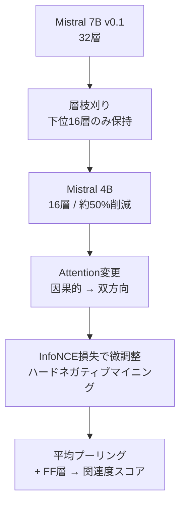

本記事は [arXiv:2409.07691 "Enhancing Q&A Text Retrieval with Ranking Models: Benchmarking, fine-tuning and deploying Rerankers for RAG"](https://arxiv.org/abs/2409.07691) の解説記事です。CIKM 2024 Workshop on GenAI and RAG Systems for Enterprise に採択された論文である。

## 論文概要（Abstract）

RAGパイプラインにおけるRerankerは、検索段階で取得した候補文書をより精密に再順位付けすることで、LLMに渡すコンテキストの品質を向上させる。本論文の著者ら（Moreira, Ak, Schifferer, Xu, Osmulski, Oldridge; NVIDIA）は、5種類のRerankerモデルをBEIRベンチマーク（Natural Questions, HotpotQA, FiQA）で比較し、新たに提案するNV-RerankQA-Mistral-4B-v3が平均NDCG@10で約14%の差をつけて最高精度を達成したと報告している。さらに、モデルサイズ・Attention方向・損失関数に関する体系的なアブレーション実験と、本番デプロイにおけるレイテンシ・スループットのトレードオフを分析している。

この記事は [Zenn記事: Haystack 2.xハイブリッド検索×Rerankerで構築する高精度QAパイプライン](https://zenn.dev/0h_n0/articles/a0caf566799e01) の深掘りです。

## 情報源

- **arXiv ID**: 2409.07691
- **URL**: [https://arxiv.org/abs/2409.07691](https://arxiv.org/abs/2409.07691)
- **著者**: Gabriel de Souza P. Moreira, Ronay Ak, Benedikt Schifferer, Mengyao Xu, Radek Osmulski, Even Oldridge（NVIDIA）
- **発表年**: 2024年9月（CIKM 2024 Workshop採択）
- **分野**: cs.IR（情報検索）、cs.CL（計算言語学）、cs.LG（機械学習）

## 背景と動機（Background & Motivation）

RAGパイプラインでは、検索段階（Retriever）が取得する候補文書の品質が最終的な回答精度を決定する。Embeddingモデル（Bi-encoder）は高速だが、クエリと文書の相互作用を直接モデル化できないため、精度に限界がある。Rerankerはこの精度ギャップを埋める役割を担うが、モデル選択の指針が不足している状況であった。

著者らは、公開Rerankerモデルの体系的なベンチマークが欠如していることを問題意識とし、BEIR標準データセットでの比較評価、微調整戦略のアブレーション、そしてデプロイ時のレイテンシ・スループット分析を提供している。

## 主要な貢献（Key Contributions）

- **貢献1**: 5種類の公開Rerankerモデル（33M〜4Bパラメータ）のBEIRベンチマークでの統一評価
- **貢献2**: NV-RerankQA-Mistral-4B-v3の設計と公開。Mistral 7Bを4Bに枝刈りし、双方向AttentionとInfoNCE損失で微調整
- **貢献3**: モデルサイズ・Attention方向（単方向 vs 双方向）・損失関数（BCE vs InfoNCE）のアブレーション実験
- **貢献4**: H100 GPUでのレイテンシ・スループット測定によるデプロイ指針の提供

## 技術的詳細（Technical Details）

### 評価対象のRerankerモデル

著者らが比較した5種のモデルを以下に示す。

| モデル | パラメータ数 | ベースアーキテクチャ | ライセンス |
|--------|------------|-------------------|-----------|
| ms-marco-MiniLM-L-12-v2 | 33M | MiniLMv2 | Apache 2.0 |
| jina-reranker-v2-base-multilingual | 278M | XLM-RoBERTa | Apache 2.0 |
| mxbai-rerank-large-v1 | 435M | DeBERTa系 | Apache 2.0 |
| bge-reranker-v2-m3 | 568M | BGE M3-Embedding | Apache 2.0 |
| **NV-RerankQA-Mistral-4B-v3** | **4B** | **Mistral 7B（枝刈り）** | **商用利用可** |

Zenn記事で紹介した`BAAI/bge-reranker-base`（278M）と`BAAI/bge-reranker-v2-m3`（568M）は、いずれも本論文の評価対象に含まれている。

### NV-RerankQA-Mistral-4B-v3のアーキテクチャ

著者らが提案するNV-RerankQA-Mistral-4B-v3は、以下の3つの変更をMistral 7Bに加えたモデルである。



1. **層枝刈り**: 32層のうち下位16層のみを保持し、パラメータ数を約50%削減。著者らは約1%の精度低下と報告している
2. **双方向Attention**: 因果的（単方向）Attentionを双方向に変更。クエリと文書の双方向の相互作用をモデル化可能にする
3. **InfoNCE損失**: 従来のBCE（Binary Cross-Entropy）ではなく、リストワイズのInfoNCE損失で微調整

### InfoNCE損失関数

$$
\mathcal{L}_{\text{InfoNCE}} = -\log \frac{\exp(\text{sim}(q, d^+) / \tau)}{\exp(\text{sim}(q, d^+) / \tau) + \sum_{j=1}^{N} \exp(\text{sim}(q, d_j^-) / \tau)}
$$

ここで、
- $q$: クエリ
- $d^+$: 正例文書
- $d_j^-$: $j$番目の負例文書（$N$件）
- $\text{sim}(\cdot, \cdot)$: モデルが出力する関連度スコア
- $\tau$: 温度パラメータ

InfoNCEはポイントワイズのBCE損失と異なり、正例と複数の負例を同時に考慮するリストワイズ学習を行う。これにより、文書間の相対的な順序をより効果的に学習できる。

### ハードネガティブマイニング

著者らはTopK-PercPos方式でハードネガティブを生成している。教師Embeddingモデルでコーパスからネガティブを検索し、正例スコアの95%以上のスコアを持つネガティブは偽陰性（False Negative）として除外する。この閾値により、実際に関連性のある文書が誤ってネガティブとして使用されるリスクを軽減している。

## 実験結果（Results）

### 主要結果（論文Table 1より、NDCG@10）

3つのEmbeddingモデルとの組み合わせで評価された結果を示す。代表として`snowflake-arctic-embed-l`との組み合わせを掲載する。

| Reranker | 平均 | NQ | HotpotQA | FiQA |
|----------|------|-----|----------|------|
| Retrieverのみ（Rerankerなし） | 0.610 | 0.631 | 0.752 | 0.447 |
| + MiniLM-L-12-v2 (33M) | 0.577 | 0.588 | 0.759 | 0.385 |
| + mxbai-rerank-large-v1 (435M) | 0.608 | 0.643 | 0.740 | 0.440 |
| + jina-reranker-v2 (278M) | 0.648 | 0.677 | 0.817 | 0.451 |
| + bge-reranker-v2-m3 (568M) | 0.659 | 0.697 | 0.846 | 0.433 |
| **+ NV-RerankQA-Mistral-4B-v3** | **0.753** | **0.779** | **0.873** | **0.607** |

著者らが報告した主な知見は以下の通りである。

1. **NV-RerankQA-Mistral-4B-v3が全データセットで最高精度**: 2位のbge-reranker-v2-m3に対し平均NDCG@10で約14%の差をつけている
2. **小型Reranker（MiniLM-L-12-v2）は逆効果**: Retrieverのみの0.610から0.577に低下。著者らは、MS-MARCOで微調整された33Mモデルの汎化能力が不十分であるためと分析している
3. **FiQAで最大の差**: 金融QAドメインでNV-RerankQAが0.607を記録し、bge-reranker-v2-m3の0.433を大きく上回っている

### アブレーション実験

著者らは3つの設計要素について体系的なアブレーションを実施している。

**Attention方向の効果（論文Table 3より、Mistral 4B）**:

| Attention方向 | 平均NDCG@10 |
|-------------|-------------|
| 単方向（因果的） | 0.735 |
| **双方向** | **0.754** |

双方向Attentionは全Embeddingモデルとの組み合わせで一貫した改善を示している。

**損失関数の効果（論文Table 4より、Mistral 4B、双方向）**:

| 損失関数 | 平均NDCG@10 |
|---------|-------------|
| BCE（ポイントワイズ） | 0.726 |
| **InfoNCE（リストワイズ）** | **0.754** |

InfoNCEはBCEに対しすべてのEmbedding組み合わせで優位性を示している。

**モデルサイズの効果（論文Table 2より）**:

| ベースモデル | パラメータ | 平均NDCG@10 |
|------------|----------|-------------|
| MiniLM-L12-H384 | 33M | 0.627 |
| DeBERTa-v3-large | 435M | 0.728 |
| Mistral 4B | 4B | 0.754 |

著者らはDeBERTa-v3-largeをサイズ対精度のバランスが良いモデルとして推奨している。

### レイテンシとスループット（論文Table 5より、H100 GPU）

| Embeddingモデル | クエリレイテンシ（batch 1, 20トークン） | インデックススループット（batch 64, 512トークン） |
|----------------|------------------------------------|--------------------------------------------|
| NV-EmbedQA-E5-v5 (335M) | 5.1 ms | 558.4 passages/sec |
| NV-EmbedQA-Mistral7B-v2 (7.2B) | 19.8 ms | 68.7 passages/sec |

Reranking（NV-RerankQA-Mistral-4B-v3、Top 40候補）の平均レイテンシは約266msと報告されている。著者らは、レイテンシ要件が厳しい場合はDeBERTa-v3-large（435M）の使用を推奨している。

## 実装のポイント（Implementation）

1. **2段パイプラインの設計**: 著者らは、小型Embeddingモデル（E5-v5, 335M）+ 大型Reranker（NV-RerankQA, 4B）の組み合わせが、大型Embeddingモデル（Mistral7B-v2, 7.2B）の単段パイプラインよりも精度が高く、インデックススループットが8.2倍であると報告している。Haystackの2段構成はこの設計思想と合致する

2. **Rerankerモデル選定の指針**:
   - **プロトタイプ/CPU環境**: bge-reranker-base (278M) — Zenn記事で推奨
   - **本番/精度重視**: bge-reranker-v2-m3 (568M) — 多言語対応、Apache 2.0
   - **本番/最高精度**: NV-RerankQA-Mistral-4B-v3 (4B) — GPU必須、H100で266ms/40候補
   - **コスト効率**: DeBERTa-v3-large (435M) — 著者ら推奨のサイズ対精度バランス

3. **小型Rerankerの落とし穴**: 33MのMiniLM-L-12-v2はRerankerなしよりも精度が低下するケースがある。Reranker導入時はRerankerなしのベースラインとの比較評価を必ず実施すべきである

4. **商用ライセンスの確認**: 著者らは、NV-RerankQA-Mistral-4B-v3とmxbai-rerank-large-v1のみがライセンスと学習データの観点から商用利用可能であると述べている。bge-reranker-v2-m3はApache 2.0だが、学習データのライセンスを別途確認する必要がある

```python
from haystack_integrations.components.rankers.sentence_transformers import (
    SentenceTransformersSimilarityRanker,
)

ranker_prototype = SentenceTransformersSimilarityRanker(
    model="BAAI/bge-reranker-base", top_k=5
)

ranker_production = SentenceTransformersSimilarityRanker(
    model="BAAI/bge-reranker-v2-m3", top_k=5
)

ranker_best_accuracy = SentenceTransformersSimilarityRanker(
    model="BAAI/bge-reranker-v2-m3",
    top_k=5,
    backend="onnx",
)
```

## Production Deployment Guide

### AWS実装パターン（コスト最適化重視）

Rerankerモデルのサイズに応じたAWSデプロイ構成を示す。

**トラフィック量別の推奨構成**:

| 規模 | 月間リクエスト | 推奨構成 | 月額コスト | Rerankerモデル |
|------|--------------|---------|-----------|--------------|
| **Small** | ~3,000 (100/日) | Serverless | $50-150 | Bedrock Cohere Rerank API |
| **Medium** | ~30,000 (1,000/日) | Hybrid | $400-900 | ECS Fargate (bge-v2-m3) |
| **Large** | 300,000+ (10,000/日) | Container | $3,000-7,000 | EKS + g5.xlarge (NV-RerankQA) |

**Medium構成の詳細** (月額$400-900):
- **ECS Fargate**: 2 vCPU, 8GB RAM × 2タスク ($150/月)
- **bge-reranker-v2-m3**: CPU推論、ONNX最適化
- **OpenSearch**: Embedding + BM25インデックス ($200/月)
- **Lambda**: オーケストレーション ($20/月)
- **ALB**: ロードバランサー ($20/月)

**Large構成の詳細** (月額$3,000-7,000):
- **EKS**: コントロールプレーン ($72/月)
- **g5.xlarge Spot**: NV-RerankQA推論（266ms/40候補）× 2-4台 ($800/月)
- **Karpenter**: GPU需要に応じた自動スケーリング
- **NeMo Retriever**: NVIDIAの推論最適化マイクロサービス

**コスト試算の注意事項**: 上記は2026年10月時点のAWS ap-northeast-1料金に基づく概算値です。g5.xlargeのSpot価格は変動します。最新料金は [AWS料金計算ツール](https://calculator.aws/) で確認してください。

### Terraformインフラコード

**Medium構成: ECS Fargate + bge-reranker-v2-m3**

```hcl
resource "aws_ecs_cluster" "reranker" {
  name = "reranker-cluster"

  setting {
    name  = "containerInsights"
    value = "enabled"
  }
}

resource "aws_ecs_task_definition" "reranker" {
  family                   = "reranker-service"
  requires_compatibilities = ["FARGATE"]
  network_mode             = "awsvpc"
  cpu                      = "2048"
  memory                   = "8192"
  execution_role_arn       = aws_iam_role.ecs_execution.arn

  container_definitions = jsonencode([{
    name  = "reranker"
    image = "sentence-transformers/bge-reranker-v2-m3:onnx"
    portMappings = [{
      containerPort = 8080
      protocol      = "tcp"
    }]
    environment = [
      { name = "MODEL_NAME", value = "BAAI/bge-reranker-v2-m3" },
      { name = "BACKEND", value = "onnx" },
      { name = "TOP_K", value = "5" },
      { name = "MAX_CANDIDATES", value = "50" }
    ]
    logConfiguration = {
      logDriver = "awslogs"
      options = {
        "awslogs-group"         = "/ecs/reranker"
        "awslogs-region"        = "ap-northeast-1"
        "awslogs-stream-prefix" = "reranker"
      }
    }
  }])
}

resource "aws_ecs_service" "reranker" {
  name            = "reranker-service"
  cluster         = aws_ecs_cluster.reranker.id
  task_definition = aws_ecs_task_definition.reranker.arn
  desired_count   = 2
  launch_type     = "FARGATE"

  network_configuration {
    subnets         = module.vpc.private_subnets
    security_groups = [aws_security_group.reranker.id]
  }

  load_balancer {
    target_group_arn = aws_lb_target_group.reranker.arn
    container_name   = "reranker"
    container_port   = 8080
  }
}
```

### セキュリティベストプラクティス

1. **ネットワーク**: Fargateタスクはプライベートサブネットに配置し、ALB経由でのみアクセス
2. **IAM**: タスクロールには最小限の権限のみ付与
3. **コンテナイメージ**: ECRプライベートリポジトリから取得、イメージスキャン有効化
4. **通信暗号化**: ALBでTLS 1.2以上を強制

### コスト最適化チェックリスト

- [ ] プロトタイプ: Bedrock Cohere Rerank API（GPU管理不要）
- [ ] 本番CPU環境: bge-reranker-v2-m3 ONNX on Fargate
- [ ] 本番GPU環境: NV-RerankQA on g5.xlarge Spot（最大90%削減）
- [ ] Reranker候補数制限: 50件以内（266ms/40候補の基準値から逆算）
- [ ] ECS Auto Scaling: 夜間はdesired_count=1に削減
- [ ] 結果キャッシュ: ElastiCache Redis（同一クエリの重複排除）
- [ ] AWS Budgets: 月額予算設定（80%で警告、100%でアラート）
- [ ] CloudWatch: Rerankerレイテンシ P95/P99監視
- [ ] Cost Anomaly Detection: 自動異常検知有効化

## 関連研究（Related Work）

- **From BM25 to Corrective RAG (arXiv:2604.01733)**: ハイブリッド検索＋Cohere Rerank v4.0 Proの2段パイプラインでRecall@5 = 0.816を達成。本論文のNV-RerankQA-Mistral-4Bとの直接比較は行われていないが、Rerankerの候補数に対する感度分析を提供している
- **SciRerankBench (arXiv:2508.08742)**: 13種のRerankerを科学文献で評価。MXBAI（本論文のmxbai-rerank-large-v1に相当）が意味的類似コンテキストの識別で優れていると報告している
- **Cohere Rerank v4.0**: 本論文の評価対象には含まれていないが、Zenn記事で紹介したAPIベースのRerankerとして、NV-RerankQA-Mistral-4Bのセルフホスト型に対する代替選択肢となる

## まとめと今後の展望

本論文は、RAG向けRerankerモデルの体系的なベンチマークを通じて、モデル選定の実践的な指針を提供している。NV-RerankQA-Mistral-4B-v3がBEIRベンチマークで既存モデルを大幅に上回る結果は、Zenn記事で解説したHaystack 2.xパイプラインにおけるRerankerのモデル選択肢を拡充するものである。

一方で、4Bパラメータモデルは266ms/40候補のレイテンシを要するため、リアルタイム性の要件が厳しいアプリケーションではbge-reranker-v2-m3（568M）やDeBERTa-v3-large（435M）が現実的な選択肢となる。著者らが示したDeBERTa-v3-largeの精度対サイズ効率の高さは、セルフホスト環境でのReranker導入において参考になる知見である。

## 参考文献

- **arXiv**: [https://arxiv.org/abs/2409.07691](https://arxiv.org/abs/2409.07691)
- **CIKM 2024 Workshop**: 1st Workshop on GenAI and RAG Systems for Enterprise
- **Related Zenn article**: [https://zenn.dev/0h_n0/articles/a0caf566799e01](https://zenn.dev/0h_n0/articles/a0caf566799e01)
