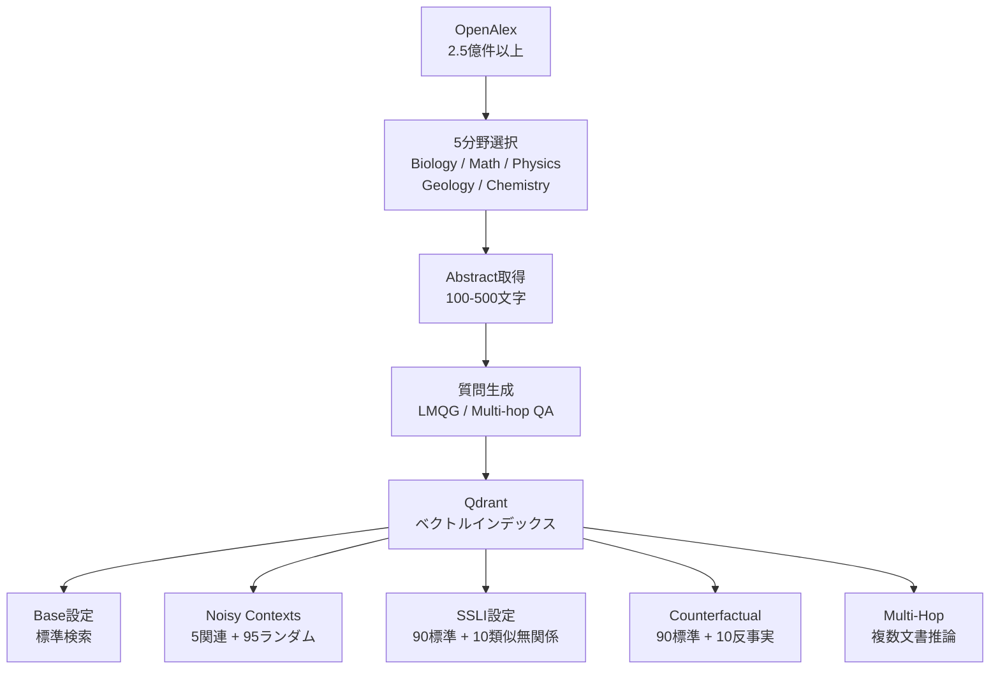

本記事は [arXiv:2508.08742 "SciRerankBench: Benchmarking Rerankers Towards Scientific Retrieval-Augmented Generated LLMs"](https://arxiv.org/abs/2508.08742) の解説記事です。

## 論文概要（Abstract）

RAGにおけるRerankerは、検索候補から最も関連性の高い文書を選別する重要なコンポーネントであるが、科学文献特有の課題——専門用語の微妙な差異がファクトの正誤を左右する——に対するRerankerの評価は不十分であった。本論文の著者ら（Chen, Long, Xiao, Luo, Ju, Wang, Wang, Zhou, Zhu）は、5つの科学分野（生物学、数学、物理学、地学、化学）にまたがるベンチマーク「SciRerankBench」を構築し、13種のRerankerを3つの破壊的コンテキスト設定（ノイズ・意味的類似だが論理的に無関係・反事実）で評価している。

この記事は [Zenn記事: Haystack 2.xハイブリッド検索×Rerankerで構築する高精度QAパイプライン](https://zenn.dev/0h_n0/articles/a0caf566799e01) の深掘りです。

## 情報源

- **arXiv ID**: 2508.08742
- **URL**: [https://arxiv.org/abs/2508.08742](https://arxiv.org/abs/2508.08742)
- **著者**: Haotian Chen, Qingqing Long, Meng Xiao, Xiao Luo, Wei Ju, Chengrui Wang, Xuezhi Wang, Yuanchun Zhou, Hengshu Zhu
- **発表年**: 2025年8月
- **分野**: cs.CL（計算言語学）、cs.AI（人工知能）

## 背景と動機（Background & Motivation）

汎用QAベンチマーク（BEIR、MS-MARCOなど）ではRerankerの性能が広く評価されているが、科学文献検索には固有の課題がある。科学論文では、表面的に類似した記述が異なる実験条件や結果を指す場合があり、用語の微細な差異が事実の正誤を左右する。たとえば「Transformerの学習率を$10^{-4}$に設定」と「$10^{-3}$に設定」は表面的に類似しているが、再現実験における結果は大きく異なる。

著者らは、このような科学文献特有の検索課題に対するRerankerの頑健性を評価するため、3つの「破壊的コンテキスト」設定を含むベンチマークを設計している。これは、Zenn記事で議論したRerankerの選定基準に、科学文献という新たな評価軸を追加するものである。

## 主要な貢献（Key Contributions）

- **貢献1**: 5つの科学分野にまたがるReranker評価ベンチマーク「SciRerankBench」の構築（OpenAlexから約4,500のQ-C-Aペア）
- **貢献2**: ノイズ耐性（NC）、関連性識別（SSLI）、事実整合性（CC）の3次元でRerankerの頑健性を評価する実験設計
- **貢献3**: 13種のRerankerと5つのLLMファミリー（11モデル）の組み合わせ評価。Cross-encoder系（特にMXBAI）が意味的に困難な設定で優位であることを実証

## 技術的詳細（Technical Details）

### ベンチマーク設計

SciRerankBenchは以下の構成で設計されている。



### 3つの破壊的コンテキスト設定

著者らが設計した3つの設定は、Rerankerが直面する実践的な課題を模擬している。

| 設定 | 略称 | 構成 | 評価対象 |
|------|------|------|---------|
| Noisy Contexts | NC | 5件の関連パッセージ + 95件のランダムディストラクタ | ノイズ耐性 |
| Semantically Similar but Logically Irrelevant | SSLI | 90件の標準パッセージ + 10件の表面類似・論理無関係パッセージ | 関連性識別能力 |
| Counterfactual Contexts | CC | 90件の標準パッセージ + 10件のもっともらしいが事実誤りのパッセージ | 事実整合性 |

**SSLI設定の意義**: RAGパイプラインにおいて、Embeddingモデルは「表面的に似ている」パッセージを高スコアで返す傾向がある。たとえば「BERTのファインチューニング」に対して「GPT-2のファインチューニング」は意味的に類似しているが、BERTに関する質問に対しては論理的に無関係である。Rerankerがこの種の「偽陽性」を適切に識別できるかを評価する。

**CC設定の意義**: 科学文献では、数値の改変（精度90%→95%）やメソッドの入れ替えなど、微妙な事実の変更が回答の正確性に直結する。Rerankerが反事実パッセージを高ランクに配置しないかを評価する。

### 評価対象のRerankerモデル（13種）

著者らが評価した13種のRerankerは以下の4カテゴリに分類される。

| カテゴリ | モデル |
|---------|--------|
| Dense Cross-encoder | BGE, BCE, Jina, **MXBAI** |
| スパース語彙モデル | SPLADE |
| リストワイズ | RankT5, ListT5 |
| その他 | In-Rank (seq2seq), TwoLAR (軽量), MiniLM, ColBERT (late interaction), LLM2Vec, Rearank (agent-based) |

Zenn記事で紹介した`BAAI/bge-reranker-base`は本論文のBGEに対応し、`mxbai-rerank-large-v1`はMXBAIに対応する。

### 評価指標

- **Token-level Recall**: LLM回答のトークンレベル再現率
- **Contain Answer**: 回答に正解トークンが含まれるかの判定（閾値約0.6）
- **Recall@10**: Rerankerの順位品質
- **推論時間**: 1質問あたりの平均秒数

### 評価対象のLLMファミリー（5ファミリー・11モデル）

| ファミリー | モデル |
|-----------|--------|
| Mistral | 7B, 24B |
| LLaMA | 7B, 70B |
| DeepSeek-V3 | 7B, 671B |
| Qwen | 7B, 32B, 72B |
| InternLM2 | 7B, 20B |

## 実験結果（Results）

### 主要結果（論文Table 6より、Qwen / 生物学分野）

| Reranker | Multi-Hop | NC | CC | SSLI | Base |
|----------|----------|-----|-----|------|------|
| BGE | 54.55 | 53.56 | 55.52 | 54.56 | 64.74 |
| **MXBAI** | 53.56 | 53.62 | **57.18** | **58.40** | 62.25 |
| ColBERT | 53.35 | 53.63 | 44.92 | 44.38 | 62.87 |
| ListT5 | 8.89 | 26.71 | 15.54 | 14.69 | 15.62 |
| SPLADE | — | — | — | — | — |

著者らが報告した主な知見は以下の通りである。

1. **MXBAIがSSLI・CC設定で最高精度**: 意味的に類似だが論理的に無関係なコンテキスト（SSLI）で58.40、反事実コンテキスト（CC）で57.18を記録し、BGEを上回っている。著者らは、MXBAIのDense Cross-encoderアーキテクチャが、表面的類似性を超えた論理的関連性の判断に優れていると分析している

2. **スパース・Late Interactionモデルの脆弱性**: ColBERTはCC（44.92）とSSLI（44.38）で大幅に性能が低下しており、ListT5（リストワイズ）はMulti-Hop（8.89）でほぼ機能していない

3. **Rerankerの追加で20-30ポイントの改善**: Rerankerなし（検索のみ）と比較して、Rerankerを追加することで平均20-30ポイントのRecall改善が報告されている

4. **LLMの推論能力がボトルネック**: Multi-Hopタスクでは、高いRecall@10を達成してもLLMの多段推論能力がボトルネックとなり、最終回答の品質向上は限定的である

### 推論効率（論文Section 5より）

| Reranker | 平均秒数/質問 |
|----------|-------------|
| SPLADE | 0.49 |
| MiniLM | 1.34 |
| BCE / BGE | ~3.5 |
| LLM2Vec | 5.47 |
| Rearank | 6.82 |
| MXBAI | 10.96 |

MXBAIは精度が高い一方で、推論時間がBGEの約3倍である。著者らは、精度と速度のトレードオフを考慮したモデル選択の重要性を強調している。

### LLMファミリーごとの恩恵

著者らは、Rerankerの恩恵はLLMファミリーによって異なると報告している。InternLMとQwenがRerankingから最も恩恵を受けており、MistralやLLaMAは相対的に恩恵が少ないとされている。

## 実装のポイント（Implementation）

1. **SSLI対策としてのCross-encoder**: Bi-encoderベースの検索は表面的類似性に基づくため、SSLI的な偽陽性を返しやすい。Cross-encoder Rerankerを追加することで、クエリと文書の論理的関連性を直接評価し、偽陽性をフィルタリングできる。Zenn記事の`SentenceTransformersSimilarityRanker`はこの役割を果たす

2. **ドメイン特化の考慮**: 科学文献ではBGEとMXBAIの差が顕著であるが、汎用QA（BEIRなど）ではbge-reranker-v2-m3が強い結果を示す（arXiv:2409.07691参照）。ドメインに応じたReranker選定が重要である

3. **Multi-Hopの限界**: Rerankerが高いRecall@10を達成しても、複数文書にまたがる推論が必要なクエリでは、LLMの推論能力がボトルネックとなる。この場合、Rerankerの改善よりも、Chain-of-Thoughtプロンプティングやイテレーティブ検索の導入が効果的である

4. **反事実コンテキストへの対応**: CC設定での性能低下は、Rerankerが「もっともらしいが事実的に誤った」パッセージを識別できないことを示している。ファクトチェック用の追加レイヤー（arXiv:2605.01664のクレームレベル検証など）の導入が有効である

```python
from haystack_integrations.components.rankers.sentence_transformers import (
    SentenceTransformersSimilarityRanker,
)

ranker_ssli_robust = SentenceTransformersSimilarityRanker(
    model="mixedbread-ai/mxbai-rerank-large-v1",
    top_k=5,
)

ranker_balanced = SentenceTransformersSimilarityRanker(
    model="BAAI/bge-reranker-v2-m3",
    top_k=5,
)
```

## 実運用への応用（Practical Applications）

本論文の知見は、以下のユースケースで直接応用できる。

1. **学術論文検索システム**: SSLI設定で高精度なMXBAIを採用し、表面的に類似するが異なる研究の混同を防ぐ。レイテンシ要件が厳しい場合は、BGEで妥協しつつ、Recall@10の低下を許容する判断が必要

2. **医療・法務RAG**: 反事実コンテキスト（CC）に対する頑健性が重要な分野では、Rerankerの選定に加え、事後検証レイヤーの導入を検討する

3. **Multi-Hop QA**: 複数文書にまたがる推論が必要な場合、Rerankerの改善だけでは不十分であり、イテレーティブ検索やChain-of-Thoughtプロンプティングの併用が推奨される

4. **Reranker評価パイプラインの構築**: 自社データでRerankerを評価する際、NC/SSLI/CC設定のテストセットを構築することで、Rerankerの脆弱性を事前に検出できる。Haystackの評価フレームワークと組み合わせることで、自動化されたReranker選定パイプラインを構築可能である

## 関連研究（Related Work）

- **NV-RerankQA-Mistral-4B-v3 (arXiv:2409.07691)**: BEIRベンチマークでの体系的Reranker比較。本論文とは評価ドメイン（汎用QA vs 科学文献）と評価設定（標準 vs 破壊的コンテキスト）が異なるが、Cross-encoderの優位性という結論は一致している
- **ARAGOG (arXiv:2404.01037)**: RAG出力のグレーディングフレームワーク。Reranker戦略としてCross-encoderとLLM Rerankerを比較し、LLM Rerankerがより高精度だがコストが高いことを報告している
- **BEIR (Thakur et al., 2021)**: 汎用情報検索ベンチマーク。SciRerankBenchは、BEIRが対象としない科学文献固有の課題（SSLI、CC）をカバーする相補的なベンチマークとして位置付けられている

## まとめと今後の展望

SciRerankBenchは、科学文献RAGにおけるRerankerの頑健性を3つの破壊的コンテキスト設定で評価する初のベンチマークである。著者らの実験結果は、Cross-encoder系（特にMXBAI）が意味的に困難な設定で優位であること、スパース・Late Interactionモデルが反事実コンテキストに脆弱であること、そしてRerankerの改善だけではMulti-Hop推論の限界を克服できないことを示している。

Zenn記事で解説したHaystack 2.xパイプラインにおいて、Rerankerモデルの選定は精度向上の鍵であるが、本論文の知見は、選定にあたってドメイン特性（科学文献、金融、法務など）を考慮する必要性を明確にしている。汎用ベンチマーク（BEIR）の結果のみに依存するのではなく、自社データにおけるSSLI・CC的な困難ケースでの評価を実施することが推奨される。

## 参考文献

- **arXiv**: [https://arxiv.org/abs/2508.08742](https://arxiv.org/abs/2508.08742)
- **OpenAlex**: [https://openalex.org/](https://openalex.org/)
- **Related Zenn article**: [https://zenn.dev/0h_n0/articles/a0caf566799e01](https://zenn.dev/0h_n0/articles/a0caf566799e01)
