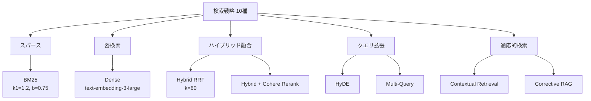

本記事は [arXiv:2604.01733 "From BM25 to Corrective RAG: Benchmarking Retrieval Strategies for Text-and-Table Documents"](https://arxiv.org/abs/2604.01733) の解説記事です。

## 論文概要（Abstract）

RAGシステムの性能は検索（Retrieval）の品質に大きく依存するが、テキストとテーブルが混在する文書に対して、現代的な検索手法を体系的に比較した研究はこれまで存在しなかった。本論文の著者ら（Akarsu, Karaman, Mierbach）は、金融QAベンチマーク「T2-RAGBench」を構築し、BM25からCorrective RAGまで10種類の検索戦略を統一条件で評価している。

この記事は [Zenn記事: Haystack 2.xハイブリッド検索×Rerankerで構築する高精度QAパイプライン](https://zenn.dev/0h_n0/articles/a0caf566799e01) の深掘りです。

## 情報源

- **arXiv ID**: 2604.01733
- **URL**: [https://arxiv.org/abs/2604.01733](https://arxiv.org/abs/2604.01733)
- **著者**: Meftun Akarsu, Recep Kaan Karaman, Christopher Mierbach
- **発表年**: 2026年4月
- **分野**: cs.IR（情報検索）、cs.CL（計算言語学）
- **コード**: 公開済み（Zenodo DOI: 10.5281/zenodo.19382814）

## 背景と動機（Background & Motivation）

RAGにおける検索品質は最終的な回答精度を直接左右する。特に金融文書のようにテキストと数値テーブルが混在する文書では、キーワードマッチ（BM25）と意味的検索（Dense Retrieval）のどちらが適切かは自明ではない。従来研究では個別の検索手法の改善に焦点が当てられていたが、複数手法の公平な比較は限定的であった。

著者らは、金融文書に特化した23,088クエリ・7,318文書のベンチマーク「T2-RAGBench」を構築し、スパース検索・密検索・ハイブリッド融合・Reranking・クエリ拡張・適応的検索を含む10手法を統一条件で評価することで、この空白を埋めることを目指している。

## 主要な貢献（Key Contributions）

- **貢献1**: テキスト・テーブル混在文書に対する初の体系的検索ベンチマーク「T2-RAGBench」の構築（23,088クエリ、3つの金融QAデータセットから統合）
- **貢献2**: 10種類の検索戦略の公平な比較評価。ハイブリッド検索＋Rerankerの2段パイプラインがRecall@5で0.816を達成し、単一手法を大幅に上回ることを実証
- **貢献3**: BM25が金融文書においてDense Retrievalをすべての評価指標で上回るという実証結果。意味的検索が常に優れるという仮定に対する反証を提示
- **貢献4**: 融合手法（RRF vs Convex Combination）やReranker候補数の系統的なアブレーション実験とコスト・精度のトレードオフ分析

## 技術的詳細（Technical Details）

### 評価対象の検索戦略

著者らが比較した10手法を以下に整理する。



各手法の設定は以下の通りである（論文Section IIIより）。

| 手法 | 構成 |
|------|------|
| BM25 | Okapi BM25、$k_1=1.2$、$b=0.75$（rank_bm25ライブラリ） |
| Dense | text-embedding-3-large（3,072次元）、FAISS IndexFlatIP |
| Hybrid RRF | BM25 + Dense、Reciprocal Rank Fusionで統合（$k=60$） |
| Hybrid + Rerank | RRFで50候補取得後、Cohere Rerank v4.0 ProでTop 10に絞り込み |
| HyDE | GPT-4.1-miniで仮説的回答を生成し、そのEmbeddingで検索 |
| Multi-Query | GPT-4.1-miniで3つのクエリ変種を生成、4リストをRRFで統合 |
| Contextual Retrieval | GPT-4.1-miniで文書全体の要約を各チャンクに付加 |
| CRAG | Top 5をRELEVANT/AMBIGUOUS/IRRELEVANTに分類し、必要に応じてクエリ書き換え |

### Reciprocal Rank Fusion（RRF）の定式化

ハイブリッド検索のスコア統合にはRRFが使用されている。RRFスコアは以下の式で計算される。

$$
\text{RRF}(d) = \sum_{r \in R} \frac{1}{k + \text{rank}_r(d)}
$$

ここで、
- $d$: 文書
- $R$: Retrieverの集合（本論文ではBM25とDenseの2つ）
- $\text{rank}_r(d)$: Retriever $r$ における文書 $d$ の順位（1-indexed）
- $k$: スムージングパラメータ（本論文では$k=60$をデフォルトとして使用）

RRFの利点は、BM25のTF-IDFスコアとDense RetrievalのCosine類似度という異なるスケールのスコアを直接比較せず、**順位のみ**で統合する点にある。

### 評価指標

検索品質の評価には以下の指標が使用されている。

- **Recall@k**（$k = 1, 3, 5, 10, 20$）: 正解文書がTop-k内に含まれる割合
- **MRR@3**: 正解文書の逆順位の平均（上位3件）
- **nDCG@10**: 正規化割引累積利得
- **MAP**: 平均精度

統計的検定にはPaired Bootstrap（$B=10,000$, Bonferroni補正, $p < 0.05$）が適用されている。

## 実験結果（Results）

### 主要結果（論文Table Iより）

| 手法 | R@1 | R@5 | R@10 | MRR@3 | nDCG@10 |
|------|-----|-----|------|-------|---------|
| BM25 | 0.293 | 0.644 | 0.735 | 0.411 | 0.515 |
| Dense | 0.248 | 0.587 | 0.703 | 0.351 | 0.466 |
| HyDE | 0.221 | 0.544 | 0.671 | 0.318 | 0.433 |
| Multi-Query | 0.283 | 0.640 | 0.734 | 0.397 | 0.506 |
| Contextual Hybrid | 0.327 | 0.717 | 0.818 | 0.454 | 0.571 |
| CRAG | 0.302 | 0.658 | 0.788 | 0.415 | 0.536 |
| Hybrid RRF | 0.308 | 0.695 | 0.801 | 0.433 | 0.551 |
| **Hybrid + Rerank** | **0.472** | **0.816** | **0.861** | **0.605** | **0.683** |

著者らが報告した主な知見は以下の通りである。

1. **Hybrid + Rerank が全指標で最高精度を達成**: Hybrid RRFと比較してRecall@5で+12.1ポイント、MRR@3で+17.2ポイントの改善を記録している
2. **BM25がDense Retrievalを上回る**: 金融文書ではBM25がDense検索をRecall@5で+5.7ポイント上回っている。著者らはこれを、金融文書に含まれる固有名詞・数値・型番がキーワードマッチに適しているためと分析している
3. **HyDEは逆効果**: HyDEはDense Retrieval単体よりも低い精度を示している（R@5: 0.544 vs 0.587）。著者らは、数値的に正確な回答が求められるクエリでは仮説的回答の生成が検索品質を損なうと指摘している

### 融合手法のアブレーション（論文Section IV-Eより）

| 融合手法 | R@5 |
|---------|-----|
| Convex Combination（$\alpha=0.5$） | 0.726 |
| RRF（$k=60$） | 0.695 |
| RRF（$k=10$） | 0.716 |

Convex Combinationが最も高いRecall@5を示しているが、著者らはこの手法がスコアの正規化に依存するため、ドメインやモデルの変更に対してRRFよりも脆弱になり得ると注記している。

### Reranker候補数のアブレーション

| 候補数 | R@5 |
|--------|-----|
| 20 | 0.458 |
| 50 | 0.826 |
| 100 | 0.888 |

候補数を20から50に増やすと大幅な改善が見られるが、50から100への増加は+6.2ポイントにとどまる。レイテンシとのトレードオフを考慮すると、50候補がコスト効率の良い設定であると著者らは推奨している。

### エラー分析

著者らは検索失敗ケース100件をサンプリングし、以下のカテゴリに分類している。

| 失敗原因 | 割合 |
|---------|------|
| テーブル構造の不一致 | 73% |
| 数値推論の困難 | 20% |
| 語彙の不一致 | 5% |
| 曖昧なクエリ | 1% |

テーブル構造の不一致が支配的であり、テーブルのMarkdown表現とクエリのマッチングが主要な課題であることが示されている。

## 実装のポイント（Implementation）

著者らの実装に基づく実践的な推奨事項を整理する。

1. **パイプライン構成**: Hybrid Retrieval（BM25 + Dense）→ Reranking の2段構成が推奨される。Zenn記事で解説したHaystack 2.xの`DocumentJoiner`（RRF）+ `SentenceTransformersSimilarityRanker`の構成はこの知見と合致する

2. **BM25パラメータ**: $k_1=1.2$, $b=0.75$のOkapi BM25がデフォルトとして妥当。金融・法務など専門用語が多いドメインではBM25の相対的優位性が高まる

3. **Reranker候補数**: Retrieverで50件を取得し、Rerankerで10件に絞り込む構成がコスト効率に優れる。20件では候補が不足し、100件ではレイテンシの増加に見合う精度向上が得られにくい

4. **HyDEの適用判断**: 数値回答やエンティティ検索が多いドメインではHyDEの採用を避けるべきである。著者らの実験では、HyDEはDense Retrieval単体よりも低い精度を示している

5. **Contextual Retrieval**: インデックス作成時にLLMで文書要約を付加する手法は、一回限りのコストで+2〜3ポイントの安定した改善を提供する。ただし、全文書に対するLLM呼び出しが必要なため、大規模コーパスではコストに注意が必要である

```python
from haystack.components.joiners.document_joiner import DocumentJoiner
from haystack.components.retrievers.in_memory import (
    InMemoryBM25Retriever,
    InMemoryEmbeddingRetriever,
)
from haystack_integrations.components.rankers.sentence_transformers import (
    SentenceTransformersSimilarityRanker,
)

bm25_retriever = InMemoryBM25Retriever(document_store, top_k=50)
embedding_retriever = InMemoryEmbeddingRetriever(document_store, top_k=50)
joiner = DocumentJoiner(join_mode="reciprocal_rank_fusion", top_k=50)
ranker = SentenceTransformersSimilarityRanker(
    model="BAAI/bge-reranker-v2-m3", top_k=10
)
```

## Production Deployment Guide

### AWS実装パターン（コスト最適化重視）

本論文のHybrid + Rerankerパイプラインをプロダクション環境に展開する場合のAWS構成を示す。

**トラフィック量別の推奨構成**:

| 規模 | 月間リクエスト | 推奨構成 | 月額コスト | 主要サービス |
|------|--------------|---------|-----------|------------|
| **Small** | ~3,000 (100/日) | Serverless | $50-150 | Lambda + OpenSearch Serverless + Bedrock |
| **Medium** | ~30,000 (1,000/日) | Hybrid | $300-800 | Lambda + ECS Fargate + ElastiCache |
| **Large** | 300,000+ (10,000/日) | Container | $2,000-5,000 | EKS + Karpenter + EC2 Spot |

**Small構成の詳細** (月額$50-150):
- **Lambda**: 1GB RAM, 60秒タイムアウト ($20/月)
- **OpenSearch Serverless**: ベクトル検索 + BM25検索統合 ($30/月)
- **Bedrock**: Reranker API呼び出し ($50/月)
- **DynamoDB**: キャッシュストア ($10/月)
- **CloudWatch**: 基本監視 ($5/月)

**コスト試算の注意事項**: 上記は2026年10月時点のAWS ap-northeast-1（東京）リージョン料金に基づく概算値です。実際のコストはトラフィックパターンやバースト使用量により変動します。最新料金は [AWS料金計算ツール](https://calculator.aws/) で確認してください。

### Terraformインフラコード

**Small構成 (Serverless): Lambda + OpenSearch Serverless**

```hcl
module "vpc" {
  source  = "terraform-aws-modules/vpc/aws"
  version = "~> 5.0"

  name = "hybrid-search-vpc"
  cidr = "10.0.0.0/16"
  azs  = ["ap-northeast-1a", "ap-northeast-1c"]
  private_subnets = ["10.0.1.0/24", "10.0.2.0/24"]

  enable_nat_gateway   = false
  enable_dns_hostnames = true
}

resource "aws_iam_role" "lambda_search" {
  name = "hybrid-search-lambda-role"

  assume_role_policy = jsonencode({
    Version = "2012-10-17"
    Statement = [{
      Action    = "sts:AssumeRole"
      Effect    = "Allow"
      Principal = { Service = "lambda.amazonaws.com" }
    }]
  })
}

resource "aws_iam_role_policy" "opensearch_access" {
  role = aws_iam_role.lambda_search.id

  policy = jsonencode({
    Version = "2012-10-17"
    Statement = [{
      Effect   = "Allow"
      Action   = ["aoss:APIAccessAll"]
      Resource = "*"
    }]
  })
}

resource "aws_lambda_function" "hybrid_search" {
  filename      = "search_handler.zip"
  function_name = "hybrid-search-handler"
  role          = aws_iam_role.lambda_search.arn
  handler       = "index.handler"
  runtime       = "python3.12"
  timeout       = 60
  memory_size   = 1024

  environment {
    variables = {
      OPENSEARCH_ENDPOINT = aws_opensearchserverless_collection.docs.collection_endpoint
      RERANKER_MODEL      = "cohere.rerank-v4.0-pro"
      TOP_K_RETRIEVAL     = "50"
      TOP_K_RERANK        = "10"
    }
  }
}

resource "aws_dynamodb_table" "search_cache" {
  name         = "hybrid-search-cache"
  billing_mode = "PAY_PER_REQUEST"
  hash_key     = "query_hash"

  attribute {
    name = "query_hash"
    type = "S"
  }

  ttl {
    attribute_name = "expire_at"
    enabled        = true
  }
}
```

### セキュリティベストプラクティス

1. **ネットワーク**: OpenSearch ServerlessへのアクセスはVPCエンドポイント経由に限定
2. **IAM**: 最小権限の原則。Lambda実行ロールにはOpenSearchとBedrockの必要なアクションのみ許可
3. **暗号化**: OpenSearch Serverlessはデフォルトでサーバーサイド暗号化が有効
4. **シークレット管理**: APIキーはSecrets Managerで管理し、環境変数へのハードコード禁止

### コスト最適化チェックリスト

- [ ] ~100 req/日 → Lambda + OpenSearch Serverless (Serverless) - $50-150/月
- [ ] ~1000 req/日 → ECS Fargate + OpenSearch (Hybrid) - $300-800/月
- [ ] 10000+ req/日 → EKS + Spot Instances (Container) - $2,000-5,000/月
- [ ] OpenSearch Serverless: OCU自動スケーリング設定
- [ ] Lambda: メモリサイズ最適化（CloudWatch Insights分析）
- [ ] Reranker候補数を50に制限（100候補との精度差+6.2ppに対しレイテンシ2倍）
- [ ] BM25 + Denseの結果キャッシュ（DynamoDB TTL 1時間）
- [ ] Bedrock Batch API: 非リアルタイム処理で50%削減
- [ ] CloudWatch アラーム: 検索レイテンシP99監視
- [ ] AWS Budgets: 月額予算設定（80%で警告）

## 実運用への応用（Practical Applications）

本論文の知見をZenn記事で構築したHaystack 2.xパイプラインに適用する場合、以下のポイントが参考になる。

1. **ドメイン特性の考慮**: 金融・法務・医療など固有名詞や数値が重要なドメインでは、BM25の重みを高めに設定することが有効である。Haystackの`DocumentJoiner`で`merge`モードを使用し、`weights=[0.6, 0.4]`（BM25:Dense）とする設定が考えられる

2. **Reranker候補数の調整**: 論文のアブレーション結果に基づき、Retriever段階で50件を取得しRerankerで絞り込む構成が推奨される。Zenn記事の`top_k=10`設定はやや少ない可能性がある

3. **テーブル含有文書への対応**: テーブル構造の不一致が失敗原因の73%を占めるという結果は、チャンキング戦略の重要性を示している。テーブルを独立したチャンクとして扱い、メタデータに構造情報を付加する前処理が効果的である

## 関連研究（Related Work）

- **Cormack et al. (2009)**: RRFの原著論文。$k=60$のスムージングパラメータを提案し、複数のIRシステムの順位リスト統合で一貫した改善を示した。本論文のハイブリッド検索はこの手法を基盤としている
- **AutoRAG (arXiv:2410.20878)**: 検索戦略の自動最適化フレームワーク。ハイブリッドRRFが高い性能を示す一方、DBSF融合（重み0.7/0.3）がさらに高い精度を達成するケースも報告されている
- **CHSR-RRF (arXiv:2609.02913)**: 教育RAGにおけるRRFの適用。コレクション固有のチューニングなしでは、RRFを上回ることは困難であると報告している

## まとめと今後の展望

本論文は、テキスト・テーブル混在文書に対する検索戦略の体系的比較を通じて、ハイブリッド検索＋Rerankerの2段パイプラインの有効性を実証している。著者らが報告したRecall@5 = 0.816（Hybrid + Rerank）は、BM25単体の0.644を大幅に上回る結果であり、Zenn記事で解説したHaystack 2.xの3段構成（BM25 + Dense → RRF → Reranker）の設計判断を裏付けるものである。

一方で、本論文は金融文書のみを対象としており、他ドメインへの一般化には追加検証が必要である。また、すべての回答が数値であるため、自由形式の回答生成における検索品質の影響は未評価である。

## 参考文献

- **arXiv**: [https://arxiv.org/abs/2604.01733](https://arxiv.org/abs/2604.01733)
- **Code**: Zenodo DOI 10.5281/zenodo.19382814
- **Related Zenn article**: [https://zenn.dev/0h_n0/articles/a0caf566799e01](https://zenn.dev/0h_n0/articles/a0caf566799e01)
