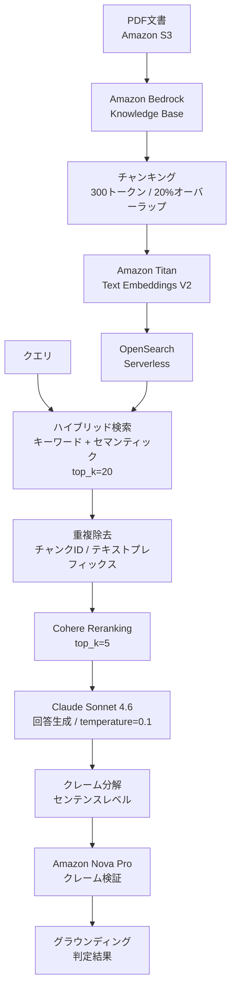

本記事は [arXiv:2605.01664 "A Hybrid Retrieval and Reranking Framework for Evidence-Grounded Retrieval-Augmented Generation"](https://arxiv.org/abs/2605.01664) の解説記事です。

## 論文概要（Abstract）

RAGシステムが生成する回答のファクトチェックは、特に生物医学・ヘルスケア領域において極めて重要である。本論文の著者ら（Irany, Akwafuo）は、Amazon Bedrockエコシステム上にハイブリッド検索、Cohere Reranking、保守的プロンプティング、そしてクレームレベルの事後検証を統合したRAGフレームワークを構築している。25件のパイロットクエリで200件の事実クレームを生成し、すべてのクレームが根拠文書に裏付けられていると判定される100%グラウンディング精度を報告している。

この記事は [Zenn記事: Haystack 2.xハイブリッド検索×Rerankerで構築する高精度QAパイプライン](https://zenn.dev/0h_n0/articles/a0caf566799e01) の深掘りです。

## 情報源

- **arXiv ID**: 2605.01664
- **URL**: [https://arxiv.org/abs/2605.01664](https://arxiv.org/abs/2605.01664)
- **著者**: Fariba Afrin Irany, Sampson Akwafuo
- **発表年**: 2026年5月
- **分野**: cs.IR（情報検索）

## 背景と動機（Background & Motivation）

RAGシステムの回答は、検索された文書に基づいて生成されるが、LLMがハルシネーション（幻覚）を起こし、検索文書に含まれない情報を生成するリスクがある。特に生物医学・ヘルスケア分野では、誤った情報が患者の治療方針に影響を与える可能性があるため、回答のグラウンディング（根拠付け）が不可欠である。

著者らは、ハイブリッド検索でRetrievalの網羅性を確保し、Rerankingで関連度の精密な順位付けを行い、さらにクレームレベルの事後検証で生成内容の正確性を保証する多段階フレームワークを提案している。

## 主要な貢献（Key Contributions）

- **貢献1**: Amazon Bedrock Knowledge Base + OpenSearch Serverless + Cohere Rerankingを統合した、クラウドネイティブなハイブリッド検索＋Rerankingパイプラインの構築
- **貢献2**: 生成回答をセンテンスレベルのクレームに分解し、独立した判定モデル（Amazon Nova Pro）で各クレームの根拠を検証する事後検証機構の実装
- **貢献3**: パイロット評価で全200クレームが根拠付けされた100%グラウンディング精度の達成（ただし、25クエリの小規模評価である点に留意）

## 技術的詳細（Technical Details）

### システムアーキテクチャ

著者らが構築したフレームワークは以下の5つのステージで構成されている。



### チャンキング戦略

著者らは固定サイズチャンキングを採用している。

| パラメータ | 値 |
|-----------|-----|
| チャンクサイズ | 300トークン |
| オーバーラップ率 | 20%（60トークン） |
| パーサー | Bedrockデフォルトパーサー |

300トークンという比較的小さなチャンクサイズは、Rerankerが処理する候補の粒度を細かくし、関連度スコアの精度を高める効果がある。Zenn記事で紹介したHaystackの`DocumentSplitter`の`split_length=512`と比較すると、より細粒度な分割となっている。

### ハイブリッド検索

Amazon Bedrock Agent Runtime APIの`overrideSearchType = HYBRID`パラメータを使用し、キーワード検索とセマンティックベクトル検索を同時に実行する。各クエリで20件の候補チャンクを取得している。

これはZenn記事で解説した`InMemoryBM25Retriever` + `InMemoryEmbeddingRetriever`の並列実行と同等のアーキテクチャであるが、AWSマネージドサービスとしてインフラ管理が不要な点が異なる。

### Cohere Rerankingの効果

著者らはRerankingの効果を定量的に分析している（論文Section 4より）。

| 指標 | 値 |
|------|-----|
| 元の順位を維持したチャンク | 44/500件（8.8%） |
| 最終Top 1チャンクの元の平均順位 | 6.0（範囲: 1-16） |
| 元のTop 3に含まれていた最終Top 1 | 10/25件 |
| 元のTop 10外から昇格した最終Top 1 | 3/25件 |

この結果は、Rerankingが単純な順位保持ではなく、大幅な再順位付けを行っていることを示している。91.2%のチャンクが元の順位から移動しており、Rerankingの付加価値を裏付けている。

### スコア統計

| スコア | 平均 | 標準偏差 | 最小 | 最大 |
|--------|------|---------|------|------|
| Bedrock検索スコア | 0.501 | 0.059 | 0.401 | 0.727 |
| Cohere Rerankスコア | 0.442 | 0.242 | 0.016 | 0.919 |
| Top 1 Rerankスコア | 0.801 | 0.098 | 0.566 | 0.919 |

著者らは、Bedrock検索スコアとCohere Rerankスコアは異なるモデルによるスコアであり、直接比較すべきではないと注記している。これはZenn記事で解説したRRFの設計思想（スコアではなく順位で統合）と同様の問題意識である。

### クレームレベル検証

生成された回答は以下の手順で検証される。

1. 回答をセンテンスレベルのクレームに分解
2. 短いフラグメント、見出し、テーブル行、「情報不足」の一般的記述を除外
3. Amazon Nova Pro（`us.amazon.nova-pro-v1:0`）が各クレームに対し構造化JSONを出力
   - バイナリの支持/非支持判定
   - 最も裏付けとなるソースの特定
   - 簡潔な説明

クレームが「支持」と判定されるのは、エビデンスがクレームの完全な意味を直接的に裏付ける場合のみであり、間接的・部分的な裏付けは「非支持」とされる。

## 実験結果（Results）

### パイロット評価結果（論文Section 4より）

| 評価項目 | 値 |
|---------|-----|
| ソース文書数 | 5件 |
| Rerankされたチャンク数 | 500件（20件/クエリ × 25クエリ） |
| 生成に使用されたチャンク数 | 5件/クエリ |
| 抽出されたクレーム数 | 200件（平均8.0件/クエリ、範囲1-12） |
| 支持判定 / 非支持判定 | 200 / 0 |
| **グラウンディング精度** | **100.0%** |
| 100%精度のクエリ数 | 25/25件 |

### チャンクのソース文書分布

| ソース文書 | チャンク数 | 割合 |
|-----------|----------|------|
| Transformersとヘルスケア | 155 | 31.0% |
| バイオメディカルTransformer | 123 | 24.6% |
| 臨床NLP用軽量Transformer | 87 | 17.4% |
| ClinicalBERTによるICD予測 | 70 | 14.0% |
| BioBERTテキストマイニング | 65 | 13.0% |

### 制約と留意点

1. **パイロット規模**: 5文書・25クエリの小規模評価であり、統計的有意性の検証には不十分である
2. **ベースラインなし**: 検索のみ、Rerankingのみ、非ハイブリッド検索との比較が行われていない
3. **自動判定のみ**: クレームの支持判定はAmazon Nova Proによる自動評価であり、人間の専門家による検証は含まれていない
4. **内部グラウンディング**: 厳密な引用精度ではなく、回答が検索チャンクに根拠を持つかどうかの評価である

## 実装のポイント（Implementation）

1. **チャンクサイズの選択**: 300トークンという小さなチャンクサイズは、Rerankerの精度向上に寄与するが、コンテキストの欠落リスクがある。20%のオーバーラップで境界情報の欠落を軽減している。Haystackの`DocumentSplitter`で同等の設定を再現可能である

2. **ハイブリッド検索のマネージド化**: Amazon Bedrock Knowledge Baseは`HYBRID`検索タイプを内蔵しており、BM25とDenseの個別管理が不要である。Haystackでセルフホスト構成を組む場合と比較して、運用負荷が大幅に低減される

3. **クレームレベル検証の導入**: 回答全体の品質評価ではなく、センテンスレベルの事実チェックは、ハルシネーションの検出精度を向上させる。Haystackパイプラインにカスタムコンポーネントとして追加することが可能である

4. **実行時間**: Google Colab（NVIDIA A100）で20-35分と報告されている。大部分はBedrock・Cohere APIへの外部呼び出しであり、ローカルGPU計算ではない

## Production Deployment Guide

### AWS実装パターン（コスト最適化重視）

本論文のアーキテクチャはAWS Bedrockエコシステムに基づいており、そのままプロダクション展開が可能である。

**トラフィック量別の推奨構成**:

| 規模 | 月間リクエスト | 推奨構成 | 月額コスト | 主要サービス |
|------|--------------|---------|-----------|------------|
| **Small** | ~3,000 (100/日) | Serverless | $100-250 | Lambda + Bedrock KB + Cohere Rerank |
| **Medium** | ~30,000 (1,000/日) | Hybrid | $500-1,200 | Step Functions + Bedrock + OpenSearch |
| **Large** | 300,000+ (10,000/日) | Container | $3,000-7,000 | ECS + Bedrock Batch + OpenSearch |

**Small構成の詳細** (月額$100-250):
- **Bedrock Knowledge Base**: チャンキング + Embedding ($30/月)
- **OpenSearch Serverless**: 2 OCU最小構成 ($50/月)
- **Bedrock Runtime**: Claude Haiku回答生成 ($40/月)
- **Cohere Rerank API**: Bedrock経由 ($30/月)
- **Lambda**: オーケストレーション ($10/月)
- **S3**: ドキュメントストア ($5/月)

**コスト試算の注意事項**: 上記は2026年10月時点のAWS ap-northeast-1料金に基づく概算値です。OpenSearch Serverlessは最小2 OCU（約$50/月）が必要であり、小規模利用でもこの固定コストが発生します。最新料金は [AWS料金計算ツール](https://calculator.aws/) で確認してください。

### Terraformインフラコード

**Small構成: Bedrock Knowledge Base + OpenSearch Serverless**

```hcl
resource "aws_opensearchserverless_collection" "rag_docs" {
  name = "rag-hybrid-search"
  type = "VECTORSEARCH"
}

resource "aws_opensearchserverless_security_policy" "encryption" {
  name = "rag-encryption"
  type = "encryption"
  policy = jsonencode({
    Rules = [{
      ResourceType = "collection"
      Resource     = ["collection/rag-hybrid-search"]
    }]
    AWSOwnedKey = true
  })
}

resource "aws_bedrockagent_knowledge_base" "rag_kb" {
  name     = "hybrid-search-kb"
  role_arn = aws_iam_role.bedrock_kb.arn

  knowledge_base_configuration {
    type = "VECTOR"
    vector_knowledge_base_configuration {
      embedding_model_arn = "arn:aws:bedrock:ap-northeast-1::foundation-model/amazon.titan-embed-text-v2:0"
    }
  }

  storage_configuration {
    type = "OPENSEARCH_SERVERLESS"
    opensearch_serverless_configuration {
      collection_arn    = aws_opensearchserverless_collection.rag_docs.arn
      vector_index_name = "rag-index"
    }
  }
}

resource "aws_s3_bucket" "docs" {
  bucket = "rag-source-documents"
}

resource "aws_bedrockagent_data_source" "s3_docs" {
  knowledge_base_id = aws_bedrockagent_knowledge_base.rag_kb.id
  name              = "s3-documents"

  data_source_configuration {
    type = "S3"
    s3_configuration {
      bucket_arn = aws_s3_bucket.docs.arn
    }
  }

  vector_ingestion_configuration {
    chunking_configuration {
      chunking_strategy = "FIXED_SIZE"
      fixed_size_chunking_configuration {
        max_tokens         = 300
        overlap_percentage = 20
      }
    }
  }
}
```

### セキュリティベストプラクティス

1. **OpenSearch Serverless暗号化**: AWSOwnedKeyまたはカスタマーマネージドKMSキーで暗号化
2. **データアクセスポリシー**: Knowledge Base IAMロールのみにcollectionアクセスを許可
3. **ネットワーク**: VPCエンドポイント経由でOpenSearchに接続
4. **S3バケットポリシー**: パブリックアクセスブロック有効化

### コスト最適化チェックリスト

- [ ] OpenSearch Serverless OCU最小構成（2 OCU）
- [ ] Bedrock Knowledge Base: 差分同期でインジェストコスト削減
- [ ] Cohere Rerank候補数制限（20件→5件）
- [ ] Claude Haiku使用で生成コスト80%削減（Sonnet比）
- [ ] S3 Intelligent-Tieringでストレージコスト最適化
- [ ] CloudWatch: OpenSearch OCU使用率監視
- [ ] AWS Budgets: 月額予算設定（80%で警告）
- [ ] Bedrock Batch API: 非リアルタイムクレーム検証で50%削減

## 関連研究（Related Work）

- **From BM25 to Corrective RAG (arXiv:2604.01733)**: 本論文と同様にハイブリッド検索＋Rerankingの有効性を金融QAで実証している。ただし、クレームレベルの事後検証は含まれていない
- **ARAGOG (arXiv:2404.01037)**: RAG出力のグレーディングフレームワーク。Cohere Rerankを含む複数のReranker戦略を比較し、LLM Rerankerの精度と計算コストのトレードオフを分析している
- **FActScore**: 長文生成のファクトチェックにおけるクレーム分解アプローチの先駆的研究。本論文のセンテンスレベル検証はこの手法を踏襲している

## まとめと今後の展望

本論文は、AWSマネージドサービスを活用したハイブリッド検索＋Reranking＋クレーム検証の統合フレームワークを提示している。パイロット規模ではあるが100%グラウンディング精度を達成しており、Zenn記事で解説したHaystack 2.xのハイブリッド検索パイプラインに、回答の信頼性を保証する事後検証レイヤーを追加する設計パターンとして参考になる。

ただし、5文書・25クエリの小規模評価であること、ベースラインとの比較がないこと、自動判定のみで人間評価が含まれないことは、結果の一般化可能性を限定する要因である。

## 参考文献

- **arXiv**: [https://arxiv.org/abs/2605.01664](https://arxiv.org/abs/2605.01664)
- **Amazon Bedrock Knowledge Bases**: [https://aws.amazon.com/bedrock/knowledge-bases/](https://aws.amazon.com/bedrock/knowledge-bases/)
- **Related Zenn article**: [https://zenn.dev/0h_n0/articles/a0caf566799e01](https://zenn.dev/0h_n0/articles/a0caf566799e01)
