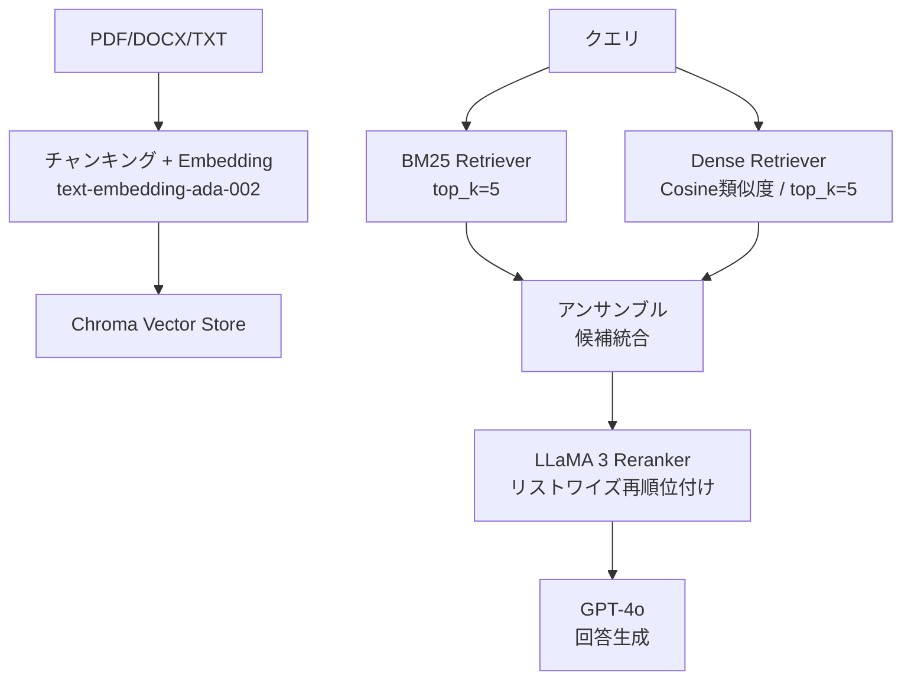

本記事は [arXiv:2607.11933 "Transforming LLMs into Efficient Cross-Encoders via Knowledge Distillation for RAG Reranking"](https://arxiv.org/abs/2607.11933) の解説記事です。

## 論文概要（Abstract）

Cross-encoderはRAGパイプラインにおいて高精度なRerankerとして機能するが、クエリと文書のペアごとに推論が必要なため、計算コストが二次的に増加する問題がある。本論文の著者ら（Lakshminath, S）は、LLaMA 3（8B）をLoRAアダプタとUnslothフレームワークで教師あり微調整し、4bit量子化を適用することで、従来のBERT系Cross-encoderを置き換える軽量Rerankerを構築している。

この記事は [Zenn記事: Haystack 2.xハイブリッド検索×Rerankerで構築する高精度QAパイプライン](https://zenn.dev/0h_n0/articles/a0caf566799e01) の深掘りです。

## 情報源

- **arXiv ID**: 2607.11933
- **URL**: [https://arxiv.org/abs/2607.11933](https://arxiv.org/abs/2607.11933)
- **著者**: Shreeya Dasa Lakshminath, Shubhan S
- **発表年**: 2026年7月
- **分野**: cs.CL（計算言語学）、cs.IR（情報検索）、cs.LG（機械学習）

## 背景と動機（Background & Motivation）

RAGパイプラインにおけるRerankerは、検索段階で取得した候補文書を精密に再順位付けすることで、LLMに渡すコンテキストの品質を向上させる。Bi-encoder（Embeddingモデル）はクエリと文書を独立にエンコードするため高速だが、両者の相互作用を直接モデル化できない。一方、Cross-encoderはクエリと文書を同時にエンコードするため高精度だが、候補数$n$に対して$O(n)$回の推論が必要となり、レイテンシが候補数に比例して増加する。

著者らは、LLM（LLaMA 3 8B）をRerankerとして微調整し、4bit量子化で推論コストを削減することで、Cross-encoderの精度を維持しつつ、デプロイメントの障壁を下げるアプローチを提案している。

## 主要な貢献（Key Contributions）

- **貢献1**: LLaMA 3（8B）をLoRAアダプタでRerankerとして微調整する手法の提示。リストワイズ方式でランキング全体を一度に処理する
- **貢献2**: 4bit GGUF形式での量子化により、限られたハードウェアでのデプロイを実現
- **貢献3**: BM25 + Dense Retrievalのデュアルレトリーバーパイプラインにおいて、BERT系Cross-encoderと比較してRAGASスコアで14〜21%の改善を報告

## 技術的詳細（Technical Details）

### パイプライン全体構成

著者らが構築したRAGパイプラインは以下の4段階で構成されている。



### LoRA微調整の詳細

著者らはUnslothフレームワークを使用し、以下の設定でLLaMA 3 8Bを微調整している。

| パラメータ | 値 |
|-----------|-----|
| ベースモデル | llama-3-8b-bnb-4bit |
| LoRA適用対象 | q_proj, k_proj, v_proj, o_proj |
| LoRAランク $r$ | 16 |
| LoRA $\alpha$ | 32 |
| オプティマイザ | 8-bit AdamW |
| 学習率 | $2 \times 10^{-4}$ |
| Weight Decay | 0.01 |
| ウォームアップ | 全ステップの10% |
| 精度 | fp16 / bf16混合精度 |

LoRAは元のモデルの重み$\mathbf{W}_0$に低ランク行列$\Delta \mathbf{W} = \mathbf{B}\mathbf{A}$を加算する手法である。

$$
\mathbf{W} = \mathbf{W}_0 + \Delta \mathbf{W} = \mathbf{W}_0 + \mathbf{B}\mathbf{A}
$$

ここで、
- $\mathbf{W}_0 \in \mathbb{R}^{d \times d}$: 事前学習済みの重み行列（凍結）
- $\mathbf{B} \in \mathbb{R}^{d \times r}$, $\mathbf{A} \in \mathbb{R}^{r \times d}$: 学習可能な低ランク行列
- $r = 16$: LoRAランク（$d \gg r$により、学習パラメータ数を大幅に削減）

スケーリング係数$\alpha / r = 32 / 16 = 2$が適用され、学習率と合わせて勾配の大きさを調整している。

### リストワイズReranking

著者らは従来のポイントワイズ（文書ごとの独立スコアリング）ではなく、リストワイズ方式を採用している。リストワイズ方式では、クエリと候補文書リスト全体を一度のフォワードパスで処理し、文書間の相対的な関連度を直接学習する。

入力フォーマットは以下の3フィールドで構成される。
- **input**: クエリ + 候補文書リスト
- **prompt**: ランキング指示文
- **output**: 正解の順序付け

### 量子化

微調整後のLoRAアダプタは元モデルにマージされ、4bit GGUF形式で保存される。これにより、16GBのVRAMを持つGPUや、場合によってはCPU環境でもデプロイが可能になる。

## 実験結果（Results）

### 主要結果（論文Table 1より）

著者らは、BERT系Cross-encoderをベースラインとし、微調整済みLLaMA 3 Rerankerとの比較を報告している。評価にはRAGASフレームワークが使用されている。

| 評価指標 | Cross-Encoder | LLaMA 3 (提案手法) | 相対改善 |
|---------|--------------|-------------------|---------|
| Answer Relevancy | 0.78 | 0.89 | +14% |
| Context Precision | 0.75 | 0.87 | +16% |
| Answer Similarity | 0.74 | 0.88 | +19% |
| Answer Correctness | 0.70 | 0.85 | +21% |

著者らは、Answer Correctnessにおける+21%の改善を最も重要な結果として位置付けており、事実に関連する文書の特定精度が向上したことが要因であると分析している。

### 制約と留意点

本論文の結果を解釈する際には、以下の制約を考慮する必要がある。

1. **単一データセット**: 評価は1つのドメイン固有QAデータセット（大学の学術プログラム関連文書）でのみ実施されており、MS-MARCOやBEIRなどの標準ベンチマークでの検証は行われていない
2. **単一ベースライン**: 比較対象はBERT系Cross-encoder1種のみであり、monoT5やRankGPTとの比較は含まれていない
3. **レイテンシ未測定**: 4bit量子化による推論速度の改善は論文の主要な主張だが、具体的なレイテンシやスループットの測定値は報告されていない
4. **タイトルとの乖離**: 論文タイトルは「知識蒸留」を掲げているが、記述されている手法は教師あり微調整であり、蒸留ステップは確認できない

## 実装のポイント（Implementation）

本論文のアプローチをHaystack 2.xパイプラインに適用する場合の実践的な考慮点を整理する。

1. **モデル選択のトレードオフ**: LLM系Reranker（4B-8Bパラメータ）はBERT系Cross-encoder（278M-568M）と比較して高精度だが、推論コストも高い。Zenn記事で紹介した`BAAI/bge-reranker-base`（278M）はCPU環境でも実用的な速度で動作するため、プロトタイプ段階ではBERT系、本番環境ではLLM系という段階的アプローチが考えられる

2. **LoRA微調整の実践**: Unslothフレームワークを使用することで、A100相当のGPU 1枚で8Bモデルの微調整が可能である。ドメイン固有のQAデータセットが利用可能な場合、汎用Rerankerよりも高い精度が期待できる

3. **量子化によるデプロイ**: 4bit GGUF形式は`llama.cpp`や`vLLM`で直接ロード可能であり、Haystackの`LocalGenerator`と組み合わせることでカスタムRerankerを構築できる

```python
from haystack_integrations.components.rankers.sentence_transformers import (
    SentenceTransformersSimilarityRanker,
)

ranker_bert = SentenceTransformersSimilarityRanker(
    model="BAAI/bge-reranker-base",
    top_k=5,
)

ranker_multilingual = SentenceTransformersSimilarityRanker(
    model="BAAI/bge-reranker-v2-m3",
    top_k=5,
)
```

## Production Deployment Guide

### AWS実装パターン（コスト最適化重視）

LLM系Rerankerをプロダクション環境にデプロイする場合のAWS構成を示す。

**トラフィック量別の推奨構成**:

| 規模 | 月間リクエスト | 推奨構成 | 月額コスト | 主要サービス |
|------|--------------|---------|-----------|------------|
| **Small** | ~3,000 (100/日) | Serverless | $80-200 | Lambda + Bedrock (Reranker API) |
| **Medium** | ~30,000 (1,000/日) | Hybrid | $400-1,000 | ECS Fargate (Rerankerホスト) + Bedrock |
| **Large** | 300,000+ (10,000/日) | Container | $2,500-6,000 | EKS + g5.xlarge Spot + Karpenter |

**Small構成の詳細** (月額$80-200):
- **Lambda**: BM25 + Dense Retrieval処理 ($20/月)
- **Bedrock**: Cohere Rerank v4.0 API利用 ($100/月)
- **OpenSearch Serverless**: ベクトル + キーワードインデックス ($30/月)
- **S3**: ドキュメントストア ($5/月)

**Large構成の詳細** (月額$2,500-6,000):
- **EKS**: コントロールプレーン ($72/月)
- **EC2 Spot** (g5.xlarge): LLaMA 3 4bit推論 × 2-4台 ($800/月)
- **Karpenter**: GPU需要に応じた自動スケーリング
- **ElastiCache Redis**: Rerankerスコアキャッシュ ($30/月)

**コスト試算の注意事項**: 上記は2026年10月時点のAWS ap-northeast-1料金に基づく概算値です。最新料金は [AWS料金計算ツール](https://calculator.aws/) で確認してください。

### Terraformインフラコード

**Small構成 (Serverless): Lambda + Bedrock Reranker**

```hcl
resource "aws_iam_role" "reranker_lambda" {
  name = "reranker-lambda-role"

  assume_role_policy = jsonencode({
    Version = "2012-10-17"
    Statement = [{
      Action    = "sts:AssumeRole"
      Effect    = "Allow"
      Principal = { Service = "lambda.amazonaws.com" }
    }]
  })
}

resource "aws_iam_role_policy" "bedrock_rerank" {
  role = aws_iam_role.reranker_lambda.id

  policy = jsonencode({
    Version = "2012-10-17"
    Statement = [{
      Effect   = "Allow"
      Action   = ["bedrock:InvokeModel"]
      Resource = "arn:aws:bedrock:ap-northeast-1::foundation-model/cohere.rerank*"
    }]
  })
}

resource "aws_lambda_function" "reranker" {
  filename      = "reranker.zip"
  function_name = "rag-reranker"
  role          = aws_iam_role.reranker_lambda.arn
  handler       = "index.handler"
  runtime       = "python3.12"
  timeout       = 120
  memory_size   = 2048

  environment {
    variables = {
      RERANKER_MODEL    = "cohere.rerank-v4.0-pro"
      TOP_K_CANDIDATES  = "50"
      TOP_K_RERANK      = "5"
    }
  }
}
```

### セキュリティベストプラクティス

1. **IAM最小権限**: Bedrock InvokeModelアクションは使用するモデルARNのみに制限
2. **ネットワーク**: Lambda VPC内配置、VPCエンドポイント経由でBedrock接続
3. **暗号化**: KMSカスタマーマネージドキーによるデータ暗号化
4. **監査**: CloudTrailでBedrock API呼び出しを記録

### コスト最適化チェックリスト

- [ ] BERT系Reranker（bge-reranker-base）でプロトタイプし、精度が不足する場合のみLLM系に移行
- [ ] 4bit量子化モデル使用でVRAM要件を50%以上削減
- [ ] Reranker候補数制限（50件以内）
- [ ] 同一クエリの結果キャッシュ（Redis TTL 30分）
- [ ] Bedrock Batch API活用で非リアルタイム処理50%削減
- [ ] Spot Instances利用で最大90%削減（GPU推論ノード）
- [ ] AWS Budgets: 月額予算設定
- [ ] CloudWatch: Rerankerレイテンシ P99監視

## 関連研究（Related Work）

- **NV-RerankQA-Mistral-4B-v3 (arXiv:2409.07691)**: Mistral 7Bを4Bに枝刈りし、双方向Attentionに変更してRerankerとして微調整したモデル。BEIR NQ/HotpotQA/FiQAでNDCG@10のSOTAを報告している。本論文のLLaMA 3ベースのアプローチとは、枝刈り+Attention変更 vs LoRA+量子化という異なるアプローチを取っている
- **SciRerankBench (arXiv:2508.08742)**: 13種のRerankerを科学文献RAGで評価したベンチマーク。Cross-encoder系（特にMXBAI）が意味的に類似だが論理的に無関係なコンテキストの識別で優れていると報告している
- **bge-reranker-v2-m3 (BAAI)**: 568Mパラメータの多言語Cross-encoder。Apache 2.0ライセンスでセルフホスト可能であり、本論文のLLM系アプローチに対するコスト効率の良い代替選択肢となる

## まとめと今後の展望

本論文は、LLM（LLaMA 3 8B）をLoRA微調整と4bit量子化でRerankerに変換するアプローチを提示し、BERT系Cross-encoderと比較してRAGASスコアで14〜21%の改善を報告している。Zenn記事で解説した`SentenceTransformersSimilarityRanker`が提供するBERT系Rerankerに対し、精度要件が厳しい本番環境ではLLM系Rerankerへの移行が有効な選択肢となり得る。

ただし、本論文は単一の小規模データセットでの評価に限定されており、標準ベンチマークでの検証やレイテンシ測定が欠如している点には注意が必要である。LLM系Rerankerの本番導入を検討する際は、NV-RerankQA-Mistral-4B-v3のようにBEIRベンチマークで広範に評価されたモデルとの比較を推奨する。

## 参考文献

- **arXiv**: [https://arxiv.org/abs/2607.11933](https://arxiv.org/abs/2607.11933)
- **Unsloth**: [https://github.com/unslothai/unsloth](https://github.com/unslothai/unsloth)
- **Related Zenn article**: [https://zenn.dev/0h_n0/articles/a0caf566799e01](https://zenn.dev/0h_n0/articles/a0caf566799e01)
