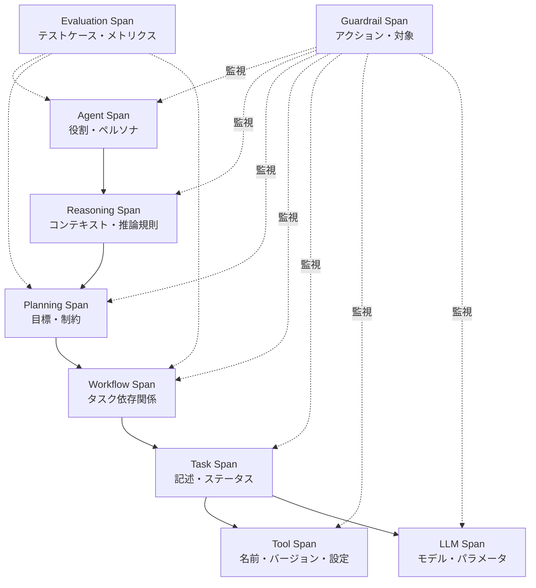

本記事は [AgentOps: Enabling Observability of LLM Agents](https://arxiv.org/abs/2411.05285) の解説記事です。

## 論文概要（Abstract）

LLMエージェントの自律的・非決定的・継続的に進化する振る舞いはAI安全性上の懸念を生じさせる。Dong, Lu, Zhuらは、DevOpsの観点からエージェントの観測可能性を体系化し、エージェントライフサイクル全体でトレースすべきアーティファクトとデータの包括的タクソノミーを提案した。このタクソノミーは17の既存AgentOpsツールの体系的マッピング調査から導出されたものであり、モニタリング・ロギング・分析のインフラ設計における参照テンプレートとして機能する。

この記事は [Zenn記事: LangSmith Engine×Automationsで本番エージェント障害を自動トリアージする](https://zenn.dev/0h_n0/articles/201e1b264fa021) の深掘りです。

## 情報源

- **arXiv ID**: 2411.05285
- **URL**: [https://arxiv.org/abs/2411.05285](https://arxiv.org/abs/2411.05285)
- **著者**: Liming Dong, Qinghua Lu, Liming Zhu
- **発表年**: 2024
- **分野**: cs.AI, cs.SE

## 背景と動機（Background & Motivation）

LLMエージェントの本番運用では、プロトタイプからプロダクションへの移行に伴い、観測可能性（observability）の確保が不可欠となる。著者らは、従来のソフトウェアシステムにおけるDevOpsの概念をLLMエージェントに拡張し、「AgentOps」という新たなパラダイムを提唱している。

既存の観測可能性ツール（LangSmith、Langfuse、Arize等）は個別に発展してきたが、著者らの調査時点では「どのアーティファクトをどの粒度でトレースすべきか」という共通の体系が存在しなかった。本論文は、17ツールの体系的調査から帰納的にタクソノミーを導出し、エージェント固有のトレーシング要件を明確化することを目的としている。

## 主要な貢献（Key Contributions）

- **AgentOpsタクソノミー**: エージェントのライフサイクル全体でトレースすべきアーティファクトとデータの包括的分類体系
- **体系的マッピング調査**: Kitchenham-Charters手法に基づく17ツールの調査と機能比較
- **実体関連モデル**: エージェントスパン、推論スパン、計画スパン、ワークフロースパン等の関係を定義するデータモデル
- **参照テンプレート**: AgentOpsインフラ設計のためのリファレンスアーキテクチャ

## 技術的詳細（Technical Details）

### AgentOpsタクソノミー：トレース可能アーティファクト

著者らは、エージェントの実行トレースを構成する9種類のスパン型を定義している。各スパンは共通メタデータ（名前、開始タイムスタンプ、持続時間、属性、イベント、親ID、リンク）を持つ。

**9種類のスパン型の詳細**:

| スパン型 | 記録するデータ | 用途 |
|---------|-------------|------|
| **Agent Span** | エージェントの役割、ペルソナ | エージェントの識別と追跡 |
| **Reasoning Span** | コンテキスト、取得済み知識、推論規則・境界、結果 | 推論プロセスの透明化 |
| **Planning Span** | 目標、制約条件、コンテキスト、過去の計画履歴 | 計画の追跡と比較 |
| **Workflow Span** | タスク一覧、タスク間依存関係、運用コンテキスト、実行履歴 | ワークフロー全体の可視化 |
| **Task Span** | タスク記述、ステータス（pending/in_progress/completed） | 個別タスクの進捗管理 |
| **Tool Span** | ツール名、バージョン、設定（タイムアウト、リソース制限等） | ツール呼び出しの記録 |
| **LLM Span** | モデル名、バージョン、パラメータ（temperature、max_tokens等） | LLM呼び出しの詳細記録 |
| **Evaluation Span** | テストケース、評価メトリクス、テスト結果 | 品質評価の記録 |
| **Guardrail Span** | ガードレールアクション（block/filter/validate）、対象 | 安全性制御の記録 |

### 実体関連モデル

著者らは上記のスパン型間の関係を以下のように定義している。

1. ユーザー目標は0以上のナレッジベースを参照する
2. Reasoning Spanは計画を生成する
3. 各Planning Spanは複数のLLM Spanを呼び出しうる
4. 計画はWorkflow Spanとして実現される
5. Workflowは複数のTask Spanを含む
6. TaskはTool SpanおよびLLM Spanを呼び出す
7. Evaluation Spanはエージェント、計画、またはワークフローを評価する
8. Guardrail Spanはすべての他のスパンを監視する

### 体系的マッピング調査の方法論

著者らはKitchenham-Charters手法およびGarousiらの灰色文献レビュー手法に基づき、以下の手順でツールを収集・分析した。

**データソース**:
- GitHub検索: 「AgentOps」「Agent AND DevOps」「Agent AND LLMOps」「Agent AND Observability」
- Google検索: 「LLM AND Agent AND Observability AND Tool」

**選定基準**:
- I1: 観測可能性（モニタリング、トレーシング）をサポートすること
- I2: エージェント固有またはエージェント適用可能なトレーシングを提供すること（LLMレベルのみのトレーシングは除外）
- I3: 正式リリースバージョンが存在すること
- I4: 公開オンラインドキュメントが存在すること

GitHub検索では37+24+81リポジトリから4+3+3ツール、DevOps検索では618件の上位3ページから1ツール、Google検索から6ツールが選定され、合計17ツールが対象となった。

### 17ツールの機能比較

著者らは7つの主要機能カテゴリで17ツールを比較している。

**ツールのスコープ分類**:
- **エージェント特化型**: AgentOps、AgentNeo、AGIFlow、DataDog（4ツール）
- **LLMアプリケーション特化型**: Agenta、Arize、Dify、Helicone、Langfuse、LangSmith、LangTrace、Lunary、TraceLoop、TruLens、Portkey、Laminar（13ツール）

**機能カバレッジ**:

| 機能 | 対応ツール数 | 代表ツール |
|------|-----------|----------|
| トレーシング | 17/17（全ツール） | 全ツール |
| モニタリング（ダッシュボード・コスト追跡） | 多数 | LangSmith, Arize, DataDog |
| 評価（ベンチマーク・データセット） | 多数 | LangSmith, TruLens, Arize |
| フィードバック（明示的・暗黙的） | 一部 | LangSmith, Langfuse |
| プロンプト管理（バージョニング・Playground） | 一部 | LangSmith, Agenta |
| ガードレール | 6/17 | AgentOps, Arize, Dify, LangSmith, Lunary, TruLens |
| カスタマイズ（エージェント構成・ファインチューニング） | 一部 | Dify, AGIFlow |

著者らの調査結果から注目すべき点として、全17ツールがトレーシングを実装しているのに対し、ガードレール機能を提供するのは6ツール（AgentOps、Arize、Dify、LangSmith、Lunary、TruLens）のみであり、安全性制御の統合が未成熟な領域であることが示唆されている。

### LangSmithの位置づけ

本論文のタクソノミーにおけるLangSmithの位置づけは以下の通りである。

- **スコープ**: LLMアプリケーション特化型（エージェント特化型ではない）
- **GitHub Stars**: 417（論文執筆時点、2024年）
- **ガードレール**: あり
- **特徴**: トレーシング、評価、フィードバック、プロンプト管理、モニタリングの幅広い機能セットを提供

Zenn記事で解説したLangSmithのAutomationsやEngineは、本論文が提案するタクソノミーにおけるEvaluation Span（Online Evaluator）とGuardrail Span（ルールベースフィルタリング）の実装例として位置づけることができる。

## 実運用への応用（Practical Applications）

AgentOpsタクソノミーは、LLMエージェントの観測可能性システムを設計する際の要件定義として活用できる。

**LangSmithとの対応関係**:

| AgentOpsスパン型 | LangSmithの対応機能 | カバー範囲 |
|-----------------|-------------------|---------|
| Agent Span | Threadsタブ | 部分的（role/personaは記録しない） |
| Reasoning Span | Trajectory View | 部分的（推論規則は明示的に記録しない） |
| Planning Span | — | 非対応 |
| Workflow Span | プロジェクト | 部分的 |
| Task Span | Run | 対応 |
| Tool Span | Tool Runのスパン | 対応 |
| LLM Span | LLM Runのスパン | 対応（トークン数・コスト含む） |
| Evaluation Span | Online Evaluator / Automations | 対応 |
| Guardrail Span | Automations Rules | 部分的 |

この対応関係から、LangSmithは特にTask/Tool/LLM Spanのトレーシングと評価機能において充実している一方、Planning SpanやReasoning Spanのような高レベルの認知プロセスの記録は明示的にはサポートされていないことがわかる。

**実務上の示唆**:
- エージェントの観測可能性を設計する際は、単なるLLM呼び出しのトレーシングにとどまらず、推論・計画・タスク管理の各レベルでのスパン設計を検討すべき
- ガードレールの統合は17ツール中6ツールしか対応しておらず、本番運用ではガードレールを別途設計する必要がある場合が多い
- エージェント特化型ツール（AgentOps、AgentNeo等）とLLMアプリケーション特化型ツール（LangSmith等）では設計思想が異なり、用途に応じた選定が重要

## 制約と限界

著者らは以下の制約を明記している。

- タクソノミーは実世界のケーススタディやプロトタイプ実装による検証がまだ行われていない
- トレースリンクやステップ間インタラクションの記録が不足している可能性がある
- 調査対象は2024年11月時点のツールであり、その後の機能追加（LangSmith Engineなど）は反映されていない
- GitHub Starsやドキュメントのみからのデータ抽出であり、実際の利用者フィードバックは含まれていない

## 関連研究（Related Work）

- **エージェント設計パターン**: エージェントのアーキテクチャ設計に関する先行研究。本論文はこれを運用・観測可能性の観点から補完する
- **参照アーキテクチャ**: ソフトウェアシステムの参照アーキテクチャに関する研究。AgentOpsタクソノミーはこの延長線上に位置づけられる
- **評価駆動型設計**: エージェントの品質保証を評価中心に設計するアプローチ。本論文のEvaluation Spanの設計根拠
- **多層ランタイムガードレール**: 実行時の安全性制御に関する研究。本論文のGuardrail Spanの設計根拠

## まとめと今後の展望

AgentOpsは、LLMエージェントの観測可能性を9種類のスパン型からなる包括的タクソノミーとして体系化し、17の既存ツールの機能を横断的に比較した。全ツールがトレーシングを実装する一方、ガードレールの統合は6/17にとどまり、エージェント特化型ツールは4/17のみであるという現状を明らかにした。

本タクソノミーはLangSmithのようなプラットフォームの機能カバレッジを評価する際の基準フレームワークとして有用であり、不足する機能領域（Planning Span、Reasoning Span等）の特定に役立つ。今後はタクソノミーの実運用環境での検証と、ツール間の相互運用性の標準化が課題として挙げられる。

## 参考文献

- **arXiv**: [https://arxiv.org/abs/2411.05285](https://arxiv.org/abs/2411.05285)
- **Related Zenn article**: [https://zenn.dev/0h_n0/articles/201e1b264fa021](https://zenn.dev/0h_n0/articles/201e1b264fa021)
- **Kitchenham & Charters**: 体系的レビュー手法のガイドライン
- **Garousi et al.**: 灰色文献・多声文献レビューの手法

---

:::message
この記事はAI（Claude Code）により自動生成されました。論文の内容は著者らの報告に基づいており、実際の利用時は[原論文](https://arxiv.org/abs/2411.05285)もご確認ください。
:::
