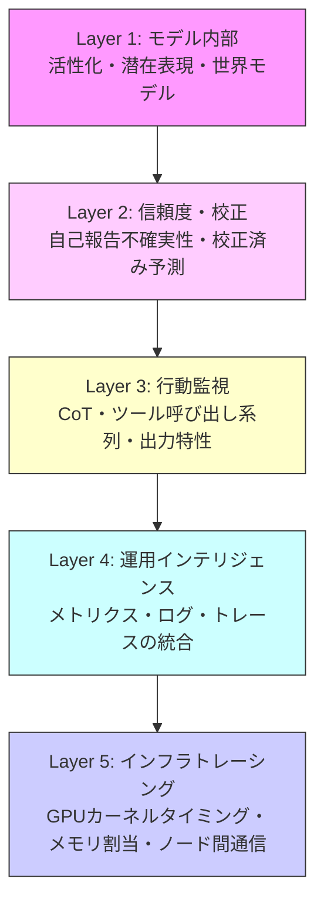

本記事は [AI Observability for Large Language Model Systems: A Multi-Layer Analysis of Monitoring Approaches from Confidence Calibration to Infrastructure Tracing](https://arxiv.org/abs/2604.26152) の解説記事です。

## 論文概要（Abstract）

Sisodiaは、2025〜2026年に発表されたLLMシステムの観測可能性に関する5つの研究を調査し、モデル内部からGPUカーネルまでを網羅する5層のタクソノミーを提案した。調査対象は、MIT CSAILの信頼度校正、UC Berkeleyの命題プローブ、OpenAIのChain-of-Thought監視可能性、Microsoft Research等のAIOpsLabベンチマーク、XuらのTRUFFLDトレーシングフレームワークの5件である。著者は「モデルレベルの信頼度シグナルとインフラレベルの異常を接続することが、この分野の定義的な未解決問題である」と結論付けている。

この記事は [Zenn記事: LangSmith Engine×Automationsで本番エージェント障害を自動トリアージする](https://zenn.dev/0h_n0/articles/201e1b264fa021) の深掘りです。

## 情報源

- **arXiv ID**: 2604.26152
- **URL**: [https://arxiv.org/abs/2604.26152](https://arxiv.org/abs/2604.26152)
- **著者**: Twinkll Sisodia
- **発表年**: 2026
- **分野**: cs.SE

## 背景と動機（Background & Motivation）

LLMシステムの本番運用において、観測可能性（observability）は信頼性確保の基盤である。しかし、著者は従来の観測可能性研究が個別の層（モデルの信頼度、行動監視、インフラトレーシング等）に特化しており、層間を横断的に分析するフレームワークが存在しないことを課題として指摘している。

たとえば、LLMの出力品質が低下した場合、その原因がモデルの不確実性（信頼度校正の問題）なのか、GPUメモリ圧迫やKVキャッシュ退避（インフラの問題）なのかを区別するためには、複数の層にまたがるシグナルの相関分析が必要となる。LangSmithのような観測可能性プラットフォームは主にアプリケーション層（トレーシング、メトリクス、ダッシュボード）をカバーするが、モデル内部やインフラ層との統合は限定的である。

## 主要な貢献（Key Contributions）

- **5層観測可能性タクソノミー**: LLMシステムの監視アプローチをモデル内部からGPUカーネルまで5層に体系化
- **5研究の統一的比較**: 異なる層に属する5つの先端研究を共通の枠組みで分析
- **4つの未解決課題（Open Gap）の特定**: 層間シグナル相関、統一ベンチマーク、リアルタイム適応監視、コスト考慮型監視配分
- **運用的観測可能性システムとの比較**: SREチーム向けの実用システムとの対比分析

## 技術的詳細（Technical Details）

### 5層観測可能性タクソノミー

各層の特徴と要件:

| 層 | アクセス要件 | 主な対象 | LangSmithとの対応 |
|---|-----------|---------|-----------------|
| **Layer 1**: モデル内部 | ホワイトボックス | 活性化、潜在表現 | 非対応 |
| **Layer 2**: 信頼度・校正 | モデル出力 | 不確実性推定 | 非対応 |
| **Layer 3**: 行動監視 | 入出力のみ | CoT、ツール呼び出し | Trajectory View、Automations |
| **Layer 4**: 運用インテリジェンス | システムレベル | メトリクス統合 | ダッシュボード、アラート |
| **Layer 5**: インフラトレーシング | GPUレベル | カーネルタイミング | 非対応 |

LangSmithが主にカバーするのはLayer 3（Trajectory View、Automations）とLayer 4（ダッシュボード、アラート）であり、Layer 1・2・5は対象外であることがわかる。

### 調査対象5研究の詳細

#### 研究1: RLCR — 強化学習による信頼度校正（MIT CSAIL, Damani et al.）

**層**: Layer 2（信頼度・校正）

著者らは標準的な二値正解報酬にBrierスコアの校正ペナルティを追加した報酬関数を提案している。

$$
R = \mathbb{1}[y \equiv y^*] - (q - \mathbb{1}[y \equiv y^*])^2
$$

ここで、
- $y$: モデルの出力
- $y^*$: 正解
- $q$: 言語化された信頼度（0〜1）
- $\mathbb{1}[y \equiv y^*]$: 正解の指示関数

著者らは「任意の有界な真のスコアリング規則を校正項として使用すれば、精度と校正を同時に最大化するモデルが得られる」ことを証明したと報告されている。

**実験結果（Damani et al.の報告値）**:
- HotpotQA ECE（Expected Calibration Error）: 0.37 → 0.03（精度維持）
- 数学ベンチマーク ECE: 0.26 → 0.10
- 分布外データでは標準的なRLVRが校正を悪化させるのに対し、RLCRは改善

この研究はLLMの「自己報告する不確実性」の信頼性を向上させる技術であり、LangSmithのAnnotation Queueでのレビュー優先度決定（低信頼度の出力を優先的にレビュー）に応用可能な基盤技術である。

#### 研究2: 命題プローブ — モデル内部の忠実な表現抽出（UC Berkeley, Feng et al.）

**層**: Layer 1（モデル内部）

3段階のアプローチで、モデルの活性化からその内部表現（世界モデル）を抽出する。

1. **ドメインプローブ**: トークン活性化を語彙カテゴリに分類
2. **バインディング部分空間探索**: ヘッセ行列ベースのアルゴリズムで結合関係を発見
3. **合成的参照**: 命題（例: WorksAs(Greg, nurse)）を組み立て

著者らの報告によると、単純な英語テンプレートのみで訓練したプローブが短編小説やスペイン語にも汎化し、Jaccard指数でプロンプティングベースラインの10%以内の精度を達成した。

**重要な発見**: プロンプトインジェクション攻撃やバックドア攻撃、ジェンダーバイアスの条件下で、モデルは内部的には忠実な表現を保持しながら不忠実な出力を生成するケースがあると報告されている。この知見は、LLMの出力のみを監視する既存の観測可能性ツール（LangSmith含む）の限界を示唆している。

#### 研究3: CoT監視可能性（OpenAI, Guan et al.）

**層**: Layer 3（行動監視）

13の評価を3つのアーキタイプ（介入、プロセス、結果特性）にわたって実施し、$g\text{-mean}^2 = \text{TPR} \times \text{TNR}$で評価している。

**主要な発見（Guan et al.の報告）**:
1. 長いChain-of-Thoughtは一般により監視可能である
2. CoT監視は行動のみの監視をほぼ全設定で上回る
3. 現在のフロンティア規模でのRL訓練は監視可能性を実質的に低下させない
4. 「監視可能性税（monitorability tax）」: 小規模モデルを高推論努力で使用すると、同等の能力でより高い監視可能性が得られるが、推論コストが増加する
5. 追加CoTを生成するフォローアップ質問は監視可能性を大幅に改善する

この研究はLangSmithのTrajectory Viewの理論的基盤を提供する。CoTが長いほど監視しやすいという発見は、エージェントのデバッグにおいてステップごとの推論過程を記録する重要性を裏付けている。

#### 研究4: AIOpsLab — クラウドオペレーション自動化ベンチマーク（Microsoft Research / UC Berkeley / UIUC / IISc, Chen et al.）

**層**: Layer 4（運用インテリジェンス）

LLMエージェントによる検出・診断・緩和・解決の「AgentOps」パラダイムを提案し、Kubernetesマイクロサービス上のベンチマークを構築している。5つの能力（デプロイメント、障害注入、ワークロード生成、テレメトリエクスポート、Agent-Cloudインターフェース）を提供し、再現可能な比較のための正解根本原因を含む。

**重要な発見**: ボトルネックはテレメトリの可用性ではなく、テレメトリの解釈能力にあると報告されている。同一のテレメトリを与えられたエージェントでも、推論能力の違いにより診断精度が大幅に異なる。

この知見は、LangSmithが収集するトレースやメトリクスの量ではなく、それらをどう分析するか（LangSmith EngineやAutomationsの設計）が本番品質を決定する要因であることを示唆している。

#### 研究5: TRUFFLD — 非侵入型推論レベルトレーシング（Xu et al.）

**層**: Layer 5（インフラトレーシング）

推論エンジン、計算バックエンド、ホストオペレータ、GPUカーネルにまたがるエンドツーエンドの非侵入型トレーシングフレームワーク。NVTXマーカーとCUPTIコールバックで収集し、垂直（ノード内）と水平（ノード間、テンソル並列・パイプライン並列）の両方の視点を提供する。

**異常検出**: 2段階アプローチを採用する。ガウス混合モデル（GMM）でステップごとの校正済み信頼度を算出し、LLM推論でステップレベルの判断とオペレータレベルの位置特定を行う。

著者らの報告によると、マルチノードGPUクラスタ上のQwen3-8Bで「ほぼ完全なステップレベル検出」と優れたオペレータ位置特定を達成し、オーバーヘッドは低く、バイナリ修正は不要である。

## 4つの未解決課題（Open Gaps）

著者は以下の4つの未解決課題を特定している。

### Gap 1: 層間シグナル相関

現在、モデルの信頼度（Layer 2）とインフラの異常（Layer 5）を接続するシステムは存在しない。LLMの出力品質低下がクエリの難しさによるものなのか、GPUメモリ圧迫やKVキャッシュ退避によるものなのかを区別できない。

著者は「モデルレベルの信頼度シグナルとインフラレベルの異常を接続することが、この分野の定義的な未解決問題」と述べている。

### Gap 2: 統一評価ベンチマーク

AIOpsLabは運用エージェントのベンチマークを提供するが、モデルレベルの監視に関する共有ベンチマークは存在しない。異なる層の監視アプローチを公平に比較する手段が不足している。

### Gap 3: リアルタイム適応監視

プローブはオフラインで訓練され、閾値は手動で設定され、評価は定期的に実行される。リアルタイムで変化する状況に適応する監視システムの実現が課題である。

### Gap 4: コスト考慮型監視配分

CoT分析、インフラトレーシング、信頼度校正に費やす計算資源の最適配分を行うフレームワークが存在しない。監視自体のコストがシステム全体のコストに影響する状況では、監視粒度の動的調整が必要である。

## 実運用への応用（Practical Applications）

本論文の5層タクソノミーは、LangSmithのような観測可能性プラットフォームの機能カバレッジを評価するための「座標系」として活用できる。

**LangSmithの現在のカバレッジ分析**:

LangSmithは主にLayer 3とLayer 4をカバーしており、Layer 1・2・5は対象外である。この分析から、以下の拡張方向性が示唆される。

1. **Layer 2統合**: 信頼度校正の結果をAnnotation Queueの優先度に反映させることで、レビュー効率を向上できる
2. **Layer 5統合**: GPUレベルのトレーシングとアプリケーションレベルのトレーシングを統合し、レイテンシ異常の根本原因をインフラ層まで追跡できるようにする
3. **Gap 1への対応**: Layer 2-4-5をまたぐ因果分析パイプラインの構築

ただし、Gap 4（コスト考慮型監視配分）が示すように、すべての層を常時監視することはコスト的に現実的ではなく、トラフィック量やリスクレベルに応じた動的な監視粒度の調整が必要である。

**各研究結果の定量的サマリー**:

| 研究 | 評価指標 | 主な結果 |
|------|---------|---------|
| RLCR | ECE（HotpotQA） | 0.37 → 0.03 |
| RLCR | ECE（Math） | 0.26 → 0.10 |
| 命題プローブ | Jaccard指数 | プロンプティングベースラインの10%以内 |
| CoT監視 | g-mean² | CoT長に比例して向上 |
| AIOpsLab | 診断精度 | エージェントの推論能力に依存（具体値なし） |
| TRUFFLD | ステップレベル検出 | 「ほぼ完全」（具体的F1値なし） |
| Sisodia | レイテンシ | カタログ参照200ms未満、パイプライン全体1.1秒 |

これらの結果から、個別の層では成熟した監視手法が確立されつつあるが、層間の統合的な評価指標は未定義であることがわかる。

## 制約と限界

- 調査対象が5件に限定されており、2025〜2026年の代表的な研究をカバーしているが網羅的ではない
- 著者自身の先行研究（Layer 4のPromQL生成システム）が比較対象に含まれており、自己引用の偏りがある
- 定量的な統合評価は行われておらず、各研究の報告値の横断的比較にとどまる
- TRUFFLDの具体的なF1スコアが記載されていない

## 関連研究（Related Work）

- **AgentOps (2411.05285)**: 17のAgentOpsツールの体系的比較。本論文のLayer 3-4に対応する領域をカバー
- **AgentDebugX (2607.18754)**: 障害検出→帰属→修復の閉ループ。本論文のLayer 3に位置する
- **PrefixGuard (2605.06455)**: GRU+DFAによるオンライン障害警告。Layer 3のリアルタイム監視を実現
- **OpenTelemetry**: LLMシステムの分散トレーシング標準。Layer 4に位置

## まとめと今後の展望

本論文は、LLMシステムの観測可能性を5層タクソノミー（モデル内部→信頼度校正→行動監視→運用インテリジェンス→インフラトレーシング）で体系化し、各層が個別に成熟しつつも層間の統合が未解決であることを明らかにした。LangSmithのような既存プラットフォームはLayer 3-4に強みを持つが、Layer 1・2・5との統合、およびコスト考慮型の動的監視配分が今後の課題として残される。

## 参考文献

- **arXiv**: [https://arxiv.org/abs/2604.26152](https://arxiv.org/abs/2604.26152)
- **Related Zenn article**: [https://zenn.dev/0h_n0/articles/201e1b264fa021](https://zenn.dev/0h_n0/articles/201e1b264fa021)
- **RLCR (Damani et al.)**: MIT CSAILの信頼度校正研究
- **AIOpsLab (Chen et al.)**: Microsoft Research等のクラウドオペレーション自動化ベンチマーク
- **TRUFFLD (Xu et al.)**: 非侵入型推論レベルトレーシングフレームワーク
- **OpenAI CoT Monitorability (Guan et al.)**: Chain-of-Thought監視可能性研究

---

:::message
この記事はAI（Claude Code）により自動生成されました。論文の内容は著者らの報告に基づいており、実際の利用時は[原論文](https://arxiv.org/abs/2604.26152)もご確認ください。
:::
