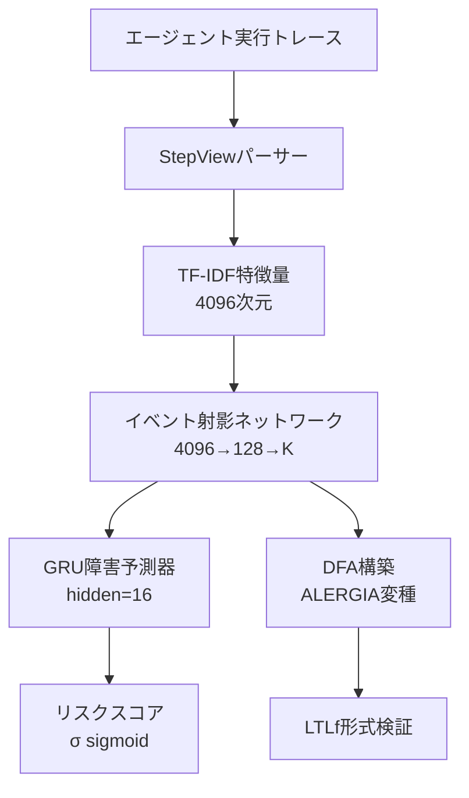

本記事は [PrefixGuard: Online Failure Warning and Trace-Grounded Diagnosis for LLM Agents](https://arxiv.org/abs/2605.06455) の解説記事です。

## 論文概要（Abstract）

LLMエージェントのマルチステップタスクでは、最終的な成否判定が遅れるため実行途中での介入が困難である。Huang, Hu, He, Roy, Wu, Dong, Huangらが提案するPrefixGuardは、GRU（Gated Recurrent Unit）ベースの障害予測器と決定性有限オートマトン（DFA）を組み合わせたニューロシンボリック手法で、エージェントの実行トレースからリアルタイムに障害リスクを推定し、根拠付きの診断を提供する。

この記事は [Zenn記事: LangSmith Engine×Automationsで本番エージェント障害を自動トリアージする](https://zenn.dev/0h_n0/articles/201e1b264fa021) の深掘りです。

## 情報源

- **arXiv ID**: 2605.06455
- **URL**: [https://arxiv.org/abs/2605.06455](https://arxiv.org/abs/2605.06455)
- **著者**: Xinmiao Huang, Jinwei Hu, Qisong He et al.（7名）
- **発表年**: 2026（Under Review）
- **分野**: cs.AI

## 背景と動機（Background & Motivation）

LLMエージェントの本番運用において、障害の「事後分析（post-hoc analysis）」は標準的なアプローチであるが、著者らは「terminal verdicts arrive too late for intervention（最終判定は介入するには遅すぎる）」と指摘している。エージェントトレースにはメッセージ、ツール呼び出し、フィードバックが混在しており、障害シグナルの学習を困難にしている。

LangSmithのAutomationsのような既存のルールベース自動化は、トレース完了後に特定条件のフィルタリングを行うが、実行途中でのリアルタイム介入は提供していない。PrefixGuardは、この「実行中の障害予測」という問題を、ニューラル予測とシンボリック構造化の融合で解決しようとする研究である。

## 主要な貢献（Key Contributions）

- **GRUベース障害警告器**: 実行イベントの接頭辞（prefix）から指定タイムホライズンの障害リスクを予測する学習済み警告器
- **DFAによる実行トレースの構造化**: 実行履歴をコンパクトなリスクラベル付きパスとして組織化し、リプレイとルールモニター合成を可能にする決定性有限オートマトン
- **形式検証によるスペック違反検出**: モデル検査（model checking）でLTLf安全性仕様の違反を検出し、ベンチマークで成功とされた実行にも潜在的違反を発見
- **4ベンチマーク・17エージェント実装での体系的評価**: WebArena、τ²-Bench、SkillsBench、TerminalBenchにまたがる広範な実験

## 技術的詳細（Technical Details）

### アーキテクチャ概要

PrefixGuardは3つのコンポーネントから構成される。



### StepViewパーサーとTF-IDF特徴量

各実行ステップは、LLMが提案した固定パーサーによってStepViewレコード（メタデータ、観測、行動、ツール、引数、結果、ステータス）に変換される。このStepViewレコードをunigram/bigram TF-IDFベクトライザーで4,096次元の特徴ベクトルに変換する。

$$
\mathbf{x}_t = \text{TF-IDF}(\text{StepView}(s_t)) \in \mathbb{R}^{4096}
$$

ここで、$s_t$は時刻$t$の実行ステップ、$\mathbf{x}_t$はその特徴量ベクトルである。スコアリング時にはLLMの呼び出しは不要であり、推論コストが低い点が特徴である。

### イベント射影ネットワーク

TF-IDF特徴量は2層のネットワーク（4096→128→$K$、GELU活性化）で$K$個のイベントカテゴリへの帰属確率に変換される。

$$
\mathbf{e}_t = \text{Gumbel-Softmax}(f_\theta(\mathbf{x}_t)) \in \Delta^{K-1}
$$

ここで、
- $K$: イベントカテゴリ数（WebArena, τ²-Bench, SkillsBenchでは16、TerminalBenchでは32）
- $f_\theta$: 射影ネットワーク
- $\Delta^{K-1}$: $(K-1)$次元単体（確率分布）
- 訓練時のGumbel-Softmax温度は1.0から0.25にアニーリングされる

### GRU障害予測器

イベント帰属確率の系列がGRUに入力され、各時刻でタイムホライズン$H$に対する障害リスクを推定する。

$$
h_t = \text{GRU}(h_{t-1}, \mathbf{e}_t), \quad \hat{r}_t = \sigma(W_r h_t + b_r)
$$

ここで、
- $h_t \in \mathbb{R}^{d_h}$: 隠れ状態（$d_h = 16$、TerminalBenchでは32）
- $\hat{r}_t \in [0, 1]$: 時刻$t$における障害リスク推定値
- $\sigma$: シグモイド関数
- $H$: 予測ホライズン（何ステップ先の障害を予測するか）

**損失関数**: ホライズン固有の接頭辞ラベル（最終結果から導出）に対する二値交差エントロピーにバランス損失を加えた形式を使用する。

$$
\mathcal{L} = \text{BCE}(\hat{r}_t, y_t) + 0.1 \cdot \mathcal{L}_{\text{balance}}
$$

バランス損失$\mathcal{L}_{\text{balance}}$は、確信度の高い多様なイベント使用を促進する正則化項である。訓練はAdamW（学習率$10^{-3}$、重み減衰$10^{-4}$）で24エポック実施し、検証AUPRCが最大のチェックポイントを選択する。

### DFA構築

GRUのargmaxイベント系列を接頭辞木に組織化し、ALERGIAに基づくHoeffding型リスク互換性検定（$\eta = 0.05$）で状態を統合する。

```python
def build_dfa(event_sequences: list[list[int]], outcomes: list[bool]) -> DFA:
    """イベント系列からDFAを構築する

    Args:
        event_sequences: 各トレースのargmaxイベント系列
        outcomes: 各トレースの成否ラベル

    Returns:
        リスクラベル付きDFA
    """
    # Step 1: 接頭辞木を構築
    prefix_tree = build_prefix_tree(event_sequences, outcomes)

    # Step 2: Hoeffding互換性検定で状態統合
    # サポート数が最大のノードから順に処理
    for node in sorted(prefix_tree.nodes, key=lambda n: n.support, reverse=True):
        for candidate in find_compatible_states(node, eta=0.05):
            if recursive_risk_compatible(node, candidate):
                merge_states(node, candidate)

    # Step 3: 欠損遷移を吸収シンクに接続
    add_absorbing_sink(prefix_tree)

    # Step 4: キャリブレーションデータで最終リスクを計算
    # 5つの疑似カウントでグローバル有病率に平滑化
    calibrate_state_risks(prefix_tree, pseudo_counts=5)

    return prefix_tree.to_dfa()
```

統合の結果、DFAの状態数は平均5.0〜32.3にコンパクト化される。

### LTLf形式検証

τ²-Benchの小売業務要件を5つのLTLf安全性仕様として記述し、モニターオートマトンにコンパイルした上でDFAと積構成（product construction）を行う。

著者らが記述した5つの仕様は以下の通りである。
1. 注文ステータスの確認
2. 交換ペアの整合性
3. アイテム数量の正確性
4. 同一製品バリアントの制約
5. 返金先の正確性

著者らの報告によると、これらの仕様違反は265件の成功トレース中21件（7.92%）、94件の失敗トレース中19件で検出された。ベンチマークが「成功」と判定した実行にも潜在的な要件違反が含まれることを示す結果である。

## 実験結果（Results）

### メインベンチマーク結果

著者らは4つのベンチマーク（WebArena、τ²-Bench、SkillsBench、TerminalBench）、17のエージェント実装、39のバックボーンモデルで評価を実施したと報告している。分割は70/10/10/10（訓練/検証/テスト/キャリブレーション）である。

**主要な報告結果**:
- GRUベース予測器は全24ベンチマーク×ホライズン設定でベースライン（PPM-LSTM）の平均テストAUPRCを上回ったと報告されている
- ホライズン平均のAUPRC向上幅は12.0ポイント（TerminalBench）〜21.9ポイント（WebArena）
- 10%の偽アラーム率（FAR）での平均テスト再現率は56.1%〜93.0%

**ベースラインとの比較（ゼロショットLLMジャッジ、H=3のAUPRC）**:
- WebArena: 0.450
- τ²-Bench: 0.396
- SkillsBench: 0.080
- TerminalBench: 0.107

著者らは「ゼロショットLLMジャッジはmatched prefix-warningプロトコル下では弱い」と結論付けている。PrefixGuardのGRUベース予測器はLLMを使用しないにもかかわらず、ゼロショットLLMジャッジを大幅に上回る性能を示したと報告されている。

### DFA保持率

DFAはGRU AUPRCの平均90.9%を保持したと報告されている。アラート再現率は71〜98%、精度は3ベンチマークで64〜88%であるが、WebArenaでは37〜76%に低下する。

### リードタイムの比較

ベースラインのPPM-LSTM等はいくつかのベンチマークで0.81〜1.00の再現率を達成するが、リードタイム（警告から障害までの余裕）は0.03〜0.12と短い。PrefixGuardは0.15〜0.39のリードタイムを確保しており、実行途中での介入余地が大きい。

### τ²-Bench詳細分析

τ²-Benchの359件（成功265件、失敗94件、114タスク、4エージェント）での詳細分析において、キャリブレーション済みDFA（H=3、seed 13）で失敗トレースが$t=13$で初めてリスク0.965で警告を発する事例が報告されている。

## 実装のポイント（Implementation）

**推論時のコスト**: PrefixGuardの推論にはLLMの呼び出しが不要であり、TF-IDF + GRUのみで動作する。これはLangSmithのAutomationsのようなルールベースシステムと同様に低コストで運用可能であることを意味する。

**実装上の注意点**:
- StepViewパーサーの設計がドメイン依存であり、新しいエージェントフレームワークへの適用にはパーサーの再設計が必要となる可能性がある
- GRUの隠れ状態次元（16〜32）とイベント数$K$（16〜32）はベンチマークごとにチューニングが必要
- DFA構築のHoeffding検定パラメータ$\eta = 0.05$は、データ量が少ない場合に過度な状態統合を引き起こす可能性がある
- LTLf仕様の記述には対象ドメインの業務要件の形式化が必要であり、汎用的な自動化は困難

## 実運用への応用（Practical Applications）

PrefixGuardのアプローチは、Zenn記事で解説したLangSmith Automationsのルールベースフィルタリングを補完する位置づけにある。

| PrefixGuard | LangSmith Automations | 対応関係 |
|-------------|----------------------|---------|
| GRU障害予測 | フィルタ条件 | トレースの選別基準 |
| DFA構造化 | トレーシングプロジェクト | 実行履歴の組織化 |
| LTLf形式検証 | Online Evaluator | 品質チェック |
| リアルタイム警告 | （未対応） | 実行中介入 |

LangSmith Automationsはトレース完了後のルールベース処理を提供するが、PrefixGuardは実行途中でのリアルタイム障害予測を実現する。両者を組み合わせることで、「実行中のリスク監視」と「完了後の自動トリアージ」の二段階監視体制を構築できる可能性がある。

ただし、PrefixGuardの性能はトレーニングデータの質と量に依存し、新しいエージェントやタスクへの汎化にはドメイン固有の調整が必要である。また、DFA構築には一定量の過去トレースが必要であり、新規運用開始直後の適用は困難である。

## 関連研究（Related Work）

- **PPM-LSTM**: 予測接頭辞モデルをLSTMで実装したベースライン。PrefixGuardのGRUに対してAUPRCで12.0〜21.9ポイント劣ると報告されている
- **DeepLog**: ログ異常検知の手法。エージェントトレースへの適用では性能が限定的
- **LogBERT**: Transformerベースのログ異常検知。PrefixGuardと同様にトレースの構造化を試みるが、DFAベースの形式検証は提供しない
- **AgentForesight (2605.08715)**: オンラインオーディティングによる早期障害予測。PrefixGuardとは異なり、7Bパラメータの専用モデルを訓練するアプローチ

## アブレーション分析

著者らはいくつかのアブレーションを報告している。

- **イベント射影なしのGRU**: 同一特徴量でイベント射影を省略した場合、0.4〜2.4ポイント高い性能を示すケースがある。ただし、DFA構築にはイベント射影が必要であるため、形式検証との両立には射影が不可欠である
- **プールドStepView MLP vs GRU**: 系列情報を無視してプーリングするMLPと比較すると、GRUはWebArenaで+2.44、SkillsBenchで+0.51ポイント優位であるが、τ²-Benchで-2.37、TerminalBenchで-1.78ポイント劣る。系列的な依存関係の重要性はベンチマークに依存する
- **抽象仕様の追加効果**: τ²-BenchでDFAに「2回の書き込みの間に読み取りが1回必要」という抽象仕様を追加すると、AUPRCが0.457から0.510に向上したと報告されている

## まとめと今後の展望

PrefixGuardは、ニューラル予測（GRU）とシンボリック構造化（DFA）の融合により、LLMエージェントの実行中障害予測を実現した。全24ベンチマーク×ホライズン設定でAUPRCが最良ベースラインを上回り、DFAによる形式検証で成功トレース中の潜在的要件違反も検出できることを示した。LLMを使用しない低コストな推論と、形式的な検証可能性の両立が本研究の特徴である。

今後の研究方向として、異なるドメインへのStepViewパーサーの自動適応、DFA状態数の適応的決定、およびLTLf仕様の半自動生成が挙げられる。

## 参考文献

- **arXiv**: [https://arxiv.org/abs/2605.06455](https://arxiv.org/abs/2605.06455)
- **Related Zenn article**: [https://zenn.dev/0h_n0/articles/201e1b264fa021](https://zenn.dev/0h_n0/articles/201e1b264fa021)
- **τ²-Bench**: エージェント評価ベンチマーク
- **WebArena**: Webエージェント評価環境

---

:::message
この記事はAI（Claude Code）により自動生成されました。論文の内容は著者らの報告に基づいており、実際の利用時は[原論文](https://arxiv.org/abs/2605.06455)もご確認ください。
:::
