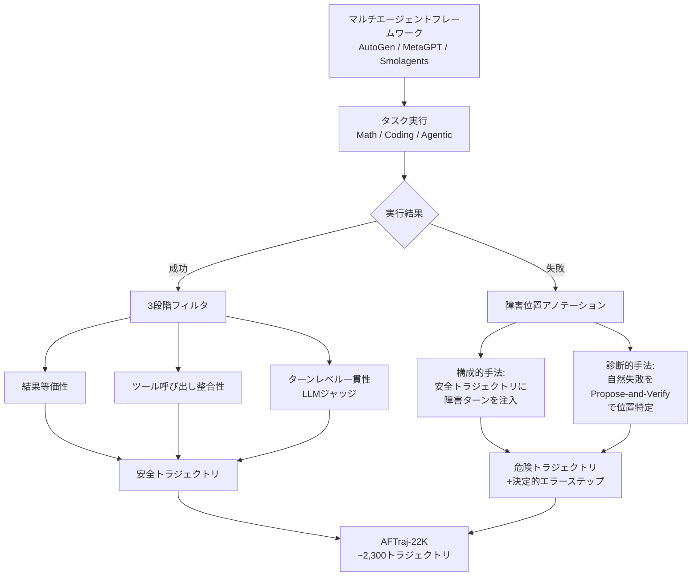

本記事は [AgentForesight: Online Auditing for Early Failure Prediction in Multi-Agent Systems](https://arxiv.org/abs/2605.08715) の解説記事です。

## 論文概要（Abstract）

マルチエージェントLLMシステムでは、初期ステップの単一のエラーが下流のエージェントに伝播し、トラジェクトリ全体の失敗を引き起こす。Zhang, Zhu, Shi, Liu, Tangらは、事後的な障害帰属ではなく実行中のオンラインオーディティングにより、障害の早期予測と介入を可能にするフレームワークを提案した。コアとなるAgentForesight-7Bは、Qwen2.5-7B-Instructをベースに2段階の強化学習（coarse-to-fine RL）で訓練された専用オーディターモデルであり、GPT-4.1やDeepSeek-V4-Proを上回る性能を報告している。

この記事は [Zenn記事: LangSmith Engine×Automationsで本番エージェント障害を自動トリアージする](https://zenn.dev/0h_n0/articles/201e1b264fa021) の深掘りです。

## 情報源

- **arXiv ID**: 2605.08715
- **URL**: [https://arxiv.org/abs/2605.08715](https://arxiv.org/abs/2605.08715)
- **著者**: Boxuan Zhang, Jianing Zhu, Zeru Shi, Dongfang Liu, Ruixiang Tang
- **発表年**: 2026
- **分野**: cs.CL（主分野）、cs.AI、cs.MA

## 背景と動機（Background & Motivation）

マルチエージェントシステムの長期的タスクにおいて、あるエージェントが犯した初期のエラーを下流のエージェントがそのまま受け入れてしまい、タスク全体が失敗するケースが頻発する。著者らは、従来の研究が「事後的な障害帰属（post-hoc failure attribution）」に焦点を当てており、実行が完了するまで介入の機会がない点を課題として指摘している。

この問題に対し、著者らは「オンラインオーディティング」という枠組みを提案する。各ステップで、オーディターは現在の接頭辞（prefix）のみを観察し、「Continue（続行）」または「Alarm（警告）」を出力する。Alarm時には、予測された障害ステップ$\hat{k}$と責任エージェント$\hat{a}$を特定する。

## 主要な貢献（Key Contributions）

- **オンラインオーディティングの定式化**: 障害分析を事後診断からリアルタイム介入に転換する新たな問題設定
- **AFTraj-22Kコーパス**: AutoGen、MetaGPT、Smolagentsの3フレームワークから構築された約2,300のアノテーション付きエージェントトラジェクトリ
- **AgentForesight-7B**: 2段階強化学習で訓練されたコンパクトなオンラインオーディター
- **3軸報酬関数**: What（構造）、Where（タイミング）、Who（帰属）の3軸で判定品質を評価する報酬設計

## 技術的詳細（Technical Details）

### オンラインオーディティングの定式化

著者らは以下のように問題を定式化している。

各ステップ$t$において、オーディターは実行接頭辞$\text{prefix}(t) = (s_1, s_2, \ldots, s_t)$を観察し、判定$v_t$を出力する。

$$
v_t = \begin{cases}
\text{Continue} & \text{（リスクなし）} \\
\text{Alarm}(\hat{k}, \hat{a}) & \text{（障害予測、ステップ}\hat{k}\text{、エージェント}\hat{a}\text{）}
\end{cases}
$$

ここで、$\hat{k}$は予測される決定的エラー（decisive error）のステップ、$\hat{a}$は責任エージェントである。「決定的エラー」とは、修正すれば失敗トラジェクトリが成功に転換する最も早いステップと定義されている。

### AFTraj-22Kコーパスの構築

**ドメインとタスク**:
- **Math**: MATH-500
- **Coding**: HumanEval+、MBPP+
- **Agentic**: GAIA、HotpotQA

**安全トラジェクトリのフィルタリング**: 成功した実行は3段階のフィルタ（結果等価性、ツール呼び出し整合性、ターンレベル一貫性のLLMジャッジ）を通過したもののみ保持される。

**危険トラジェクトリの構築**は2つの経路で行われる。

1. **構成的手法**: 安全トラジェクトリに障害ターンを注入して再実行する。結果がまだ成功する場合や、対象ターンが変更されない場合は棄却される
2. **診断的手法**: 自然に失敗した実行を、4つの基準に基づくPropose-and-Verify手法と多数決で決定的エラーステップに位置特定する

### AgentForesight-7Bの訓練（Coarse-to-Fine RL）

ベースモデルはQwen2.5-7B-Instructで、2×NVIDIA H200 GPUで訓練される。

**Stage 1: 障害境界整列（Boundary PPO / BPPO）**

各危険トラジェクトリに対し、エラー前後で1ターン異なる2つのプロンプトを構築する。

$$
\text{prefix}_{\text{pre}} = (s_1, \ldots, s_{k^*-1}), \quad \text{prefix}_{\text{post}} = (s_1, \ldots, s_{k^*})
$$

ここで$k^*$は決定的エラーステップである。$\text{prefix}_{\text{pre}}$に対する最適判定はContinue、$\text{prefix}_{\text{post}}$に対する最適判定はAlarmである。選好損失（$\beta = 0.1$）で訓練し、モデルに障害境界の認識を学習させる。

訓練パラメータ: 学習率$5 \times 10^{-7}$、3エポック。

**Stage 2: 3軸判定先鋭化（GRPO）**

Stage 1のチェックポイントを参照方策として、Group Relative Policy Optimization（GRPO）で判定の精度を向上させる。

$$
J(\theta) = \mathbb{E}\left[\sum_{g=1}^{G} \left(\frac{\pi_\theta(y_g|x)}{\pi_{\text{ref}}(y_g|x)} \cdot A_g - \beta_{\text{KL}} \cdot D_{\text{KL}}(\pi_\theta \| \pi_{\text{ref}})\right)\right]
$$

ここで、
- $G = 8$: グループサイズ
- $\beta_{\text{KL}} = 10^{-3}$: KL係数
- 学習率: $10^{-6}$
- KL推定: k3推定量
- $A_g$: グループ内の相対アドバンテージ

### 3軸報酬関数

報酬は3つの軸で構成される。

**What（構造ゲート）**: スキーマ、JSONバリデーション、根拠付けをチェックする二値ゲート$G(\hat{y})$。違反時はソフトペナルティ$-\eta_G$。

**Where（タイミング）**: ステップ位置の正確性をガウス関数で評価する。

$$
r_{\text{step}} = \exp\left(-\frac{(\hat{k} - k^*)^2}{2\sigma^2}\right)
$$

ここで$\hat{k}$は予測ステップ、$k^*$は正解ステップ、$\sigma$はスケールパラメータである。

**Who（帰属）**: 責任エージェントの正確性を評価する。完全一致で満点、部分一致で減点。

**統合報酬**:
- 正しいSafe判定: $+1$
- 正しいAlarm判定: $w_s \cdot r_{\text{step}} + w_a \cdot r_{\text{agent}}$（$w_s + w_a = 1$）
- クラス間エラー（SafeをAlarmと誤判定、またはその逆）: $-1$

## 実験結果（Results）

### AFTraj-22Kでの主要結果

著者らはExact-F1（判定精度）とASS（Average Step Shift、ステップ位置誤差）で評価している（論文Table 1相当）。

| モデル | Math | Coding | Agentic | Overall Exact-F1 |
|-------|------|--------|---------|-----------------|
| Qwen2.5-7B-Instruct | 10.39 | 38.20 | 14.00 | 21.05 |
| GPT-4.1 | 24.39 | 10.81 | 40.68 | 27.43 |
| DeepSeek-V4-Pro | 50.34 | 49.32 | 41.77 | 46.56 |
| Claude-Haiku-4.5 | — | — | — | 25.53 |
| **AgentForesight-7B** | **77.36** | **78.87** | **48.70** | **66.44** |

AgentForesight-7Bは全体Exact-F1で66.44%を達成し、DeepSeek-V4-Pro（46.56%）を+19.88ポイント、GPT-4.1（27.43%）を+39.01ポイント上回ったと著者らは報告している。ASS（ステップ位置誤差）は0.59で、DeepSeek-V4-Pro（1.77）の約3分の1である。

### Who&Whenベンチマーク（外部評価）

外部ベンチマークWho&Whenでの結果（論文Table 2相当）。

| モデル | Step-Acc | Agent-Acc | ASS↓ |
|-------|----------|-----------|------|
| GPT-4.1 | 38.10 | 66.67 | 2.38 |
| DeepSeek-V4-Flash | 37.21 | 65.12 | 2.35 |
| Qwen2.5-7B-Instruct | 36.59 | 58.54 | 2.41 |
| **AgentForesight-7B** | **57.69** | **73.08** | **1.62** |

著者らは、GPT-4.1比でStep-Accが+19.59ポイント、Agent-Accが+6.41ポイント向上し、ASSが約32%低減したと報告している。

### アブレーション分析

2段階訓練の各段階の寄与（論文内アブレーション結果より）:

| 構成 | Overall Exact-F1 | Agentic |
|------|-----------------|---------|
| ベースQwen2.5-7B | 21.1 | — |
| + Stage 1のみ（BPPO） | 35.6 | 31.6 |
| + Stage 2のみ（GRPO） | 50.4 | 19.0 |
| **Full（Stage 1 + 2）** | **66.4** | **48.7** |

Stage 1（障害境界整列）はAgentic領域で+12.6ポイントの改善をもたらすが、Stage 2（判定先鋭化）のみではAgentic領域が19.0%に留まる。両段階の組み合わせにより、Agenticで48.7%と大幅に向上する。著者らは「Stage 1がリスク認識の基盤を構築し、Stage 2がステップレベルの精度を向上させる」と分析している。

### デプロイ適性分析

著者らはFAR（False Alarm Rate）20%以下かつStep-Acc 50%以上を「デプロイ可能領域」と定義している。

- **AgentForesight-7B**: FAR 2.4%、Step-Acc 59.5%（デプロイ可能領域内）
- **DeepSeek-V4-Pro**: FAR 43.2%、Step-Acc 54.0%（FAR過大でデプロイ不適）

このデプロイ適性分析は、本番環境での運用可能性を直接評価する指標として注目に値する。

## 実装のポイント（Implementation）

**訓練コスト**: 2×NVIDIA H200 GPUで訓練。7Bパラメータモデルのため、推論コストはGPT-4.1等のプロプライエタリモデルと比較して大幅に低い。

**推論時の動作**: 各ステップでオーディターは現在の接頭辞を入力として受け取り、Continue/Alarmの判定を出力する。判定にはステップ位置$\hat{k}$と責任エージェント$\hat{a}$の予測が含まれる。

**実装上の注意点**:
- オーディターの入力コンテキスト長はベースモデル（Qwen2.5-7B-Instruct）の制約に依存する。長いトラジェクトリでは接頭辞の切り詰めが必要となる可能性がある
- FAR 2.4%は低い偽アラーム率であるが、大規模運用では絶対数として無視できない数の偽アラームが発生する
- 現在のモデルはMath・Coding・Agenticの3ドメインで訓練されており、その他のドメイン（カスタマーサポート、データ分析等）への汎化は未検証

## 実運用への応用（Practical Applications）

AgentForesightのオンラインオーディティングは、Zenn記事で解説したLangSmithの機能群と以下のように対応する。

| AgentForesight | LangSmith | 対応関係 |
|---------------|-----------|---------|
| オンラインオーディティング | Automations（フィルタ条件） | トレースの選別。AgentForesightはリアルタイム、Automationsは事後 |
| Alarm判定 | Annotation Queue | 人間レビューへの振り分け |
| 決定的エラー特定 | Engine Diagnose | 障害箇所の特定 |
| FAR/Step-Acc分析 | ダッシュボード・アラート | 品質メトリクスの監視 |

AgentForesightはLangSmith Engineの「検出（Detect）」フェーズを、専用の7Bモデルで代替するアプローチとして位置づけることができる。LangSmith Engineがプロプライエタリな大規模モデルで障害パターンを認識するのに対し、AgentForesightはドメイン特化の小規模モデルで低コスト・低遅延の予測を実現する。

ただし、AgentForesightは現時点で障害の「修正（Fix）」や「予防（Prevent）」のフェーズをカバーしておらず、LangSmith Engineの閉ループサイクル全体を代替するものではない。

## 関連研究（Related Work）

- **Who&When (Zhang et al., 2025)**: 事後的な障害帰属ベンチマーク。AgentForesightは同ベンチマークでGPT-4.1を上回る性能を報告
- **MAST (Cemri et al., 2026)**: マルチエージェント障害のタクソノミー。事後分析に焦点
- **PrefixGuard (2605.06455)**: 同時期の研究で、GRU+DFAによるオンライン障害警告を提案。AgentForesightとは異なりLLMを使用しないアプローチ
- **AgentDebugX (2607.18754)**: 事後的だが、Detect→Attribute→Recover→Rerunの閉ループを提供

## まとめと今後の展望

AgentForesightは、マルチエージェントシステムの障害対応を事後分析からリアルタイム介入に転換する「オンラインオーディティング」を提案した。7Bパラメータの専用オーディターモデルをcoarse-to-fine強化学習で訓練し、GPT-4.1比+19.9ポイントのExact-F1向上とFAR 2.4%を達成したと報告されている。

今後の研究方向として、修正・予防フェーズとの統合、新ドメインへの汎化、およびLangSmith等の観測可能性プラットフォームとの連携が挙げられる。

## 参考文献

- **arXiv**: [https://arxiv.org/abs/2605.08715](https://arxiv.org/abs/2605.08715)
- **Related Zenn article**: [https://zenn.dev/0h_n0/articles/201e1b264fa021](https://zenn.dev/0h_n0/articles/201e1b264fa021)
- **Who&When benchmark**: [https://arxiv.org/abs/2505.00212](https://arxiv.org/abs/2505.00212)
- **GRPO**: Group Relative Policy Optimization（DeepSeek技術報告書より）

---

:::message
この記事はAI（Claude Code）により自動生成されました。論文の内容は著者らの報告に基づいており、実際の利用時は[原論文](https://arxiv.org/abs/2605.08715)もご確認ください。
:::
