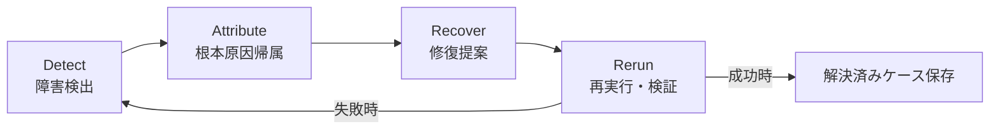

本記事は [AgentDebugX: An Open-Source Toolkit for Failure Observability, Attribution, and Recovery in LLM Agents](https://arxiv.org/abs/2607.18754) の解説記事です。

## 論文概要（Abstract）

LLMエージェントの障害デバッグでは、エラーの発生ステップと原因ステップが異なるケースが多く、既存のトレース再生ツールでは根本原因の特定が困難である。本論文でZhu, Ye, Han, Zhao, Li, Zhang, Tian, Tang, Lu, Zou, You, Jiらが提案するAgentDebugXは、Detect（検出）→ Attribute（帰属）→ Recover（修復）→ Rerun（再実行）の4段階閉ループでエージェントの障害対応を自動化するオープンソースフレームワークである。

この記事は [Zenn記事: LangSmith Engine×Automationsで本番エージェント障害を自動トリアージする](https://zenn.dev/0h_n0/articles/201e1b264fa021) の深掘りです。

## 情報源

- **arXiv ID**: 2607.18754
- **URL**: [https://arxiv.org/abs/2607.18754](https://arxiv.org/abs/2607.18754)
- **著者**: Kunlun Zhu, Xuyan Ye, Zhiguang Han et al.（12名）
- **発表年**: 2026
- **分野**: cs.AI, cs.CL
- **ライセンス**: CC BY-NC-SA 4.0

## 背景と動機（Background & Motivation）

LLMエージェントの本番運用では、ツール呼び出しの失敗、ハルシネーション、不適切なハンドオフなど多様な障害が発生する。既存の観測可能性ツール（LangSmith、Langfuse等）はトレースの記録・再生を提供するが、著者らは「根本原因の特定や修正案の生成まではカバーしていない」と指摘している。

特に問題なのは、障害の「症状」が現れるステップと「原因」が存在するステップが異なるケースである。たとえば、ステップ3でのツール選択ミスがステップ8でのエラーとして顕在化する場合、トレースを眺めるだけでは原因箇所の特定が困難となる。Tyen et al. (2024) の研究では、エラーの位置情報が与えられた場合にモデルの修正精度が大幅に向上することが報告されており、「帰属（Attribution）」と「修復（Recovery）」を組み合わせるアプローチの有効性を示唆している。

## 主要な貢献（Key Contributions）

- **Detect→Attribute→Recover→Rerunの閉ループフレームワーク**: 障害検出から再実行までを一貫して自動化する設計
- **DeepDebugアルゴリズム**: グローバルトラジェクトリ理解、構造誘導型調査、交差検証の3段階で根本原因を特定するマルチターン診断手法
- **19種類の障害モードの体系的分類**: 決定論的ルールとLLMジャッジの組み合わせによる障害分類タクソノミー
- **Error Hub**: スクラブ済みの障害-診断-修復バンドルを共有・再利用するためのオプトイン型リポジトリ
- **Pythonライブラリ・CLI・Webコンソール・エージェントスキル**: 複数のインターフェースによるツールキット提供

## 技術的詳細（Technical Details）

### Detect→Attribute→Recover→Rerunループ

AgentDebugXのコアアーキテクチャは以下の4段階で構成される。



**1. Detect（検出）**

著者らは検出を2層構造で設計している。第1層は決定論的ルールパックで、不正なツール呼び出しフォーマット、無限ループ（no-progress loop）、早期成功宣言（premature success）などの機械的に検証可能な障害をモデル呼び出しなしで検出する。第2層はLLMジャッジが担当し、ルールで捕捉できない意味的障害を型付き所見として返す。

初期タクソノミーには19種類の障害モードが定義されている。さらに、未認識の障害を自動的にクラスタリングし、新たな障害モードを提案するインデューサー機能を備えるが、提案はキュレーション済みタクソノミーを自動上書きせず、人間のレビューを経て追加される。

**2. Attribute（帰属）**

症状から根本原因のステップを追跡する。著者らは複数の帰属戦略を用意している。

- **ヒューリスティクス**: 単純なルールベースの帰属
- **全トレース読み取り（All-at-Once）**: トレース全体を一度に読んで原因を推定
- **ステップバイステップ検査**: 各ステップを順番に検査
- **二分探索（Binary Search）**: ステップ範囲を半分ずつ絞り込む
- **予算付きアンサンブル**: 複数戦略を組み合わせてランク付き仮説を生成

曖昧なケースはDeepDebugにエスカレーションされる。

**3. Recover（修復）**

特定された障害箇所に対して修復提案を生成する。ネイティブパスではDeepDebugの修正提案を追加のモデル呼び出しなしで再利用する。代替戦略としてReflexion、CRITIC、AutoManualも統合されている。すべての修復提案は「suggest-only」であり、適用には人間またはポリシーゲートの承認が必要である点を著者らは強調している。

**4. Rerun（再実行）**

診断結果、チェックポイント、リトライ指示をパッケージ化して再実行リクエストを生成する。成功した分岐は解決済みケースとして保存され、元の失敗トレースと比較保持される。失敗した分岐は再度検出フェーズに投入される。

### DeepDebugアルゴリズム

DeepDebugは4ステージのマルチターン根本原因診断エージェントであり、キャプチャ済みトレース上で読み取り専用で動作する（ツールの再実行は行わない）。

```python
def deep_debug(trace: AgentTrace) -> DiagnosisReport:
    """DeepDebugの4段階根本原因診断アルゴリズム

    Args:
        trace: キャプチャ済みのエージェント実行トレース

    Returns:
        責任エージェント・ステップ、説明、修正案を含む構造化レポート
    """
    # Stage 1: グローバル読み取り
    objective = reconstruct_objective(trace)
    history = reconstruct_history(trace)
    candidate_1 = identify_initial_candidate(objective, history)

    # Stage 2: 構造誘導型調査
    if trace.is_multi_agent:
        candidate_2 = trace_upstream_handoff_cascade(trace, candidate_1)
    else:
        candidate_2 = bisect_step_range(trace, candidate_1)

    # Stage 3: 交差検証
    if candidate_1.step == candidate_2.step:
        final_step = candidate_1
    else:
        final_step = llm_cross_examine(candidate_1, candidate_2)

    # Stage 4: 診断・修正提案
    report = generate_structured_report(
        responsible_agent=final_step.agent,
        responsible_step=final_step.step,
        explanation=final_step.causal_explanation,
        evidence=final_step.quoted_evidence,
        fix_suggestion=generate_concrete_fix(final_step),
    )
    return report
```

各ステージの詳細は以下の通りである。

**Stage 1（グローバル読み取り）**: トレース全体から目的と履歴を再構成し、初期候補ステップを指名する。

**Stage 2（構造誘導型調査）**: トレースの構造に応じた調査を行う。マルチエージェントの場合はハンドオフの連鎖を上流に辿り、シングルエージェントの場合はステップ範囲を二分探索して独立した第2候補を生成する。

**Stage 3（交差検証）**: 2つの候補が一致すればそのまま採用する。不一致の場合はLLMが両候補を並べて比較し、因果関係がより強い方を選択する。

**Stage 4（診断・修正提案）**: 責任エージェントとステップ、因果説明、引用エビデンス、具体的修正案を含む構造化レポートを出力する。すべての検査ログが記録される。

## 実験結果（Results）

### Who&When帰属ベンチマーク

著者らはWho&Whenベンチマーク（184トレース、qwen3.5-9bバックボーン）で以下の結果を報告している。

| 手法 | Agent Acc | Step (exact) | Step (±1) | A+S (exact) | A+S (±1) |
|------|-----------|-------------|-----------|-------------|-----------|
| Rule heuristic | 14.1 | 1.6 | 6.5 | 1.6 | 2.7 |
| All-at-Once | 47.8 | 22.3 | 35.3 | 21.7 | 23.9 |
| Step-by-Step | 41.8 | 18.5 | 38.0 | 17.9 | 19.6 |
| Binary-Search | 41.8 | 17.4 | 38.6 | 17.4 | 20.1 |
| **DeepDebug** | **56.0** | **28.8** | **44.0** | **28.8** | **32.1** |

論文Table 3より、DeepDebugは厳密なAgent+Step同時正解率（A+S exact）で28.8%を達成し、最良ベースライン（All-at-Once: 21.7%）を7.1ポイント上回ったと報告されている。

ただし、著者らはqwen3.6-27bでは差が38.0% vs 36.4%に縮小し、ホスト型バックボーンではグローバル読み取り単独の方が高精度となるケースもあるため、モデルごとのルーティングを推奨している。

### GAIAエンドツーエンド修復

GAIA検証タスク（165タスク、ベースライン精度55.8%、73件の失敗、各1回のリラン）での結果を以下に示す（論文Table 4より）。

| 手法 | 修復数 | L1 | L2 | L3 | 全体 |
|------|--------|-----|-----|-----|------|
| Vanilla | — | 77.4 | 48.8 | 34.6 | 55.8 |
| + CRITIC | 4/73 | 81.1 | 51.2 | 34.6 | 58.2 |
| + Reflexion | 6/73 | 77.4 | 55.8 | 34.6 | 59.4 |
| **+ DeepDebug** | **13/73** | **81.1** | **61.6** | **34.6** | **63.6** |

DeepDebugは73件の失敗タスクのうち13件を1回のリランで修復し、全体精度を55.8%から63.6%に向上させたと著者らは報告している。比較対象のReflexion（6件修復）やCRITIC（4件修復）と比べて修復成功数で2倍以上の差がある。ただし、ベースラインにはDeepDebugの位置特定・エビデンス・修正案ではなく汎用的なジャッジサマリーのみが提供されている点に注意が必要である。

### コスト分析

著者らは25トレースのサンプルで、全トレース1パス読み取りが平均約8,100トークン、DeepDebugが約12,800トークン（1.6倍）と報告している。DeepDebugは約5回のモデル呼び出しを使用する。曖昧なケースのみエスカレーションする運用では、期待コストは1パスに近い水準に留まるとされている。

## Error Hubの設計

Error Hubは、スクラブ済みのトラジェクトリ−診断−修復バンドルを保存・共有するためのオプトイン型ストアである。

- **スクラブ処理**: デフォルトではイベント入力（プロンプト、ツール引数）を完全に除去する。既知のクレデンシャル・PIIパターンは残りの文字列からも削除される。著者らは「パターン削除では任意の機密コンテンツを捕捉できないため、公開前にバンドルをレビューすべき」と注記している
- **保存先**: ローカルディレクトリ、プライベートGitリモート、公開データセットから選択
- **用途**: インシデント記録、CI回帰テストのフィクスチャ、過去の類似ケースの検索によるデバッグメモリ
- **現状の制限**: 検索とタクソノミー誘導は実装済みだが未評価であり、誘導には人間の承認が必要

## 実運用への応用（Practical Applications）

AgentDebugXの閉ループ設計は、Zenn記事で解説したLangSmith Engineの「検出→診断→修正→予防」サイクルと構造的に対応している。

| AgentDebugX | LangSmith Engine | 対応する機能 |
|-------------|-----------------|------------|
| Detect | 検出（Detect） | 障害シグナルの自動認識 |
| Attribute | 診断（Diagnose） | 根本原因の特定 |
| Recover | 修正（Fix） | 修正PRのドラフト生成 |
| Rerun | 予防（Prevent） | 再発防止のための評価器生成 |

LangSmith Engineがプロプライエタリな統合ソリューションであるのに対し、AgentDebugXはフレームワーク非依存のオープンソースツールキットとして設計されている。LangChainエコシステム外のエージェント（AutoGen、MetaGPT、カスタム実装等）でも利用可能であり、Error Hubを通じた組織横断的なインシデント知識の蓄積が可能な点は実運用上の差別化要因となる。

ただし、論文時点（2026年7月）での制約として、Error Hubの検索機能は未評価であり、タクソノミー誘導も人間の承認が必要である。また、DeepDebugの性能はバックボーンモデルに依存し、すべてのモデルで一貫した改善が得られるわけではない点に注意が必要である。

## 関連研究（Related Work）

論文Table 1より、著者らは既存ツールとの機能カバレッジを以下のように比較している。

- **AgentDebug (Zhu et al., 2025)**: タクソノミーと帰属を提供するが、修復とError Hubを欠く
- **MAST (Cemri et al., 2026)**: タクソノミーを提供するが、帰属は部分的でポータブルスキーマを欠く
- **Who&When (Zhang et al., 2025)**: 帰属に特化するが、タクソノミーは部分的で修復を欠く
- **Langfuse (2023)**: ポータブルスキーマを部分的に提供するが、タクソノミー・帰属・修復を欠く
- **AgentDebugX**: 5項目すべて（ポータブルスキーマ、タクソノミー、帰属、修復、Error Hub）をカバー

自己修正系の関連研究として、Reflexion、Self-Refine、CRITIC、AutoManualが挙げられ、いずれもAgentDebugXの修復戦略として統合されている。

## まとめと今後の展望

AgentDebugXは、LLMエージェントの障害対応をDetect→Attribute→Recover→Rerunの閉ループとして体系化し、DeepDebugアルゴリズムによる構造的な根本原因診断を実現した。Who&Whenベンチマークで厳密帰属精度28.8%（ベースライン比+7.1pt）、GAIAでの修復成功率17.8%（13/73件）を報告している。

今後の研究方向として、Error Hubの検索精度の評価、モデル非依存な帰属戦略の自動ルーティング、およびLangSmith等の既存観測可能性プラットフォームとの統合が挙げられる。

## 参考文献

- **arXiv**: [https://arxiv.org/abs/2607.18754](https://arxiv.org/abs/2607.18754)
- **Related Zenn article**: [https://zenn.dev/0h_n0/articles/201e1b264fa021](https://zenn.dev/0h_n0/articles/201e1b264fa021)
- **Tyen et al. (2024)**: LLMs Cannot Find Reasoning Errors — エラー位置情報の提供が修正精度を向上させることを示した先行研究
- **Who&When benchmark**: [https://arxiv.org/abs/2505.00212](https://arxiv.org/abs/2505.00212)

## Production Deployment Guide

### AWS実装パターン（コスト最適化重視）

AgentDebugXのようなエージェントデバッグパイプラインをAWSで運用する場合、トレース収集→障害検出→根本原因帰属→修復提案の各段階をサーバーレスまたはコンテナで実装できる。

**トラフィック量別の推奨構成**:

| 規模 | 月間トレース数 | 推奨構成 | 月額コスト | 主要サービス |
|------|-------------|---------|-----------|------------|
| **Small** | ~3,000 | Serverless | $80-200 | Lambda + Bedrock + DynamoDB |
| **Medium** | ~30,000 | Hybrid | $400-1,000 | Lambda + ECS Fargate + ElastiCache |
| **Large** | 300,000+ | Container | $2,500-6,000 | EKS + Karpenter + EC2 Spot |

**Small構成の詳細**（月額$80-200）:
- **Lambda**: トレース受信・障害検出ルール実行（1GB RAM, 60秒タイムアウト, $25/月）
- **Bedrock**: DeepDebug相当の根本原因診断（Claude 3.5 Haiku, 約12,800トークン/診断, $100/月）
- **DynamoDB**: トレース・診断結果の保存（On-Demand, $15/月）
- **S3**: Error Hubバンドルのストレージ（$5/月）
- **CloudWatch**: 基本監視（$10/月）

**Medium構成の詳細**（月額$400-1,000）:
- **Lambda**: トレースイベント受信（$50/月）
- **ECS Fargate**: DeepDebug診断ワーカー（0.5 vCPU, 1GB RAM × 2タスク, $120/月）
- **Bedrock**: Claude 3.5 Sonnet（複雑な帰属タスク向け, $500/月）
- **ElastiCache Redis**: Error Hub検索キャッシュ（cache.t3.micro, $15/月）
- **SQS**: 診断タスクキューイング（$5/月）

**Large構成の詳細**（月額$2,500-6,000）:
- **EKS**: コントロールプレーン（$72/月）
- **EC2 Spot Instances**: g5.xlarge × 2-4台（DeepDebug並列実行, 平均$800/月）
- **Karpenter**: 自動スケーリング（追加コストなし）
- **Bedrock Batch**: 50%割引活用（$1,500/月）
- **OpenSearch**: トレース全文検索・Error Hub検索（$200/月）

**コスト試算の注意事項**: 上記は2026年10月時点のAWS ap-northeast-1（東京）リージョン料金に基づく概算値です。実際のコストはトレース量、診断頻度、バックボーンモデルの選択により変動します。最新料金は [AWS料金計算ツール](https://calculator.aws/) で確認してください。

### Terraformインフラコード

**Small構成（Serverless）: Lambda + Bedrock + DynamoDB**

```hcl
module "vpc" {
  source  = "terraform-aws-modules/vpc/aws"
  version = "~> 5.0"

  name = "agent-debug-vpc"
  cidr = "10.0.0.0/16"
  azs  = ["ap-northeast-1a", "ap-northeast-1c"]
  private_subnets = ["10.0.1.0/24", "10.0.2.0/24"]

  enable_nat_gateway   = false
  enable_dns_hostnames = true
}

resource "aws_iam_role" "lambda_debug" {
  name = "agent-debug-lambda-role"

  assume_role_policy = jsonencode({
    Version = "2012-10-17"
    Statement = [{
      Action = "sts:AssumeRole"
      Effect = "Allow"
      Principal = { Service = "lambda.amazonaws.com" }
    }]
  })
}

resource "aws_iam_role_policy" "bedrock_invoke" {
  role = aws_iam_role.lambda_debug.id
  policy = jsonencode({
    Version = "2012-10-17"
    Statement = [{
      Effect   = "Allow"
      Action   = ["bedrock:InvokeModel", "bedrock:InvokeModelWithResponseStream"]
      Resource = "arn:aws:bedrock:ap-northeast-1::foundation-model/anthropic.claude-3-5-haiku*"
    }]
  })
}

resource "aws_lambda_function" "debug_handler" {
  filename      = "lambda.zip"
  function_name = "agent-debug-handler"
  role          = aws_iam_role.lambda_debug.arn
  handler       = "index.handler"
  runtime       = "python3.12"
  timeout       = 120
  memory_size   = 1024

  environment {
    variables = {
      BEDROCK_MODEL_ID = "anthropic.claude-3-5-haiku-20241022-v1:0"
      DYNAMODB_TABLE   = aws_dynamodb_table.traces.name
      ERROR_HUB_BUCKET = aws_s3_bucket.error_hub.id
    }
  }
}

resource "aws_dynamodb_table" "traces" {
  name         = "agent-debug-traces"
  billing_mode = "PAY_PER_REQUEST"
  hash_key     = "trace_id"
  range_key    = "step_id"

  attribute {
    name = "trace_id"
    type = "S"
  }
  attribute {
    name = "step_id"
    type = "N"
  }

  ttl {
    attribute_name = "expire_at"
    enabled        = true
  }
}

resource "aws_s3_bucket" "error_hub" {
  bucket = "agent-debug-error-hub"
}

resource "aws_s3_bucket_server_side_encryption_configuration" "error_hub" {
  bucket = aws_s3_bucket.error_hub.id
  rule {
    apply_server_side_encryption_by_default {
      sse_algorithm = "aws:kms"
    }
  }
}
```

**Large構成（Container）: EKS + Karpenter + Spot Instances**

```hcl
module "eks" {
  source  = "terraform-aws-modules/eks/aws"
  version = "~> 20.0"

  cluster_name    = "agent-debug-cluster"
  cluster_version = "1.31"
  vpc_id          = module.vpc.vpc_id
  subnet_ids      = module.vpc.private_subnets

  cluster_endpoint_public_access = true
  enable_cluster_creator_admin_permissions = true
}

resource "kubectl_manifest" "karpenter_provisioner" {
  yaml_body = <<-YAML
    apiVersion: karpenter.sh/v1
    kind: NodePool
    metadata:
      name: debug-workers
    spec:
      template:
        spec:
          requirements:
            - key: karpenter.sh/capacity-type
              operator: In
              values: ["spot"]
            - key: node.kubernetes.io/instance-type
              operator: In
              values: ["m5.xlarge", "m5.2xlarge"]
          limits:
            cpu: "32"
            memory: "128Gi"
      disruption:
        consolidationPolicy: WhenEmpty
        consolidateAfter: 30s
  YAML
}

resource "aws_budgets_budget" "debug_monthly" {
  name         = "agent-debug-monthly"
  budget_type  = "COST"
  limit_amount = "6000"
  limit_unit   = "USD"
  time_unit    = "MONTHLY"

  notification {
    comparison_operator        = "GREATER_THAN"
    threshold                  = 80
    threshold_type             = "PERCENTAGE"
    notification_type          = "ACTUAL"
    subscriber_email_addresses = ["ops@example.com"]
  }
}
```

### セキュリティベストプラクティス

- **IAMロール**: 最小権限の原則。Bedrock InvokeModelのみ許可し、モデルARNを限定
- **ネットワーク**: Lambda/ECSはVPC内プライベートサブネットに配置
- **シークレット管理**: AWS Secrets Manager使用。環境変数へのハードコード禁止
- **暗号化**: S3/DynamoDB/EBSすべてKMS暗号化。転送中はTLS 1.2以上必須
- **監査**: CloudTrail全リージョン有効化。Error Hubバンドルのアクセスログ記録

### 運用・監視設定

```sql
-- CloudWatch Logs Insights: DeepDebug診断のレイテンシ分析
fields @timestamp, trace_id, diagnosis_duration_ms, token_count
| stats avg(diagnosis_duration_ms) as avg_ms,
        pct(diagnosis_duration_ms, 95) as p95_ms,
        sum(token_count) as total_tokens
  by bin(1h)
| filter total_tokens > 50000
```

```python
import boto3

cloudwatch = boto3.client('cloudwatch')

cloudwatch.put_metric_alarm(
    AlarmName='debug-diagnosis-latency',
    ComparisonOperator='GreaterThanThreshold',
    EvaluationPeriods=2,
    MetricName='DiagnosisDuration',
    Namespace='AgentDebug',
    Period=300,
    Statistic='Average',
    Threshold=60000,
    AlarmDescription='DeepDebug診断の平均時間が60秒超過',
    AlarmActions=['arn:aws:sns:ap-northeast-1:123456789:debug-alerts'],
)
```

### コスト最適化チェックリスト

**アーキテクチャ選択**:
- [ ] ~100トレース/日 → Lambda + Bedrock（Serverless）$80-200/月
- [ ] ~1,000トレース/日 → ECS Fargate + Bedrock（Hybrid）$400-1,000/月
- [ ] 10,000+トレース/日 → EKS + Spot（Container）$2,500-6,000/月

**リソース最適化**:
- [ ] EC2 Spot Instances優先（Karpenter自動管理）
- [ ] Lambda メモリサイズ最適化（PowerTuning実行）
- [ ] DynamoDB On-Demandモード（低トラフィック時）
- [ ] S3ライフサイクルポリシー（古いバンドル自動削除）
- [ ] ECS/EKSアイドルタイムのスケールダウン

**LLMコスト削減**:
- [ ] Bedrock Batch API: 非リアルタイム診断に50%割引適用
- [ ] Prompt Caching: システムプロンプト固定で30-90%削減
- [ ] モデル選択ロジック: 簡易検出はHaiku、複雑帰属はSonnet
- [ ] トークン数制限: max_tokens設定で過剰生成防止
- [ ] 曖昧ケースのみDeepDebugにエスカレーション（期待コスト削減）

**監視・アラート**:
- [ ] AWS Budgets月額予算設定
- [ ] CloudWatchアラーム: 診断レイテンシスパイク検知
- [ ] Cost Anomaly Detection有効化
- [ ] 日次コストレポートSNS送信

---

:::message
この記事はAI（Claude Code）により自動生成されました。論文の内容は著者らの報告に基づいており、実際の利用時は[原論文](https://arxiv.org/abs/2607.18754)もご確認ください。
:::
